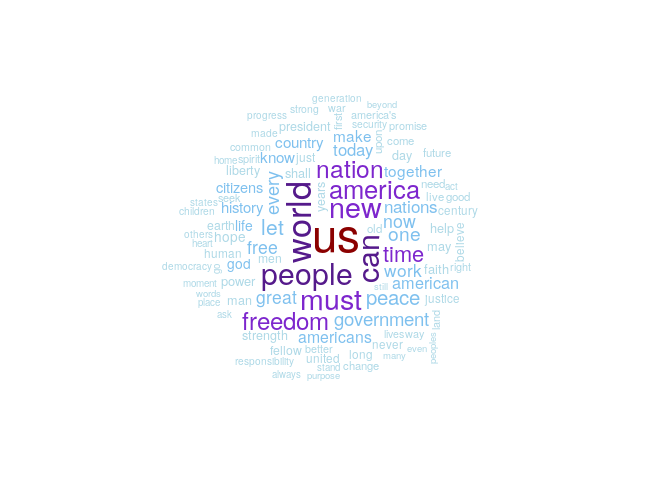
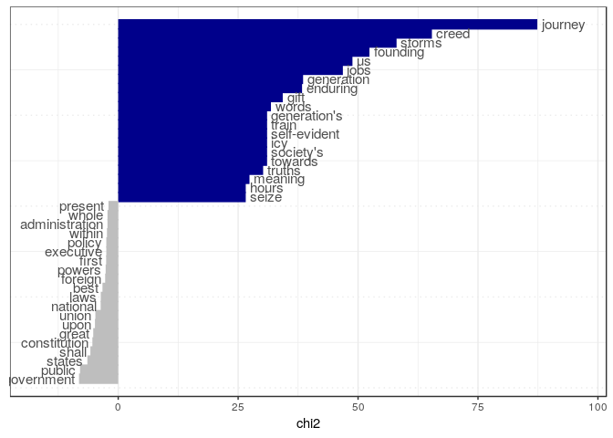

R basics: Getting started
================
Kasper Welbers, Wouter van Atteveldt & Philipp Masur
2021-10

-   [Introduction](#introduction)
    -   [What is R and why should you learn
        it?](#what-is-r-and-why-should-you-learn-it)
    -   [Purpose of this tutorial](#purpose-of-this-tutorial)
-   [Getting started with R](#getting-started-with-r)
    -   [Installing R](#installing-r)
    -   [Installing RStudio](#installing-rstudio)
    -   [Using RStudio](#using-rstudio)
    -   [Running code from the R
        script](#running-code-from-the-r-script)
    -   [Assigning values to names](#assigning-values-to-names)
    -   [Using RStudio projects](#using-rstudio-projects)
-   [Text Analysis in R](#text-analysis-in-r)
    -   [Installing and loading the quanteda
        package](#installing-and-loading-the-quanteda-package)
    -   [The inaugral speeches Corpus](#the-inaugral-speeches-corpus)
    -   [The Document-term Matrix](#the-document-term-matrix)
    -   [Word clouds](#word-clouds)
    -   [Keyword in context](#keyword-in-context)
    -   [Corpus comparison](#corpus-comparison)

# Introduction

## What is R and why should you learn it?

R is an open-source statistical software language, that is currently
among the most popular languages for data science. In comparison to
other popular software packages in social scientific research, such as
SPSS and Stata, R has several notable advantages:

-   R is a programming language, which makes it much more versatile.
    While R focuses on statistical analysis at heart, it facilitates a
    wide-range of features, and virtually any tool for data science can
    be implemented.
-   The range of things you can do with R is constantly being updated. R
    is open-source, meaning that anyone can contribute to its
    development. In particular, people can develop new *packages*, that
    can easily and safely be installed from within R with a single
    command. Since many scholars and industry professionals use R, it is
    likely that any cutting-edge and bleeding-edge techniques that you
    are interested in are already available. You can think of it as an
    app-store for all your data-science needs!
-   R is free. While for students this is not yet a big deal due to free
    or cheap student and university licences, this can be a big plus in
    the commercial sector. Especially for small businesses and
    free-lancers.

The tradeoff is that R has a relatively steep learning curve. Still,
learning R is not as bad as people often fear, and with thanks to the
rising popularity of data science there are now many footholds that make
learning and using R easier and–dare we say–fun. In this course you will
learn the core basics, and see how this immediately grants you access to
using cutting-edge techniques.

## Purpose of this tutorial

The focus of this tutorial is to get you started with R, and to see how
easy it is to start doing some cool stuff. We will not yet dive into how
R and the R syntax really work, so do not be alarmed if you do not
understand the code that you’ll be using. For now, just focus on getting
R running, getting familiar with how to run code, and playing around
with it.

# Getting started with R

For the current course material, you will need to install two pieces of
software.

-   *R* is the actual R software, that is used to run R code.
-   *RStudio* is a graphical user interface (GUI) that makes working
    with R much easier. While it is not required to use R, and there are
    other GUI’s available, using RStudio is highly recommended.

Both programs can be downloaded for free, and are available for all main
operating systems (Windows, macOS and Linux).

## Installing R

To install R, you can download it from the [CRAN (comprehensive R
Archive Network) website](https://cran.r-project.org/). Do not be
alarmed by the website’s 90’s asthetics. R itself is cold, dry,
no-nonsense software. The decoration comes with RStudio.

## Installing RStudio

The [RStudio website](https://www.rstudio.com/) contains download links
and installing instructions. You will need to install the free *RStudio
Desktop Open Source License*. Note that the expensive licences do not
offer better features or anything, but just offer additional support and
a commercial license. You can also use the free version when doing
commercial research, but with an AGPL license.

## Using RStudio

Once you have installed R and RStudio, you can start by launching
RStudio. If everything was installed correctly, RStudio will
automatically launch R as well.

The first time you open RStudio, you will likely see three separate
windows. The first thing you want to do is open an R Script to work in.
To do so, go to the toolbar and select File -&gt; New File -&gt; R
Script.

You will now see four windows split evenly over the four corners of your
screen:

-   In the **top-left** you have the text editor for the file that you
    are working in. This will most of the time be an R script or
    RMarkdown file.
-   In the **top-right** you can see the data and values that you are
    currently working with (environment) or view your history of input.
-   In the **bottom-left** you have the console, which is where you can
    enter and run code, and view the output. If you run code from your R
    script, it will also be executed in this console.
-   In the **bottom-right** you can browse through files on your
    computer, view help for functions, or view visualizations.

While you can directly enter code into your console (bottom-left), you
should always work with R scripts (top-left). This allows you to keep
track of what you are doing and save every step.

## Running code from the R script

Copy and paste the following example code into your R Script. For now,
don’t bother understanding the syntax itself. Just focus on running it.

``` r
3 + 3
2 * 5
6 / 2
"some text"
"some more text"
sum(1,2,3,4,5)
```

You can **run** parts of the code in an R script by pressing Ctrl +
Enter (on mac this is command + Enter). This can be done in two ways:

-   If you select a piece of text (so that it is highlighted) you can
    press Ctrl + Enter to run the selection. For example, select the
    first three lines (the three mathematical operations) and press
    Ctrl + Enter.
-   If you haven’t made a selection, but your text cursor is in the
    editor, you can press Ctrl + Enter to run the line where the cursor
    is at. This will also move the cursor to the next line, so you can
    *walk* through the code from top to bottom, running each line. Try
    starting on the first line, and pressing Ctrl + Enter six times, to
    run each line separately.

## Assigning values to names

When running the example code, you saw that R automatically
**evaluates** expressions. The calculation 3+3 evaluates to 6, and 2\*5
evaluates to 10. You also saw that the **function** *sum(1,2,3,4,5)*
evaluates to 15 (the sum of the numbers). We’ll address how to use R as
a calculator and how to perform functions at a later time. For now, one
more thing that you need to know about the R syntax is how values can be
**assigned** to names.

In plain terms, **assignment** is how you make R remember things by
assigning them to a name. This works the same way for all sorts of
values, from single numbers to entire datasets. You can choose whether
you prefer the equal sign (=) or the arrow (&lt;-) for assignment.

``` r
x = 2
y <- "some text"
```

Here we have remembered the number 2 as **x** and the text “some text”
as **y**. If you are working in RStudio (which you should), you can now
also see these names and values in the topright window, under the
“Environment” tab.

We can now use the names to retrieve the values, or to use these values
in new commands.

``` r
x * 5
```

    ## [1] 10

Note that you shouldn’t type the line `## [1] 10`: in this tutorial,
lines starting with `##` show the *output* of commands (2 \* 5 = 10).

## Using RStudio projects

It is best to put all your code in an RStudio *project*. This is
essentially a folder on your computer in which you can store the R files
and data for a project that you are working on. While you do not
necessarily need a project to work with R, they are very convenient, and
we strongly recommend using them.

To create a new project, go to the top-right corner of your RStudio
window. Look for the button labeled **Project: (None)**. Click on this
button, and select New Project. Follow the instructions to create a new
directory with a new project. Name the project “R introduction”.

Now, open a new R script and immediately save it (select File -&gt; Save
in the toolbar, or press ctrl-s). Name the file
**my\_first\_r\_script.r**. In the bottom-right corner, under the
**Files** tab, you’ll now see the file added to the project. The
extension **.r** indicates that the file is an R script.

# Text Analysis in R

Now, to get a taste of some of the more interesting stuff that you can
do with R, you’re going to set up a project for analyzing texts using
the **quanteda** package. For now, understanding what each line of code
does is less important. What’s important now is to get a feel for
working with R.

Also, we’ll trow some information at you regarding how computers can
analyze texts. Here as well, try to get the gist of it, but do not feel
alarmed if you do not fully understand it at this point.

## Installing and loading the quanteda package

As mentioned above, one of the nice things about R is its excellent
system for sharing **packages**. In this case, we’re going to use the
[quanteda](https://quanteda.io/) package, which is an elaborate package
for automatic text analysis, developed by a team of experts.

Many R packages are on the CRAN network, which allows us to safely and
easily download and install a new package from within R. We only need to
run a single line of code. For example, the following line of code
installs the
[ggplot2](https://www.r-graph-gallery.com/ggplot2-package.html) package,
which provides powerful visualization tools.

``` r
install.packages('ggplot2')
```

In general, most packages can be installed without any issues. However,
there are some exceptions that you need to know about. For **quanteda**,
your computer needs certain software that is not always installed, as
mentioned on the [quanteda website](https://quanteda.io/). You can
either install this software, or make sure to have R version 4.0.0 (or
higher) installed. To see your current version, enter `version` in your
console, and to update visit the R website
([Windows](https://cran.r-project.org/bin/windows/base/),
[Mac](https://cran.r-project.org/bin/macosx/)).

If you are a **macOS user**, you might get the question whether you want
to install the package from source. In this case your should enter “n”
or “no” in your console (“yes” only works if you have certain software
installed).

``` r
install.packages('quanteda')
```

Once completed, **quanteda** has been installed on your computer. You do
not need to repeat this command on this computer, unless you want to
install quanteda anew (in case there have been updates). Think of this
as installing an app on your phone.

Next to the quanteda package, you’ll also need two add-ons.

``` r
install.packages('quanteda.textstats')
install.packages('quanteda.textplots')
```

To use quanteda in your current session, you need to explicitly tell R
that you want to load the package. Think of this as opening an app on
your phone. For this you need to following command.

``` r
library(quanteda)
library(quanteda.textplots)
library(quanteda.textstats)
```

## The inaugral speeches Corpus

In text analysis, the term **corpus** is often used to refer to a
collection of texts. For this tutorial, we’ll use a demo corpus that is
included in the **quanteda**. The corpus is called
**data\_corpus\_inaugural**, and contains the inaugural speeches of US
presidents. For convenience, we’ll assign the corpus to the name
**corp**

``` r
corp <- data_corpus_inaugural
corp
```

    ## Corpus consisting of 59 documents and 4 docvars.
    ## 1789-Washington :
    ## "Fellow-Citizens of the Senate and of the House of Representa..."
    ## 
    ## 1793-Washington :
    ## "Fellow citizens, I am again called upon by the voice of my c..."
    ## 
    ## 1797-Adams :
    ## "When it was first perceived, in early times, that no middle ..."
    ## 
    ## 1801-Jefferson :
    ## "Friends and Fellow Citizens: Called upon to undertake the du..."
    ## 
    ## 1805-Jefferson :
    ## "Proceeding, fellow citizens, to that qualification which the..."
    ## 
    ## 1809-Madison :
    ## "Unwilling to depart from examples of the most revered author..."
    ## 
    ## [ reached max_ndoc ... 53 more documents ]

Here **quanteda** lets us know that the corpus contains 58 documents,
and 3 docvars. The docvars are **variables** about the documents, in
this case the first and last name of the president, and the year of the
speech. We can view them with the *docvars()* function.

``` r
docvars(corp)  ## (only the first lines of output are shown here)
```

    ##   Year  President FirstName                 Party
    ## 1 1789 Washington    George                  none
    ## 2 1793 Washington    George                  none
    ## 3 1797      Adams      John            Federalist
    ## 4 1801  Jefferson    Thomas Democratic-Republican
    ## 5 1805  Jefferson    Thomas Democratic-Republican
    ## 6 1809    Madison     James Democratic-Republican

## The Document-term Matrix

So where do we go from here? A computer cannot actually understand
texts. To analyze texts computationally, we have to convert texts to a
representation that allows us to perform calculations. One of the most
commonly used representations is the document-term matrix (DTM). This is
a matrix in which rows are documents, columns are terms, and cells
indicate how often each term occured in each document.

This is also called a bag-of-words representation of texts, because
documents have been reducted to only word frequencies (the matrix only
shows how often a word occured in a text). While this format ignores a
lot of important information regarding word order and syntax, research
has shown that many interesting elements of texts can be measured by
looking at word frequencies alone.

When we create a DTM there are some standard techniques for
**preprocessing** the data. Specifically, we often want to filter out
words that are not interesting, such as stopwords (e.g., the, it, is).
Also, we need to normalize the terms in certain ways to help the
computer understand that they mean the same thing. Most importantly, we
often make all text lowercase, because a computer would see “oil” and
“Oil” as two separate words, even if “Oil” was just “oil” at the start
of a sentence. We might also want to count different forms of a verb
(e.g., walk, walking, walked) as the same term. A simple (but for some
languages flawed) way to achieve this is by **stemming** words. This
technique cuts of certain parts of words to reduce them to their stem
(e.g., walk, walk-ing, walk-ed).

For this example, we’ll make terms lowercase, remove english stopwords
and remove punctuation. We do this in three steps. First, we tokenize
the text using the tokens function, which breaks it into individual
words. Next, we create the DTM, using the `dfm` function from the
quanteda package. DFM stands for document-feature matrix, which is a
more general form of a document-term matrix (a feature can be a term,
but also other things). In our case, the DFM is a DTM. Finally, we use
dfm\_remove to remove the stopwords.

``` r
tok <- tokens(corp, remove_punct=TRUE)
m <- dfm(tok, tolower = TRUE)
m <- dfm_remove(m, stopwords('en'))
```

We now have a DTM with 58 documents and 5,405 terms. The DTM is 89.2%
sparse, which means that 89.2% of the cells in the DTM have the value
zero. In general, DTM’s are very sparse, because individual documents
(rows) contain only a small portion of all the words in the vocabulary
(columns).

The entire DTM is pretty big, so we cannot visualize it entirely. Here
we print a subset of only the first 10 documents and first 10 terms.

``` r
m[1:10,1:10]
```

    ## Document-feature matrix of: 10 documents, 10 features (60.00% sparse) and 4 docvars.
    ##                  features
    ## docs              fellow-citizens senate house representatives among
    ##   1789-Washington               1      1     2               2     1
    ##   1793-Washington               0      0     0               0     0
    ##   1797-Adams                    3      1     0               2     4
    ##   1801-Jefferson                2      0     0               0     1
    ##   1805-Jefferson                0      0     0               0     7
    ##   1809-Madison                  1      0     0               0     0
    ##                  features
    ## docs              vicissitudes incident life event filled
    ##   1789-Washington            1        1    1     2      1
    ##   1793-Washington            0        0    0     0      0
    ##   1797-Adams                 0        0    2     0      0
    ##   1801-Jefferson             0        0    1     0      0
    ##   1805-Jefferson             0        0    2     0      0
    ##   1809-Madison               0        0    1     0      1
    ## [ reached max_ndoc ... 4 more documents ]

For example, we see here that the word “senat”, which is the stemmed
version of the word “senate”, occurs once in the 1789 speech by George
Washington, and once in the 1797 speech of John Adams.

## Word clouds

To get a basic idea of what presidents talk about, we can create a
wordcloud with quanteda’s **textplot\_wordcloud()** function. The main
input for this function is the DTM that you created in the previous
step. As an additional argument we set min\_count (the minimum
wordcount) to 50 to ignore all words that occured less than 50 times.

``` r
textplot_wordcloud(m, min_count = 50)
```

<!-- -->

OK, that’s decent, but we can do better. One thing we can do is take a
/subset/ of the speeches, for example only speeches after 1945 or only
speeches by Obama:

``` r
m_obama <- dfm_subset(m, President=="Obama")
m_postwar <- dfm_subset(m, Year > 1945)
```

Note that this has not deleted other years or presidents from our
existing DTM `m`, but created two new DTMs `m_obama` and `m_postwar` to
contain the subsets. Let’s plot one of these, and let’s also use some
colors in addition to wordsize to complement the differences in
wordfrequency. You can pass multiple colors to the function to achieve
this.

``` r
textplot_wordcloud(m_postwar, max_words = 100, 
                   color = c('lightblue', 'skyblue2','purple3', 'purple4','darkred'))
```

<!-- -->

Alright, that’ll do for now. Try to play around a bit. If you want to
use a better color combination (which shouldn’t be too hard), you can
get a list of the available colors, or see [this
page](https://www.r-graph-gallery.com/42-colors-names/) for an overview
of colors.

``` r
colors()     ## output not printed in this document
```

## Keyword in context

The wordcloud shows you the words that occur most frequently, but lack
context. To get an idea of the context in which words are used, a
**keyword-in-context** (kwic) listing can be of assistance. With
quanteda, you can simply run the **kwic()** function on the corpus
object (which we earlier named corp) and specifying what word to use.

Let’s use this to see how the word “terror” has been used. We’ll use
“terror\*”, where the \* is a wild-card that indicates that any word
starting with “terror” is matched. The output shows an occurence of the
word with a given number of words before and after the word (this might
not fit on the line, so widen your console window for a better view)

``` r
kwic(tok, 'terror*') 
```

    ## Keyword-in-context with 12 matches.                                                                               
    ##     [1797-Adams, 1190]                      by fraud or violence by |  terror  
    ##   [1933-Roosevelt, 99] fear itself nameless unreasoning unjustified |  terror  
    ##  [1941-Roosevelt, 258]                seemed frozen by a fatalistic |  terror  
    ##    [1961-Kennedy, 761]              alter that uncertain balance of |  terror  
    ##    [1961-Kennedy, 872]                    of science instead of its |  terrors 
    ##     [1981-Reagan, 700]               freeing all Americans from the |  terror  
    ##    [1981-Reagan, 1910]             understood by those who practice | terrorism
    ##    [1997-Clinton, 921]                  They fuel the fanaticism of |  terror  
    ##   [1997-Clinton, 1454]            maintain a strong defense against |  terror  
    ##     [2009-Obama, 1442]               advance their aims by inducing |  terror  
    ##      [2017-Trump, 977]      civilized world against radical Islamic | terrorism
    ##      [2021-Biden, 472] political extremism white supremacy domestic | terrorism
    ##                                       
    ##  | intrigue or venality the Government
    ##  | which paralyzes needed efforts to  
    ##  | we proved that this is             
    ##  | that stays the hand of             
    ##  | Together let us explore the        
    ##  | of runaway living costs All        
    ##  | and prey upon their neighbors      
    ##  | And they torment the lives         
    ##  | and destruction Our children will  
    ##  | and slaughtering innocents we say  
    ##  | which we will eradicate from       
    ##  | that we must confront and

Note that KWIC uses the tokens (`tok`) rather than the DTM, as the DTM
no longer has word order information (so it can’t display context).
Thus, to get a KWIC list for a subset of documents, e.g. only Obama’s
speeches, you need to use `tok_subset` rather than `dfm_subset`:

``` r
tok_obama <- tokens_subset(tok, President == "Obama")
kwic(tok_obama, '*econom*')   ## output not printed in this document
```

## Corpus comparison

If you are interested in how two corpora of documents differ, a nice
technique for getting a quick indication is comparing the word
frequencies. For the inaugural speeches, we can for instance use this
technique to see what words are overrepresented in Obama’s inaugural
speeches.

``` r
tk <- textstat_keyness(m, docvars(m, 'President') == "Obama")
textplot_keyness(tk, show_legend = F)
```

<!-- -->

In the plot we see 20 terms that are overrepresented in Obama’s
speeches. These are the top 20 terms with the blue bars. Most strongly
overrepresented are the terms “journey”, “generat(ion)”, “job” and
“creed”. The 20 terms with the grey bars are the underrepresented terms,
meaning that Obama used them relatively less often than the average
president. Again, we could plug these words into a keyword-in-context
listing to get some context.
