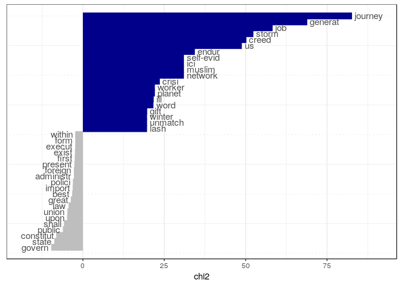

R basics: Getting started
================
Kasper Welbers & Wouter van Atteveldt
2018-09-03

-   [Working with R](#working-with-r)
    -   [What is R and why should you learn it?](#what-is-r-and-why-should-you-learn-it)
    -   [Purpose of this tutorial](#purpose-of-this-tutorial)
-   [Installing R and RStudio](#installing-r-and-rstudio)
    -   [Installing R](#installing-r)
    -   [Installing RStudio](#installing-rstudio)
-   [Getting started](#getting-started)
    -   [Opening RStudio](#opening-rstudio)
    -   [Running code from the R script](#running-code-from-the-r-script)
    -   [Assigning values to names](#assigning-values-to-names)
-   [Your first project](#your-first-project)
    -   [Creating a new RStudio project](#creating-a-new-rstudio-project)
    -   [Installing and using the quanteda package](#installing-and-using-the-quanteda-package)
-   [Assignment](#assignment)

Working with R
==============

### What is R and why should you learn it?

R is an open-source statistical software language, that is currently among the most popular languages for data science. In comparison to other popular software packages in social scientific research, such as SPSS and Stata, R has several notable advantages:

-   R is a programming language, which makes it much more versatile. While R focuses on statistical analysis at heart, it facilitates a wide-range of features, and virtually any tool for data science can be implemented.
-   The range of things you can do with R is constantly being updated. R is open-source, meaning that anyone can contribute to its development. In particular, people can develop new *packages*, that can easily and safely be installed from within R with a single command. Since many scholars and industry professionals use R, it is likely that any cutting-edge and bleeding-edge techniques that you are interested in are already available. You can think of it as an app-store for all your data-science needs!
-   R is free. While for students this is not yet a big deal due to free or cheap student and university licences, this can be a big plus in the commercial sector. Especially for small businesses and free-lancers.

The tradeoff is that R has a relatively steep learning curve. Still, learning R is not as bad as people often fear, and with thanks to the rising popularity of data science there are now many footholds that make learning and using R easier and--dare we say--fun. In this course you will learn the core basics, and see how this immediately grants you access to using cutting-edge techniques.

### Purpose of this tutorial

The focus of this tutorial is to get you started with R, and to see how easy it is to start doing some cool stuff. We will not yet dive into how R and the R syntax really work, so do not be allarmed if you do not understand the code that you'll be using. For now, just focus on getting R running, getting familiar with how to run code, and playing around with it.

Installing R and RStudio
========================

For the current course material, you will need to install two pieces of software.

-   *R* is the actual R software, that is required to run R code.
-   *RStudio* is a graphical user interface (GUI) that makes working with R much easier. While it is not required to use R, and there are other GUI's available, using RStudio is highly recommended.

R and RStudio are installed on the VU computers, but it's highly recommended that you install the software on your own device. Both can be downloaded for free, and are available for all main operating systems (Windows, macOS and Linux).

### Installing R

To install R, you can download it from the [CRAN (comprehensive R Archive Network) website](https://cran.r-project.org/). Do not be alarmed by the website's 90's asthetics. R itself is cold, dry, no-nonsense software. The decorations comes with RStudio.

### Installing RStudio

The [RStudio website](https://www.rstudio.com/) contains download links and installing instructions. You will need to install the free *RStudio Desktop Open Source License*. Note that the expensive licences do not offer better features or anything, but just offer additional support and a commercial licence. You can also use the free version when doing commercial research, but with an AGPL licence.

Getting started
===============

Once you have installed R and RStudio, you can start by launching RStudio. If everything was installed correctly, RStudio will automatically launch R as well.

### Opening RStudio

The first time you open RStudio, you will likely see three separate windows. The first thing you want to do is open an R Script to work in. To do so, go to the toolbar and select File -&gt; New File -&gt; R Script.

You will now see four windows split evenly over the four corners of your screen:

-   In the **top-left** you have the text editor for the file that you are working in. This will most of the time be an R script or RMarkdown file.
-   In the **top-right** you can see the data and values that you are currently working with (environment) or view your history of input.
-   In the **bottom-left** you have the console, which is where you can enter and run code, and view the output. If you run code from your R script, it will also be executed in this console.
-   In the **bottom-right** you can browse through files on your computer, view help for functions, or view visualizations.

While you can directly enter code into your console (bottom-left), you should always work with R scripts (top-left). This allows you to keep track of what you are doing and save every step.

### Running code from the R script

Copy and paste the following example code into your R Script. For now, don't bother understanding the syntax itself. Just focus on running it.

``` r
3 + 3
2 * 5
6 / 2
"some text"
"some more text"
sum(1,2,3,4,5)
```

You can **run** parts of the code in an R script by pressing Ctrl + Enter (on mac this is command + Enter). This can be done in two ways:

-   If you select a piece of text (so that it is highlighted) you can press Ctrl + Enter to run the selection. For example, select the first three lines (the three mathematical operations) and press Ctrl + Enter.
-   If you haven't made a selection, but your text cursor is in the editor, you can press Ctrl + Enter to run the line where the cursor is at. This will also move the cursor to the next line, so you can *walk* through the code from top to bottom, running each line. Try starting on the first line, and pressing Ctrl + Enter six times, to run each line separately.

### Assigning values to names

When running the example code, you saw that R automatically **evaluates** expressions. The calculation 3+3 evaluates to 6, and 2\*5 evaluates to 10. You also saw that the **function** *sum(1,2,3,4,5)* evaluates to 15 (the sum of the numbers). We'll address how to use R as a calculator and how to perform functions at a later time. For now, one more thing that you need to know about the R syntax is how values can be **assigned** to names.

In plain terms, **assignment** is how you make R remember things by assigning them to a name. This works the same way for all sorts of values, from single numbers to entire datasets. You can choose whether you prefer the equal sign (=) or the arrow (&lt;-) for assignment.

``` r
x = 2
y <- "some text"
```

Here we have remembered the number 2 as **x** and the text "some text" as **y**. If you are working in RStudio (which you should), you can now also see these names and values in the topright window, under the "Environment" tab.

We can now use the names to retrieve the values, or to use these values in new commands.

``` r
x
```

    ## [1] 2

``` r
x * 5
```

    ## [1] 10

``` r
toupper(y)
```

    ## [1] "SOME TEXT"

Your first project
==================

Now, to get a taste of some of the more interesting stuff that you can do with R, you're going to set up a project for analyzing texts using the **quanteda** package. For now, understanding what each line of code does is less important. What's important now is to get a feel for working with R.

Also, we'll trow some information at you regarding how computers can analyze texts. Here as well, try to get the gist of it, but do not feel alarmed if you do not fully understand it at this point.

### Creating a new RStudio project

We'll start by making an RStudio project. This is essentially a folder on your computer in which you can store the R files and data for a project that you are working on. While you do not necesarily need a project to work with R, they are very convenient, and we strongly recommend using them.

To create a new project, go to the top-right corner of your RStudio window. Look for the button labeled **Project: (None)**. Click on this button, and select New Project. Follow the instructions to create a new directory with a new project. Name the project "R introduction".

Now, open a new R script and immediately save it (select File -&gt; Save in the toolbar, or press ctrl-s). Name the file **my\_first\_r\_script.r**. In the bottom-right corner, under the **Files** tab, you'll now see the file added to the project. The extension **.r** indicates that the file is an R script.

### Installing and using the quanteda package

As mentioned above, one of the nice things about R is its excellent system for sharing **packages**. In this case, we're going to use the [quanteda](https://quanteda.io/) package, which is an elaborage package for automatic text analysis, developed by a team of experts.

Many R packages are on the CRAN network, which allows us to safely and easily download and install a new package from within R. We only need to run a single line of code.

``` r
install.packages('quanteda')
```

Once completed, **quanteda** has been installed on your computer. You do not need to repeat this command on this computer, unless you want to install quanteda anew (in case there have been updates). Think of this as installing an app on your phone.

However, to use quanteda in an R script, you do need to explicitly tell R that you want to use the package. Think of this as opening an app on your phone. For this you need to following command.

``` r
library(quanteda)
```

In text analysis, the term **corpus** is often used to refer to a collection of texts. For this tutorial, we'll use a demo corpus that is included in the **quanteda**. The corpus is called **data\_corpus\_inaugural**, and contains the inaugural speeches of US presidents. For convenience, we'll assign the corpus to the name **corp**

``` r
corp = data_corpus_inaugural
corp
```

    ## Corpus consisting of 58 documents and 3 docvars.

Here **quanteda** lets us know that the corpus contains 58 documents, and 3 docvars. The docvars are **variables** about the documents, in this case the first and last name of the president, and the year of the speech. We can view them with the *docvars()* function.

``` r
docvars(corp)
```

    ##                 Year  President       FirstName
    ## 1789-Washington 1789 Washington          George
    ## 1793-Washington 1793 Washington          George
    ## 1797-Adams      1797      Adams            John
    ## 1801-Jefferson  1801  Jefferson          Thomas
    ## 1805-Jefferson  1805  Jefferson          Thomas
    ## 1809-Madison    1809    Madison           James
    ## 1813-Madison    1813    Madison           James
    ## 1817-Monroe     1817     Monroe           James
    ## 1821-Monroe     1821     Monroe           James
    ## 1825-Adams      1825      Adams     John Quincy
    ## 1829-Jackson    1829    Jackson          Andrew
    ## 1833-Jackson    1833    Jackson          Andrew
    ## 1837-VanBuren   1837  Van Buren          Martin
    ## 1841-Harrison   1841   Harrison   William Henry
    ## 1845-Polk       1845       Polk      James Knox
    ## 1849-Taylor     1849     Taylor         Zachary
    ## 1853-Pierce     1853     Pierce        Franklin
    ## 1857-Buchanan   1857   Buchanan           James
    ## 1861-Lincoln    1861    Lincoln         Abraham
    ## 1865-Lincoln    1865    Lincoln         Abraham
    ## 1869-Grant      1869      Grant      Ulysses S.
    ## 1873-Grant      1873      Grant      Ulysses S.
    ## 1877-Hayes      1877      Hayes   Rutherford B.
    ## 1881-Garfield   1881   Garfield        James A.
    ## 1885-Cleveland  1885  Cleveland          Grover
    ## 1889-Harrison   1889   Harrison        Benjamin
    ## 1893-Cleveland  1893  Cleveland          Grover
    ## 1897-McKinley   1897   McKinley         William
    ## 1901-McKinley   1901   McKinley         William
    ## 1905-Roosevelt  1905  Roosevelt        Theodore
    ## 1909-Taft       1909       Taft  William Howard
    ## 1913-Wilson     1913     Wilson         Woodrow
    ## 1917-Wilson     1917     Wilson         Woodrow
    ## 1921-Harding    1921    Harding       Warren G.
    ## 1925-Coolidge   1925   Coolidge          Calvin
    ## 1929-Hoover     1929     Hoover         Herbert
    ## 1933-Roosevelt  1933  Roosevelt     Franklin D.
    ## 1937-Roosevelt  1937  Roosevelt     Franklin D.
    ## 1941-Roosevelt  1941  Roosevelt     Franklin D.
    ## 1945-Roosevelt  1945  Roosevelt     Franklin D.
    ## 1949-Truman     1949     Truman        Harry S.
    ## 1953-Eisenhower 1953 Eisenhower       Dwight D.
    ## 1957-Eisenhower 1957 Eisenhower       Dwight D.
    ## 1961-Kennedy    1961    Kennedy         John F.
    ## 1965-Johnson    1965    Johnson   Lyndon Baines
    ## 1969-Nixon      1969      Nixon Richard Milhous
    ## 1973-Nixon      1973      Nixon Richard Milhous
    ## 1977-Carter     1977     Carter           Jimmy
    ## 1981-Reagan     1981     Reagan          Ronald
    ## 1985-Reagan     1985     Reagan          Ronald
    ## 1989-Bush       1989       Bush          George
    ## 1993-Clinton    1993    Clinton            Bill
    ## 1997-Clinton    1997    Clinton            Bill
    ## 2001-Bush       2001       Bush       George W.
    ## 2005-Bush       2005       Bush       George W.
    ## 2009-Obama      2009      Obama          Barack
    ## 2013-Obama      2013      Obama          Barack
    ## 2017-Trump      2017      Trump       Donald J.

So where do we go from here? A computer cannot actually understand texts. To analyze texts computationally, we have to convert texts to a representation that allows us to perform calculations. One of the most commonly used representations is the document-term matrix (DTM). This is a matrix in which rows are documents, columns are terms, and cells indicate how often each term occured in each document.

This is also called a bag-of-words representation of texts, because documents have been reducted to only word frequencies (the matrix only shows how often a word occured in a text). While this format ignores a lot of important information regarding word order and syntax, research has shown that many interesting elements of texts can be measured by looking at word frequencies alone.

When we create a DTM there are some standard techniques for **preprocessing** the data. Specifically, we often want to filter out words that are not interesting, such as stopwords (e.g., the, it, is). Also, we need to normalize the terms in certain ways to help the computer understand that they mean the same thing. Most importantly, we often make all text lowercase, because a computer would see "oil" and "Oil" as two separate words, even if "Oil" was just "oil" at the start of a sentence. We might also want to count different forms of a verb (e.g., walk, walking, walked) as the same term. A simple (but for some languages flawed) way to achieve this is by **stemming** words. This technique cuts of certain parts of words to reduce them to their stem (e.g., walk, walk-ing, walk-ed).

For this example, we'll use make terms lowercase, remove english stopwords, remove punctuation, and use stemming. We will use the `dfm` function from the quanteda package. DFM stands for document-feature matrix, which is a more general form of a document-term matrix (a feature can be a term, but also other things). In our case, the DFM is a DTM.

``` r
m = dfm(corp, tolower = TRUE, remove = stopwords('english'), remove_punct = TRUE, stem = TRUE)
m
```

    ## Document-feature matrix of: 58 documents, 5,405 features (89.2% sparse).

We now have a DTM with 58 documents and 5,405 terms. The DTM is 89.2% sparse, which means that 89.2% of the cells in the DTM have the value zero. In general, DTM's are very sparse, because individual documents (rows) contain only a small portion of all the words in the vocabulary (columns).

The entire DTM is pretty big, so we cannot visualize it entirely. Here we print a subset of only the first 10 documents and first 10 terms.

``` r
m[1:10,1:10]
```

    ## Document-feature matrix of: 10 documents, 10 features (53% sparse).
    ## 10 x 10 sparse Matrix of class "dfm"
    ##                  features
    ## docs              fellow-citizen senat hous repres among vicissitud incid
    ##   1789-Washington              1     1    2      2     1          1     1
    ##   1793-Washington              0     0    0      0     0          0     0
    ##   1797-Adams                   3     1    3      3     4          0     0
    ##   1801-Jefferson               2     0    0      1     1          0     0
    ##   1805-Jefferson               0     0    0      0     7          0     0
    ##   1809-Madison                 1     0    0      1     0          1     0
    ##   1813-Madison                 1     0    0      0     1          0     0
    ##   1817-Monroe                  5     0    0      1     3          0     2
    ##   1821-Monroe                  1     0    0      2     1          0     0
    ##   1825-Adams                   0     0    0      2     3          1     0
    ##                  features
    ## docs              life event fill
    ##   1789-Washington    1     2    1
    ##   1793-Washington    0     0    0
    ##   1797-Adams         2     0    0
    ##   1801-Jefferson     1     0    0
    ##   1805-Jefferson     2     1    0
    ##   1809-Madison       1     0    1
    ##   1813-Madison       1     0    0
    ##   1817-Monroe        1     4    0
    ##   1821-Monroe        2     4    0
    ##   1825-Adams         1     1    0

For example, we see here that the word "senat", which is the stemmed version of the word "senate", occurs once in the 1789 speech by George Washington, and once in the 1797 speech of John Adams.

#### Word clouds

To get a basic idea of what presidents talk about, we can create a wordcloud with quanteda's **textplot\_wordcloud()** function. The main input for this function is the DTM that you created in the previous step. As an additional argument we set min\_count (the minimum wordcount) to 20 to ignore all words that occured less than 70 times.

``` r
textplot_wordcloud(m, min_count = 50)
```


OK, that's decent, but we can do better. In particular, it would be nice to use some colors in addition to wordsize to complement the differences in wordfrequency. In the quanteda documentation we see that you can pass multiple colors to the function to achieve this.

``` r
textplot_wordcloud(m, min_count = 50, color = c('lightblue', 'skyblue2','purple3', 'purple4','darkred'))
```


Alright, that'll do for now. Try to play around a bit. If you want to use a better color combination (which shouldn't be too hard), you can get a list of the available colors.

``` r
colors()     ## output not printed in this document
```

#### Keyword in context

The wordcloud shows you the words that occur most frequently, but lack context. To get an idea of the context in which words are used, a **keyword-in-context** (kwic) listing can be of assistance. With quanteda, you can simply run the **kwic()** function on the corpus object (which we earlier named corp) and specifying what word to use.

Let's use this to see how the word "terror" has been used. We'll use "terror\*", where the \* is a wild-card that indicates that any word starting with "terror" is matched.

``` r
kwic(corp, 'terror*')    ## output not printed in this document
```

#### Corpus comparison

If you are interested in how two corpora of documents differ, a nice technique for getting a quick indication is comparing the word frequencies. For the inaugural speeches, we can for instance use this technique to see what words are overrepresented in Obama's inaugural speeches.

``` r
tk = textstat_keyness(m, docvars(m, 'President') == "Obama")
textplot_keyness(tk, show_legend = F)
```



In the plot we see 20 terms that are overrepresented in Obama's speeches. These are the top 20 terms with the blue bars. Most strongly overrepresented are the terms "journey", "generat(ion)", "job" and "creed". The 20 terms with the grey bars are the underrepresented terms, meaning that Obama used them relatively less often than the average president. Again, we could plug these words into a keyword-in-context listing to get some context.

Assignment
==========

Your assignment for this tutorial is simply to play around a bit with the **quanteda** code. Try to get a feel for typing or pasting syntax in R, and running lines of code.
