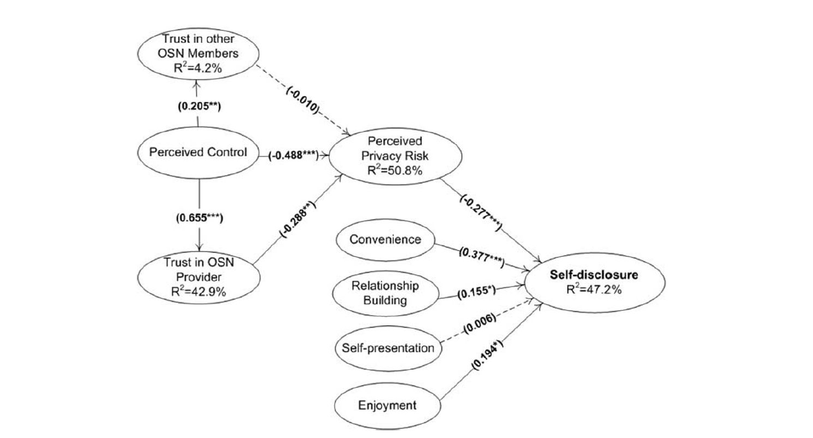
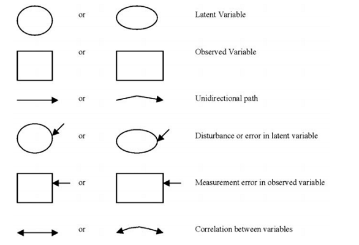
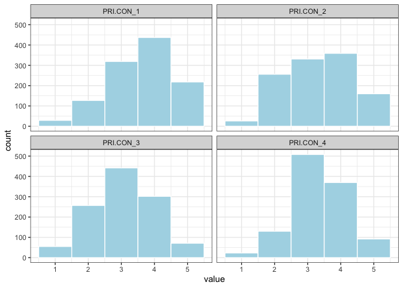
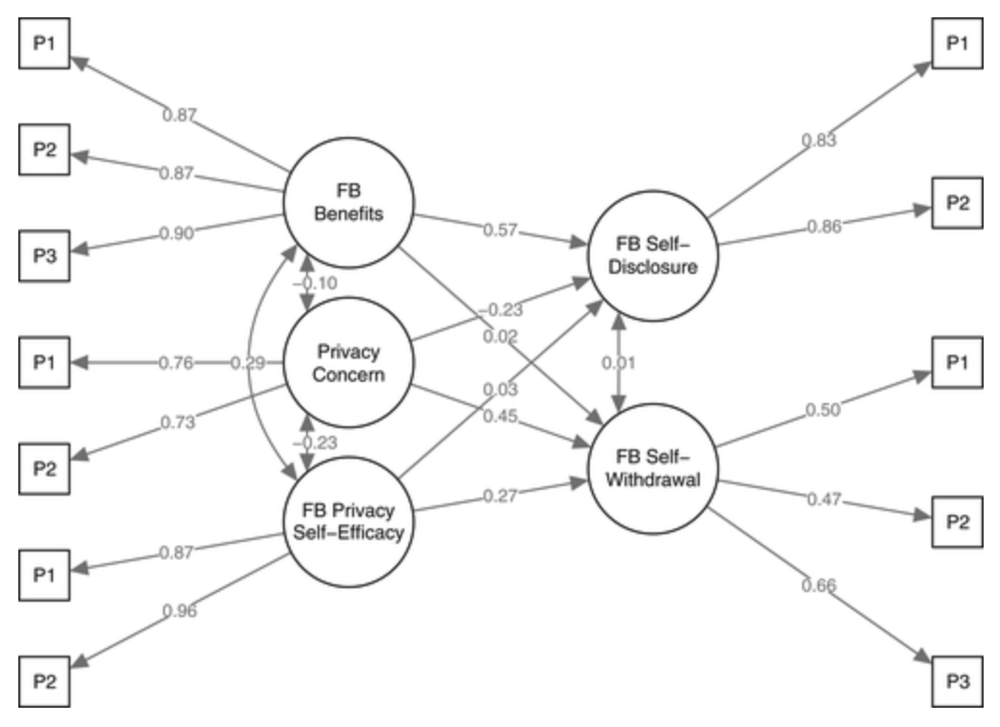
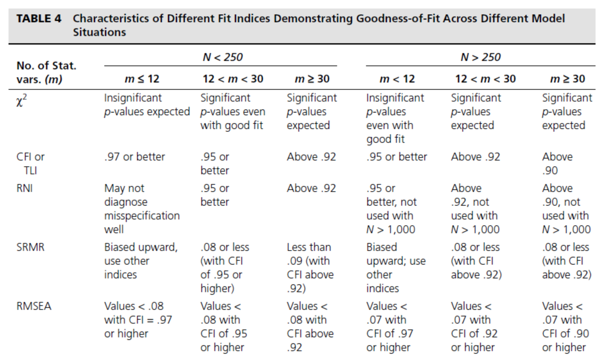
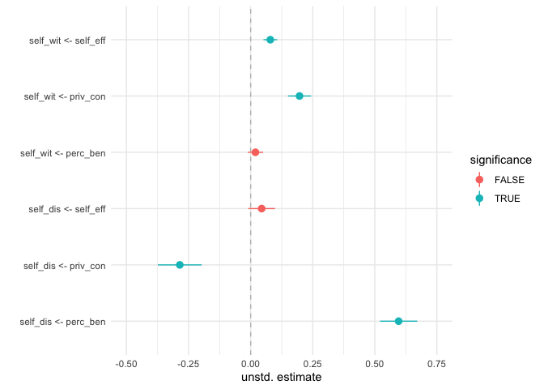

Structural equation modeling
================
Philipp Masur
2022-03

-   [Introduction](#introduction)
    -   [Basics](#basics)
    -   [Terminology and visual
        representation](#terminology-and-visual-representation)
-   [Preparation](#preparation)
    -   [Getting the data](#getting-the-data)
    -   [Explore the data](#explore-the-data)
-   [Structural equation modeling](#structural-equation-modeling)
    -   [Simple confirmatory factor
        analysis](#simple-confirmatory-factor-analysis)
    -   [Simple structural equation
        model](#simple-structural-equation-model)
    -   [Model from the paper](#model-from-the-paper)
    -   [Assessing fit](#assessing-fit)
-   [Reporting results](#reporting-results)
    -   [Inspecting individual paths](#inspecting-individual-paths)
    -   [Plotting results](#plotting-results)
-   [Where to go next?](#where-to-go-next)
-   [References](#references)

# Introduction

This tutorial explains the basics of using the package `lavaan`
(*la*tent *va*riable *an*alysis) to conduct structural equation modeling
(SEM) with latent variables. Although we will focus on SEM with latent
variables, `lavaan` can actually be used for a large variety of
multivariate statistical models, including path analysis, confirmatory
factor analysis, structural equation modeling, multigroup structural
equation analyses, multilevel structural equation modeling, and various
growth curve models. For more information have a look at the respective
[website](https://lavaan.ugent.be/).

## Basics

In a previous tutorial on [confirmatory factor
analysis](https://github.com/ccs-amsterdam/r-course-material/blob/master/tutorials/R_test-theory_1_cfa.md)
(CFA), I already explained why it is often useful to estimate a
*reflective* measurement model when we are interested in somewhat
abstract concepts (e.g., emotions, attitudes, concerns, personality…).
As these concept cannot be measured directly, we have to assess them
indirectly using observable indicators such as items in a questionnaire.
By using latent modeling, we can estimate these concepts with less
measurement error and thus estimate relationship between such concepts
with more accuracy.

Structural equation modeling is basically a combination of latent
measurement (as used in CFAs) and standard regressions modeling. We
first define our measurement models, i.e., how each item is explained by
a latent variable and then model the relationships between these
measurement models. For example, as shown in Figure 1, we could estimate
intelligence and academic performance based on different observable
indicators (e.g., scales, scores, etc.) and then estimate their
relationship (in this case b = .8).


*Figure 1*. Example of a structural equation model with latent
variables.

But structural equation modeling does not only allow to model bi-variate
relationship with more precision. We can model various relationships
between several variables. Take, for example, the following model by
Krasnova et al. (2010) which puts 9 distinct variables in theoretically
derived relationships. In contrast to standard regression modeling,
there can be several dependent variables, and some dependent variables
can furher be independent variables predicting other dependent
variables. As such, SEM is in a way the “big brother” of mediation
analyses or path analyses.



*Figure 2.* Structural equation model with latent variables as estimated
by Krasnova et al., 2010.

## Terminology and visual representation

A SEM thus represents theoretically assumed relationships. Estimating a
SEM thus requires a better theoretical understanding and *a priori*
formulation of the relationships of interest. As introduced already
earlier, such models are often represented visually. For such
visualizations, we should follow certain rules (see Figure 3). We need
to distinguish latent vs. observed variables, unidirectional and
correlational paths, as well as various error representations:

 *Figure 3.* Typical
symbols used in path and structural equation models.

We further have to distinguish *endogeneous* and *exogeneous* variables.
Endogeneous variables are predicted by one or several other variables in
the model (e.g., academic performance in Figure 1). Exogeneous variables
are not predicted by any other variables in the model (e.g.,
intelligence in Figure 1).

In contrast to standard regression modeling, SEM allows us to estimate
all paths of a potentially infinitely complex model in one step. This is
done by creating regression equations for all endogeneous variables. The
combination of all equations is what we call the structural equation
system. I won’t go into the mathematical details here. For more
information, have a look at the book “Principles and Practice of
Structural Equation Modeling” by Rex Kline.

# Preparation

In this tutorial, we will estimate several structural equation models
based on the data by Dienlin & Metzger (2016) who collected responses
from n = 1,156 US-American participants to test an extended version of
the privacy calculus model.

To run structurual equation models, we only need the package `lavaan`.
But as we will have to wrangle the data bit and want to assess normality
in the data, we will also load the package collection `tidyverse` and
the package `psych`

``` r
# Data wrangling packages
library(tidyverse)
library(psych)

# Structural equation modeling package
library(lavaan)
```

## Getting the data

Dienlin and Metzger (2016) fortunately published the data on the Open
Science Framework (<https://osf.io/bu74a/>). The function `read.csv()`
allows us to load the data directly from the website.

``` r
d <- read.csv("https://osf.io/bu74a/download", header=TRUE, na.strings="NA") %>%
  as_tibble 

head(d)
```

|  ID | FB.BEN\_1 | FB.BEN\_2 | FB.BEN\_3 | FB.BEN\_4 | FB.BEN\_5 | FB.BEN\_6 | FB.BEN\_7 | FB.BEN\_8 | FB.BEN\_9 | FB.BEN\_10 | FB.BEN\_DELETED\_1 | FB.BEN\_DELETED\_2 | PRI.CON\_1 | PRI.CON\_2 | PRI.CON\_3 | PRI.CON\_4 | PRI.CON\_DELETED\_1 | FB.PRI.SEL.EFF\_1 | FB.PRI.SEL.EFF\_2 | FB.PRI.SEL.EFF\_3 | FB.PRI.SEL.EFF\_4 | FB.PRI.SEL.EFF\_5 | FB.DIS\_1 | FB.DIS\_2 | FB.DIS\_3 | FB.DIS\_4 | FB.DIS\_5 | FB.DIS\_DELETED\_1 | FB.DIS\_DELETED\_2 | FB.WIT\_1 | FB.WIT\_2 | FB.WIT\_3 | FB.WIT\_4 | FB.WIT\_5 | FB.WIT\_6 | FB.WIT\_DELETED\_1 | FB.WIT\_DELETED\_2 | FB.WIT\_DELETED\_3 | FB.WIT\_DELETED\_4 | FB.BEN\_P1 | FB.BEN\_P2 | FB.BEN\_P3 | PRI.CON\_P1 | PRI.CON\_P2 | FB.PRI.SEL.EFF\_P1 | FB.PRI.SEL.EFF\_P2 | FB.DIS\_P1 | FB.DIS\_P2 | FB.WIT\_P1 | FB.WIT\_P2 | FB.WIT\_P3 | WEIGHT | AGE | AGE\_num | EDUCATION                        | EDUCATION\_num | SEX    | SEX\_num | ETHNICITY          |
|----:|----------:|----------:|----------:|----------:|----------:|----------:|----------:|----------:|----------:|-----------:|-------------------:|-------------------:|-----------:|-----------:|-----------:|-----------:|--------------------:|------------------:|------------------:|------------------:|------------------:|------------------:|----------:|----------:|----------:|----------:|----------:|-------------------:|-------------------:|----------:|----------:|----------:|----------:|----------:|----------:|-------------------:|-------------------:|-------------------:|-------------------:|-----------:|-----------:|-----------:|------------:|------------:|-------------------:|-------------------:|-----------:|-----------:|-----------:|-----------:|-----------:|-------:|----:|---------:|:---------------------------------|---------------:|:-------|---------:|:-------------------|
|   1 |         3 |         3 |         4 |         3 |         4 |         4 |        NA |         4 |         3 |          4 |                  4 |                  4 |          4 |          5 |          4 |          4 |                   4 |                 2 |                 1 |                 2 |                 1 |                 4 |         2 |         4 |         4 |         3 |         3 |                  2 |                  1 |         1 |         0 |         1 |         1 |         1 |         1 |                  1 |                  1 |                  1 |                  1 |       3.75 |   3.500000 |   3.333333 |         4.5 |         4.0 |           2.333333 |                1.5 |   3.666667 |        2.5 |        1.0 |        1.0 |        0.5 | 0.3816 |  44 |      4.4 | Professional or Doctorate Degree |              6 | male   |        1 | White/Non-Hispanic |
|   2 |         3 |         3 |         3 |         3 |         3 |         3 |        NA |         3 |         3 |          3 |                  3 |                  3 |          1 |          1 |          1 |          4 |                   1 |                 3 |                 3 |                 3 |                 3 |                 3 |         1 |         1 |         1 |         1 |         1 |                  5 |                  1 |         0 |         0 |         0 |         0 |         1 |         0 |                  1 |                  0 |                  0 |                  1 |       3.00 |   3.000000 |   3.000000 |         1.0 |         1.0 |           3.000000 |                3.0 |   1.000000 |        1.0 |        0.0 |        0.5 |        0.0 | 0.3448 |  56 |      5.6 | Masters Degree                   |              6 | male   |        1 | White/Non-Hispanic |
|   3 |         1 |         2 |         2 |         1 |         2 |         4 |         4 |         1 |         1 |          1 |                  1 |                  4 |          2 |          4 |          4 |          4 |                   4 |                 2 |                 2 |                 2 |                 2 |                 2 |         2 |         2 |         4 |         2 |         4 |                  2 |                  2 |         1 |         0 |         1 |         0 |         1 |         0 |                  1 |                  0 |                  0 |                  1 |       2.00 |   2.666667 |   1.000000 |         4.0 |         3.0 |           2.000000 |                2.0 |   3.333333 |        2.0 |        0.0 |        1.0 |        0.5 | 0.5320 |  23 |      2.3 | Bachelors Degree                 |              5 | female |        2 | White/Non-Hispanic |
|   5 |         3 |         3 |         3 |         3 |         3 |         3 |         3 |         3 |         3 |          3 |                  3 |                  4 |          3 |          3 |          2 |          3 |                   4 |                 3 |                 3 |                 3 |                 3 |                 3 |         2 |         2 |         1 |         1 |         2 |                  1 |                  1 |         0 |         0 |         0 |         1 |         1 |         0 |                  1 |                  0 |                  0 |                  1 |       3.00 |   3.000000 |   3.000000 |         3.5 |         2.5 |           3.000000 |                3.0 |   1.666667 |        1.5 |        0.5 |        0.5 |        0.0 | 0.9061 |  69 |      6.9 | Some High School                 |              1 | female |        2 | White/Non-Hispanic |
|   6 |         4 |         4 |         4 |         4 |         4 |         4 |         3 |         4 |         4 |          4 |                  4 |                  4 |          3 |          4 |          3 |          2 |                   2 |                 2 |                 2 |                 2 |                 3 |                 2 |         2 |         4 |         3 |         2 |         4 |                  3 |                  1 |         0 |         0 |         1 |         0 |         0 |         1 |                  1 |                  0 |                  1 |                  0 |       4.00 |   3.666667 |   4.000000 |         3.0 |         3.0 |           2.000000 |                2.5 |   3.666667 |        2.0 |        0.5 |        0.5 |        0.0 | 1.1648 |  21 |      2.1 | Some College                     |              3 | female |        2 | White/Non-Hispanic |
|   7 |         3 |         3 |         3 |         3 |         3 |         3 |         3 |         3 |         3 |          3 |                  3 |                  3 |          3 |          2 |          2 |          2 |                   4 |                 4 |                 4 |                 4 |                 4 |                 4 |         2 |         3 |         3 |         3 |        NA |                  2 |                  2 |         1 |         0 |         0 |         0 |         0 |         1 |                  1 |                  0 |                  0 |                  1 |       3.00 |   3.000000 |   3.000000 |         3.0 |         2.5 |           4.000000 |                4.0 |   3.000000 |        2.5 |        0.5 |        0.0 |        0.5 | 0.7669 |  69 |      6.9 | Associate Degree                 |              4 | male   |        1 | White/Non-Hispanic |

As we can see, the data contains 60 variables and consists of 1156
observations.

## Explore the data

Let’s quickly explore the data and get a feel for the sample. Here, I am
simply summarizing some socio-demographics.

``` r
# Age 
describe(d$AGE)
```

|     | vars |    n |    mean |       sd | median |  trimmed |     mad | min | max | range |      skew |   kurtosis |        se |
|:----|-----:|-----:|--------:|---------:|-------:|---------:|--------:|----:|----:|------:|----------:|-----------:|----------:|
| X1  |    1 | 1156 | 46.9083 | 16.37003 |     48 | 46.83585 | 19.2738 |  18 |  86 |    68 | 0.0115004 | -0.9535618 | 0.4814713 |

``` r
# Gender
table(d$SEX) %>%
  prop.table
```

|    female |      male |
|----------:|----------:|
| 0.5735294 | 0.4264706 |

``` r
# Check variables
names(d)
```

    ##  [1] "ID"                "FB.BEN_1"          "FB.BEN_2"         
    ##  [4] "FB.BEN_3"          "FB.BEN_4"          "FB.BEN_5"         
    ##  [7] "FB.BEN_6"          "FB.BEN_7"          "FB.BEN_8"         
    ## [10] "FB.BEN_9"          "FB.BEN_10"         "FB.BEN_DELETED_1" 
    ## [13] "FB.BEN_DELETED_2"  "PRI.CON_1"         "PRI.CON_2"        
    ## [16] "PRI.CON_3"         "PRI.CON_4"         "PRI.CON_DELETED_1"
    ## [19] "FB.PRI.SEL.EFF_1"  "FB.PRI.SEL.EFF_2"  "FB.PRI.SEL.EFF_3" 
    ## [22] "FB.PRI.SEL.EFF_4"  "FB.PRI.SEL.EFF_5"  "FB.DIS_1"         
    ## [25] "FB.DIS_2"          "FB.DIS_3"          "FB.DIS_4"         
    ## [28] "FB.DIS_5"          "FB.DIS_DELETED_1"  "FB.DIS_DELETED_2" 
    ## [31] "FB.WIT_1"          "FB.WIT_2"          "FB.WIT_3"         
    ## [34] "FB.WIT_4"          "FB.WIT_5"          "FB.WIT_6"         
    ## [37] "FB.WIT_DELETED_1"  "FB.WIT_DELETED_2"  "FB.WIT_DELETED_3" 
    ## [40] "FB.WIT_DELETED_4"  "FB.BEN_P1"         "FB.BEN_P2"        
    ## [43] "FB.BEN_P3"         "PRI.CON_P1"        "PRI.CON_P2"       
    ## [46] "FB.PRI.SEL.EFF_P1" "FB.PRI.SEL.EFF_P2" "FB.DIS_P1"        
    ## [49] "FB.DIS_P2"         "FB.WIT_P1"         "FB.WIT_P2"        
    ## [52] "FB.WIT_P3"         "WEIGHT"            "AGE"              
    ## [55] "AGE_num"           "EDUCATION"         "EDUCATION_num"    
    ## [58] "SEX"               "SEX_num"           "ETHNICITY"

The authors state that the sample is representative for the US.
Participants are on average M = 46.91 years old and 42.6% are female.

The data sets includes the following scales:

-   Perceived benefits of using Facebook (FB.BEN\*)
-   Perceived concerns (PRI.CON\*)
-   Privacy self-efficacy (FB.PRI.SEL.EFF\*)
-   Self-Disclosure (FB.DIS\*)
-   Withdrawal (FB.WIT\*)

# Structural equation modeling

## Simple confirmatory factor analysis

Technically speaking, a simple reflective measurement model already
represents a SEM. So let’s start simple and estimate a comparatively
simple CFA for the latent variable “privacy concerns”. Before we do so,
we should check whether the items are normally distributed and whether
the assumption of multivariate normality is violated.

``` r
# Check normal distribution of individual items
d %>%
  select(PRI.CON_1:PRI.CON_4) %>%
  describe
```

|            | vars |    n |     mean |        sd | median |  trimmed |    mad | min | max | range |       skew |   kurtosis |        se |
|:-----------|-----:|-----:|---------:|----------:|-------:|---------:|-------:|----:|----:|------:|-----------:|-----------:|----------:|
| PRI.CON\_1 |    1 | 1130 | 3.608850 | 1.0018192 |      4 | 3.668142 | 1.4826 |   1 |   5 |     4 | -0.4424687 | -0.3074353 | 0.0298023 |
| PRI.CON\_2 |    2 | 1132 | 3.327739 | 1.0459847 |      3 | 3.313466 | 1.4826 |   1 |   5 |     4 | -0.0629044 | -0.8692005 | 0.0310887 |
| PRI.CON\_3 |    3 | 1127 | 3.068323 | 0.9692149 |      3 | 3.067553 | 1.4826 |   1 |   5 |     4 | -0.0430403 | -0.4284339 | 0.0288708 |
| PRI.CON\_4 |    4 | 1123 | 3.336598 | 0.8615193 |      3 | 3.343715 | 1.4826 |   1 |   5 |     4 | -0.1277703 |  0.0437756 | 0.0257084 |

``` r
# Inspect visually
d %>%
  select(PRI.CON_1:PRI.CON_4) %>%
  pivot_longer(PRI.CON_1:PRI.CON_4) %>%
  ggplot(aes(x = value)) +
  geom_histogram(bins = 5, color = "white", fill = "lightblue") +
  facet_wrap(~name, ncol = 2) +
  theme_bw()
```

<!-- -->

``` r
# Check multivariate normal distribution
d %>%
  select(PRI.CON_1:PRI.CON_4) %>%
  mardia(plot = FALSE) # We could use MLR instead of ML
```

    ## Call: mardia(x = ., plot = FALSE)
    ## 
    ## Mardia tests of multivariate skew and kurtosis
    ## Use describe(x) the to get univariate tests
    ## n.obs = 1113   num.vars =  4 
    ## b1p =  0.85   skew =  158.55  with probability  <=  2.9e-23
    ##  small sample skew =  159.15  with probability <=  2.2e-23
    ## b2p =  31.12   kurtosis =  17.14  with probability <=  0

Based on these analyses, we can conclude that all items are fairly
normally distributed. The assumption of multivariate normality, however,
was nonetheless violated (significant Mardia tests for skewness and
kurtosis). This is not necessarily a problem (in fact psychological
measurements are hardly ever multivariate normally distributed), but we
can choose a more robust estimator later to account for this.

`lavaan` provides a convenient syntax for fitting SEMs in general and
CFAs specifically. For the latter, we define each latent factor in one
string. In this example, the model syntax will contain one ‘latent
variable definition’. Each latent variable formula has the following
format:

`latent variable =~ indicator1 + indicator2 + ... + indicator_n`

The reason why this model syntax is so short is that behind the scenes,
the sem() function, which wraps around this model in the next step, will
take care of several things. First, by default, the factor loading of
the first indicator of a latent variable is fixed to 1, thereby fixing
the scale of the latent variable. Second, residual variances are added
automatically. We can get a comprehensive output via the `summary()`
function.

``` r
# Model as a string
cfa_priv <- "
  priv_con =~ PRI.CON_1+ PRI.CON_2 + PRI.CON_3 + PRI.CON_4
"

# Fitting the model
fit_cfa <- sem(model = cfa_priv, data = d)
fit_cfa_robust <- sem(model = cfa_priv, estimator = "MLR", data = d) # Fitting the same model with a robust estimator

# Most comprehensive output
summary(fit_cfa)
```

    ## lavaan 0.6-7 ended normally after 22 iterations
    ## 
    ##   Estimator                                         ML
    ##   Optimization method                           NLMINB
    ##   Number of free parameters                          8
    ##                                                       
    ##                                                   Used       Total
    ##   Number of observations                          1113        1156
    ##                                                                   
    ## Model Test User Model:
    ##                                                       
    ##   Test statistic                                 8.420
    ##   Degrees of freedom                                 2
    ##   P-value (Chi-square)                           0.015
    ## 
    ## Parameter Estimates:
    ## 
    ##   Standard errors                             Standard
    ##   Information                                 Expected
    ##   Information saturated (h1) model          Structured
    ## 
    ## Latent Variables:
    ##                    Estimate  Std.Err  z-value  P(>|z|)
    ##   priv_con =~                                         
    ##     PRI.CON_1         1.000                           
    ##     PRI.CON_2         1.160    0.084   13.786    0.000
    ##     PRI.CON_3         0.598    0.056   10.624    0.000
    ##     PRI.CON_4         0.671    0.053   12.734    0.000
    ## 
    ## Variances:
    ##                    Estimate  Std.Err  z-value  P(>|z|)
    ##    .PRI.CON_1         0.563    0.038   15.006    0.000
    ##    .PRI.CON_2         0.496    0.044   11.374    0.000
    ##    .PRI.CON_3         0.779    0.036   21.650    0.000
    ##    .PRI.CON_4         0.545    0.027   19.994    0.000
    ##     priv_con          0.439    0.046    9.644    0.000

``` r
summary(fit_cfa_robust)
```

    ## lavaan 0.6-7 ended normally after 22 iterations
    ## 
    ##   Estimator                                         ML
    ##   Optimization method                           NLMINB
    ##   Number of free parameters                          8
    ##                                                       
    ##                                                   Used       Total
    ##   Number of observations                          1113        1156
    ##                                                                   
    ## Model Test User Model:
    ##                                                Standard      Robust
    ##   Test Statistic                                  8.420       5.936
    ##   Degrees of freedom                                  2           2
    ##   P-value (Chi-square)                            0.015       0.051
    ##   Scaling correction factor                                   1.419
    ##        Yuan-Bentler correction (Mplus variant)                     
    ## 
    ## Parameter Estimates:
    ## 
    ##   Standard errors                             Sandwich
    ##   Information bread                           Observed
    ##   Observed information based on                Hessian
    ## 
    ## Latent Variables:
    ##                    Estimate  Std.Err  z-value  P(>|z|)
    ##   priv_con =~                                         
    ##     PRI.CON_1         1.000                           
    ##     PRI.CON_2         1.160    0.092   12.578    0.000
    ##     PRI.CON_3         0.598    0.073    8.212    0.000
    ##     PRI.CON_4         0.671    0.060   11.204    0.000
    ## 
    ## Variances:
    ##                    Estimate  Std.Err  z-value  P(>|z|)
    ##    .PRI.CON_1         0.563    0.047   11.954    0.000
    ##    .PRI.CON_2         0.496    0.060    8.293    0.000
    ##    .PRI.CON_3         0.779    0.043   18.181    0.000
    ##    .PRI.CON_4         0.545    0.038   14.385    0.000
    ##     priv_con          0.439    0.047    9.321    0.000

The output contains three parts:

-   The header: Information about lavaan, the optimization method, the
    number of free parameters and number of observations used in the
    analysis
-   The fit section (Model Test User Model): Includes various fit
    indices to assess model fit
-   Parameter Estimates: The last section contains all parameters that
    were fitted (including the factor loadings, variances, thresholds…)

In our example, the model fits the data well (the chi-square test is
non-significant, more on fit indices later). For a more comprehensive
discussion on how to evaluate CFAs, see [this
tutorial](https://github.com/ccs-amsterdam/r-course-material/blob/master/tutorials/R_test-theory_1_cfa.md).

## Simple structural equation model

Let’s extend this simple measurement model to an actual SEM. To do this,
we define two variables (privacy concerns and self-disclosure) as latent
variables (note that we can also add comments in the model syntax!) and
one simple regression equation. Similarly to formulas in e.g., `lm()`,
we use the operator `~` to denote that privacy concerns predict
self-disclosure.

``` r
model1 <- "
  # latent variables
  priv_con =~ PRI.CON_1+ PRI.CON_2 + PRI.CON_3 + PRI.CON_4
  self_dis =~ FB.DIS_1 + FB.DIS_2 + FB.DIS_3 + FB.DIS_4 
  
  # regression
  self_dis ~ priv_con
"

# Fit model
fit_m1 <- sem(model = model1, 
              estimator = "MLR",
              data = d)

# Output
summary(fit_m1, 
        std = T)
```

    ## lavaan 0.6-7 ended normally after 26 iterations
    ## 
    ##   Estimator                                         ML
    ##   Optimization method                           NLMINB
    ##   Number of free parameters                         17
    ##                                                       
    ##                                                   Used       Total
    ##   Number of observations                          1102        1156
    ##                                                                   
    ## Model Test User Model:
    ##                                                Standard      Robust
    ##   Test Statistic                                108.227      83.284
    ##   Degrees of freedom                                 19          19
    ##   P-value (Chi-square)                            0.000       0.000
    ##   Scaling correction factor                                   1.299
    ##        Yuan-Bentler correction (Mplus variant)                     
    ## 
    ## Parameter Estimates:
    ## 
    ##   Standard errors                             Sandwich
    ##   Information bread                           Observed
    ##   Observed information based on                Hessian
    ## 
    ## Latent Variables:
    ##                    Estimate  Std.Err  z-value  P(>|z|)   Std.lv  Std.all
    ##   priv_con =~                                                           
    ##     PRI.CON_1         1.000                               0.664    0.662
    ##     PRI.CON_2         1.135    0.081   14.057    0.000    0.754    0.722
    ##     PRI.CON_3         0.596    0.073    8.141    0.000    0.396    0.408
    ##     PRI.CON_4         0.691    0.063   10.947    0.000    0.459    0.534
    ##   self_dis =~                                                           
    ##     FB.DIS_1          1.000                               0.568    0.595
    ##     FB.DIS_2          1.239    0.071   17.354    0.000    0.703    0.660
    ##     FB.DIS_3          1.638    0.094   17.400    0.000    0.930    0.843
    ##     FB.DIS_4          1.437    0.084   17.156    0.000    0.816    0.759
    ## 
    ## Regressions:
    ##                    Estimate  Std.Err  z-value  P(>|z|)   Std.lv  Std.all
    ##   self_dis ~                                                            
    ##     priv_con         -0.273    0.044   -6.226    0.000   -0.319   -0.319
    ## 
    ## Variances:
    ##                    Estimate  Std.Err  z-value  P(>|z|)   Std.lv  Std.all
    ##    .PRI.CON_1         0.564    0.046   12.219    0.000    0.564    0.561
    ##    .PRI.CON_2         0.521    0.056    9.282    0.000    0.521    0.478
    ##    .PRI.CON_3         0.785    0.043   18.127    0.000    0.785    0.834
    ##    .PRI.CON_4         0.529    0.039   13.592    0.000    0.529    0.715
    ##    .FB.DIS_1          0.588    0.032   18.377    0.000    0.588    0.646
    ##    .FB.DIS_2          0.639    0.041   15.585    0.000    0.639    0.564
    ##    .FB.DIS_3          0.354    0.035   10.220    0.000    0.354    0.290
    ##    .FB.DIS_4          0.490    0.036   13.554    0.000    0.490    0.424
    ##     priv_con          0.441    0.045    9.711    0.000    1.000    1.000
    ##    .self_dis          0.290    0.030    9.597    0.000    0.898    0.898

Note that I added the argument `std = T` to the summary function to also
get standardized beta coefficients for the estimated relationships.
These can be interpreted as effect sizes as they range from 0 to 1.

We now see that the “Parameter Estimates” section of the output not only
include latent variables, but also regressions. We can see that the
relationship between privacy concerns and self-disclosure is estimated
to be b = -0.27, *β* = = .32, p &lt; .001. This can be regarded as a
medium-sized, negative relationship.

## Model from the paper

Let us move on to estimate the actual model from the paper. Figure 4
shows the path model (including all results) from the article:

 *Figure 4*: Structural equation
model estimated by Dienlin & Metzger (2016).

We can see that we have to define five latent variables that consistn of
3-4 items each. Further, we have to define two regression equations as
there are two endogeneous variables in the model (Self-Disclosure and
Self-Withdrawal).

``` r
model2 <- "
  # latent variables
  priv_con =~ PRI.CON_P1 + PRI.CON_P2
  perc_ben =~ FB.BEN_P1  + FB.BEN_P1 + FB.BEN_P3
  self_eff =~ FB.PRI.SEL.EFF_P1 + FB.PRI.SEL.EFF_P2
  self_dis =~ FB.DIS_P1 + FB.DIS_P2
  self_wit =~ FB.WIT_P1 + FB.WIT_P2
  
  # regression
  self_dis ~ priv_con + perc_ben + self_eff
  self_wit ~ priv_con + perc_ben + self_eff
"

fit_mod2 <- sem(model2, estimator = "MLR", data = d)
summary(fit_mod2, std = T)
```

    ## lavaan 0.6-7 ended normally after 53 iterations
    ## 
    ##   Estimator                                         ML
    ##   Optimization method                           NLMINB
    ##   Number of free parameters                         30
    ##                                                       
    ##                                                   Used       Total
    ##   Number of observations                          1125        1156
    ##                                                                   
    ## Model Test User Model:
    ##                                                Standard      Robust
    ##   Test Statistic                                 66.724      61.997
    ##   Degrees of freedom                                 25          25
    ##   P-value (Chi-square)                            0.000       0.000
    ##   Scaling correction factor                                   1.076
    ##        Yuan-Bentler correction (Mplus variant)                     
    ## 
    ## Parameter Estimates:
    ## 
    ##   Standard errors                             Sandwich
    ##   Information bread                           Observed
    ##   Observed information based on                Hessian
    ## 
    ## Latent Variables:
    ##                    Estimate  Std.Err  z-value  P(>|z|)   Std.lv  Std.all
    ##   priv_con =~                                                           
    ##     PRI.CON_P1        1.000                               0.567    0.716
    ##     PRI.CON_P2        1.051    0.107    9.845    0.000    0.596    0.770
    ##   perc_ben =~                                                           
    ##     FB.BEN_P1         1.000                               0.669    0.946
    ##     FB.BEN_P3         0.957    0.039   24.753    0.000    0.640    0.832
    ##   self_eff =~                                                           
    ##     FB.PRI.SEL.EFF    1.000                               0.802    0.967
    ##     FB.PRI.SEL.EFF    0.937    0.056   16.815    0.000    0.751    0.863
    ##   self_dis =~                                                           
    ##     FB.DIS_P1         1.000                               0.722    0.865
    ##     FB.DIS_P2         0.986    0.049   20.070    0.000    0.712    0.824
    ##   self_wit =~                                                           
    ##     FB.WIT_P1         1.000                               0.238    0.665
    ##     FB.WIT_P2         0.563    0.106    5.327    0.000    0.134    0.449
    ## 
    ## Regressions:
    ##                    Estimate  Std.Err  z-value  P(>|z|)   Std.lv  Std.all
    ##   self_dis ~                                                            
    ##     priv_con         -0.285    0.048   -5.887    0.000   -0.224   -0.224
    ##     perc_ben          0.596    0.040   14.941    0.000    0.552    0.552
    ##     self_eff          0.044    0.030    1.460    0.144    0.049    0.049
    ##   self_wit ~                                                            
    ##     priv_con          0.197    0.022    8.799    0.000    0.468    0.468
    ##     perc_ben          0.019    0.018    1.089    0.276    0.054    0.054
    ##     self_eff          0.079    0.016    5.052    0.000    0.266    0.266
    ## 
    ## Covariances:
    ##                    Estimate  Std.Err  z-value  P(>|z|)   Std.lv  Std.all
    ##   priv_con ~~                                                           
    ##     perc_ben         -0.042    0.016   -2.570    0.010   -0.110   -0.110
    ##     self_eff         -0.104    0.018   -5.752    0.000   -0.229   -0.229
    ##   perc_ben ~~                                                           
    ##     self_eff          0.145    0.021    6.815    0.000    0.271    0.271
    ##  .self_dis ~~                                                           
    ##    .self_wit          0.002    0.007    0.267    0.789    0.015    0.015
    ## 
    ## Variances:
    ##                    Estimate  Std.Err  z-value  P(>|z|)   Std.lv  Std.all
    ##    .PRI.CON_P1        0.306    0.037    8.269    0.000    0.306    0.488
    ##    .PRI.CON_P2        0.243    0.040    6.101    0.000    0.243    0.407
    ##    .FB.BEN_P1         0.053    0.015    3.390    0.001    0.053    0.105
    ##    .FB.BEN_P3         0.182    0.017   10.833    0.000    0.182    0.307
    ##    .FB.PRI.SEL.EFF    0.045    0.037    1.200    0.230    0.045    0.065
    ##    .FB.PRI.SEL.EFF    0.194    0.034    5.752    0.000    0.194    0.256
    ##    .FB.DIS_P1         0.175    0.025    6.898    0.000    0.175    0.251
    ##    .FB.DIS_P2         0.239    0.026    9.302    0.000    0.239    0.321
    ##    .FB.WIT_P1         0.072    0.011    6.612    0.000    0.072    0.558
    ##    .FB.WIT_P2         0.071    0.005   14.882    0.000    0.071    0.799
    ##     priv_con          0.321    0.040    8.065    0.000    1.000    1.000
    ##     perc_ben          0.447    0.030   14.961    0.000    1.000    1.000
    ##     self_eff          0.642    0.046   13.932    0.000    1.000    1.000
    ##    .self_dis          0.311    0.029   10.678    0.000    0.596    0.596
    ##    .self_wit          0.043    0.010    4.229    0.000    0.762    0.762

We can see that we roughly obtain the same results as Dienlin & Metzger
(perhaps they used a different estimator or controlled for some other
variables).

## Assessing fit

An important aspect of structural equation modeling is evaluating how
well the model fits the data. Due to the complexity of model fit
evaluation, I am only going to introduce the basic concepts. For more
depth, please have a look a the book by Hair et al. (2012).

Very generally speaking, we should evaluate how well our model fits the
underlying data. Model fit is based on a comparison between the model
implied covariances and the empirical covariances. The less a model
deviates from the original data, the better.

The most basic test is a *χ*<sup>2</sup> test. At best, the
*χ*<sup>2</sup> value is low and non-significant. However, with large
sample sizes, even small (at times non-problematic) deviations will turn
out to be significant. We hence also look at goodness- and
badness-of-fit indices such as the Comparative Fit Index (CFI), the
Tucker-Lewis Index (TLI) and the Root Means Square Error of
Approximation (RMSEA). There are many thresholds in the literature, but
effectively, each model fit has to be interpreted by taking the
circumenstances into account (e.g., sample size, model complexity, …). A
rough guidline is provided by Hair et al. (2012) and is summarized in
the following table:

 *Table 1.* Model fit guidelines
as proposed by Hair et al., 2012.

To get various fit indices, we can use the function `fitMeasures()`.
With a bit of data wrangling, we can also select only those that we are
interested in.

``` r
# All available fit indices
fitMeasures(fit_mod2)
```

    ##                          npar                          fmin 
    ##                        30.000                         0.030 
    ##                         chisq                            df 
    ##                        66.724                        25.000 
    ##                        pvalue                  chisq.scaled 
    ##                         0.000                        61.997 
    ##                     df.scaled                 pvalue.scaled 
    ##                        25.000                         0.000 
    ##          chisq.scaling.factor                baseline.chisq 
    ##                         1.076                      4434.203 
    ##                   baseline.df               baseline.pvalue 
    ##                        45.000                         0.000 
    ##         baseline.chisq.scaled            baseline.df.scaled 
    ##                      3768.690                        45.000 
    ##        baseline.pvalue.scaled baseline.chisq.scaling.factor 
    ##                         0.000                         1.177 
    ##                           cfi                           tli 
    ##                         0.990                         0.983 
    ##                          nnfi                           rfi 
    ##                         0.983                         0.973 
    ##                           nfi                          pnfi 
    ##                         0.985                         0.547 
    ##                           ifi                           rni 
    ##                         0.991                         0.990 
    ##                    cfi.scaled                    tli.scaled 
    ##                         0.990                         0.982 
    ##                    cfi.robust                    tli.robust 
    ##                         0.991                         0.984 
    ##                   nnfi.scaled                   nnfi.robust 
    ##                         0.982                         0.984 
    ##                    rfi.scaled                    nfi.scaled 
    ##                         0.970                         0.984 
    ##                    ifi.scaled                    rni.scaled 
    ##                         0.990                         0.990 
    ##                    rni.robust                          logl 
    ##                         0.991                     -9293.853 
    ##             unrestricted.logl                           aic 
    ##                     -9260.491                     18647.705 
    ##                           bic                        ntotal 
    ##                     18798.471                      1125.000 
    ##                          bic2             scaling.factor.h1 
    ##                     18703.183                         1.139 
    ##             scaling.factor.h0                         rmsea 
    ##                         1.191                         0.039 
    ##                rmsea.ci.lower                rmsea.ci.upper 
    ##                         0.027                         0.050 
    ##                  rmsea.pvalue                  rmsea.scaled 
    ##                         0.952                         0.036 
    ##         rmsea.ci.lower.scaled         rmsea.ci.upper.scaled 
    ##                         0.025                         0.047 
    ##           rmsea.pvalue.scaled                  rmsea.robust 
    ##                         0.981                         0.038 
    ##         rmsea.ci.lower.robust         rmsea.ci.upper.robust 
    ##                         0.026                         0.050 
    ##           rmsea.pvalue.robust                           rmr 
    ##                            NA                         0.009 
    ##                    rmr_nomean                          srmr 
    ##                         0.009                         0.023 
    ##                  srmr_bentler           srmr_bentler_nomean 
    ##                         0.023                         0.023 
    ##                          crmr                   crmr_nomean 
    ##                         0.025                         0.025 
    ##                    srmr_mplus             srmr_mplus_nomean 
    ##                         0.023                         0.023 
    ##                         cn_05                         cn_01 
    ##                       635.843                       748.162 
    ##                           gfi                          agfi 
    ##                         0.988                         0.975 
    ##                          pgfi                           mfi 
    ##                         0.449                         0.982 
    ##                          ecvi 
    ##                         0.113

``` r
# Specific fit indices
fitMeasures(fit_mod2) %>% as_tibble(rownames = "fitMeasures") %>%
  filter(fitMeasures %in% c("chisq", "df", "pvalue", "cfi", "tli", "rmsea")) %>%
  mutate(value = round(value, 3))
```

| fitMeasures |  value |
|:------------|-------:|
| chisq       | 66.724 |
| df          | 25.000 |
| pvalue      |  0.000 |
| cfi         |  0.990 |
| tli         |  0.983 |
| rmsea       |  0.039 |

We can also get the most common fit indices by adding `fit = T` to the
summary output. This way, we produce a very comprehensive output that
contains almost everything that we need to assess our model.

``` r
summary(fit_mod2, fit = T, std = T)
```

    ## lavaan 0.6-7 ended normally after 53 iterations
    ## 
    ##   Estimator                                         ML
    ##   Optimization method                           NLMINB
    ##   Number of free parameters                         30
    ##                                                       
    ##                                                   Used       Total
    ##   Number of observations                          1125        1156
    ##                                                                   
    ## Model Test User Model:
    ##                                                Standard      Robust
    ##   Test Statistic                                 66.724      61.997
    ##   Degrees of freedom                                 25          25
    ##   P-value (Chi-square)                            0.000       0.000
    ##   Scaling correction factor                                   1.076
    ##        Yuan-Bentler correction (Mplus variant)                     
    ## 
    ## Model Test Baseline Model:
    ## 
    ##   Test statistic                              4434.203    3768.690
    ##   Degrees of freedom                                45          45
    ##   P-value                                        0.000       0.000
    ##   Scaling correction factor                                  1.177
    ## 
    ## User Model versus Baseline Model:
    ## 
    ##   Comparative Fit Index (CFI)                    0.990       0.990
    ##   Tucker-Lewis Index (TLI)                       0.983       0.982
    ##                                                                   
    ##   Robust Comparative Fit Index (CFI)                         0.991
    ##   Robust Tucker-Lewis Index (TLI)                            0.984
    ## 
    ## Loglikelihood and Information Criteria:
    ## 
    ##   Loglikelihood user model (H0)              -9293.853   -9293.853
    ##   Scaling correction factor                                  1.191
    ##       for the MLR correction                                      
    ##   Loglikelihood unrestricted model (H1)      -9260.491   -9260.491
    ##   Scaling correction factor                                  1.139
    ##       for the MLR correction                                      
    ##                                                                   
    ##   Akaike (AIC)                               18647.705   18647.705
    ##   Bayesian (BIC)                             18798.471   18798.471
    ##   Sample-size adjusted Bayesian (BIC)        18703.183   18703.183
    ## 
    ## Root Mean Square Error of Approximation:
    ## 
    ##   RMSEA                                          0.039       0.036
    ##   90 Percent confidence interval - lower         0.027       0.025
    ##   90 Percent confidence interval - upper         0.050       0.047
    ##   P-value RMSEA <= 0.05                          0.952       0.981
    ##                                                                   
    ##   Robust RMSEA                                               0.038
    ##   90 Percent confidence interval - lower                     0.026
    ##   90 Percent confidence interval - upper                     0.050
    ## 
    ## Standardized Root Mean Square Residual:
    ## 
    ##   SRMR                                           0.023       0.023
    ## 
    ## Parameter Estimates:
    ## 
    ##   Standard errors                             Sandwich
    ##   Information bread                           Observed
    ##   Observed information based on                Hessian
    ## 
    ## Latent Variables:
    ##                    Estimate  Std.Err  z-value  P(>|z|)   Std.lv  Std.all
    ##   priv_con =~                                                           
    ##     PRI.CON_P1        1.000                               0.567    0.716
    ##     PRI.CON_P2        1.051    0.107    9.845    0.000    0.596    0.770
    ##   perc_ben =~                                                           
    ##     FB.BEN_P1         1.000                               0.669    0.946
    ##     FB.BEN_P3         0.957    0.039   24.753    0.000    0.640    0.832
    ##   self_eff =~                                                           
    ##     FB.PRI.SEL.EFF    1.000                               0.802    0.967
    ##     FB.PRI.SEL.EFF    0.937    0.056   16.815    0.000    0.751    0.863
    ##   self_dis =~                                                           
    ##     FB.DIS_P1         1.000                               0.722    0.865
    ##     FB.DIS_P2         0.986    0.049   20.070    0.000    0.712    0.824
    ##   self_wit =~                                                           
    ##     FB.WIT_P1         1.000                               0.238    0.665
    ##     FB.WIT_P2         0.563    0.106    5.327    0.000    0.134    0.449
    ## 
    ## Regressions:
    ##                    Estimate  Std.Err  z-value  P(>|z|)   Std.lv  Std.all
    ##   self_dis ~                                                            
    ##     priv_con         -0.285    0.048   -5.887    0.000   -0.224   -0.224
    ##     perc_ben          0.596    0.040   14.941    0.000    0.552    0.552
    ##     self_eff          0.044    0.030    1.460    0.144    0.049    0.049
    ##   self_wit ~                                                            
    ##     priv_con          0.197    0.022    8.799    0.000    0.468    0.468
    ##     perc_ben          0.019    0.018    1.089    0.276    0.054    0.054
    ##     self_eff          0.079    0.016    5.052    0.000    0.266    0.266
    ## 
    ## Covariances:
    ##                    Estimate  Std.Err  z-value  P(>|z|)   Std.lv  Std.all
    ##   priv_con ~~                                                           
    ##     perc_ben         -0.042    0.016   -2.570    0.010   -0.110   -0.110
    ##     self_eff         -0.104    0.018   -5.752    0.000   -0.229   -0.229
    ##   perc_ben ~~                                                           
    ##     self_eff          0.145    0.021    6.815    0.000    0.271    0.271
    ##  .self_dis ~~                                                           
    ##    .self_wit          0.002    0.007    0.267    0.789    0.015    0.015
    ## 
    ## Variances:
    ##                    Estimate  Std.Err  z-value  P(>|z|)   Std.lv  Std.all
    ##    .PRI.CON_P1        0.306    0.037    8.269    0.000    0.306    0.488
    ##    .PRI.CON_P2        0.243    0.040    6.101    0.000    0.243    0.407
    ##    .FB.BEN_P1         0.053    0.015    3.390    0.001    0.053    0.105
    ##    .FB.BEN_P3         0.182    0.017   10.833    0.000    0.182    0.307
    ##    .FB.PRI.SEL.EFF    0.045    0.037    1.200    0.230    0.045    0.065
    ##    .FB.PRI.SEL.EFF    0.194    0.034    5.752    0.000    0.194    0.256
    ##    .FB.DIS_P1         0.175    0.025    6.898    0.000    0.175    0.251
    ##    .FB.DIS_P2         0.239    0.026    9.302    0.000    0.239    0.321
    ##    .FB.WIT_P1         0.072    0.011    6.612    0.000    0.072    0.558
    ##    .FB.WIT_P2         0.071    0.005   14.882    0.000    0.071    0.799
    ##     priv_con          0.321    0.040    8.065    0.000    1.000    1.000
    ##     perc_ben          0.447    0.030   14.961    0.000    1.000    1.000
    ##     self_eff          0.642    0.046   13.932    0.000    1.000    1.000
    ##    .self_dis          0.311    0.029   10.678    0.000    0.596    0.596
    ##    .self_wit          0.043    0.010    4.229    0.000    0.762    0.762

# Reporting results

As a final aspect of SEM, we should talk about how to report results
from such a complex analysis. There are generally three ways:

1.  We draw a respective path model and include the standardized
    coefficients on the arrows (this is done most often, see Figure 1).
2.  We create a table that includes all relevant coefficients and
    information about each of the paths.
3.  We plot a so-called coefficient plot.

In the following, we will shortly engage with 2. and 3. Although there
are packages to plot the path models directly as well (e.g., `tidySEM`
or `semPaths`, see Figure 4), they usually don’t work that well and
drawing the model with e.g., powerpoint is - in my opinion - still the
better option.

## Inspecting individual paths

We can use the function `parameterEstimates()` to get all coefficients
estimated in the model including their unstandardized estimates,
confidence intervals, and standardized coefficients.

``` r
parameterEstimates(fit_mod2, standardized = T)
```

| lhs                | op   | rhs                |        est |        se |          z |    pvalue |   ci.lower |   ci.upper |     std.lv |    std.all |    std.nox |
|:-------------------|:-----|:-------------------|-----------:|----------:|-----------:|----------:|-----------:|-----------:|-----------:|-----------:|-----------:|
| priv\_con          | =\~  | PRI.CON\_P1        |  1.0000000 | 0.0000000 |         NA |        NA |  1.0000000 |  1.0000000 |  0.5666651 |  0.7156856 |  0.7156856 |
| priv\_con          | =\~  | PRI.CON\_P2        |  1.0509081 | 0.1067402 |  9.8454799 | 0.0000000 |  0.8417012 |  1.2601149 |  0.5955130 |  0.7701813 |  0.7701813 |
| perc\_ben          | =\~  | FB.BEN\_P1         |  1.0000000 | 0.0000000 |         NA |        NA |  1.0000000 |  1.0000000 |  0.6686291 |  0.9459657 |  0.9459657 |
| perc\_ben          | =\~  | FB.BEN\_P3         |  0.9567435 | 0.0386522 | 24.7526432 | 0.0000000 |  0.8809866 |  1.0325004 |  0.6397066 |  0.8322447 |  0.8322447 |
| self\_eff          | =\~  | FB.PRI.SEL.EFF\_P1 |  1.0000000 | 0.0000000 |         NA |        NA |  1.0000000 |  1.0000000 |  0.8015146 |  0.9669402 |  0.9669402 |
| self\_eff          | =\~  | FB.PRI.SEL.EFF\_P2 |  0.9369543 | 0.0557208 | 16.8151638 | 0.0000000 |  0.8277435 |  1.0461650 |  0.7509825 |  0.8626751 |  0.8626751 |
| self\_dis          | =\~  | FB.DIS\_P1         |  1.0000000 | 0.0000000 |         NA |        NA |  1.0000000 |  1.0000000 |  0.7221752 |  0.8652712 |  0.8652712 |
| self\_dis          | =\~  | FB.DIS\_P2         |  0.9863403 | 0.0491442 | 20.0703279 | 0.0000000 |  0.8900195 |  1.0826612 |  0.7123105 |  0.8242683 |  0.8242683 |
| self\_wit          | =\~  | FB.WIT\_P1         |  1.0000000 | 0.0000000 |         NA |        NA |  1.0000000 |  1.0000000 |  0.2384429 |  0.6650310 |  0.6650310 |
| self\_wit          | =\~  | FB.WIT\_P2         |  0.5625464 | 0.1056080 |  5.3267406 | 0.0000001 |  0.3555586 |  0.7695343 |  0.1341352 |  0.4487252 |  0.4487252 |
| self\_dis          | \~   | priv\_con          | -0.2854681 | 0.0484935 | -5.8867247 | 0.0000000 | -0.3805136 | -0.1904225 | -0.2239966 | -0.2239966 | -0.2239966 |
| self\_dis          | \~   | perc\_ben          |  0.5959558 | 0.0398874 | 14.9409546 | 0.0000000 |  0.5177780 |  0.6741337 |  0.5517684 |  0.5517684 |  0.5517684 |
| self\_dis          | \~   | self\_eff          |  0.0443366 | 0.0303625 |  1.4602416 | 0.1442237 | -0.0151728 |  0.1038460 |  0.0492075 |  0.0492075 |  0.0492075 |
| self\_wit          | \~   | priv\_con          |  0.1967857 | 0.0223651 |  8.7987684 | 0.0000000 |  0.1529509 |  0.2406206 |  0.4676658 |  0.4676658 |  0.4676658 |
| self\_wit          | \~   | perc\_ben          |  0.0192527 | 0.0176853 |  1.0886296 | 0.2763172 | -0.0154098 |  0.0539152 |  0.0539874 |  0.0539874 |  0.0539874 |
| self\_wit          | \~   | self\_eff          |  0.0791994 | 0.0156777 |  5.0517171 | 0.0000004 |  0.0484716 |  0.1099272 |  0.2662250 |  0.2662250 |  0.2662250 |
| PRI.CON\_P1        | \~\~ | PRI.CON\_P1        |  0.3058053 | 0.0369836 |  8.2686755 | 0.0000000 |  0.2333188 |  0.3782918 |  0.3058053 |  0.4877941 |  0.4877941 |
| PRI.CON\_P2        | \~\~ | PRI.CON\_P2        |  0.2432202 | 0.0398681 |  6.1006295 | 0.0000000 |  0.1650803 |  0.3213602 |  0.2432202 |  0.4068208 |  0.4068208 |
| FB.BEN\_P1         | \~\~ | FB.BEN\_P1         |  0.0525321 | 0.0154969 |  3.3898438 | 0.0006993 |  0.0221587 |  0.0829054 |  0.0525321 |  0.1051489 |  0.1051489 |
| FB.BEN\_P3         | \~\~ | FB.BEN\_P3         |  0.1816015 | 0.0167634 | 10.8332114 | 0.0000000 |  0.1487458 |  0.2144572 |  0.1816015 |  0.3073688 |  0.3073688 |
| FB.PRI.SEL.EFF\_P1 | \~\~ | FB.PRI.SEL.EFF\_P1 |  0.0446802 | 0.0372216 |  1.2003844 | 0.2299901 | -0.0282728 |  0.1176333 |  0.0446802 |  0.0650267 |  0.0650267 |
| FB.PRI.SEL.EFF\_P2 | \~\~ | FB.PRI.SEL.EFF\_P2 |  0.1938436 | 0.0336987 |  5.7522558 | 0.0000000 |  0.1277953 |  0.2598919 |  0.1938436 |  0.2557916 |  0.2557916 |
| FB.DIS\_P1         | \~\~ | FB.DIS\_P1         |  0.1750585 | 0.0253772 |  6.8982620 | 0.0000000 |  0.1253201 |  0.2247968 |  0.1750585 |  0.2513058 |  0.2513058 |
| FB.DIS\_P2         | \~\~ | FB.DIS\_P2         |  0.2394089 | 0.0257385 |  9.3016066 | 0.0000000 |  0.1889625 |  0.2898554 |  0.2394089 |  0.3205818 |  0.3205818 |
| FB.WIT\_P1         | \~\~ | FB.WIT\_P1         |  0.0716988 | 0.0108444 |  6.6116144 | 0.0000000 |  0.0504443 |  0.0929534 |  0.0716988 |  0.5577338 |  0.5577338 |
| FB.WIT\_P2         | \~\~ | FB.WIT\_P2         |  0.0713640 | 0.0047952 | 14.8822804 | 0.0000000 |  0.0619655 |  0.0807625 |  0.0713640 |  0.7986457 |  0.7986457 |
| priv\_con          | \~\~ | priv\_con          |  0.3211094 | 0.0398145 |  8.0651271 | 0.0000000 |  0.2430743 |  0.3991445 |  1.0000000 |  1.0000000 |  1.0000000 |
| perc\_ben          | \~\~ | perc\_ben          |  0.4470649 | 0.0298829 | 14.9605551 | 0.0000000 |  0.3884955 |  0.5056343 |  1.0000000 |  1.0000000 |  1.0000000 |
| self\_eff          | \~\~ | self\_eff          |  0.6424257 | 0.0461101 | 13.9324372 | 0.0000000 |  0.5520516 |  0.7327997 |  1.0000000 |  1.0000000 |  1.0000000 |
| self\_dis          | \~\~ | self\_dis          |  0.3108174 | 0.0291073 | 10.6783327 | 0.0000000 |  0.2537682 |  0.3678667 |  0.5959643 |  0.5959643 |  0.5959643 |
| self\_wit          | \~\~ | self\_wit          |  0.0433430 | 0.0102498 |  4.2286791 | 0.0000235 |  0.0232538 |  0.0634322 |  0.7623424 |  0.7623424 |  0.7623424 |
| priv\_con          | \~\~ | perc\_ben          | -0.0417165 | 0.0162334 | -2.5697977 | 0.0101758 | -0.0735334 | -0.0098997 | -0.1101023 | -0.1101023 | -0.1101023 |
| priv\_con          | \~\~ | self\_eff          | -0.1041098 | 0.0181001 | -5.7518847 | 0.0000000 | -0.1395853 | -0.0686342 | -0.2292205 | -0.2292205 | -0.2292205 |
| perc\_ben          | \~\~ | self\_eff          |  0.1452965 | 0.0213195 |  6.8151778 | 0.0000000 |  0.1035110 |  0.1870821 |  0.2711181 |  0.2711181 |  0.2711181 |
| self\_dis          | \~\~ | self\_wit          |  0.0017603 | 0.0065929 |  0.2669935 | 0.7894742 | -0.0111616 |  0.0146821 |  0.0151658 |  0.0151658 |  0.0151658 |

## Plotting results

A very elegant way of presenting the results is to plot the
unstandardized effects with their 95% confidence intervals in a
so-called coefficient plot. For this, we have to filter those paths that
contain regressions, rename some variables and simply use the
`geom_pointrange()` function from the ggplot2 package to get the right
plot.

``` r
parameterEstimates(fit_mod2) %>%
  filter(op == "~") %>%
  mutate(paths = paste(lhs, rhs, sep = " <- "),
         significance = ifelse(pvalue < .05, TRUE, FALSE)) %>%
  ggplot(aes(x = paths, y = est, ymin = ci.lower, ymax =ci.upper, color = significance)) +
  geom_hline(yintercept = 0, linetype = "dashed", color = "grey") +
  geom_pointrange() +
  ylim(-.5, .75) +
  coord_flip() +
  theme_minimal() +
  labs(x = "", y = "unstd. estimate")
```

<!-- -->

# Where to go next?

Structural equation modeling allows to estimate models of varying
complexity. This includes simply path models, complex latent variable
estimations, but also time series, growth curve modelling,
cross-lagged-panel analyses and even multilevel structural equation
modelling. With `blavaan`, there is even a package to run Bayesian SEMs
in R. To get started, check out the following books and websites:

-   [lavaan project website](https://lavaan.ugent.be/)

-   [blavaan CRAN
    repository](https://cran.r-project.org/web/packages/blavaan/index.html)

-   Hair, J. F., Black,W., Babin, B., & Andersen, R. (2010).
    Multivariate data analysis (7th ed.). Upper Saddle River, NJ:
    Pearson Prentice Hall.

-   Kline, R. B. (2016). Principles and practice of structural equation
    modeling (4th ed.). Methodology in the social sciences. New York:
    The Guilford Press.

-   Very good chapter on SEM by Jerry Bean (in Bean, J.(2021). Using R
    for Social Work Research.):
    <https://bookdown.org/bean_jerry/using_r_for_social_work_research/structural-equation-modeling.html>

# References

-   Dienlin, T., & Metzger, M. J. (2016). An extended privacy calculus
    model for SNSs-Analyzing self-disclosure and self-withdrawal in a
    U.S. representative sample. Journal of Computer Mediated
    Communication, 21, 368–383. <doi:10.1111/jcc4.12163>
    ([data](https://osf.io/bu74a/))

-   Hair, J. F., Black,W., Babin, B., & Andersen, R. (2010).
    Multivariate data analysis (7th ed.). Upper Saddle River, NJ:
    Pearson Prentice Hall.

-   Kline, R. B. (2016). Principles and practice of structural equation
    modeling (4th ed.). Methodology in the social sciences. New York:
    The Guilford Press.

-   Krasnova, H., Spiekermann, S., Koroleva, K., & Hildebrand, H.
    (2010). Online socialnetworks: Why we disclose.Journal of
    InformationTechnology, 24, 109-125.
