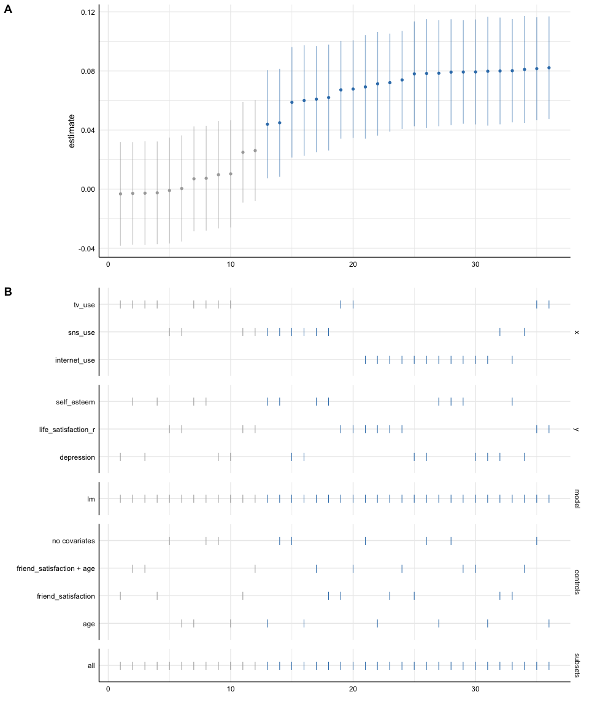
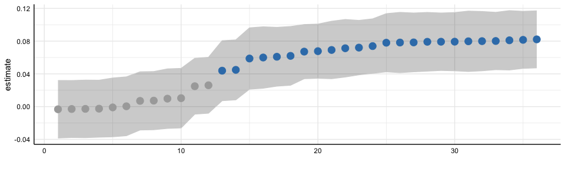
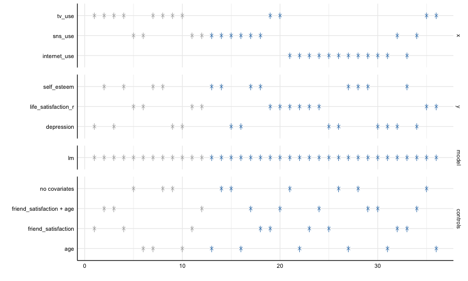
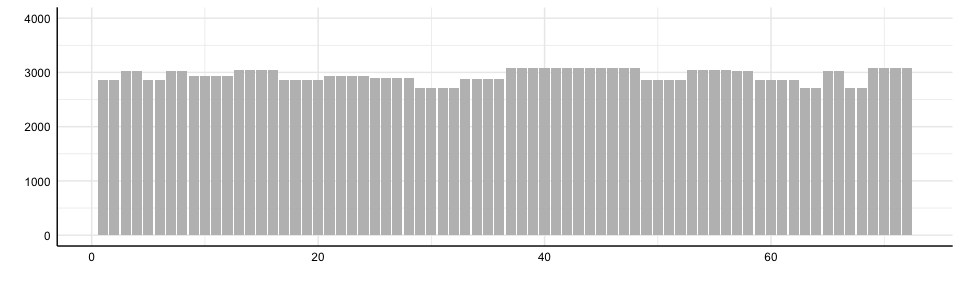
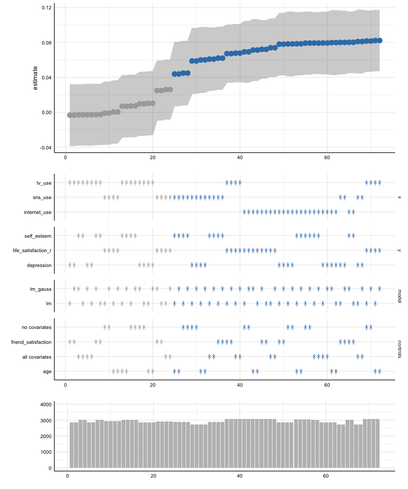
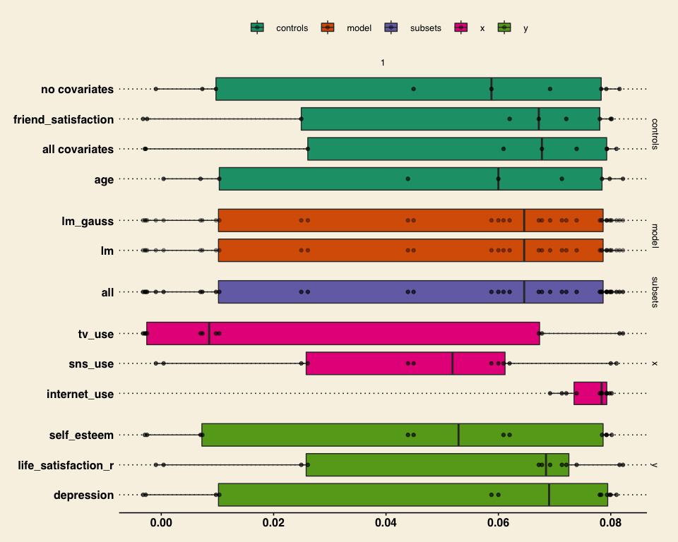
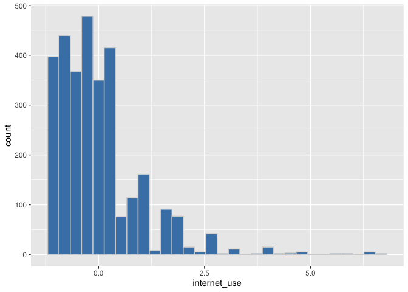
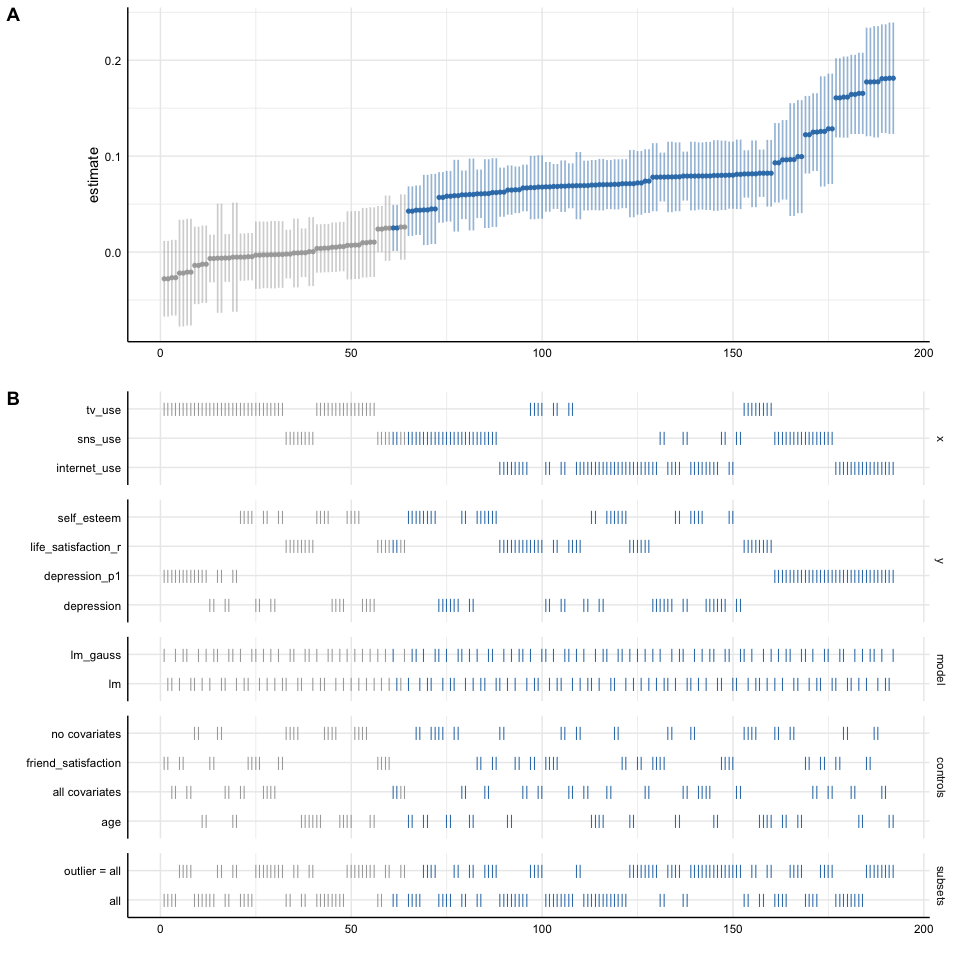
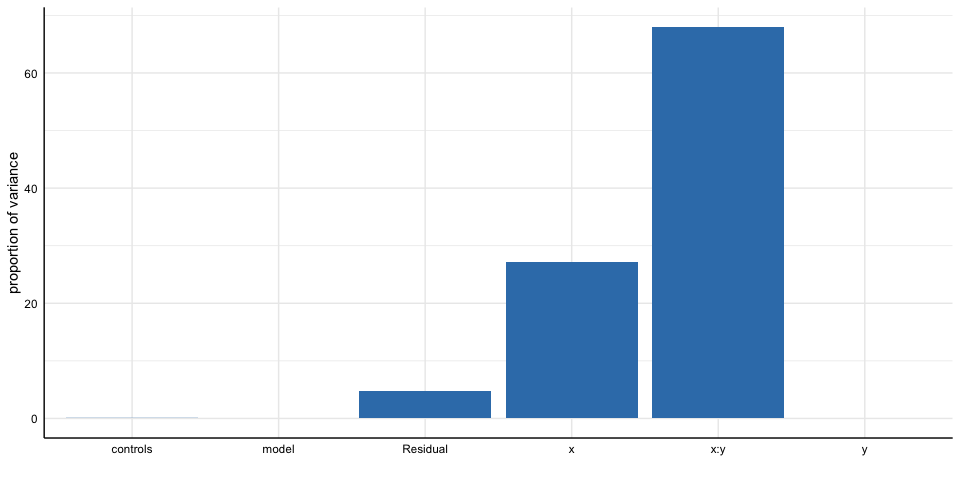

Specification Curve Analysis
================
Philipp Masur
2022-10

-   <a href="#introduction" id="toc-introduction">Introduction</a>
-   <a href="#preparation" id="toc-preparation">Preparation</a>
    -   <a href="#packages" id="toc-packages">Packages</a>
    -   <a href="#getting-some-data" id="toc-getting-some-data">Getting some
        data</a>
-   <a href="#specification-curve-analysis"
    id="toc-specification-curve-analysis">Specification Curve Analysis</a>
    -   <a href="#setup-specifications" id="toc-setup-specifications">Setup
        specifications</a>
    -   <a href="#run-specifications" id="toc-run-specifications">Run
        specifications</a>
-   <a href="#summarizing-and-visualizing-results"
    id="toc-summarizing-and-visualizing-results">Summarizing and visualizing
    results</a>
    -   <a href="#summarizing-the-parameter-distribution"
        id="toc-summarizing-the-parameter-distribution">Summarizing the
        parameter distribution</a>
    -   <a href="#visualize-the-specification-curve"
        id="toc-visualize-the-specification-curve">Visualize the “specification
        curve”</a>
    -   <a href="#alternative-visualization"
        id="toc-alternative-visualization">Alternative visualization</a>
-   <a href="#more-advanced-options" id="toc-more-advanced-options">More
    advanced options</a>
    -   <a href="#adding-more-specification-via-subsets"
        id="toc-adding-more-specification-via-subsets">Adding more specification
        via “subsets</a>
    -   <a href="#decompose-the-variance-in-the-specification-curve"
        id="toc-decompose-the-variance-in-the-specification-curve">Decompose the
        variance in the specification curve</a>
-   <a href="#where-to-go-next" id="toc-where-to-go-next">Where to go
    next?</a>
-   <a href="#references" id="toc-references">References</a>

# Introduction

In this tutorial, I am going to introduce the package
[`specr`](https://masurp.github.io/specr/index.html) (Masur & Scharkow,
2020), which provides a comprehensive framework for conducting so-called
specification curve analyses (also known as multiverse analyses).

Whenever researchers are collecting and analyzing data, they are
confronted with many degrees of freedom. They have to take both
conceptual and analytical decisions about e.g., variable selection, data
transformation, subsetting, whether to include control variables, what
modelling strategy to use, what estimators to choose, and so on. In
fact, in many cases, two alternatives are equally defensible or even
arbitrary. Yet, any of these decisions (in combination with all others)
lead to a unique “data set” or specification strategy that could
(potentially) lead to a (albeit often only slightly) different result.
This has been termed the “garden of forking paths” (see Fig. 1; Gelman &
Lokens, 2013).

This is problematic for several reasons. As Simonsohn, Simmons, and
Nelson (2020) put it one of the most prominent articles on specification
curve analyses:

> When reading the results of a study, people want to learn about the
> true relationship being analysed but this requires that the analyses
> reported are representative of the set of valid analyses that could
> have been conducted. This is often not the case. One problem is the
> possibility that the results may hinge on an arbitrary choice by the
> researcher. A probably greater, more pervasive problem is that people
> in general, and researchers in particular, are more likely to report
> evidence consistent with the claims they are trying to make than to
> report evidence that is inconsistent with such claims. The standard
> errors around published effect sizes represent the sampling error
> inherent in a particular analysis, but they do not reflect the error
> caused by the arbitrary and/or motivated selection of specifications.
> (p. 1208)

Specification curve analysis (or multiverse analysis) aims to circumvent
these issues by reporting results for all “reasonable specifications. A
reasonable specification is one that represents a sensible, that is
defensible test of the hypothesis or research question at hand, that is
further statistically valid, and not redundant with other specifications
in the set.

The analysis itself consists of running all models based on the
different specifications and then summarizing and/or visualizing the
results. Typically, a specification curve is plotted that shows the
estimated effect size across all specifications (often sorted by
magnitude), which is further accompanied by a sort of dashboard chart
that indicates how the different conceptial and analytical choices
affected the results.

As such, specification curve analyses are similar to robustness test
(i.e., running alternative models to prove the stability and robustness
of an effect). Yet, the take this approach a step further by running all
possible combinations of analytical and conceptual choices to produce
often a large, but to a certain degree exhaustive number of
specifications.

# Preparation

## Packages

The following tutorial exemplifies how to use the major functions of
this package. Although using `specr` strictly speaking does not require
any other package, we recommend to also load the `tidyverse` as it
provides valuable functions for data wrangling and adapting outputs from
`specr` functions. Furthermore, the tidyverse includes `ggplot2` which
can be used to modify the layout of the plots.

``` r
library(tidyverse)
library(specr)
```

## Getting some data

Specification curve analyses perhaps particular haven gotten attention
by the scientific community after Amy Orben and Andrew Przybylski (2019)
published a study that showed quite vividly that the association between
adolescent well-being and digital technology use heavily depends on the
analytical choices and type of measures researchers use.

In this tutorial, we are conducting a secondary data analysis of one
wave of the [pairfam](https://www.pairfam.de/en/) data set, which
represents a representative survey of young adolescents in Germany. The
data that we are going to use is not the actual data set, but a
synthetic data set whose properties are similar (but not equal) to the
pairfam data set.

The data set allows use - similar to Orben and Przybylski - investigate
the influence of analytical choices on the relationship between media
use and well-being in young adolescents. The synthetic data set is
available on our github resource and can be loaded directly via the link
below.

``` r
d <- read_csv("https://raw.githubusercontent.com/ccs-amsterdam/r-course-material/master/data/pairfam_synth_data.csv")
head(d)
```

|  …1 |        id | age | gender | tv_use | sns_use | internet_use | self_esteem | depression | depression_p1 | depression_p2 | life_satisfaction_r | friend_satisfaction | outlier |
|----:|----------:|----:|:-------|-------:|--------:|-------------:|------------:|-----------:|--------------:|--------------:|--------------------:|--------------------:|:--------|
|   1 | 547532000 |  16 | female |     28 |       3 |           14 |           4 |   3.769231 |      2.928571 |      4.214286 |                   4 |                   2 | all     |
|   2 | 283764000 |  15 | female |     12 |       0 |           15 |           4 |   3.423077 |      2.285714 |      4.214286 |                   2 |                   3 | all     |
|   3 | 376209000 |  15 | female |      2 |       3 |            8 |           1 |   1.000000 |      1.000000 |      1.000000 |                   1 |                   1 | all     |
|   4 | 716289000 |  16 | male   |     28 |       0 |            5 |           4 |   4.461538 |      4.214286 |      4.214286 |                   4 |                   6 | all     |
|   5 | 143070000 |  17 | male   |      9 |       5 |           10 |           1 |   2.384615 |      1.642857 |      2.928571 |                   2 |                   3 | all     |
|   6 | 677015000 |  15 | female |      0 |       4 |           50 |           1 |   1.000000 |      1.000000 |      1.000000 |                   2 |                   1 | all     |

The data set includes the following variables:

-   Information about participants
    -   id
    -   age
    -   gender
-   Media use
    -   tv_use: TV use in hours per week
    -   internet_use: Internet use in hours per week
    -   sns_use: A frequency scale measures SNS use
-   Well-Being
    -   depression
    -   life_satisfaction
    -   self-esteem
-   Control variables
    -   friend_satisfaction

In a first step, we are going to standardize all variables (except those
that we want to use for subgroup analyses: gender, outlier).
Standardization is technically not necessary for conducting a
specification curve analysis, but it often makes sense as the resulting
standardized coefficients (e.g., betas) are then comparable across the
specifications.

``` r
std_vars <- c("age", "tv_use", "internet_use", "sns_use",
              "self_esteem", "depression", "life_satisfaction_r", "friend_satisfaction")
d <- d %>% 
  mutate(across(all_of(std_vars), function(x) (x - mean(x, na.rm = T)) / sd(x, T))) 
```

# Specification Curve Analysis

## Setup specifications

The next step involves identifying possible conceptual and analytical
choices. This step involves an in-depth understanding of the research
question and the model(s) that will be specified. In this case, we
assume simply that media use should be positively (or negatively)
correlated with well-being. We first use the function `setup()` to check
how different analytical decisions create varying factorial designs.

We simply pass the different measures for (1) `x` and (2) `y` to the
function, add what type of (3) model we want to compute (can be several)
and finally what (4) control variables we would like to add. By default,
`specr` will compute models that have no controls, each control
variable, and all controls. We can then use the simple `summary()`
function to explore the design.

``` r
# Setup specifications
specs <- setup(data = d, 
               x = c("tv_use", "sns_use", "internet_use"),
               y = c("self_esteem", "depression", "life_satisfaction_r"),
               model = "lm",
               controls = c("friend_satisfaction", "age"))

# Explore design
summary(specs)
```

    ## Setup for the Specification Curve Analysis
    ## -------------------------------------------
    ## Class:                      specr.setup -- version: 1.0.0 
    ## Number of specifications:   36 
    ## 
    ## Specifications:
    ## 
    ##   Independent variable:     tv_use, sns_use, internet_use 
    ##   Dependent variable:       self_esteem, depression, life_satisfaction_r 
    ##   Models:                   lm 
    ##   Covariates:               no covariates, friend_satisfaction, age, friend_satisfaction + age 
    ##   Subsets analyses:         all 
    ## 
    ## Function used to extract parameters:
    ## 
    ##   function (x) 
    ## broom::tidy(x, conf.int = TRUE)
    ## <environment: 0x7f9ea46f3a10>
    ## 
    ## 
    ## Head of specifications table (first 6 rows):

| x      | y           | model | controls                  | subsets | formula                                           |
|:-------|:------------|:------|:--------------------------|:--------|:--------------------------------------------------|
| tv_use | self_esteem | lm    | no covariates             | all     | self_esteem \~ tv_use + 1                         |
| tv_use | self_esteem | lm    | friend_satisfaction       | all     | self_esteem \~ tv_use + friend_satisfaction       |
| tv_use | self_esteem | lm    | age                       | all     | self_esteem \~ tv_use + age                       |
| tv_use | self_esteem | lm    | friend_satisfaction + age | all     | self_esteem \~ tv_use + friend_satisfaction + age |
| tv_use | depression  | lm    | no covariates             | all     | depression \~ tv_use + 1                          |
| tv_use | depression  | lm    | friend_satisfaction       | all     | depression \~ tv_use + friend_satisfaction        |

We can see that the function simply computes all combinations from our
input. So these few choices already lead to 36 different specifications
(and thus models)! We also get some other information including e.g.,
what function is used to extract parameters from the models (this
function can technically be changed to whatever you want).

## Run specifications

To estimate all models based on these specifications, we simply need to
pass the setup to the function `specr()`. We can again get a first idea
about the results using the `summary()` function. I am adding
`digits = 3` here to get sufficient precision in the descriptive
summaries.

``` r
# Estimating all models
results <- specr(specs)

# First insights
summary(results, digits = 3)
```

    ## Results of the specification curve analysis
    ## -------------------
    ## Technical details:
    ## 
    ##   Class:                          specr.object -- version: 1.0.0 
    ##   Cores used:                     1 
    ##   Duration of fitting process:    0.63 sec elapsed 
    ##   Number of specifications:       36 
    ## 
    ## Descriptive summary of the specification curve:
    ## 
    ##  median   mad    min   max  q25   q75
    ##   0.065 0.023 -0.003 0.082 0.01 0.079
    ## 
    ## Descriptive summary of sample sizes: 
    ## 
    ##  median  min  max
    ##  2929.5 2719 3080
    ## 
    ## Head of the specification results (first 6 rows): 
    ## 
    ## # A tibble: 6 × 24
    ##   x      y           model controls subsets formula estimate std.error statistic
    ##   <chr>  <chr>       <chr> <chr>    <chr>   <glue>     <dbl>     <dbl>     <dbl>
    ## 1 tv_use self_esteem lm    no cova… all     self_e…    0.007     0.018     0.404
    ## 2 tv_use self_esteem lm    friend_… all     self_e…   -0.003     0.018    -0.142
    ## 3 tv_use self_esteem lm    age      all     self_e…    0.007     0.018     0.386
    ## 4 tv_use self_esteem lm    friend_… all     self_e…   -0.003     0.018    -0.165
    ## 5 tv_use depression  lm    no cova… all     depres…    0.01      0.019     0.526
    ## 6 tv_use depression  lm    friend_… all     depres…   -0.003     0.018    -0.181
    ## # … with 15 more variables: p.value <dbl>, conf.low <dbl>, conf.high <dbl>,
    ## #   fit_r.squared <dbl>, fit_adj.r.squared <dbl>, fit_sigma <dbl>,
    ## #   fit_statistic <dbl>, fit_p.value <dbl>, fit_df <dbl>, fit_logLik <dbl>,
    ## #   fit_AIC <dbl>, fit_BIC <dbl>, fit_deviance <dbl>, fit_df.residual <dbl>,
    ## #   fit_nobs <dbl>

The resulting object includes a lot of information, but also a data set
(tibble) that includes rows for all specifications and adds relevant
statistical parameters for the relationship of interest (the association
between x and y). `specr` automatically extracts relevant parameters
depending on the model type, but usually it will include the estimate
(in this case std. regression coefficients), their standard error,
p-value, confidence intervals, and the number of observations use in the
particular specification (can be different if missing values exists).

Among other things, we can see that the effect sizes range from -0.003
to 0.082 and the median is 0.65. The tibble at the bottom (here first 6
rows are shown) includes all model parameters.

# Summarizing and visualizing results

Specification curve analyses typically involve summarizing the
distribution of parameters (e.g., reporting the median effect size) and
visualizing the specification curve with a dashboard of the analytical
choices.

## Summarizing the parameter distribution

To summarize the results, we can use the function `summary()` with
specific arguments. We can customize the output by defining what exactly
we want to see (e.g., the choices the should be shown, whether the
results should be “grouped by” andy choices and and what statistics
should be computed”.

``` r
# Standard descriptive analysis
summary(results, 
        type = "curve")
```

|    median |       mad |        min |       max |       q25 |       q75 |    obs |
|----------:|----------:|-----------:|----------:|----------:|----------:|-------:|
| 0.0645939 | 0.0229626 | -0.0032347 | 0.0821696 | 0.0101831 | 0.0786368 | 2929.5 |

``` r
# With specific statistics
summary(results, 
        type = "curve",
        group = "x",
        stats = lst(median, mean, min, max))
```

| x            |    median |      mean |        min |       max |    obs |
|:-------------|----------:|----------:|-----------:|----------:|-------:|
| internet_use | 0.0783710 | 0.0765918 |  0.0692013 | 0.0801669 | 3036.5 |
| sns_use      | 0.0518338 | 0.0451619 | -0.0009572 | 0.0810108 | 2887.5 |
| tv_use       | 0.0085274 | 0.0268007 | -0.0032347 | 0.0821696 | 3034.5 |

As we can see, the median relationship between media use and well-being
is

= .06. The largest effect sizes, however, are found for internet use.

## Visualize the “specification curve”

To produce the standard specification curve plot that we often see in
publications, we can simply use the function `plot()`.

``` r
plot(results)
```

<!-- -->

Such a plot contains a lot of information and needs to be investigated
carefully. To give one example, we can see that the largest (positive)
effect sizes are found, when the relationship between TV use and life
satisfaction is estimated, when controlling either for no other
variables or age.

More generally speaking, the resulting plot includes the ranked
specification curve (A) and an overview about how the different
analytical choices affect the estimate of interest (B). Red represents
negative and significant effects (based on the chosen significance
level, by default

=.05). Blue represents positive and significant effects. Grey refers to
non-significant effects.

In some cases, we may want to adapt the visualization to our liking and
change bits and pieces. This can be done by plotting the two parts
separately. They both produce ggplot objects and can thus be further
modified using standard ggplot syntax.

``` r
library(ggthemes)

# Plot specification curve
(a <- plot(results, type = "curve", ci = F, ribbon = T) + 
   geom_point(size = 4))
```

<!-- -->

``` r
# Plot dashboard of choices
(b <- plot(results, type = "choices", choices = c("x", "y", "model", "controls")) +
   geom_point(size = 2, shape = 4)) 
```

<!-- -->

We can also add a third panel that shows a histrogram detailing the
sample sizes for each specification.

``` r
(c <- plot(results, type = "samplesizes") + ylim(0, 4000))
```

<!-- -->

As all three plots are ggplot-objects, we can easily arrange them with
packages such as ´cowplot\`.

``` r
library(cowplot)
plot_grid(a, b, c, ncol = 1,
          align = "v",
          rel_heights = c(1.5, 2, 0.8),
          axis = "rbl")
```

<!-- -->

## Alternative visualization

Despite their prominence in the literature, such visualization are not
the only ones that we can use to summarize and plot our results. An
alternative would be a boxplot, which we can produce with the function
`plot_summary()`. We can again customize with standard ggplot syntax.

``` r
plot(results, type = "boxplot") + 
  geom_point(alpha = .4) + 
  scale_fill_brewer(palette = "Pastel2") +
  labs(x = "Effect size", fill = "")
```

<!-- -->

# More advanced options

## Adding more specification via “subsets

So far, our specification are only based on choosing different measures,
models, and control variables. The real power of `specr`, however, is
only visible if we start to understand the argument “subset” in the
`setup()` function. This allows us to pass “grouping variables”. Specr
will then compute all combinations for each of these groups (as well as
across all). This is of course convenient, when we have grouping
variables such as age or gender, but it can also be used for other
things. For example, we can create a second data set, in which outliers
are removed, add it to the original data set (dont forget to produce a
key variable). This way, a multitude of other specifications
representing a plethora of analytical decisions becomes possible.

``` r
# Checking for outliers
d %>%
  ggplot(aes(x = internet_use)) +
  geom_histogram(color = "lightgrey", fill = "steelblue")
```

<!-- -->

``` r
# Removing outliers
d.sub <- d %>%
  filter(internet_use < 5) %>%
  mutate(outlier = "< 5")

# Create new data set
d.new <- rbind(d %>%
               mutate(outlier = "all"), 
               d.sub)
```

``` r
# Setup with subsets
specs2 <- setup(d = d.new,
               x = c("tv_use", "sns_use", "internet_use"),
               y = c("self_esteem", "depression", "life_satisfaction_r", "depression_p1"),
               model = c("lm"),
               controls = c("friend_satisfaction", "age"),
               subsets = list(outlier = unique(d.new$outlier)))
summary(specs2)
```

    ## Setup for the Specification Curve Analysis
    ## -------------------------------------------
    ## Class:                      specr.setup -- version: 1.0.0 
    ## Number of specifications:   144 
    ## 
    ## Specifications:
    ## 
    ##   Independent variable:     tv_use, sns_use, internet_use 
    ##   Dependent variable:       self_esteem, depression, life_satisfaction_r, depression_p1 
    ##   Models:                   lm 
    ##   Covariates:               no covariates, friend_satisfaction, age, friend_satisfaction + age 
    ##   Subsets analyses:         all, < 5 
    ## 
    ## Function used to extract parameters:
    ## 
    ##   function (x) 
    ## broom::tidy(x, conf.int = TRUE)
    ## <environment: 0x7f9e9eef3470>
    ## 
    ## 
    ## Head of specifications table (first 6 rows):

| x      | y           | model | controls            | subsets | outlier | formula                                     |
|:-------|:------------|:------|:--------------------|:--------|:--------|:--------------------------------------------|
| tv_use | self_esteem | lm    | no covariates       | all     | all     | self_esteem \~ tv_use + 1                   |
| tv_use | self_esteem | lm    | no covariates       | \< 5    | \< 5    | self_esteem \~ tv_use + 1                   |
| tv_use | self_esteem | lm    | no covariates       | all     | NA      | self_esteem \~ tv_use + 1                   |
| tv_use | self_esteem | lm    | friend_satisfaction | all     | all     | self_esteem \~ tv_use + friend_satisfaction |
| tv_use | self_esteem | lm    | friend_satisfaction | \< 5    | \< 5    | self_esteem \~ tv_use + friend_satisfaction |
| tv_use | self_esteem | lm    | friend_satisfaction | all     | NA      | self_esteem \~ tv_use + friend_satisfaction |

``` r
# Estimate models
results2 <- specr(specs2)
plot(results2)
```

<!-- -->

## Decompose the variance in the specification curve

We can also estimate how much variance in the specification curve is
related to which analytical decisions. We simply can use the function
`plot()` with the argument `type = "variance` and we receive both the
table and the visualization.

``` r
plot(results2, type = "variance")
```

    ##        grp vcov  icc percent
    ## 1 controls    0 0.00    0.00
    ## 2        y    0 0.11   11.07
    ## 3        x    0 0.48   48.02
    ## 4  subsets    0 0.00    0.48
    ## 5 Residual    0 0.40   40.43

<!-- -->

Perhaps even more clearly than in the typical specification plot, we see
here that most variance is explain by different media use measures and
their interaction with well-being.

# Where to go next?

Specification curve analysis is a powerful tool for investigating the
impact of conceptual and analytical choices on the effect size of
interest. If you want to learn more, we strongly suggest to read the
paper by Gelman & Loken (2013), Simonsohn et al (2020), and Steegen et
al. (2016).

We further suggest to have a look at the [website of
`specr`](https://masurp.github.io/specr/index.html), which provides
further tutorials (also for more specific aspects such as latent
variable modelling, or multilevel modelling). On the homepage, you will
also find a list of papers that have used specr and thus represent
interesting applications of specification curve analyses to various
research areas.

# References

-   Gelman, A., and Loken, E. 2013. The Garden of Forking Paths: Why
    Multiple Comparisons Can Be a Problem, Even When There Is No
    “Fishing Expedition” or “p-Hacking” and the Research Hypothesis Was
    Posited Ahead of Time., Thesis, , January 1.
    (<http://www.stat.columbia.edu/~gelman/research/unpublished/p_hacking.pdf>).

-   Masur, Philipp K. & Scharkow, M. (2020). specr: Conducting and
    Visualizing Specification Curve Analyses. Available from
    <https://CRAN.R-project.org/package=specr>.

-   Orben, A., & Przybylski, A. K. (2019). The association between
    adolescent well-being and digital technology use. Nature Human
    Behavior, 3, 173-182. doi: 10.1038/s41562-018-0506-1

-   Simonsohn, U., Simmons, J.P. & Nelson, L.D. (2020). Specification
    curve analysis. Nature Human Behaviour, 4, 1208–1214.
    <https://doi.org/10.1038/s41562-020-0912-z>

-   Steegen, S., Tuerlinckx, F., Gelman, A., & Vanpaemel, W. (2016).
    Increasing Transparency Through a Multiverse Analysis. Perspectives
    on Psychological Science, 11(5), 702-712.
    <https://doi.org/10.1177/1745691616658637>
