Item Response Theory: Basics
================
Philipp Masur
2022-03

-   [Introduction](#introduction)
-   [Preparation and Data](#preparation-and-data)
-   [3PL model](#3pl-model)
    -   [Fitting the model](#fitting-the-model)
    -   [Understanding IRT parameter](#understanding-irt-parameter)
    -   [Model fit, person fit, and item fit
        evaluation](#model-fit-person-fit-and-item-fit-evaluation)
    -   [Assessing person fit](#assessing-person-fit)
    -   [Typical IRT plots](#typical-irt-plots)
    -   [Item Person Map (Wright Map)](#item-person-map-wright-map)
        -   [Item Characteristics Curves (Trace
            Plots)](#item-characteristics-curves-trace-plots)
        -   [Item Information Curves](#item-information-curves)
        -   [Test Information Curves](#test-information-curves)
        -   [Conditional reliability](#conditional-reliability)
        -   [Scale Characteristic Curves](#scale-characteristic-curves)
-   [2PL model](#2pl-model)
    -   [Fitting the model](#fitting-the-model-1)
    -   [Compare fit with 3PL model](#compare-fit-with-3pl-model)
    -   [Trace plot](#trace-plot)
-   [1PL or Rasch model](#1pl-or-rasch-model)
    -   [Fitting the model](#fitting-the-model-2)
    -   [Compare models](#compare-models)
    -   [Trace plot](#trace-plot-1)
    -   [Creating smaller tests or parallel
        tests](#creating-smaller-tests-or-parallel-tests)
-   [Where to go next?](#where-to-go-next)
-   [References](#references)

# Introduction

This tutorial provides an introduction to fitting item response theory
(IRT) models with the R package `mirt` (multidimensional item response
theory, version 1.36.1; Chalmers, 2022, [CRAN
page](https://cran.r-project.org/web/packages/mirt/index.html)).

IRT refers to a set of mathematical models which aim to explain the
relationship between a latent ability, trait, or proficiency (denoted
) and
its observable manifestations (e.g., multiple-choice questions,
true-false items, items…). In contrast to classical test theory (CTT),
IRT focuses on the pattern of responses and considers responses in
probabilistic terms, rather than focusing on composite variables and
linear regression theory. IRT thereby accounts for…

-   *item discrimination*: ability of an item to differentiate between
    respondents with different levels of proficiency.
-   *item difficulty*: the likelihood of a correct response, expressed
    as the proficiency level at which 50% of the participant sample is
    estimated to answer an item correctly.
-   Depending on the model some other parameters such as e.g., *guessing
    probability*…

Assessing item difficulties is useful in matching the test and trait
levels of a target population and in ensuring that the entire range of
the proficiency is covered. Therefore, there are several advantages to
IRT models (compared to CTT models):

1.  The stronger focus on item difficulty generally leads to scales that
    perform better at differentiating at the extremes of proficiency.

2.  Item banks that are developed using IRT often provide a good basis
    for creating smaller scales or parallel tests that still exhibit a
    high validity and reliability.

3.  It allows for computer adaptive testing (CAT). This approach can
    greatly approach the efficiency of testing. In CAT, the test items
    are selected to match each individual’s proficiency, so that the
    s/he will not be bored by easy items or frustrated by overly
    difficult items.

4.  Specific IRT models (e.g., the Rasch model, see further below) has
    specific mathematical properties that are highly desirable, such
    as a) the number-correct score is a sufficient estimation of
    , b)
    specific objectivity, which means that item and person parameters
    will be similar even if only a subset of the item pool is used or a
    different population is studied.

The theoretical background of IRT models is to comprehensive to be
covered here. Rather, this tutorial aims to introduce the main models
and discuss their properties. For further study, we refer to the
excellent book “Item Response Theory” by Christine DeMars. In this short
introductory tutorial, we focus on three of the most used IRT models:
the 3PL model, the 2PL model, and finally the 1PL or Rasch model. These
models are named by the number of item parameter used in the function
that models the relationship between
 and
the item response (0/1). Each model has unique properties but all of
them are suited to estimate latent variables from binary items (e.g.,
knowledge tests), which we will deal with in this tutorial. There are
also more complex IRT models, such as e.g., graded response models,
which can be used for non-binary items (e.g., likert-type scales). Yet,
these will be discussed in a more advanced tutorial.

# Preparation and Data

Although we are going to focus on the the package `mirt` in this
tutorial, there are actually several packages that can be used to
estimated IRT models. The most common ones are
[`ltm`](https://cran.r-project.org/web/packages/ltm/index.html),
[`eRm`](https://cran.r-project.org/web/packages/eRm/index.html), or
[`TAM`](https://cran.r-project.org/web/packages/TAM/index.html). This
article by Choi & Asilkalkan (2019) also provides an overview of all
available packages and their specific advantages:
<https://doi-org.vu-nl.idm.oclc.org/10.1080/15366367.2019.1586404>.

For this tutorial, we are going to load the `tidyverse` (for data
wrangling and visualization) and `mirt` (for the main IRT analyses). We
further are going to load the package `ggmirt`, which represents an
extension to `mirt` and provides functions to plot more
publication-ready figures and helps to assess item, person, and model
fit.

``` r
# Data wrangling
library(tidyverse)

# Very comprehensive package for IRT analyses
library(mirt)

# Extension for 'mirt' 
# devtools::install_github("masurp/ggmirt")
library(ggmirt)
```

For `ggmirt` package includes a convenient function to simulate data for
IRT analyses. Let’s quickly create a data set with 500 observations and
10 items that should fit a 3PL, 2PL and perhaps even a 1PL model.

``` r
set.seed(42)
d <- sim_irt(500, 10, discrimination = .25, seed = 42)
head(d)
```

|  V1 |  V2 |  V3 |  V4 |  V5 |  V6 |  V7 |  V8 |  V9 | V10 |
|----:|----:|----:|----:|----:|----:|----:|----:|----:|----:|
|   0 |   1 |   0 |   1 |   0 |   1 |   1 |   1 |   0 |   1 |
|   0 |   1 |   1 |   0 |   0 |   0 |   0 |   0 |   0 |   1 |
|   0 |   1 |   0 |   1 |   0 |   1 |   0 |   1 |   0 |   0 |
|   0 |   0 |   1 |   0 |   0 |   1 |   0 |   0 |   0 |   1 |
|   0 |   1 |   1 |   1 |   0 |   0 |   1 |   1 |   1 |   0 |
|   0 |   0 |   1 |   0 |   0 |   0 |   0 |   1 |   0 |   1 |

As you can see, each “participants” has answered 10 items that are
binary. Imagine we would have administered a test (e.g., LSAT, PISA,
knowledge test, exam,…) to 500 people. The score 1 means this person has
answered a particular question/item *correctly*. The score 0 means, this
person has answered this item falsely.

# 3PL model

The 3PL model takes item discrimination (first parameter: *a*), item
difficulty (second parameter: *b*), and guessing probability (third
parameter: *c*) into account. As such, the 2PL and 1PL model (discussed
below, are special cases, or constrained versions of the 3PL model).
Take a look at Fig. 1 below. It shows a typical item characteristic
curve (ICC, but not to be mistaken for the intra-class correlation). The
x-axis shows the latent ability
()
ranging from -4 to 4, with 0 being the average ability in the studied
population. The y-axis shows the probability of solving the item. The
curve thus represents the probability of answering this item given a
certain level on the latent ability.

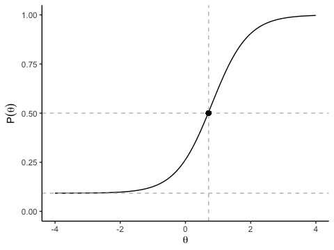<!-- -->

In this example, this 3PL model provides a smooth curve for this item
because it is based on item discrimination (steepness of the slope),
difficulty (point of inflexion at which the probability of answering the
item correctly is 50%) and the guessing probability (slightly raised
lower asymptote). The mathematical form of the 3PL model is:

 = c_i + (1-c_i)\frac{e^{1.7a_i(\theta_j-b_i)}}{1+e^{1.71a_i(\theta_j-b_i)}}")

Here, the probability of a correct response
")
given a person’s ability
 is
expressed as a function of all three item parameters and a person’s
ability, where 
indicates the item and 
indicates an individual person. In the figure, the steeper the slope,
the better the item is at differentiating people clearly in close
proximity to its difficulty. The lower the asymptote, the lower the
likelihood of selecting the right response by chance. As the item
difficulty (point of inflexion is slightly above the average: 0.71), the
item can be solved by a majority of potential participants.

So how do we fit such a model?

## Fitting the model

To fit any IRT model, we simply use the function `mirt()`. In a first
step, we specify the model itself. In this case, we simply want to
estimate a uni-dimensional model, so we use the following string command
`"Factor = item_1 - item_n"`. The syntax for specifying models is
comparatively simple, but for more complex (e.g., multidimensional
models), see the some examples using `?mirt`. It makes sense to save
this string in a separate object.

Next, we provide the function itself with

1.  the data set, which only contains the relevant variables (i.e.,
    potential id variables have to be excluded)
2.  the previously specifed model (string)
3.  the type of model we want to estiamte (in this case “3PL”)

I am adding `verbose = FALSE` to not print information about the
iterations. But you can remove this as well.

``` r
unimodel <- 'F1 = 1-10'

fit3PL <- mirt(data = d, 
               model = unimodel,  # alternatively, we could also just specify model = 1 in this case
               itemtype = "3PL", 
               verbose = FALSE)
fit3PL
```

    ## 
    ## Call:
    ## mirt(data = d, model = unimodel, itemtype = "3PL", verbose = FALSE)
    ## 
    ## Full-information item factor analysis with 1 factor(s).
    ## Converged within 1e-04 tolerance after 24 EM iterations.
    ## mirt version: 1.33.2 
    ## M-step optimizer: BFGS 
    ## EM acceleration: Ramsay 
    ## Number of rectangular quadrature: 61
    ## Latent density type: Gaussian 
    ## 
    ## Log-likelihood = -2738.689
    ## Estimated parameters: 30 
    ## AIC = 5537.377; AICc = 5541.343
    ## BIC = 5663.816; SABIC = 5568.594
    ## G2 (993) = 497.87, p = 1
    ## RMSEA = 0, CFI = NaN, TLI = NaN

The created object is of class “SingleGroupClass” and contains all
necessary information and data to assess the model. By running the
object itself, we get some information about the type of estimation as
well as some model fit indices (including AIC and BIC), which can be
used to compare models with one another.

## Understanding IRT parameter

To a certain degree, an IRT analysis is similar to a factor analysis in
CTT. If we use the `summary()` function, we get the so-called factor
solution including factor loadings (F1) and the communalities (h2),
which are squared factor loadings and are interpreted as the variance
accounted for in an item by the latent trait. Almost all of the items in
this case have a substantive relationship (loadings &gt; .50) with the
latent trait.

``` r
# Factor solution
summary(fit3PL)
```

    ##        F1    h2
    ## V1  0.707 0.500
    ## V2  0.513 0.264
    ## V3  0.535 0.286
    ## V4  0.727 0.529
    ## V5  0.574 0.329
    ## V6  0.566 0.320
    ## V7  0.603 0.364
    ## V8  0.443 0.196
    ## V9  0.718 0.516
    ## V10 0.480 0.230
    ## 
    ## SS loadings:  3.534 
    ## Proportion Var:  0.353 
    ## 
    ## Factor correlations: 
    ## 
    ##    F1
    ## F1  1

In IRT, however, we are usually more interested in the actual IRT
parameters as discussed above (discrimination, difficulty and guessing
probability). They can be extracted as follows:

``` r
params3PL <- coef(fit3PL, IRTpars = TRUE, simplify = TRUE)
round(params3PL$items, 2) # g = c = guessing parameter
```

|     |    a |     b |    g |   u |
|:----|-----:|------:|-----:|----:|
| V1  | 1.70 |  1.17 | 0.00 |   1 |
| V2  | 1.02 | -0.58 | 0.00 |   1 |
| V3  | 1.08 |  0.35 | 0.00 |   1 |
| V4  | 1.80 |  0.81 | 0.09 |   1 |
| V5  | 1.19 |  0.52 | 0.00 |   1 |
| V6  | 1.17 | -0.14 | 0.00 |   1 |
| V7  | 1.29 |  1.87 | 0.00 |   1 |
| V8  | 0.84 |  0.03 | 0.00 |   1 |
| V9  | 1.76 |  2.11 | 0.00 |   1 |
| V10 | 0.93 | -0.05 | 0.01 |   1 |

The values of the slope (a-parameters) parameters ranged from 0.84 to
1.80. This parameter is a measure of how well an item differentiates
individuals with different theta levels. Larger values, or steeper
slopes, are better at differentiating people. A slope also can be
interpreted as an indicator of the strength of a relationship between
and item and latent trait, with higher slope values corresponding to
stronger relationships.

The location or difficulty parameters (b-parameter) is also listed for
each item. Location parameters are interpreted as the value of theta
that corresponds to a .50 probability of responding correctly at or
above that location on an item. The location parameters show that the
items cover a wide range of the latent trait.

## Model fit, person fit, and item fit evaluation

Similar to factor analytical approaches, we can assess how well the
model fits the data. Rather than using a a

statisic, we use a specific index, *M2*, which is specifically designed
to assess the fit of item response models.

``` r
M2(fit3PL)
```

|       |       M2 |  df |         p | RMSEA | RMSEA\_5 | RMSEA\_95 |    SRMSR |      TLI | CFI |
|:------|---------:|----:|----------:|------:|---------:|----------:|---------:|---------:|----:|
| stats | 17.77133 |  25 | 0.8519424 |     0 |        0 | 0.0203603 | 0.033713 | 1.018438 |   1 |

As we can see, the M2 statistic is comparatively low and
non-significant. So there are no concerning differences between the
model and the data. This is further supported by a very low RMSEA and a
CFA and TLI of 1.

In IRT, however, we are usually more interested in *item*- and
*person*-fit indices. IRT allows us to assess how well each items fits
the model and whether the indiviual response patterns align with the
model.

Let us start with item fit: Similar to many other areas, different
indices have been proposed to assess item fit. We can use the function
`itemfit()` to get a variety of them. By default, we receive the `S_X2`
by Orlando and Thissen (2000) and the corresponding dfs, RMSEA and
p-values. This test should be non-significant to indicate good item fit.
As we can see here, only item V9 shows a lower fit with the model.
Proponents of the “Rasch Model” (see further below) often rather report
infit and outfit statistics. We can get those by adding the argument
`fit_stats = "infit"`). We get both mean-squared and standardized
versions of these measures (Linacre provides some guidelines to
interpret these: <https://www.rasch.org/rmt/rmt162f.htm>). Roughly
speaking the non-standardized values should be between .5 and 1.5 to not
be degrading. In the package `ggmirt`, we can also use the function
´itemfitPlot()\` to inspect this visually.

``` r
itemfit(fit3PL)
```

| item |     S\_X2 | df.S\_X2 | RMSEA.S\_X2 |   p.S\_X2 |
|:-----|----------:|---------:|------------:|----------:|
| V1   |  4.708662 |        4 |   0.0188425 | 0.3185173 |
| V2   |  2.503355 |        5 |   0.0000000 | 0.7759897 |
| V3   |  6.761645 |        5 |   0.0265720 | 0.2389791 |
| V4   |  3.700650 |        5 |   0.0000000 | 0.5932672 |
| V5   |  4.093206 |        5 |   0.0000000 | 0.5360762 |
| V6   |  2.824089 |        5 |   0.0000000 | 0.7270838 |
| V7   |  8.648072 |        5 |   0.0382381 | 0.1239519 |
| V8   |  2.901227 |        5 |   0.0000000 | 0.7152104 |
| V9   | 11.610311 |        4 |   0.0617477 | 0.0204970 |
| V10  |  2.693987 |        5 |   0.0000000 | 0.7470379 |

``` r
itemfit(fit3PL, fit_stats = "infit") # typical for Rasch modeling
```

| item |    outfit |  z.outfit |     infit |    z.infit |
|:-----|----------:|----------:|----------:|-----------:|
| V1   | 0.6386014 | -2.365002 | 0.8743268 | -1.7362580 |
| V2   | 0.8481622 | -3.058789 | 0.8705611 | -3.7125518 |
| V3   | 0.8320215 | -3.792355 | 0.8794736 | -3.4444109 |
| V4   | 0.8362322 | -2.532776 | 0.8729352 | -2.5664209 |
| V5   | 0.8035407 | -3.634037 | 0.8727943 | -3.1862993 |
| V6   | 0.8104688 | -4.158982 | 0.8432826 | -4.6042826 |
| V7   | 0.7308953 | -1.594022 | 0.9935245 | -0.0331537 |
| V8   | 0.8929857 | -3.419761 | 0.9110881 | -3.2959228 |
| V9   | 0.5264292 | -1.359471 | 1.0527710 |  0.3834486 |
| V10  | 0.8713525 | -3.689040 | 0.8945440 | -3.6438640 |

``` r
itemfitPlot(fit3PL)
```

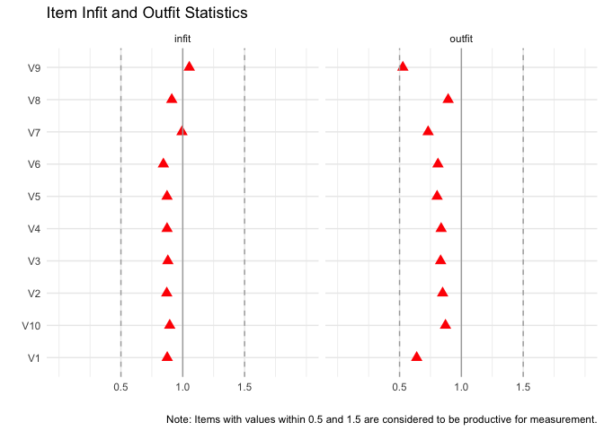<!-- -->

We again see that item V9 has a lower fit (outfit value close to .5),
but according to Linacre’s guidelines, this should not be concerning.

## Assessing person fit

We can technically produce the exact same measures for each person to
assess how well each person’s response patterns aligns with this model.
Think about it this way: If a person with a high theta (that is high
latent ability) answers does not answer an easy item correctly, this
person does not fit the model. Conversely, if a person with a low
ability answer a very difficult question correctly, it likewise doesn’t
fit the model. In practice, there will most likely be a few people who
do not fit the model well. But as long as the number of non-fitting
respondents is low, we are good. We mostly look again at infit and
outfit statistics. If less than 5% of the respondents have higher or
lower infit and outfit values than 1.96 and -1.96, we are good.

``` r
head(personfit(fit3PL))
```

|    outfit |   z.outfit |     infit |    z.infit |         Zh |
|----------:|-----------:|----------:|-----------:|-----------:|
| 1.0161479 |  0.1749541 | 1.0183924 |  0.1584039 | -0.0732308 |
| 0.6331922 | -0.1327510 | 0.8411215 | -0.4976128 |  0.5615934 |
| 0.7456650 | -0.1905736 | 0.8912849 | -0.3611853 |  0.4390657 |
| 0.7209540 | -0.0392887 | 0.9571507 | -0.0637470 |  0.2601261 |
| 2.1363674 |  2.3695393 | 1.7713727 |  2.1832656 | -2.6948633 |
| 0.7538809 |  0.0610415 | 1.0221023 |  0.1724740 |  0.0843561 |

``` r
personfit(fit3PL) %>%
  summarize(infit.outside = prop.table(table(z.infit > 1.96 | z.infit < -1.96)),
            outfit.outside = prop.table(table(z.outfit > 1.96 | z.outfit < -1.96))) # lower row = non-fitting people
```

| infit.outside | outfit.outside |
|--------------:|---------------:|
|         0.958 |           0.98 |
|         0.042 |           0.02 |

``` r
personfitPlot(fit3PL)
```

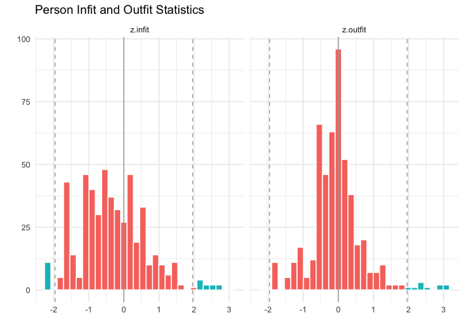<!-- -->

## Typical IRT plots

Next to overall model fit, item and person fit, we can evaluate many
more things. Some typical questions include:

1.  How well do the items cover the range of the latent ability?
2.  Is there any redundancy in the items?
3.  At what theta levels does the scale perform best?

A lot of these questions can be answered by visualizing different
aspects of the IRT models.

## Item Person Map (Wright Map)

The first question can be assessed using a so-called “Item Person Map”
(also known as Kernel Density Plots or Wright Maps). This visualization
first plots the distribution of the latent ability in the studied
sample. Next, we also plot each item’s difficulty on the same theta
scale. Aligning both plots shows us how well the items cover the latent
ability.

``` r
itempersonMap(fit3PL)
```

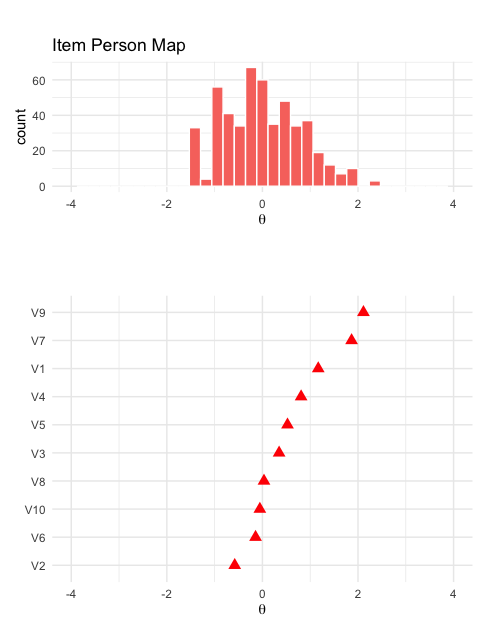<!-- -->

### Item Characteristics Curves (Trace Plots)

Item characteristic curves or trace plots (we already saw one earlier)
visualize all three IRT parameters for all the items. This visualization
is helpful in better understanding the unique properties of each item.
It can also be helpful to identify gaps in assessment as well as
differences in slope

``` r
tracePlot(fit3PL)
```

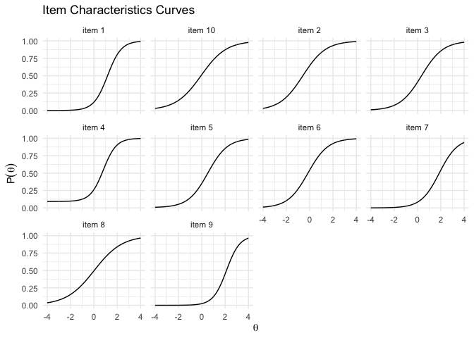<!-- -->

``` r
tracePlot(fit3PL, facet = F, legend = T) + scale_color_brewer(palette = "Set3")
```

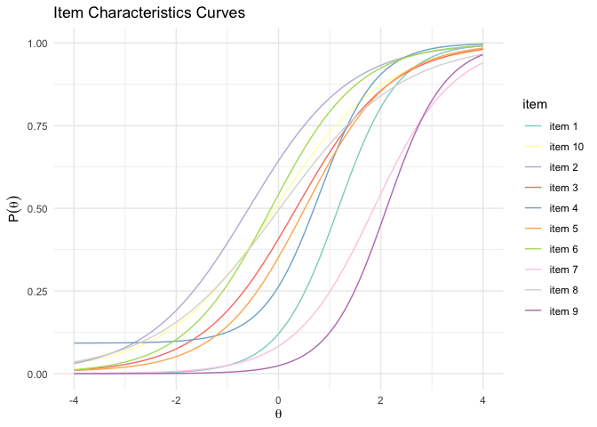<!-- -->

Particularly when plotted on top of each other, we can clearly see the
differences in slope, difficulty, and guessing.

### Item Information Curves

Another way of looking at the quality of each item is by plotting so
call item information curves. Information is a statistical concept that
refers to the ability of an item to accurately estimate scores on theta.
Item level information clarifies how well each item contributes to score
estimation precision with higher levels of information leading to more
accurate score estimates.

``` r
itemInfoPlot(fit3PL) + scale_color_brewer(palette = "Set3")
```

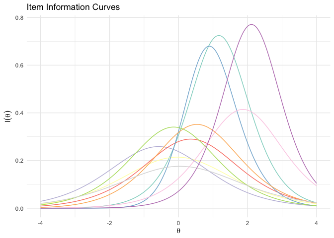<!-- -->

``` r
itemInfoPlot(fit3PL, items = c(1:3), facet = T) # only few items individually
```

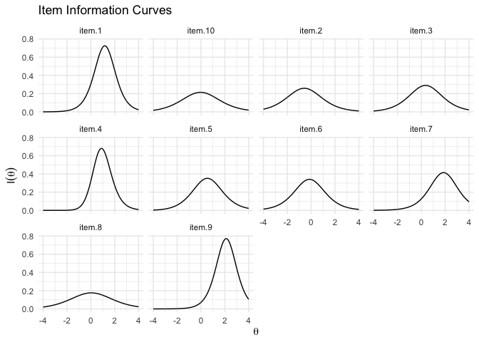<!-- -->

Here we, see clearly that some items offer most information on higher
theta levels whereas others cover the entire range of theta.

### Test Information Curves

The concept of “information” can also be applied to the entire scale.
Here, we see that the scale is very good at estimating theta scores
between -2 and 3, but has less precision at estimate theta scores at the
extremes.

``` r
testInfoPlot(fit3PL, adj_factor = 2)
```

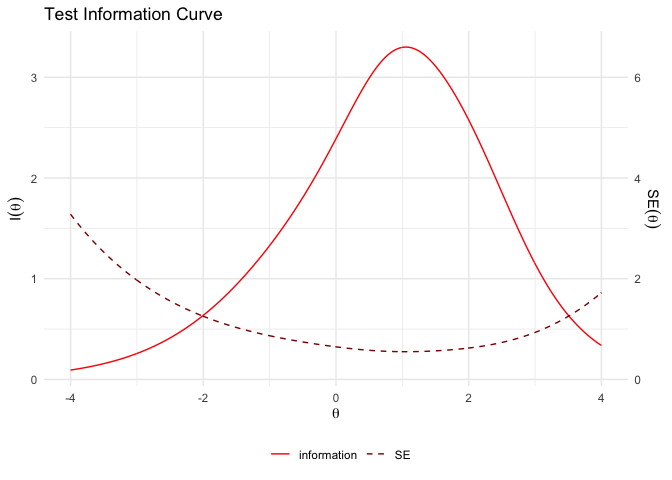<!-- -->

### Conditional reliability

The concept of reliability differs between CTT and IRT. In IRT, we can
actually compute the *conditional* reliability, i.e., the reliability of
the scale at different levels of theta. This curve is mathematically
related to both scale information and conditional standard errors
through simple transformations (see figure above).

``` r
conRelPlot(fit3PL)
```

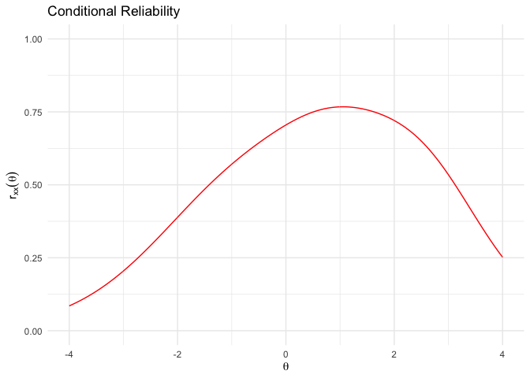<!-- -->

Yet, it is also possible to compute a single reliability estimate.

``` r
marginal_rxx(fit3PL)
```

    ## [1] 0.6682414

### Scale Characteristic Curves

A last quality of a IRT model can be that the bare number-correct-score
(sum score of correct responses) is a sufficiently good estimation of
the underlying trait. A plot of the so-called scale characteristic curve
allows to assess this visually by plotting the relationship between
theta and the number-correct-score.

``` r
scaleCharPlot(fit3PL)
```

<!-- -->

This curve usually takes the form of a S-shape as the relationship is
stronger in the middle range of theta and worse at the extremes (as
already seen in the test information curve). We can of course also test
this with a simple correlation. First, we extract the latent IRT score
using the function `fscores()`. We then correlate it with the simple
number-correct-score.

``` r
score <- fscores(fit3PL)
sumscore <- rowSums(d)
cor.test(score, sumscore)
```

    ## 
    ##  Pearson's product-moment correlation
    ## 
    ## data:  score and sumscore
    ## t = 181.54, df = 498, p-value < 2.2e-16
    ## alternative hypothesis: true correlation is not equal to 0
    ## 95 percent confidence interval:
    ##  0.9910997 0.9937302
    ## sample estimates:
    ##       cor 
    ## 0.9925295

As we can see, they correlate almost perfectly.

# 2PL model

The 2PL model only differs from the 3PL model in one regard: All items
are assumed to have no guessing probability. So the model only takes
item discrimination (a) and item difficulty into account. The
mathematical form is hence (we simply delete the part before the
fraction):

 = \frac{e^{1.7a_i(\theta_j-b_i)}}{1+e^{1.71a_i(\theta_j-b_i)}}")

The general procedure to estimate and assess the model remains the same.
I hence only pinpoint to differences and do not repeat all steps
outlined for the 3PL model.

## Fitting the model

``` r
fit2PL <- mirt(d, 1, itemtype = "2PL")
```

    ## Iteration: 1, Log-Lik: -2759.890, Max-Change: 0.37156Iteration: 2, Log-Lik: -2744.883, Max-Change: 0.21242Iteration: 3, Log-Lik: -2740.967, Max-Change: 0.11832Iteration: 4, Log-Lik: -2739.807, Max-Change: 0.07986Iteration: 5, Log-Lik: -2739.429, Max-Change: 0.04247Iteration: 6, Log-Lik: -2739.298, Max-Change: 0.02464Iteration: 7, Log-Lik: -2739.249, Max-Change: 0.01198Iteration: 8, Log-Lik: -2739.239, Max-Change: 0.00885Iteration: 9, Log-Lik: -2739.235, Max-Change: 0.00341Iteration: 10, Log-Lik: -2739.234, Max-Change: 0.00188Iteration: 11, Log-Lik: -2739.233, Max-Change: 0.00107Iteration: 12, Log-Lik: -2739.233, Max-Change: 0.00131Iteration: 13, Log-Lik: -2739.232, Max-Change: 0.00063Iteration: 14, Log-Lik: -2739.232, Max-Change: 0.00014Iteration: 15, Log-Lik: -2739.232, Max-Change: 0.00010

``` r
fit2PL
```

    ## 
    ## Call:
    ## mirt(data = d, model = 1, itemtype = "2PL")
    ## 
    ## Full-information item factor analysis with 1 factor(s).
    ## Converged within 1e-04 tolerance after 15 EM iterations.
    ## mirt version: 1.33.2 
    ## M-step optimizer: BFGS 
    ## EM acceleration: Ramsay 
    ## Number of rectangular quadrature: 61
    ## Latent density type: Gaussian 
    ## 
    ## Log-likelihood = -2739.232
    ## Estimated parameters: 20 
    ## AIC = 5518.465; AICc = 5520.218
    ## BIC = 5602.757; SABIC = 5539.276
    ## G2 (1003) = 498.96, p = 1
    ## RMSEA = 0, CFI = NaN, TLI = NaN

## Compare fit with 3PL model

We can always compare different models that are based on the same data.
Using the function `anova()`, we can check whether the models differ
based on various fit indices and a

test. In this case, the 2PL actually fits the data sightly better, but
the difference is not significant.

``` r
anova(fit2PL, fit3PL)
```

    ## 
    ## Model 1: mirt(data = d, model = 1, itemtype = "2PL")
    ## Model 2: mirt(data = d, model = unimodel, itemtype = "3PL", verbose = FALSE)

|      AIC |     AICc |    SABIC |       HQ |      BIC |    logLik |       X2 |  df |         p |
|---------:|---------:|---------:|---------:|---------:|----------:|---------:|----:|----------:|
| 5518.465 | 5520.218 | 5539.276 | 5551.541 | 5602.757 | -2739.232 |      NaN | NaN |       NaN |
| 5537.377 | 5541.343 | 5568.594 | 5586.991 | 5663.816 | -2738.689 | 1.087351 |  10 | 0.9997476 |

If we inspect the IRT parameters, the third parameter (c, here denoted
as g) is fixed to 0.

``` r
coef(fit2PL, IRTpars = TRUE, simplify = TRUE)
```

    ## $items
    ##         a      b g u
    ## V1  1.699  1.168 0 1
    ## V2  1.018 -0.582 0 1
    ## V3  1.084  0.343 0 1
    ## V4  1.275  0.657 0 1
    ## V5  1.177  0.514 0 1
    ## V6  1.176 -0.146 0 1
    ## V7  1.286  1.868 0 1
    ## V8  0.838  0.024 0 1
    ## V9  1.684  2.162 0 1
    ## V10 0.919 -0.070 0 1
    ## 
    ## $means
    ## F1 
    ##  0 
    ## 
    ## $cov
    ##    F1
    ## F1  1

## Trace plot

The difference between the 3PL and the 2PL model is particularly visible
in the trace plot.

``` r
tracePlot(fit2PL, theta_range = c(-5, 5), facet = F, legend = T) + 
  scale_color_brewer(palette = "Set3") +
  labs(title = "2PL - Traceplot")
```

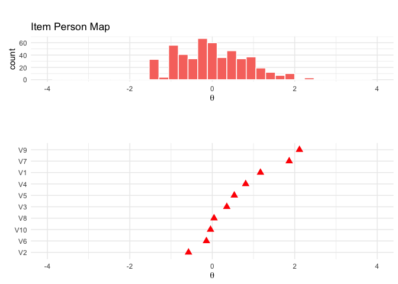<!-- -->

The curves have different slopes, but they do not have different
asymptotes (yintercepts = guessing probability).

# 1PL or Rasch model

The 1PL model gets rid of yet another parameter: item discrimination. It
basically constrains item discrimination to be equal across all items.
Only item difficulty is allowed to vary. The mathematical form hence
becomes:

 = \frac{e^{1.7a(\theta_j-b_i)}}{1+e^{1.71a(\theta_j-b_i)}}")

Note that there is no subscript for the letter
, because it is
constrained to be the same for all items. The Rasch model (stemming from
a different scholarly tradition) is mathematically equivalent, but is
often expressed slightly differently:

 = \frac{e^{(\beta-\delta_i)}}{1+ e^{(\beta-\delta_i)}}")

It is basically the same as the equation above, but the 1.7 constant is
omitted. Further, the typical notational system uses

instead of  and
 instead
of .

This constrained model is rather an “ideal” measurement model than a
model that can be perfectly fitted to the data. Yet, if we find items
that fit this model sufficiently, it actually has some mathematical
properties that cannot be obtained with less constrained models (e.g.,
2PL or 3PL models). For this reason, many scholars favor this
measurement model (particularly those following the Rasch School of
Measurement)

1.  For this model, the number-correct score is particularly a
    sufficient estimation of theta.
2.  Due to the fixed discrimination parameter, item characteristic
    curves cannot cross. Items thus do not differ in how well they
    differentiate respondents.
3.  Such a model has a so-called specific objectivity: Because the Rasch
    model is based on the idea that items are designed to fit certain
    properties, instead of finding a model that fits the data, item as
    well as person parameter estimates are invariant across samples.
    Person (i.e., proficiency scores) and item parameters (i.e., item
    difficulty) thus will be similar even if only a subset of the item
    pool is used or a different population is studied. This makes it
    very easy to create smaller tests, parallel test or even adaptive
    testing pools.

## Fitting the model

``` r
fitRasch <- mirt(d, 1, itemtype = "Rasch")
```

    ## Iteration: 1, Log-Lik: -2749.924, Max-Change: 0.12086Iteration: 2, Log-Lik: -2748.381, Max-Change: 0.06165Iteration: 3, Log-Lik: -2747.652, Max-Change: 0.04658Iteration: 4, Log-Lik: -2747.282, Max-Change: 0.03855Iteration: 5, Log-Lik: -2747.061, Max-Change: 0.02385Iteration: 6, Log-Lik: -2746.976, Max-Change: 0.01691Iteration: 7, Log-Lik: -2746.933, Max-Change: 0.01312Iteration: 8, Log-Lik: -2746.911, Max-Change: 0.00807Iteration: 9, Log-Lik: -2746.902, Max-Change: 0.00563Iteration: 10, Log-Lik: -2746.897, Max-Change: 0.00430Iteration: 11, Log-Lik: -2746.895, Max-Change: 0.00263Iteration: 12, Log-Lik: -2746.894, Max-Change: 0.00182Iteration: 13, Log-Lik: -2746.894, Max-Change: 0.00138Iteration: 14, Log-Lik: -2746.893, Max-Change: 0.00086Iteration: 15, Log-Lik: -2746.893, Max-Change: 0.00056Iteration: 16, Log-Lik: -2746.893, Max-Change: 0.00046Iteration: 17, Log-Lik: -2746.893, Max-Change: 0.00027Iteration: 18, Log-Lik: -2746.893, Max-Change: 0.00021Iteration: 19, Log-Lik: -2746.893, Max-Change: 0.00017Iteration: 20, Log-Lik: -2746.893, Max-Change: 0.00009

``` r
fitRasch
```

    ## 
    ## Call:
    ## mirt(data = d, model = 1, itemtype = "Rasch")
    ## 
    ## Full-information item factor analysis with 1 factor(s).
    ## Converged within 1e-04 tolerance after 20 EM iterations.
    ## mirt version: 1.33.2 
    ## M-step optimizer: nlminb 
    ## EM acceleration: Ramsay 
    ## Number of rectangular quadrature: 61
    ## Latent density type: Gaussian 
    ## 
    ## Log-likelihood = -2746.893
    ## Estimated parameters: 11 
    ## AIC = 5515.786; AICc = 5516.327
    ## BIC = 5562.147; SABIC = 5527.232
    ## G2 (1012) = 514.28, p = 1
    ## RMSEA = 0, CFI = NaN, TLI = NaN

## Compare models

``` r
anova(fitRasch, fit2PL)
```

    ## 
    ## Model 1: mirt(data = d, model = 1, itemtype = "Rasch")
    ## Model 2: mirt(data = d, model = 1, itemtype = "2PL")

|      AIC |     AICc |    SABIC |       HQ |      BIC |    logLik |       X2 |  df |        p |
|---------:|---------:|---------:|---------:|---------:|----------:|---------:|----:|---------:|
| 5515.786 | 5516.327 | 5527.232 | 5533.978 | 5562.147 | -2746.893 |      NaN | NaN |      NaN |
| 5518.465 | 5520.218 | 5539.276 | 5551.541 | 5602.757 | -2739.232 | 15.32166 |   9 | 0.082471 |

If we inspect the IRT parameters, the first (a, item discrimination) is
constrained to be equal and the third parameter (c, here denoted as g)
is fixed to 0.

``` r
coef(fitRasch, IRTpars = TRUE, simplify = TRUE)
```

    ## $items
    ##     a      b g u
    ## V1  1  1.673 0 1
    ## V2  1 -0.618 0 1
    ## V3  1  0.374 0 1
    ## V4  1  0.798 0 1
    ## V5  1  0.593 0 1
    ## V6  1 -0.174 0 1
    ## V7  1  2.304 0 1
    ## V8  1  0.018 0 1
    ## V9  1  3.138 0 1
    ## V10 1 -0.073 0 1
    ## 
    ## $means
    ## F1 
    ##  0 
    ## 
    ## $cov
    ##       F1
    ## F1 1.302

## Trace plot

Again, the difference between the 3PL, 2PL and the 1PL (Rasch) model is
particularly visible in the trace plot:

``` r
tracePlot(fitRasch, theta_range = c(-5, 5), facet = F, legend = T) + 
  scale_color_brewer(palette = "Set3") +
  labs(title = "1PL - Traceplot")
```

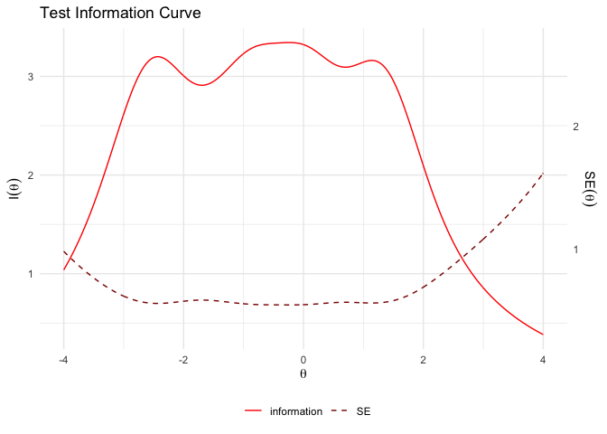<!-- -->

All items have the exact same slope.

## Creating smaller tests or parallel tests

``` r
itempersonMap(fitRasch)
```

<!-- -->

We can create smaller, but parallel tests by distributing similar items
into to subset pools. Here, I am simply inspecting the item person map
and try to form to sets that equally cover the range of the latent
ability.

``` r
subset1 <- d %>%
  select(V2, V10, V3, V4, V7)
subset2 <- d %>%
  select(V6, V8, V5, V1, V9)

test1 <- mirt(subset1, 1, itemtype = "Rasch")
```

    ## Iteration: 1, Log-Lik: -1482.086, Max-Change: 0.02578Iteration: 2, Log-Lik: -1481.954, Max-Change: 0.01916Iteration: 3, Log-Lik: -1481.870, Max-Change: 0.01696Iteration: 4, Log-Lik: -1481.820, Max-Change: 0.01823Iteration: 5, Log-Lik: -1481.753, Max-Change: 0.01291Iteration: 6, Log-Lik: -1481.719, Max-Change: 0.01122Iteration: 7, Log-Lik: -1481.698, Max-Change: 0.01094Iteration: 8, Log-Lik: -1481.673, Max-Change: 0.00827Iteration: 9, Log-Lik: -1481.659, Max-Change: 0.00713Iteration: 10, Log-Lik: -1481.652, Max-Change: 0.00733Iteration: 11, Log-Lik: -1481.642, Max-Change: 0.00522Iteration: 12, Log-Lik: -1481.637, Max-Change: 0.00446Iteration: 13, Log-Lik: -1481.634, Max-Change: 0.00429Iteration: 14, Log-Lik: -1481.630, Max-Change: 0.00319Iteration: 15, Log-Lik: -1481.628, Max-Change: 0.00273Iteration: 16, Log-Lik: -1481.627, Max-Change: 0.00271Iteration: 17, Log-Lik: -1481.626, Max-Change: 0.00196Iteration: 18, Log-Lik: -1481.625, Max-Change: 0.00167Iteration: 19, Log-Lik: -1481.625, Max-Change: 0.00159Iteration: 20, Log-Lik: -1481.624, Max-Change: 0.00118Iteration: 21, Log-Lik: -1481.624, Max-Change: 0.00101Iteration: 22, Log-Lik: -1481.624, Max-Change: 0.00098Iteration: 23, Log-Lik: -1481.624, Max-Change: 0.00072Iteration: 24, Log-Lik: -1481.623, Max-Change: 0.00061Iteration: 25, Log-Lik: -1481.623, Max-Change: 0.00059Iteration: 26, Log-Lik: -1481.623, Max-Change: 0.00043Iteration: 27, Log-Lik: -1481.623, Max-Change: 0.00037Iteration: 28, Log-Lik: -1481.623, Max-Change: 0.00035Iteration: 29, Log-Lik: -1481.623, Max-Change: 0.00026Iteration: 30, Log-Lik: -1481.623, Max-Change: 0.00022Iteration: 31, Log-Lik: -1481.623, Max-Change: 0.00022Iteration: 32, Log-Lik: -1481.623, Max-Change: 0.00016Iteration: 33, Log-Lik: -1481.623, Max-Change: 0.00014Iteration: 34, Log-Lik: -1481.623, Max-Change: 0.00014Iteration: 35, Log-Lik: -1481.623, Max-Change: 0.00010

``` r
test2 <- mirt(subset2, 1, itemtype = "Rasch")
```

    ## Iteration: 1, Log-Lik: -1346.231, Max-Change: 0.10730Iteration: 2, Log-Lik: -1345.613, Max-Change: 0.04157Iteration: 3, Log-Lik: -1345.229, Max-Change: 0.03844Iteration: 4, Log-Lik: -1344.995, Max-Change: 0.04934Iteration: 5, Log-Lik: -1344.649, Max-Change: 0.03190Iteration: 6, Log-Lik: -1344.470, Max-Change: 0.02838Iteration: 7, Log-Lik: -1344.367, Max-Change: 0.03187Iteration: 8, Log-Lik: -1344.218, Max-Change: 0.02198Iteration: 9, Log-Lik: -1344.144, Max-Change: 0.01929Iteration: 10, Log-Lik: -1344.104, Max-Change: 0.02283Iteration: 11, Log-Lik: -1344.040, Max-Change: 0.01460Iteration: 12, Log-Lik: -1344.010, Max-Change: 0.01258Iteration: 13, Log-Lik: -1343.994, Max-Change: 0.01278Iteration: 14, Log-Lik: -1343.970, Max-Change: 0.00922Iteration: 15, Log-Lik: -1343.959, Max-Change: 0.00790Iteration: 16, Log-Lik: -1343.953, Max-Change: 0.00933Iteration: 17, Log-Lik: -1343.944, Max-Change: 0.00576Iteration: 18, Log-Lik: -1343.940, Max-Change: 0.00488Iteration: 19, Log-Lik: -1343.937, Max-Change: 0.00488Iteration: 20, Log-Lik: -1343.934, Max-Change: 0.00352Iteration: 21, Log-Lik: -1343.933, Max-Change: 0.00297Iteration: 22, Log-Lik: -1343.932, Max-Change: 0.00319Iteration: 23, Log-Lik: -1343.930, Max-Change: 0.00214Iteration: 24, Log-Lik: -1343.930, Max-Change: 0.00183Iteration: 25, Log-Lik: -1343.930, Max-Change: 0.00182Iteration: 26, Log-Lik: -1343.929, Max-Change: 0.00127Iteration: 27, Log-Lik: -1343.929, Max-Change: 0.00110Iteration: 28, Log-Lik: -1343.929, Max-Change: 0.00110Iteration: 29, Log-Lik: -1343.929, Max-Change: 0.00077Iteration: 30, Log-Lik: -1343.929, Max-Change: 0.00065Iteration: 31, Log-Lik: -1343.929, Max-Change: 0.00064Iteration: 32, Log-Lik: -1343.929, Max-Change: 0.00047Iteration: 33, Log-Lik: -1343.929, Max-Change: 0.00039Iteration: 34, Log-Lik: -1343.929, Max-Change: 0.00040Iteration: 35, Log-Lik: -1343.928, Max-Change: 0.00029Iteration: 36, Log-Lik: -1343.928, Max-Change: 0.00024Iteration: 37, Log-Lik: -1343.928, Max-Change: 0.00023Iteration: 38, Log-Lik: -1343.928, Max-Change: 0.00016Iteration: 39, Log-Lik: -1343.928, Max-Change: 0.00015Iteration: 40, Log-Lik: -1343.928, Max-Change: 0.00015Iteration: 41, Log-Lik: -1343.928, Max-Change: 0.00010

We can assess their similarity be plotting two test information curves
on top of each other:

``` r
testInfoCompare(test1, test2)
```

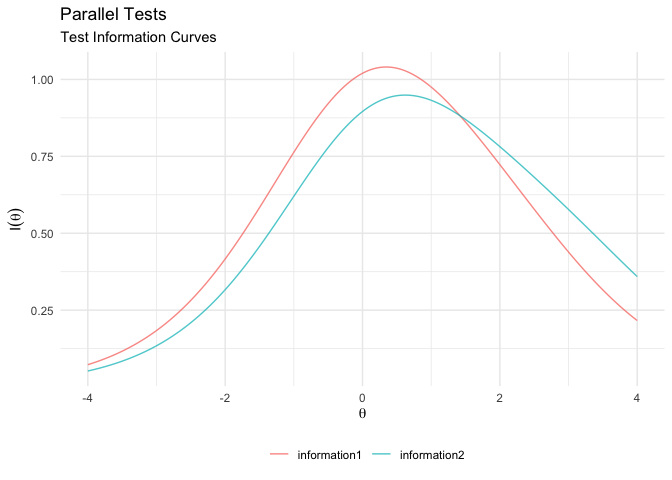<!-- -->

As we can see, both test sufficiently overlap in their information
curve. So they are very likely to correlate highly with the original
test

``` r
cor.test(fscores(test1), fscores(fitRasch))
```

    ## 
    ##  Pearson's product-moment correlation
    ## 
    ## data:  fscores(test1) and fscores(fitRasch)
    ## t = 41.294, df = 498, p-value < 2.2e-16
    ## alternative hypothesis: true correlation is not equal to 0
    ## 95 percent confidence interval:
    ##  0.8582739 0.8981538
    ## sample estimates:
    ##       cor 
    ## 0.8797521

``` r
cor.test(fscores(test2), fscores(fitRasch))
```

    ## 
    ##  Pearson's product-moment correlation
    ## 
    ## data:  fscores(test2) and fscores(fitRasch)
    ## t = 38.389, df = 498, p-value < 2.2e-16
    ## alternative hypothesis: true correlation is not equal to 0
    ## 95 percent confidence interval:
    ##  0.8405774 0.8851290
    ## sample estimates:
    ##      cor 
    ## 0.864542

# Where to go next?

IRT is a broad field and there are many more models (e.g., graded
response models, multidimensional models, 4PL models…). In a follow-up
tutorial, you can learn how to estimate [graded response
models](https://github.com/ccs-amsterdam/r-course-material/blob/master/tutorials/R_test-theory_3_irt_graded.md).
A good starting point for diving deeper into the extended literature on
IRT, see:

-   DeMars, C. (2010). Item response theory. Oxford University Press.

-   Embretson, S. E., & Reise, S. P. (2013). Item response theory (2nd
    ed.). Psychology Press.

There are also good online resources:

-   Website dedicated to Rasch modeling: <https://www.rasch.org/>

# References

-   DeMars, C. (2010). Item response theory. Oxford University Press.

-   Orlando, M. & Thissen, D. (2000). Likelihood-based item fit indices
    for dichotomous item response theory models. Applied Psychological
    Measurement, 24, 50-64.
