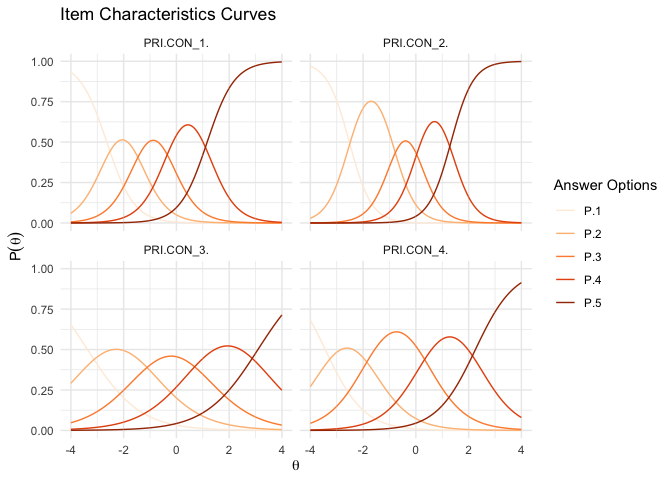
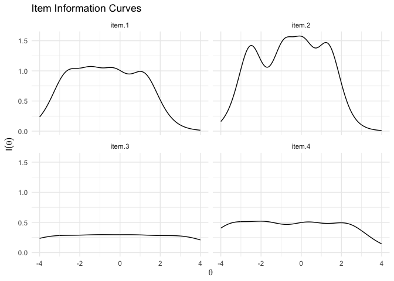
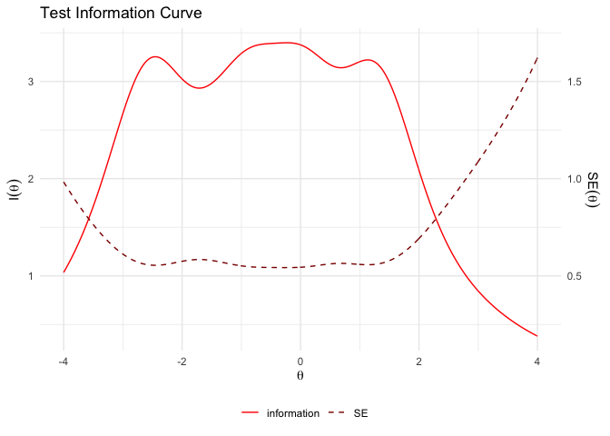

Item Response Theory: Graded Response Models
================
Philipp Masur
2022-03

-   [Introduction](#introduction)
-   [Preparation and Data](#preparation-and-data)
    -   [Fitting the model](#fitting-the-model)
    -   [IRT parameters](#irt-parameters)
    -   [Model fit, item fit, person
        fit](#model-fit-item-fit-person-fit)
    -   [Typical Plots](#typical-plots)
        -   [Trace Plots](#trace-plots)
        -   [Item Information Curves](#item-information-curves)
        -   [Test Information Curve](#test-information-curve)
-   [Comparison with CFA results](#comparison-with-cfa-results)
-   [References](#references)

# Introduction

In a previous
[tutorial](https://github.com/ccs-amsterdam/r-course-material/blob/master/tutorials/R_test-theory_3_irt.md),
I introduced the basics of Item Response Theory (IRT) and how they can
be applied to estimate unidimensional models based on dichotomous items.
This tutorial is much shorter as it heavily builds on the previous one.
So if you are new to IRT, consider working through the previous tutorial
first.

Although IRT models for binary items are more common, IRT can also be
used for non-binary items. In that sense, it provides an interesting
alternative to the standard confirmatory factor analyses (CFA, see [this
tutorial](https://github.com/ccs-amsterdam/r-course-material/blob/master/tutorials/R_test-theory_1_cfa.md))
as we can estimate similar models, but can benefit from all the
advantages and opportunities of IRT-based analyses.

The *graded response model* is recommended for estimating IRT models
from ordered polytomous response data (e.g., Likert-type scales). We
again can use the packages `tidyverse` (for data wrangling), `mirt` (for
estimating the IRT models) and the extension `ggmirt` (for
publication-ready visualizations). We are also going to load the package
`lavaan` as we will compare IRT and CTT approaches in this tutorial.

``` r
library(tidyverse)
library(mirt)
library(lavaan)

# devtools::install_github("masurp/ggmirt")
library(ggmirt)
```

# Preparation and Data

Let’s first load some data. In this case, we are going to use some data
provided by Dienlin & Metzger (2016). The data can be assessed via the
OSF (<https://osf.io/bu74a/>). For this tutorial, we will only use 4
items assessing “online privacy” concerns. They were measured on a
5-point scale ranging from 1 = \`*strongly disagree* to 5 = *strongly
agree*. Several answers were reverse coded (Example item: “I do not feel
especially concerned about my privacy online”).

``` r
d <- read.csv("https://osf.io/bu74a/download", header=TRUE, na.strings="NA") %>%
  as_tibble %>%
  select(PRI.CON_1: PRI.CON_4) %>%
  na.omit

head(d)
```

| PRI.CON\_1 | PRI.CON\_2 | PRI.CON\_3 | PRI.CON\_4 |
|-----------:|-----------:|-----------:|-----------:|
|          4 |          5 |          4 |          4 |
|          1 |          1 |          1 |          4 |
|          2 |          4 |          4 |          4 |
|          3 |          3 |          2 |          3 |
|          3 |          4 |          3 |          2 |
|          3 |          2 |          2 |          2 |

## Fitting the model

To fit the model, we can again simply use the function `mirt()` and
simply indicate that the itemtype is “graded”.

``` r
fitGraded <- mirt(d, 1, itemtype = "graded")
```

    ## Iteration: 1, Log-Lik: -5791.543, Max-Change: 0.68774Iteration: 2, Log-Lik: -5715.289, Max-Change: 0.40431Iteration: 3, Log-Lik: -5683.421, Max-Change: 0.22374Iteration: 4, Log-Lik: -5668.038, Max-Change: 0.18696Iteration: 5, Log-Lik: -5662.013, Max-Change: 0.14274Iteration: 6, Log-Lik: -5658.345, Max-Change: 0.08552Iteration: 7, Log-Lik: -5656.410, Max-Change: 0.06563Iteration: 8, Log-Lik: -5655.910, Max-Change: 0.04094Iteration: 9, Log-Lik: -5655.660, Max-Change: 0.03319Iteration: 10, Log-Lik: -5655.491, Max-Change: 0.01752Iteration: 11, Log-Lik: -5655.466, Max-Change: 0.03093Iteration: 12, Log-Lik: -5655.441, Max-Change: 0.01429Iteration: 13, Log-Lik: -5655.432, Max-Change: 0.01108Iteration: 14, Log-Lik: -5655.427, Max-Change: 0.00654Iteration: 15, Log-Lik: -5655.423, Max-Change: 0.00521Iteration: 16, Log-Lik: -5655.420, Max-Change: 0.00028Iteration: 17, Log-Lik: -5655.419, Max-Change: 0.00105Iteration: 18, Log-Lik: -5655.419, Max-Change: 0.00050Iteration: 19, Log-Lik: -5655.419, Max-Change: 0.00038Iteration: 20, Log-Lik: -5655.419, Max-Change: 0.00014Iteration: 21, Log-Lik: -5655.419, Max-Change: 0.00039Iteration: 22, Log-Lik: -5655.419, Max-Change: 0.00019Iteration: 23, Log-Lik: -5655.419, Max-Change: 0.00039Iteration: 24, Log-Lik: -5655.419, Max-Change: 0.00015Iteration: 25, Log-Lik: -5655.419, Max-Change: 0.00013Iteration: 26, Log-Lik: -5655.419, Max-Change: 0.00038Iteration: 27, Log-Lik: -5655.419, Max-Change: 0.00010Iteration: 28, Log-Lik: -5655.419, Max-Change: 0.00009

``` r
fitGraded
```

    ## 
    ## Call:
    ## mirt(data = d, model = 1, itemtype = "graded")
    ## 
    ## Full-information item factor analysis with 1 factor(s).
    ## Converged within 1e-04 tolerance after 28 EM iterations.
    ## mirt version: 1.33.2 
    ## M-step optimizer: BFGS 
    ## EM acceleration: Ramsay 
    ## Number of rectangular quadrature: 61
    ## Latent density type: Gaussian 
    ## 
    ## Log-likelihood = -5655.419
    ## Estimated parameters: 20 
    ## AIC = 11350.84; AICc = 11351.61
    ## BIC = 11451.13; SABIC = 11387.61
    ## G2 (604) = 1190.27, p = 0
    ## RMSEA = 0.03, CFI = NaN, TLI = NaN

By using the `summary()` function, we can produce the factor solution
and inspect the factor loadings. Just for fun, let’s quickly compare
with the factor solution of a CFA.

``` r
fitCTT <- cfa("privacyconcerns =~ PRI.CON_1 + PRI.CON_2 + PRI.CON_3 + PRI.CON_4", data = d)

# IRT solution
summary(fitGraded)
```

    ##              F1    h2
    ## PRI.CON_1 0.750 0.562
    ## PRI.CON_2 0.811 0.658
    ## PRI.CON_3 0.509 0.259
    ## PRI.CON_4 0.623 0.388
    ## 
    ## SS loadings:  1.867 
    ## Proportion Var:  0.467 
    ## 
    ## Factor correlations: 
    ## 
    ##    F1
    ## F1  1

``` r
# CTT solution
standardizedsolution(fitCTT) %>%
  filter(op == "=~") %>% select(rhs, F1 = est.std)
```

| rhs        |        F1 |
|:-----------|----------:|
| PRI.CON\_1 | 0.6619346 |
| PRI.CON\_2 | 0.7372001 |
| PRI.CON\_3 | 0.4094663 |
| PRI.CON\_4 | 0.5155927 |

We can see that the factor loadings are not completely the same, but the
are very “similar”. For example, the item PRI.CON\_2 has the highest
loading in both approaches.

## IRT parameters

``` r
params <- coef(fitGraded, IRTpars = TRUE, simplify = TRUE)
round(params$items, 2) # g = c = guessing parameter
```

|            |    a |    b1 |    b2 |    b3 |   b4 |
|:-----------|-----:|------:|------:|------:|-----:|
| PRI.CON\_1 | 1.93 | -2.64 | -1.46 | -0.29 | 1.17 |
| PRI.CON\_2 | 2.36 | -2.52 | -0.86 |  0.08 | 1.33 |
| PRI.CON\_3 | 1.01 | -3.37 | -1.18 |  0.79 | 3.09 |
| PRI.CON\_4 | 1.35 | -3.44 | -1.78 |  0.31 | 2.26 |

Similar to the simpler 3PL, 2PL, or 1PL models, the values of the slope
(a) parameters represent a measure of how well an item differentiates
respondents with different levels of the latent trait. Larger values, or
steeper slopes, are better at differentiating theta.

However, in contrast to models based on binary response items, we know
see four location parameters (b) for each item. These location or item
difficulty parameters are interpreted as the value of theta that
corresponds to a .5 probability of responding at or above that location
on an item. There are `m-1` location parameters where `m` refers to the
number of response categories on the response scale (in this case, 5-1).
The location parameters indicate that responses covered a wide range of
the latent trait. We also can already see that the answer options cover
different ranges on the latent trait. This is of course expected, with
“strongly disgree” naturally covering lower ranges of the trait than
e.g., “strongly agree”.

## Model fit, item fit, person fit

Similar to simpler models, we can inspect model fit, item fit, and
person fit indices.

``` r
M2(fitGraded, type = "C2", calcNULL = FALSE)
```

|       |       M2 |  df |         p |     RMSEA |  RMSEA\_5 | RMSEA\_95 |     SRMSR |       TLI |       CFI |
|:------|---------:|----:|----------:|----------:|----------:|----------:|----------:|----------:|----------:|
| stats | 9.198614 |   2 | 0.0100588 | 0.0568928 | 0.0236015 | 0.0962731 | 0.0560256 | 0.9725604 | 0.9908535 |

``` r
itemfit(fitGraded)
```

| item       |     S\_X2 | df.S\_X2 | RMSEA.S\_X2 | p.S\_X2 |
|:-----------|----------:|---------:|------------:|--------:|
| PRI.CON\_1 |  84.79371 |       20 |   0.0539758 |   0e+00 |
| PRI.CON\_2 |  71.89922 |       20 |   0.0483073 |   1e-07 |
| PRI.CON\_3 | 113.67134 |       23 |   0.0595414 |   0e+00 |
| PRI.CON\_4 |  88.75420 |       22 |   0.0522367 |   0e+00 |

``` r
head(personfit(fitGraded))
```

|    outfit |   z.outfit |     infit |    z.infit |         Zh |
|----------:|-----------:|----------:|-----------:|-----------:|
| 0.4884694 | -0.5628345 | 0.4313877 | -0.6786124 |  0.7804337 |
| 2.6071496 |  1.7713153 | 2.6885891 |  1.8116753 | -2.4191541 |
| 2.0549152 |  1.3384209 | 1.9163719 |  1.2241292 | -1.1414576 |
| 0.2468627 | -1.2931131 | 0.2976097 | -1.1339466 |  1.0415338 |
| 1.1458430 |  0.4337343 | 1.0092718 |  0.2533523 | -0.4394222 |
| 0.4218925 | -0.7069409 | 0.4172608 | -0.7520850 |  0.7638786 |

## Typical Plots

The differences between IRT models based on dichotomous data and a
graded response model becomes particularly clear when we look at trace
plots and scale information curves. Technically, we can use all the plot
functions that we already got to know in the previous tutorial, but the
results will differ slightly.

### Trace Plots

Trace plots are particularly useful to examine the probabilities of
responding to specific categories in an item’s response scale. These
probabilities are graphically displayed in the *category* response
curves shown below (not item characteristic curves as in the other IRT
models).

``` r
tracePlot(fitGraded) +
  labs(color = "Answer Options")
```

<!-- -->

These curves have a clear relationship with theta: As theta increases,
the probability of endorsing a category increases and then decreases as
responses transition to the next higher category. Again, we see clearly
that all of the item’s answer options cover a wide range of the latent
trait.

### Item Information Curves

``` r
itemInfoPlot(fitGraded, d, facet = T)
```

<!-- -->

By plot item information curves, we can also see that not all items
provide the same amount of information. From these curves, it becomes
quite clear that items 1 and 2 are better suited to measure the latent
trait (something we already saw in the higher factor loadings!).

### Test Information Curve

``` r
testInfoPlot(fitGraded, adj_factor = .5)
```

<!-- -->

Looking at the overall test information curve, we can again see that the
scale is based at differentiating people between -3 and 2 on the latent
theta trait.

# Comparison with CFA results

You may wonder in how far IRT and CFA led to the same results. We can
simply extract the respective factor scores from both models and
correlate them.

``` r
cor.test(predict(fitCTT), fscores(fitGraded))
```

    ## 
    ##  Pearson's product-moment correlation
    ## 
    ## data:  predict(fitCTT) and fscores(fitGraded)
    ## t = 286.75, df = 1111, p-value < 2.2e-16
    ## alternative hypothesis: true correlation is not equal to 0
    ## 95 percent confidence interval:
    ##  0.9924800 0.9940521
    ## sample estimates:
    ##       cor 
    ## 0.9933119

As can be seen, they are almost equivalent. A nice example of how two
different approaches lead to almost the same estimation of the latent
trait.

# References

-   Dienlin, T., & Metzger, M. J. (2016). An extended privacy calculus
    model for SNSs-Analyzing self-disclosure and self-withdrawal in a
    U.S. representative sample. Journal of Computer Mediated
    Communication, 21, 368–383. <doi:10.1111/jcc4.12163>
    ([data](https://osf.io/bu74a/))
