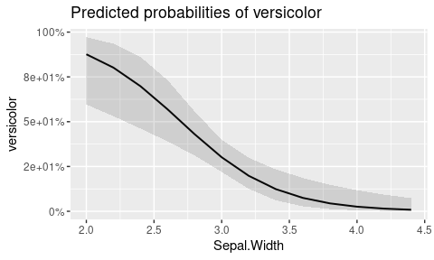
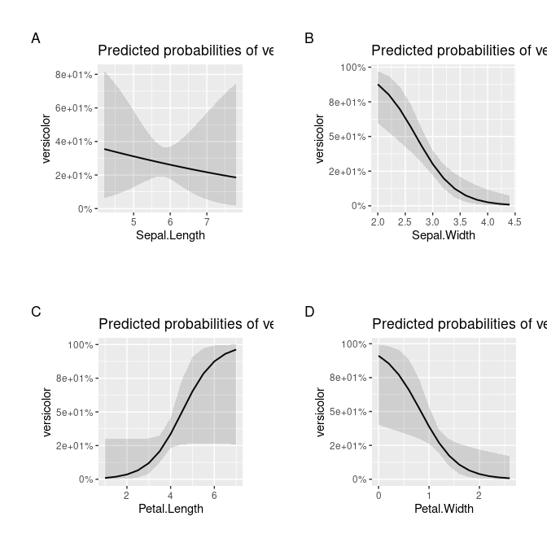
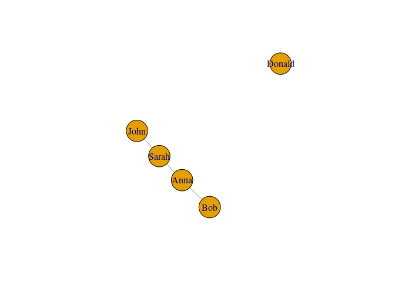

Advanced Statistical Modeling in R
================
Kasper Welbers & Wouter van Atteveldt
October 2020

  - [Advanced Modeling](#advanced-modeling)
  - [Generalized linear models](#generalized-linear-models)
      - [Logistic regression](#logistic-regression)
  - [Multilevel models, or Mixed-Effects
    models](#multilevel-models-or-mixed-effects-models)
      - [Multilevel modeling in R: a visual
        explanation](#multilevel-modeling-in-r-a-visual-explanation)
          - [Regular linear model](#regular-linear-model)
          - [Multilevel model with random
            intercepts](#multilevel-model-with-random-intercepts)
          - [Multilevel model with random intercepts and random
            slopes](#multilevel-model-with-random-intercepts-and-random-slopes)
          - [Comparing multilevel models](#comparing-multilevel-models)
      - [Multilevel Logistic or Poisson regression with
        glmer()](#multilevel-logistic-or-poisson-regression-with-glmer)

# Advanced Modeling

In this tutorial we show how to use Generalized Linear Models and
Multilevel models in R. The focus is primarily on the code, but we do
provide some general information about when to use these models and how
to interpret them, so you can follow this tutorial even if these methods
are new to you. Still, note that to properly apply these methods in your
own research it is recommended to also look into material that focuses
on the statistical models.

For this tutorial we use the tidyverse and sjPlot package to manage the
data and present the models. For the statistical models we use the stats
packages (loaded by default) and the amazing
[lme4](https://cran.r-project.org/web//packages/lme4/vignettes/lmer.pdf)
package

``` r
library(tidyverse)
library(sjPlot)
library(lme4)    
```

# Generalized linear models

> In statistics, the generalized linear model (GLM) is a flexible
> generalization of ordinary linear regression that allows for response
> variables that have error distribution models other than a normal
> distribution. The GLM generalizes linear regression by allowing the
> linear model to be related to the response variable via a link
> function and by allowing the magnitude of the variance of each
> measurement to be a function of its predicted value.
> [Wikipedia](https://en.wikipedia.org/wiki/Generalized_linear_model)

Probably the most common use of generalized linear models is the
logistic regression, or binary regression, that allows for a dichotomous
response variable. Another common use is the Poisson regression, which
allows for a response variable with a Poisson distribution.

Generalized linear models can be performed with the regular stats
package, in a way that is very similar to the regular linear models.
Where regular linear models have the `lm` function, generalized linear
models have the `glm` function. Other than this, the main difference is
that the family function, or link function, of the glm needs to be
given.

In this tutorial we will mainly focus on how to use the `glm` function,
using logistic regression as an example. If you are not familiar with
GLM’s, beware that the interpretation of coefficients and model fit can
be quite different from ordinary linear regression. For a more detailed
tutorial that includes pointers on interpretation, see the Generalized
Linear Models tutorial on the R course material GitHub page.

## Logistic regression

We’ll use the `iris` demo data, which contains measurements of sepal and
petal length and width for three species of iris. First, we create a
copy of the iris data, but with a dichotomous variable for whether a
case (row) is of the species “versicolor”. As an example case, we’ll
then use logistic linear regression to predict whether the species is
`versicolor` based on the Sepal size (length and width).

``` r
d = mutate(iris, versicolor = as.numeric(Species == 'versicolor'))
head(d)
```

    ##   Sepal.Length Sepal.Width Petal.Length Petal.Width Species versicolor
    ## 1          5.1         3.5          1.4         0.2  setosa          0
    ## 2          4.9         3.0          1.4         0.2  setosa          0
    ## 3          4.7         3.2          1.3         0.2  setosa          0
    ## 4          4.6         3.1          1.5         0.2  setosa          0
    ## 5          5.0         3.6          1.4         0.2  setosa          0
    ## 6          5.4         3.9          1.7         0.4  setosa          0

The `glm` function works mostly the same as the `lm` function, and uses
the same type of formula: `dependent ~ independent1 + independent2 +
...`. The main difference is that we’ll need to specify the error
distribution family and link function with the `family` argument. For
logistic regression, we need to use the `binomial` family (which by
default uses the canonical `logit` link function). To interpret the
model we use the tab\_model function from the sjPlot package.

``` r
m = glm(versicolor ~ Sepal.Length + Sepal.Width, family = binomial, data = d)
tab_model(m)
```

<table style="border-collapse:collapse; border:none;">

<tr>

<th style="border-top: double; text-align:center; font-style:normal; font-weight:bold; padding:0.2cm;  text-align:left; ">

 

</th>

<th colspan="3" style="border-top: double; text-align:center; font-style:normal; font-weight:bold; padding:0.2cm; ">

versicolor

</th>

</tr>

<tr>

<td style=" text-align:center; border-bottom:1px solid; font-style:italic; font-weight:normal;  text-align:left; ">

Predictors

</td>

<td style=" text-align:center; border-bottom:1px solid; font-style:italic; font-weight:normal;  ">

Odds Ratios

</td>

<td style=" text-align:center; border-bottom:1px solid; font-style:italic; font-weight:normal;  ">

CI

</td>

<td style=" text-align:center; border-bottom:1px solid; font-style:italic; font-weight:normal;  ">

p

</td>

</tr>

<tr>

<td style=" padding:0.2cm; text-align:left; vertical-align:top; text-align:left; ">

(Intercept)

</td>

<td style=" padding:0.2cm; text-align:left; vertical-align:top; text-align:center;  ">

3270.76

</td>

<td style=" padding:0.2cm; text-align:left; vertical-align:top; text-align:center;  ">

38.30 – 473371.01

</td>

<td style=" padding:0.2cm; text-align:left; vertical-align:top; text-align:center;  ">

<strong>0.001</strong>

</td>

</tr>

<tr>

<td style=" padding:0.2cm; text-align:left; vertical-align:top; text-align:left; ">

Sepal.Length

</td>

<td style=" padding:0.2cm; text-align:left; vertical-align:top; text-align:center;  ">

1.14

</td>

<td style=" padding:0.2cm; text-align:left; vertical-align:top; text-align:center;  ">

0.70 – 1.86

</td>

<td style=" padding:0.2cm; text-align:left; vertical-align:top; text-align:center;  ">

0.600

</td>

</tr>

<tr>

<td style=" padding:0.2cm; text-align:left; vertical-align:top; text-align:left; ">

Sepal.Width

</td>

<td style=" padding:0.2cm; text-align:left; vertical-align:top; text-align:center;  ">

0.04

</td>

<td style=" padding:0.2cm; text-align:left; vertical-align:top; text-align:center;  ">

0.01 – 0.13

</td>

<td style=" padding:0.2cm; text-align:left; vertical-align:top; text-align:center;  ">

<strong>\<0.001

</td>

</tr>

<tr>

<td style=" padding:0.2cm; text-align:left; vertical-align:top; text-align:left; padding-top:0.1cm; padding-bottom:0.1cm; border-top:1px solid;">

Observations

</td>

<td style=" padding:0.2cm; text-align:left; vertical-align:top; padding-top:0.1cm; padding-bottom:0.1cm; text-align:left; border-top:1px solid;" colspan="3">

150

</td>

</tr>

<tr>

<td style=" padding:0.2cm; text-align:left; vertical-align:top; text-align:left; padding-top:0.1cm; padding-bottom:0.1cm;">

R<sup>2</sup> Tjur

</td>

<td style=" padding:0.2cm; text-align:left; vertical-align:top; padding-top:0.1cm; padding-bottom:0.1cm; text-align:left;" colspan="3">

0.231

</td>

</tr>

</table>

The output in the regression table looks very similar to that of
ordinary linear regression, but there are some notable differences. Most
importantly, note that the coefficients represent Odds Ratios\[1\]. In
ordinary linear regression coefficients are additive, meaning that for
every unit increase of an independent variable the ‘predicted’ value of
the dependent variable goes up by the coefficient value. The odds
ratios, however, are multiplicative. For every unit increase, the odds
that y=1 (versus y=0) are multiplied by the coefficient value. For
example, in the current model the Odds Ratios for Sepal.Width (0.04)
indicate that for every unit increase of Sepal.Width, the odds are
multiplied by 0.04.

It’s important to realize that this means that the effect of Sepal Width
is negative\! For every unit increase of sepal width, the odds that the
iris species is versicolor (y=1) decreases. More generally speaking, be
careful that when odds ratios are reported, a positive value does not
indicate a positive effect. If the value is between 0 and 1, the effect
is negative, because the odds decrease. If the value is higher than 1,
the effect is positive.

Note that odds can be transformed to probabilities. Thus, we can compute
the probability that the species is versicolor. Here we’ll be brief (see
the dedicated tutorial on GLM for details). We’ll calculate the
probability for the case that Sepal Length is 1 and Sepal Width is 2.

``` r
odds = 3270.76         ## intercept
odds = odds * 1.14     ## sepal length is 1, so multiply by 1.14 once
odds = odds * 0.04^2   ## sepal width is 2, so multiply by 0.04 twice
odds / (odds + 1)      ## transform odds to probability
```

    ## [1] 0.8564428

Alternatively, we can use the predict function to predict the response
for a given combination of values for independent variables.

``` r
predict(m, type='response',
        newdata = data.frame(Sepal.Length = 1, Sepal.Width = 2))
```

    ##         1 
    ## 0.8577438

Just as in ordinary linear regression, p-values are reported to
interpret whether an effect is significant. In this case, we see that
only the effect of Sepal.Width is significant.

To evaluate model fit, you can compare models using the anova function.
For example, here we first make a base model that does not contain any
independent variables (other than the intercept), and also make a second
model with the Petal information included. We then compare how the model
fit changes.

``` r
m_base = glm(versicolor ~ 1, family = binomial, data = d)
m1 = glm(versicolor ~ Sepal.Length + Sepal.Width, family = binomial, data = d)
m2 = glm(versicolor ~ Sepal.Length + Sepal.Width + Petal.Length + Petal.Width, family = binomial, data = d)
anova(m_base, m1,m2, test="Chisq")
```

    ## Analysis of Deviance Table
    ## 
    ## Model 1: versicolor ~ 1
    ## Model 2: versicolor ~ Sepal.Length + Sepal.Width
    ## Model 3: versicolor ~ Sepal.Length + Sepal.Width + Petal.Length + Petal.Width
    ##   Resid. Df Resid. Dev Df Deviance  Pr(>Chi)    
    ## 1       149     190.95                          
    ## 2       147     151.65  2   39.304 2.919e-09 ***
    ## 3       145     145.07  2    6.581   0.03724 *  
    ## ---
    ## Signif. codes:  0 '***' 0.001 '**' 0.01 '*' 0.05 '.' 0.1 ' ' 1

We can see that adding the variables improves the model fit, in
particular for m1, but also for m2. The chi2 test shows whether the
change in the model fit is statistically significant for consequtive
models (m\_base to m1, and m1 to m2). If we look at the model, we also
see that Petal.Width is a significant predictor.

``` r
tab_model(m1,m2)
```

<table style="border-collapse:collapse; border:none;">

<tr>

<th style="border-top: double; text-align:center; font-style:normal; font-weight:bold; padding:0.2cm;  text-align:left; ">

 

</th>

<th colspan="3" style="border-top: double; text-align:center; font-style:normal; font-weight:bold; padding:0.2cm; ">

versicolor

</th>

<th colspan="3" style="border-top: double; text-align:center; font-style:normal; font-weight:bold; padding:0.2cm; ">

versicolor

</th>

</tr>

<tr>

<td style=" text-align:center; border-bottom:1px solid; font-style:italic; font-weight:normal;  text-align:left; ">

Predictors

</td>

<td style=" text-align:center; border-bottom:1px solid; font-style:italic; font-weight:normal;  ">

Odds Ratios

</td>

<td style=" text-align:center; border-bottom:1px solid; font-style:italic; font-weight:normal;  ">

CI

</td>

<td style=" text-align:center; border-bottom:1px solid; font-style:italic; font-weight:normal;  ">

p

</td>

<td style=" text-align:center; border-bottom:1px solid; font-style:italic; font-weight:normal;  ">

Odds Ratios

</td>

<td style=" text-align:center; border-bottom:1px solid; font-style:italic; font-weight:normal;  ">

CI

</td>

<td style=" text-align:center; border-bottom:1px solid; font-style:italic; font-weight:normal;  col7">

p

</td>

</tr>

<tr>

<td style=" padding:0.2cm; text-align:left; vertical-align:top; text-align:left; ">

(Intercept)

</td>

<td style=" padding:0.2cm; text-align:left; vertical-align:top; text-align:center;  ">

3270.76

</td>

<td style=" padding:0.2cm; text-align:left; vertical-align:top; text-align:center;  ">

38.30 – 473371.01

</td>

<td style=" padding:0.2cm; text-align:left; vertical-align:top; text-align:center;  ">

<strong>0.001</strong>

</td>

<td style=" padding:0.2cm; text-align:left; vertical-align:top; text-align:center;  ">

1601.16

</td>

<td style=" padding:0.2cm; text-align:left; vertical-align:top; text-align:center;  ">

14.60 – 280625.32

</td>

<td style=" padding:0.2cm; text-align:left; vertical-align:top; text-align:center;  col7">

<strong>0.003</strong>

</td>

</tr>

<tr>

<td style=" padding:0.2cm; text-align:left; vertical-align:top; text-align:left; ">

Sepal.Length

</td>

<td style=" padding:0.2cm; text-align:left; vertical-align:top; text-align:center;  ">

1.14

</td>

<td style=" padding:0.2cm; text-align:left; vertical-align:top; text-align:center;  ">

0.70 – 1.86

</td>

<td style=" padding:0.2cm; text-align:left; vertical-align:top; text-align:center;  ">

0.600

</td>

<td style=" padding:0.2cm; text-align:left; vertical-align:top; text-align:center;  ">

0.78

</td>

<td style=" padding:0.2cm; text-align:left; vertical-align:top; text-align:center;  ">

0.21 – 2.79

</td>

<td style=" padding:0.2cm; text-align:left; vertical-align:top; text-align:center;  col7">

0.706

</td>

</tr>

<tr>

<td style=" padding:0.2cm; text-align:left; vertical-align:top; text-align:left; ">

Sepal.Width

</td>

<td style=" padding:0.2cm; text-align:left; vertical-align:top; text-align:center;  ">

0.04

</td>

<td style=" padding:0.2cm; text-align:left; vertical-align:top; text-align:center;  ">

0.01 – 0.13

</td>

<td style=" padding:0.2cm; text-align:left; vertical-align:top; text-align:center;  ">

<strong>\<0.001

</td>

<td style=" padding:0.2cm; text-align:left; vertical-align:top; text-align:center;  ">

0.06

</td>

<td style=" padding:0.2cm; text-align:left; vertical-align:top; text-align:center;  ">

0.01 – 0.26

</td>

<td style=" padding:0.2cm; text-align:left; vertical-align:top; text-align:center;  col7">

<strong>\<0.001

</td>

</tr>

<tr>

<td style=" padding:0.2cm; text-align:left; vertical-align:top; text-align:left; ">

Petal.Length

</td>

<td style=" padding:0.2cm; text-align:left; vertical-align:top; text-align:center;  ">

</td>

<td style=" padding:0.2cm; text-align:left; vertical-align:top; text-align:center;  ">

</td>

<td style=" padding:0.2cm; text-align:left; vertical-align:top; text-align:center;  ">

</td>

<td style=" padding:0.2cm; text-align:left; vertical-align:top; text-align:center;  ">

3.72

</td>

<td style=" padding:0.2cm; text-align:left; vertical-align:top; text-align:center;  ">

1.02 – 15.09

</td>

<td style=" padding:0.2cm; text-align:left; vertical-align:top; text-align:center;  col7">

0.055

</td>

</tr>

<tr>

<td style=" padding:0.2cm; text-align:left; vertical-align:top; text-align:left; ">

Petal.Width

</td>

<td style=" padding:0.2cm; text-align:left; vertical-align:top; text-align:center;  ">

</td>

<td style=" padding:0.2cm; text-align:left; vertical-align:top; text-align:center;  ">

</td>

<td style=" padding:0.2cm; text-align:left; vertical-align:top; text-align:center;  ">

</td>

<td style=" padding:0.2cm; text-align:left; vertical-align:top; text-align:center;  ">

0.06

</td>

<td style=" padding:0.2cm; text-align:left; vertical-align:top; text-align:center;  ">

0.01 – 0.55

</td>

<td style=" padding:0.2cm; text-align:left; vertical-align:top; text-align:center;  col7">

<strong>0.018</strong>

</td>

</tr>

<tr>

<td style=" padding:0.2cm; text-align:left; vertical-align:top; text-align:left; padding-top:0.1cm; padding-bottom:0.1cm; border-top:1px solid;">

Observations

</td>

<td style=" padding:0.2cm; text-align:left; vertical-align:top; padding-top:0.1cm; padding-bottom:0.1cm; text-align:left; border-top:1px solid;" colspan="3">

150

</td>

<td style=" padding:0.2cm; text-align:left; vertical-align:top; padding-top:0.1cm; padding-bottom:0.1cm; text-align:left; border-top:1px solid;" colspan="3">

150

</td>

</tr>

<tr>

<td style=" padding:0.2cm; text-align:left; vertical-align:top; text-align:left; padding-top:0.1cm; padding-bottom:0.1cm;">

R<sup>2</sup> Tjur

</td>

<td style=" padding:0.2cm; text-align:left; vertical-align:top; padding-top:0.1cm; padding-bottom:0.1cm; text-align:left;" colspan="3">

0.231

</td>

<td style=" padding:0.2cm; text-align:left; vertical-align:top; padding-top:0.1cm; padding-bottom:0.1cm; text-align:left;" colspan="3">

0.275

</td>

</tr>

</table>

Note that the `tab_model` function also reports ths R2 Tjur, which is a
so-called pseudo-R2 measure. Pseudo R2 measures are designed to be
interpretable in the same way as regular R2 (i.e. a value between 0 and
1, where 0 means no fit and 1 means perfect fit). These are not computed
by the glm function, but the sjPlot package has implementations for
various popular pseudo R2 measures, and by default reports the R2 Tjur
for logistic regression. Long story short, if you report these measures,
beware that they are not real R2 values, that there are several
alternatives, and that there is some debate on whether and which pseudo
R2 measures are appropriate. Finally, to illustrate how fitting a `glm`
is different from using a regular `lm`, we can plot the regression line
for the Sepal.Width. For this we can use the amazing and extremely
versatile `plot_model` function from the sjPlot package. Here we plot
the prediction of the model for different values of Sepal.Width.

``` r
plot_model(m2, type = 'pred', terms = 'Sepal.Width')
```



The curved prediction line shows that the probability approaches 100%
the smaller the Sepal.Width gets, and approaches 0 the larger the
Sepal.Width gets.

You can also produce this plot for all independent variables in a grid.

``` r
p = plot_model(m2, type = 'pred')     ## creates a list of plots
plot_grid(p)
```



# Multilevel models, or Mixed-Effects models

Multilevel models are, simply put, linear models that can account for
multiple levels in the data. Here we briefly explain what what
multilevel analysis in and how to apply it in R with the `lme4` package.

The examples in the lme4 packages use the sleepstudy data, which
measures reaction time of participants after sleep deprivation. The data
contains three variables: Reaction, Days and Subject. Subjects were
limited to 3 hours of sleep each night, so the question is whether their
reaction time slows after more days of limited sleep.

``` r
head(sleepstudy)
```

    ##   Reaction Days Subject
    ## 1 249.5600    0     308
    ## 2 258.7047    1     308
    ## 3 250.8006    2     308
    ## 4 321.4398    3     308
    ## 5 356.8519    4     308
    ## 6 414.6901    5     308

The sleepstudy data requires multilevel analysis, because the
observations are nested in Subjects. Linear regression models assume
that observations are independent, but that is not the case here.
Different subjects might have different reaction speeds in general, and
might also be more or less affected by sleep deprivation.

To account for this, multilevel models can have `random intercepts` and
`random slopes`. By using random intercepts, each Subject has its own
intercept, which accounts for differences between subjects in overall
reaction speed. Random slopes can be applied for each independent
variable in the model, so that each Subject also has its own slope
(i.e. coefficient) for this variable. This can be used simply to
controll for implications of nested data (to not violate the
independence assumption in linear regression). But moreover, it can be
used to better investigate variance and effects at different levels. For
instance, to what extent student learning success is explained by
individual level factors (doing homework, participating in class) or
class level factors (class size, experience of teacher).

## Multilevel modeling in R: a visual explanation

We will not try to explain exactly what a multilevel model is and when
and how you should use it (this would be a workshop in itself). The main
goal here is to show how to perform multilevel modeling in R, and to
visually illustrate what happens when you add higher level variables to
a linear model. For this we’ll use toy data in which the random
intercepts (and slopes) are extremely obvious. We’ll stick to the names
of the sleepstudy data for sake of simplicity.

``` r
d = data.frame(Reaction = c(0,1,7,9,17,16,12,10,29,27,24,22,39,36,33,30,49,47,42,42),
               Days = c(1,2,3,4,1,2,3,4,1,2,3,4,1,2,3,4,1,2,3,4),
               Subject = c(1,1,1,1,2,2,2,2,3,3,3,3,4,4,4,4,5,5,5,5))
```

Here the Subjects have clearly different intercepts (average Reaction)
and slopes (effect of Days on Reaction). We can show this with a
scatterplot, in which different subjects are given different colors.

``` r
cols = rainbow(5)  # make colors for 5 subjects
plot(d$Days, d$Reaction, col=cols[d$Subject], pch=16)
```

<!-- -->

If we just look at the dots without the colors, we hardly see any
patterns. Taking the colors into account, we see that the average
reaction time (in our toy data) is vastly different for each Subject.
Also, we see that overall the reaction time decreases for most Subjects,
but with some differences in how fast it decreases, and for one subject
it even increases.

To show how we can model this with random intercepts and random slopes,
we’ll fit this data with three models: regular linear model, multilevel
model with random intercepts, multilevel model with random slopes.

### Regular linear model

Let’s see what happens if we fit a regular linear regression, and plot
the regression line.

``` r
m = lm(Reaction ~ Days, data=d)
tab_model(m)
```

<table style="border-collapse:collapse; border:none;">

<tr>

<th style="border-top: double; text-align:center; font-style:normal; font-weight:bold; padding:0.2cm;  text-align:left; ">

 

</th>

<th colspan="3" style="border-top: double; text-align:center; font-style:normal; font-weight:bold; padding:0.2cm; ">

Reaction

</th>

</tr>

<tr>

<td style=" text-align:center; border-bottom:1px solid; font-style:italic; font-weight:normal;  text-align:left; ">

Predictors

</td>

<td style=" text-align:center; border-bottom:1px solid; font-style:italic; font-weight:normal;  ">

Estimates

</td>

<td style=" text-align:center; border-bottom:1px solid; font-style:italic; font-weight:normal;  ">

CI

</td>

<td style=" text-align:center; border-bottom:1px solid; font-style:italic; font-weight:normal;  ">

p

</td>

</tr>

<tr>

<td style=" padding:0.2cm; text-align:left; vertical-align:top; text-align:left; ">

(Intercept)

</td>

<td style=" padding:0.2cm; text-align:left; vertical-align:top; text-align:center;  ">

28.20

</td>

<td style=" padding:0.2cm; text-align:left; vertical-align:top; text-align:center;  ">

10.33 – 46.07

</td>

<td style=" padding:0.2cm; text-align:left; vertical-align:top; text-align:center;  ">

<strong>0.004</strong>

</td>

</tr>

<tr>

<td style=" padding:0.2cm; text-align:left; vertical-align:top; text-align:left; ">

Days

</td>

<td style=" padding:0.2cm; text-align:left; vertical-align:top; text-align:center;  ">

\-1.44

</td>

<td style=" padding:0.2cm; text-align:left; vertical-align:top; text-align:center;  ">

\-7.96 – 5.08

</td>

<td style=" padding:0.2cm; text-align:left; vertical-align:top; text-align:center;  ">

0.648

</td>

</tr>

<tr>

<td style=" padding:0.2cm; text-align:left; vertical-align:top; text-align:left; padding-top:0.1cm; padding-bottom:0.1cm; border-top:1px solid;">

Observations

</td>

<td style=" padding:0.2cm; text-align:left; vertical-align:top; padding-top:0.1cm; padding-bottom:0.1cm; text-align:left; border-top:1px solid;" colspan="3">

20

</td>

</tr>

<tr>

<td style=" padding:0.2cm; text-align:left; vertical-align:top; text-align:left; padding-top:0.1cm; padding-bottom:0.1cm;">

R<sup>2</sup> / R<sup>2</sup> adjusted

</td>

<td style=" padding:0.2cm; text-align:left; vertical-align:top; padding-top:0.1cm; padding-bottom:0.1cm; text-align:left;" colspan="3">

0.012 / -0.043

</td>

</tr>

</table>

The model states that there is no relation between Days and Reaction. We
can visualize the problem of fitting a regular linear model to this data
by adding the coefficient line to the plot.

``` r
plot(d$Days, d$Reaction, col=cols[d$Subject], pch=16)
abline(coef(m)[1], coef(m)[2])
```

<!-- -->

It does captures the overal pattern (Reaction times goes down), but only
roughly.

### Multilevel model with random intercepts

To fit a linear multilevel model we will use the `lmer` function from
the `lme4` package. Notice the similarity to the `lm` function.

The difference is that you need to specify the higher level in the
formula, which looks like this.

``` r
m_ri = lmer(Reaction ~ Days + (1 | Subject), data=d)
```

The multilevel part is the added `+ (1 | Subject)`. The part between the
parentheses has two parts:

  - The part after the | symbol gives the name of the higher level
    group, in this case Subject.
  - The part before the | specifies the model for this higher level. In
    the current example, this is only `1`, which referes to the
    intercept. Normally, the intercept is implicit, but here you do
    always need to specify it.

Here we can also use the `tab_model` function (from the `sjPlot`
package) to print the regression table.

``` r
tab_model(m_ri)
```

<table style="border-collapse:collapse; border:none;">

<tr>

<th style="border-top: double; text-align:center; font-style:normal; font-weight:bold; padding:0.2cm;  text-align:left; ">

 

</th>

<th colspan="3" style="border-top: double; text-align:center; font-style:normal; font-weight:bold; padding:0.2cm; ">

Reaction

</th>

</tr>

<tr>

<td style=" text-align:center; border-bottom:1px solid; font-style:italic; font-weight:normal;  text-align:left; ">

Predictors

</td>

<td style=" text-align:center; border-bottom:1px solid; font-style:italic; font-weight:normal;  ">

Estimates

</td>

<td style=" text-align:center; border-bottom:1px solid; font-style:italic; font-weight:normal;  ">

CI

</td>

<td style=" text-align:center; border-bottom:1px solid; font-style:italic; font-weight:normal;  ">

p

</td>

</tr>

<tr>

<td style=" padding:0.2cm; text-align:left; vertical-align:top; text-align:left; ">

(Intercept)

</td>

<td style=" padding:0.2cm; text-align:left; vertical-align:top; text-align:center;  ">

28.20

</td>

<td style=" padding:0.2cm; text-align:left; vertical-align:top; text-align:center;  ">

13.66 – 42.74

</td>

<td style=" padding:0.2cm; text-align:left; vertical-align:top; text-align:center;  ">

<strong>\<0.001

</td>

</tr>

<tr>

<td style=" padding:0.2cm; text-align:left; vertical-align:top; text-align:left; ">

Days

</td>

<td style=" padding:0.2cm; text-align:left; vertical-align:top; text-align:center;  ">

\-1.44

</td>

<td style=" padding:0.2cm; text-align:left; vertical-align:top; text-align:center;  ">

\-2.73 – -0.15

</td>

<td style=" padding:0.2cm; text-align:left; vertical-align:top; text-align:center;  ">

<strong>0.029</strong>

</td>

</tr>

<tr>

<td colspan="4" style="font-weight:bold; text-align:left; padding-top:.8em;">

Random Effects

</td>

</tr>

<tr>

<td style=" padding:0.2cm; text-align:left; vertical-align:top; text-align:left; padding-top:0.1cm; padding-bottom:0.1cm;">

σ<sup>2</sup>

</td>

<td style=" padding:0.2cm; text-align:left; vertical-align:top; padding-top:0.1cm; padding-bottom:0.1cm; text-align:left;" colspan="3">

10.83

</td>

<tr>

<td style=" padding:0.2cm; text-align:left; vertical-align:top; text-align:left; padding-top:0.1cm; padding-bottom:0.1cm;">

τ<sub>00</sub> <sub>Subject</sub>

</td>

<td style=" padding:0.2cm; text-align:left; vertical-align:top; padding-top:0.1cm; padding-bottom:0.1cm; text-align:left;" colspan="3">

259.00

</td>

<tr>

<td style=" padding:0.2cm; text-align:left; vertical-align:top; text-align:left; padding-top:0.1cm; padding-bottom:0.1cm;">

ICC

</td>

<td style=" padding:0.2cm; text-align:left; vertical-align:top; padding-top:0.1cm; padding-bottom:0.1cm; text-align:left;" colspan="3">

0.96

</td>

<tr>

<td style=" padding:0.2cm; text-align:left; vertical-align:top; text-align:left; padding-top:0.1cm; padding-bottom:0.1cm;">

N <sub>Subject</sub>

</td>

<td style=" padding:0.2cm; text-align:left; vertical-align:top; padding-top:0.1cm; padding-bottom:0.1cm; text-align:left;" colspan="3">

5

</td>

<tr>

<td style=" padding:0.2cm; text-align:left; vertical-align:top; text-align:left; padding-top:0.1cm; padding-bottom:0.1cm; border-top:1px solid;">

Observations

</td>

<td style=" padding:0.2cm; text-align:left; vertical-align:top; padding-top:0.1cm; padding-bottom:0.1cm; text-align:left; border-top:1px solid;" colspan="3">

20

</td>

</tr>

<tr>

<td style=" padding:0.2cm; text-align:left; vertical-align:top; text-align:left; padding-top:0.1cm; padding-bottom:0.1cm;">

Marginal R<sup>2</sup> / Conditional R<sup>2</sup>

</td>

<td style=" padding:0.2cm; text-align:left; vertical-align:top; padding-top:0.1cm; padding-bottom:0.1cm; text-align:left;" colspan="3">

0.010 / 0.960

</td>

</tr>

</table>

Interestingly, we see that the intercept and the effect for Days is
identical (though now the effect is Days statistically significant).
This part of the output still shows the overall intercept (or grand
intercept) and effect. What’s new is the lower part, which shows the way
the model is fit and the random effects. As with the `glm` we see that
there is no R2. To evaluate the model fit the common approach is to
compare different models.

For now, focus on the `Var: Subject (Intercept)` and `Var: Residual`
rows. These report the variance for the two levels (The residual is the
variance at the level of individual observations). We see that the
Subject variance (259.00) is much higher than the Residual variance
(10.83). This makes sense for our data, because the biggest differences
in the Reaction scores can be explained by the differences between
Subjects. We can see this more clearly by visualizing the effect of Days
with the random interceps. The random intercept values are not reported
in the model above, but they are stored in the output (m\_ri).

``` r
plot(d$Days, d$Reaction, col=cols[d$Subject], pch=16)
for (i in 1:5) {  ## for each subject
  abline(coef(m_ri)$Subject[i,1], coef(m_ri)$Subject[i,2], col=cols[i])
}
```

<!-- -->

Now each Subject has it’s own regression line for the effect of Days on
Reaction. This also makes it clear why the variance is mainly on the
Subject level. The distance of the observations (the dots) to the lines
of the same colour is relatively small. The bigger distance is between
the lines.

### Multilevel model with random intercepts and random slopes

In the random intercepts model the slope for the effect of Days is still
the same. So now, let’s fit the model with random intercepts AND random
slopes. We do this by adding the Days variable in the multilevel part
(the part between parentheses) of the formula.

``` r
m_rs = lmer(Reaction ~ Days + (1 + Days| Subject), data=d)
tab_model(m_rs)
```

<table style="border-collapse:collapse; border:none;">

<tr>

<th style="border-top: double; text-align:center; font-style:normal; font-weight:bold; padding:0.2cm;  text-align:left; ">

 

</th>

<th colspan="3" style="border-top: double; text-align:center; font-style:normal; font-weight:bold; padding:0.2cm; ">

Reaction

</th>

</tr>

<tr>

<td style=" text-align:center; border-bottom:1px solid; font-style:italic; font-weight:normal;  text-align:left; ">

Predictors

</td>

<td style=" text-align:center; border-bottom:1px solid; font-style:italic; font-weight:normal;  ">

Estimates

</td>

<td style=" text-align:center; border-bottom:1px solid; font-style:italic; font-weight:normal;  ">

CI

</td>

<td style=" text-align:center; border-bottom:1px solid; font-style:italic; font-weight:normal;  ">

p

</td>

</tr>

<tr>

<td style=" padding:0.2cm; text-align:left; vertical-align:top; text-align:left; ">

(Intercept)

</td>

<td style=" padding:0.2cm; text-align:left; vertical-align:top; text-align:center;  ">

28.20

</td>

<td style=" padding:0.2cm; text-align:left; vertical-align:top; text-align:center;  ">

9.36 – 47.04

</td>

<td style=" padding:0.2cm; text-align:left; vertical-align:top; text-align:center;  ">

<strong>0.003</strong>

</td>

</tr>

<tr>

<td style=" padding:0.2cm; text-align:left; vertical-align:top; text-align:left; ">

Days

</td>

<td style=" padding:0.2cm; text-align:left; vertical-align:top; text-align:center;  ">

\-1.44

</td>

<td style=" padding:0.2cm; text-align:left; vertical-align:top; text-align:center;  ">

\-3.77 – 0.89

</td>

<td style=" padding:0.2cm; text-align:left; vertical-align:top; text-align:center;  ">

0.226

</td>

</tr>

<tr>

<td colspan="4" style="font-weight:bold; text-align:left; padding-top:.8em;">

Random Effects

</td>

</tr>

<tr>

<td style=" padding:0.2cm; text-align:left; vertical-align:top; text-align:left; padding-top:0.1cm; padding-bottom:0.1cm;">

σ<sup>2</sup>

</td>

<td style=" padding:0.2cm; text-align:left; vertical-align:top; padding-top:0.1cm; padding-bottom:0.1cm; text-align:left;" colspan="3">

1.02

</td>

<tr>

<td style=" padding:0.2cm; text-align:left; vertical-align:top; text-align:left; padding-top:0.1cm; padding-bottom:0.1cm;">

τ<sub>00</sub> <sub>Subject</sub>

</td>

<td style=" padding:0.2cm; text-align:left; vertical-align:top; padding-top:0.1cm; padding-bottom:0.1cm; text-align:left;" colspan="3">

460.52

</td>

<tr>

<td style=" padding:0.2cm; text-align:left; vertical-align:top; text-align:left; padding-top:0.1cm; padding-bottom:0.1cm;">

τ<sub>11</sub> <sub>Subject.Days</sub>

</td>

<td style=" padding:0.2cm; text-align:left; vertical-align:top; padding-top:0.1cm; padding-bottom:0.1cm; text-align:left;" colspan="3">

6.87

</td>

<tr>

<td style=" padding:0.2cm; text-align:left; vertical-align:top; text-align:left; padding-top:0.1cm; padding-bottom:0.1cm;">

ρ<sub>01</sub> <sub>Subject</sub>

</td>

<td style=" padding:0.2cm; text-align:left; vertical-align:top; padding-top:0.1cm; padding-bottom:0.1cm; text-align:left;" colspan="3">

\-0.86

</td>

<tr>

<td style=" padding:0.2cm; text-align:left; vertical-align:top; text-align:left; padding-top:0.1cm; padding-bottom:0.1cm;">

ICC

</td>

<td style=" padding:0.2cm; text-align:left; vertical-align:top; padding-top:0.1cm; padding-bottom:0.1cm; text-align:left;" colspan="3">

1.00

</td>

<tr>

<td style=" padding:0.2cm; text-align:left; vertical-align:top; text-align:left; padding-top:0.1cm; padding-bottom:0.1cm;">

N <sub>Subject</sub>

</td>

<td style=" padding:0.2cm; text-align:left; vertical-align:top; padding-top:0.1cm; padding-bottom:0.1cm; text-align:left;" colspan="3">

5

</td>

<tr>

<td style=" padding:0.2cm; text-align:left; vertical-align:top; text-align:left; padding-top:0.1cm; padding-bottom:0.1cm; border-top:1px solid;">

Observations

</td>

<td style=" padding:0.2cm; text-align:left; vertical-align:top; padding-top:0.1cm; padding-bottom:0.1cm; text-align:left; border-top:1px solid;" colspan="3">

20

</td>

</tr>

<tr>

<td style=" padding:0.2cm; text-align:left; vertical-align:top; text-align:left; padding-top:0.1cm; padding-bottom:0.1cm;">

Marginal R<sup>2</sup> / Conditional R<sup>2</sup>

</td>

<td style=" padding:0.2cm; text-align:left; vertical-align:top; padding-top:0.1cm; padding-bottom:0.1cm; text-align:left;" colspan="3">

0.010 / 0.996

</td>

</tr>

</table>

Again, the fixed effects for the Intercept and Days are the same. What
is new is that the variance of `Subject Days` is reported. This is the
variance between Subject in the effect of Days on Reaction. In our data,
this variance is most clearly seen in the effect for the ‘red’ Subject
at the bottom of the graph, which is the only Subject for whom Reaction
time somehow increased.

``` r
plot(d$Days, d$Reaction, col=cols[d$Subject], pch=16)  ## redo the plot for clarity
for (i in 1:5) {  ## for each subject
  abline(coef(m_rs)$Subject[i,1], coef(m_rs)$Subject[i,2], col=cols[i])
}
```

<!-- -->

### Comparing multilevel models

By comparing the models, we can see how the variance at different levels
changes. Here we first make a base model, which is a random intercepts
model without any predictor variables. Then we add Days at the
individual level, and finally we add the random slopes for Days.

``` r
m_base = lmer(Reaction ~ (1 | Subject), data=d)
m1 = lmer(Reaction ~ Days + (1 | Subject), data=d)
m2 = lmer(Reaction ~ Days + (1 + Days| Subject), data=d)
anova(m_base,m1,m2)
```

    ## Data: d
    ## Models:
    ## m_base: Reaction ~ (1 | Subject)
    ## m1: Reaction ~ Days + (1 | Subject)
    ## m2: Reaction ~ Days + (1 + Days | Subject)
    ##        npar    AIC    BIC  logLik deviance   Chisq Df Pr(>Chisq)    
    ## m_base    3 135.52 138.51 -64.762   129.52                          
    ## m1        4 133.11 137.10 -62.557   125.11  4.4104  1    0.03572 *  
    ## m2        6 115.58 121.55 -51.789   103.58 21.5361  2  2.106e-05 ***
    ## ---
    ## Signif. codes:  0 '***' 0.001 '**' 0.01 '*' 0.05 '.' 0.1 ' ' 1

The anova shows that each model is an improvement of the previous model.
Interestingly, the improvement from m\_base to m1 is not that great.
This is because the overall effect of Days (not taking random slopes
into account) isn’t that great (remember that it was not statistically
significant)

``` r
tab_model(m_base,m1,m2)
```

<table style="border-collapse:collapse; border:none;">

<tr>

<th style="border-top: double; text-align:center; font-style:normal; font-weight:bold; padding:0.2cm;  text-align:left; ">

 

</th>

<th colspan="3" style="border-top: double; text-align:center; font-style:normal; font-weight:bold; padding:0.2cm; ">

Reaction

</th>

<th colspan="3" style="border-top: double; text-align:center; font-style:normal; font-weight:bold; padding:0.2cm; ">

Reaction

</th>

<th colspan="3" style="border-top: double; text-align:center; font-style:normal; font-weight:bold; padding:0.2cm; ">

Reaction

</th>

</tr>

<tr>

<td style=" text-align:center; border-bottom:1px solid; font-style:italic; font-weight:normal;  text-align:left; ">

Predictors

</td>

<td style=" text-align:center; border-bottom:1px solid; font-style:italic; font-weight:normal;  ">

Estimates

</td>

<td style=" text-align:center; border-bottom:1px solid; font-style:italic; font-weight:normal;  ">

CI

</td>

<td style=" text-align:center; border-bottom:1px solid; font-style:italic; font-weight:normal;  ">

p

</td>

<td style=" text-align:center; border-bottom:1px solid; font-style:italic; font-weight:normal;  ">

Estimates

</td>

<td style=" text-align:center; border-bottom:1px solid; font-style:italic; font-weight:normal;  ">

CI

</td>

<td style=" text-align:center; border-bottom:1px solid; font-style:italic; font-weight:normal;  col7">

p

</td>

<td style=" text-align:center; border-bottom:1px solid; font-style:italic; font-weight:normal;  col8">

Estimates

</td>

<td style=" text-align:center; border-bottom:1px solid; font-style:italic; font-weight:normal;  col9">

CI

</td>

<td style=" text-align:center; border-bottom:1px solid; font-style:italic; font-weight:normal;  0">

p

</td>

</tr>

<tr>

<td style=" padding:0.2cm; text-align:left; vertical-align:top; text-align:left; ">

(Intercept)

</td>

<td style=" padding:0.2cm; text-align:left; vertical-align:top; text-align:center;  ">

24.60

</td>

<td style=" padding:0.2cm; text-align:left; vertical-align:top; text-align:center;  ">

10.42 – 38.78

</td>

<td style=" padding:0.2cm; text-align:left; vertical-align:top; text-align:center;  ">

<strong>0.001</strong>

</td>

<td style=" padding:0.2cm; text-align:left; vertical-align:top; text-align:center;  ">

28.20

</td>

<td style=" padding:0.2cm; text-align:left; vertical-align:top; text-align:center;  ">

13.66 – 42.74

</td>

<td style=" padding:0.2cm; text-align:left; vertical-align:top; text-align:center;  col7">

<strong>\<0.001

</td>

<td style=" padding:0.2cm; text-align:left; vertical-align:top; text-align:center;  col8">

28.20

</td>

<td style=" padding:0.2cm; text-align:left; vertical-align:top; text-align:center;  col9">

9.36 – 47.04

</td>

<td style=" padding:0.2cm; text-align:left; vertical-align:top; text-align:center;  0">

<strong>0.003</strong>

</td>

</tr>

<tr>

<td style=" padding:0.2cm; text-align:left; vertical-align:top; text-align:left; ">

Days

</td>

<td style=" padding:0.2cm; text-align:left; vertical-align:top; text-align:center;  ">

</td>

<td style=" padding:0.2cm; text-align:left; vertical-align:top; text-align:center;  ">

</td>

<td style=" padding:0.2cm; text-align:left; vertical-align:top; text-align:center;  ">

</td>

<td style=" padding:0.2cm; text-align:left; vertical-align:top; text-align:center;  ">

\-1.44

</td>

<td style=" padding:0.2cm; text-align:left; vertical-align:top; text-align:center;  ">

\-2.73 – -0.15

</td>

<td style=" padding:0.2cm; text-align:left; vertical-align:top; text-align:center;  col7">

<strong>0.029</strong>

</td>

<td style=" padding:0.2cm; text-align:left; vertical-align:top; text-align:center;  col8">

\-1.44

</td>

<td style=" padding:0.2cm; text-align:left; vertical-align:top; text-align:center;  col9">

\-3.77 – 0.89

</td>

<td style=" padding:0.2cm; text-align:left; vertical-align:top; text-align:center;  0">

0.226

</td>

</tr>

<tr>

<td colspan="10" style="font-weight:bold; text-align:left; padding-top:.8em;">

Random Effects

</td>

</tr>

<tr>

<td style=" padding:0.2cm; text-align:left; vertical-align:top; text-align:left; padding-top:0.1cm; padding-bottom:0.1cm;">

σ<sup>2</sup>

</td>

<td style=" padding:0.2cm; text-align:left; vertical-align:top; padding-top:0.1cm; padding-bottom:0.1cm; text-align:left;" colspan="3">

13.57

</td>

<td style=" padding:0.2cm; text-align:left; vertical-align:top; padding-top:0.1cm; padding-bottom:0.1cm; text-align:left;" colspan="3">

10.83

</td>

<td style=" padding:0.2cm; text-align:left; vertical-align:top; padding-top:0.1cm; padding-bottom:0.1cm; text-align:left;" colspan="3">

1.02

</td>

<tr>

<td style=" padding:0.2cm; text-align:left; vertical-align:top; text-align:left; padding-top:0.1cm; padding-bottom:0.1cm;">

τ<sub>00</sub>

</td>

<td style=" padding:0.2cm; text-align:left; vertical-align:top; padding-top:0.1cm; padding-bottom:0.1cm; text-align:left;" colspan="3">

258.31 <sub>Subject</sub>

</td>

<td style=" padding:0.2cm; text-align:left; vertical-align:top; padding-top:0.1cm; padding-bottom:0.1cm; text-align:left;" colspan="3">

259.00 <sub>Subject</sub>

</td>

<td style=" padding:0.2cm; text-align:left; vertical-align:top; padding-top:0.1cm; padding-bottom:0.1cm; text-align:left;" colspan="3">

460.52 <sub>Subject</sub>

</td>

<tr>

<td style=" padding:0.2cm; text-align:left; vertical-align:top; text-align:left; padding-top:0.1cm; padding-bottom:0.1cm;">

τ<sub>11</sub>

</td>

<td style=" padding:0.2cm; text-align:left; vertical-align:top; padding-top:0.1cm; padding-bottom:0.1cm; text-align:left;" colspan="3">

 

</td>

<td style=" padding:0.2cm; text-align:left; vertical-align:top; padding-top:0.1cm; padding-bottom:0.1cm; text-align:left;" colspan="3">

 

</td>

<td style=" padding:0.2cm; text-align:left; vertical-align:top; padding-top:0.1cm; padding-bottom:0.1cm; text-align:left;" colspan="3">

6.87 <sub>Subject.Days</sub>

</td>

<tr>

<td style=" padding:0.2cm; text-align:left; vertical-align:top; text-align:left; padding-top:0.1cm; padding-bottom:0.1cm;">

ρ<sub>01</sub>

</td>

<td style=" padding:0.2cm; text-align:left; vertical-align:top; padding-top:0.1cm; padding-bottom:0.1cm; text-align:left;" colspan="3">

 

</td>

<td style=" padding:0.2cm; text-align:left; vertical-align:top; padding-top:0.1cm; padding-bottom:0.1cm; text-align:left;" colspan="3">

 

</td>

<td style=" padding:0.2cm; text-align:left; vertical-align:top; padding-top:0.1cm; padding-bottom:0.1cm; text-align:left;" colspan="3">

\-0.86 <sub>Subject</sub>

</td>

<tr>

<td style=" padding:0.2cm; text-align:left; vertical-align:top; text-align:left; padding-top:0.1cm; padding-bottom:0.1cm;">

ICC

</td>

<td style=" padding:0.2cm; text-align:left; vertical-align:top; padding-top:0.1cm; padding-bottom:0.1cm; text-align:left;" colspan="3">

0.95

</td>

<td style=" padding:0.2cm; text-align:left; vertical-align:top; padding-top:0.1cm; padding-bottom:0.1cm; text-align:left;" colspan="3">

0.96

</td>

<td style=" padding:0.2cm; text-align:left; vertical-align:top; padding-top:0.1cm; padding-bottom:0.1cm; text-align:left;" colspan="3">

1.00

</td>

<tr>

<td style=" padding:0.2cm; text-align:left; vertical-align:top; text-align:left; padding-top:0.1cm; padding-bottom:0.1cm;">

N

</td>

<td style=" padding:0.2cm; text-align:left; vertical-align:top; padding-top:0.1cm; padding-bottom:0.1cm; text-align:left;" colspan="3">

5 <sub>Subject</sub>

</td>

<td style=" padding:0.2cm; text-align:left; vertical-align:top; padding-top:0.1cm; padding-bottom:0.1cm; text-align:left;" colspan="3">

5 <sub>Subject</sub>

</td>

<td style=" padding:0.2cm; text-align:left; vertical-align:top; padding-top:0.1cm; padding-bottom:0.1cm; text-align:left;" colspan="3">

5 <sub>Subject</sub>

</td>

<tr>

<td style=" padding:0.2cm; text-align:left; vertical-align:top; text-align:left; padding-top:0.1cm; padding-bottom:0.1cm; border-top:1px solid;">

Observations

</td>

<td style=" padding:0.2cm; text-align:left; vertical-align:top; padding-top:0.1cm; padding-bottom:0.1cm; text-align:left; border-top:1px solid;" colspan="3">

20

</td>

<td style=" padding:0.2cm; text-align:left; vertical-align:top; padding-top:0.1cm; padding-bottom:0.1cm; text-align:left; border-top:1px solid;" colspan="3">

20

</td>

<td style=" padding:0.2cm; text-align:left; vertical-align:top; padding-top:0.1cm; padding-bottom:0.1cm; text-align:left; border-top:1px solid;" colspan="3">

20

</td>

</tr>

<tr>

<td style=" padding:0.2cm; text-align:left; vertical-align:top; text-align:left; padding-top:0.1cm; padding-bottom:0.1cm;">

Marginal R<sup>2</sup> / Conditional R<sup>2</sup>

</td>

<td style=" padding:0.2cm; text-align:left; vertical-align:top; padding-top:0.1cm; padding-bottom:0.1cm; text-align:left;" colspan="3">

0.000 / 0.950

</td>

<td style=" padding:0.2cm; text-align:left; vertical-align:top; padding-top:0.1cm; padding-bottom:0.1cm; text-align:left;" colspan="3">

0.010 / 0.960

</td>

<td style=" padding:0.2cm; text-align:left; vertical-align:top; padding-top:0.1cm; padding-bottom:0.1cm; text-align:left;" colspan="3">

0.010 / 0.996

</td>

</tr>

</table>

It is interesting to look at the random effects to see how the variance
is explained at different levels. From m\_base to m1 (adding the Days
effect) we see that variance is mostly explained at `Var: Residual`.
This makes sense, because Days this is a within Subject variable. From
m1 to m2 (adding the random slope for Days), we see that even more
variance at the `Var: Residual` level is explained. This again makes
sense, because the lines within the Subjects now much better fit the
data. This variance can now be measured as variance between the slopes
for Days, as seen in `VAR: Subject Days`.

## Multilevel Logistic or Poisson regression with glmer()

The `lmer` function can be seen as the `lm` function for multilevel
models. Similarly, the `lme4` package has the `glmer` function, which
can be seen as the `glm` function for multilevel models. In terms of
syntax, using `glmer` is very similar to `lmer`, and like in `glm`, you
need to specify a `family` (e.g., binomial for logistic regression,
poisson for poisson regression).

1.  The actual coefficients in the logistic regression model are `log
    odds ratios`. To interpret these coefficients it’s easier to
    transform them to `odds ratios` (i.e. using the exponential function
    to undo the log). In the `tab_model` function this transformation is
    performed by default. Always check which values are reported to
    avoid misinterpretation.
