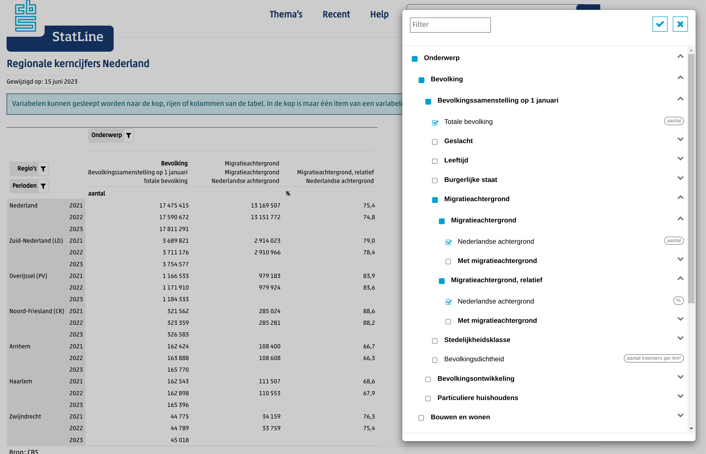

```{r setup, include=FALSE}
knitr::opts_chunk$set(echo = TRUE, results = FALSE, warning = FALSE, message = FALSE, fig.keep='none')
library(printr)
```

# CBS 

CBS heeft een dienst 'statline' waar heel veel gegevens open gepubliceerd worden. 
Deze kan je online bekijken op [opendata.cbs.nl](https://opendata.cbs.nl/) 
om bijvoorbeeld [een overzicht te krijgen](https://opendata.cbs.nl/statline/#/CBS/nl/navigatieScherm/thema) van welke gegevens er allemaal zijn.
Je kan via statline ook direct de gegevens inzien en op verschillende manieren filteren op aggregeren.

Op [opendata.cbs.nl/statline/#/CBS/nl/dataset/70072ned/table?ts=1663227187196](https://opendata.cbs.nl/statline/#/CBS/nl/dataset/70072ned/table?ts=1663227187196) zie je bijvoorbeeld en overzicht van kerncijfers per regio. Met met 'regio' filter kan je hier kiezen welke regio's je wilt zien
(van landsdelen tot gemeenten) en via onderwerp en perioden kan je kiezen wat je van die regio's wilt bekijken. 

Deze tabel in de website wordt dynamisch opgebouwd, dat wil zeggen dat als je de tabel aanpast vanuit je browser een 
opdracht naar de API van CBS wordt gestuurd, waarna de nieuwe gegevens worden weergegeven.
Zoals we straks zullen zien kunnen wij zelf vanuit R ook deze opdrachten rechtstreeks geven. 
Voor de technisch nieuwsgierigen: als je in je browser de developer tools aanzet (F12 in chrome en firefox) kan je in het netwerkscherm
precies zien welke opdrachten gegeven worden en wat voor gegevens er dan terugkomen. 

Wat voor ons ook belangrijk is om te zien is de naam van de dataset in de adresbalk, in dit geval is dit `70072ned`.
Deze naam hebben we nodig om de gegevens in R direct op te halen. 

Als je in R met CBS data werkt is het vaak zinvol om tegelijkertijd op statline dezelfde tabel te bekijken. Daar kan je vaak makkelijker zien welke gegevens erin staan en wat elke kolom betekent:
Als de kolomnamen in R niet duidelijk of eenduidig zijn, kan je in het menu van statline dezelfde kolommen zien. 

## Package cbsodataR: CBS Open Data in R

Je kan vanuit statline de gegevens opslaan als CSV en vervolgens inladen in R.
Het is echter makkelijker en vooral veel transparanter om de API van CBS direct in R te gebruiken.
Op die manier kan iedereen jouw analyses opnieuw runnen en weten ze zeker dat ze ook dezelfde data hebben.
Ook maakt het het makkelijker om de analyses opnieuw te runnen met nieuwe data als het CBS de gegevens updatet. 

Om CBS gegevens op te halen gebruiken we het pakket `cbsodataR`. 
We zouden natuurlijk zelf de API rechtstreeks aan kunnen spreken,
maar gelukkig heeft CBS een R pakket voor ons gemaakt om dat makkelijker te maken. 
Dit pakket moeten we (zoals altijd) eerst installeren, en daarna in elke sessie activeren

```{r install, eval=F}
install.packages("cbsodataR")
```

```{r}
library(tidyverse)
library(cbsodataR)
```

Zie eventueel ook [de tutorial van CBS zelf](https://www.cbs.nl/en-gb/our-services/open-data/statline-as-open-data/quick-start-guide)
en de [documentatie](https://cran.r-project.org/web/packages/cbsodataR/cbsodataR.pdf).

# Gegevens ophalen

Om de gegevens op te halen hebben we een tabelnummer nodig. 
Als voorbeeld halen we even een relatief kleine dataset op over arbeidsparticipatie. 
Aanleiding is [een column in NRC](https://www.nrc.nl/nieuws/2022/09/14/deeltijdwerk-is-de-echte-vijand-van-emancipatie-a4141919), waarin Aylin Bilic schrijft dat een groot probleem voor de emancipiatie van vrouwen in Nederland
is dat heel veel vrouwen in deeltijd werken, en dat dit ook niet verbetert: "*Maar de verschillen tussen mannen en vrouwen zijn nog steeds immens. 70 procent van de Nederlandse werkende vrouwen doet dat in deeltijd. Onder mannen is dat 28 procent. Er is maar weinig veranderd sinds 2013, stelde het CBS in zijn [begeleidende persbericht](https://www.cbs.nl/nl-nl/nieuws/2022/37/kassamedewerkers-werken-het-vaakst-in-deeltijd) deze week.*"

Laten we kijken of we hier een mooie grafiek van kunnen maken. Eerst halen we de gegevens op met `cbs_get_data`:

```{r}
d <- cbs_get_data("85275NED")
d
```

Wat we hier zien is een tabel met hoeveel mensen er in bepaalde categorien vallen.
Zo zien we dat er in het eerste kwartaal van 2013 van de 8.427.000 werkzame Nederlanders, er 3.962.000 in deeltijd werkten.

## Metadata

We zien ook dat dit uitgesplitst is naar geslacht en persoonskenmerk, maar het is niet helder wat `T001038` of `T009002` betekenen. 
Hiervor moeten we de zogenaamde metagegevens ophalen. Dit kan met de aanroep `cbs_get_meta`:

```{r}
m <- cbs_get_meta("85275NED")
names(m)
```

Het resultaat hiervan, `m`, is een lijst met een aantal verschillende informatie-elementen. 
De elementen als `TableInfos` en `DataProperties` geven algemene informatie over de tabel en zijn beschikbaar voor alle tabellen.
Voor ons relevant zijn de elementen `Geslacht`, `Persoonskenmerken` en `Perioden`.
Deze elementen zijn elk een data frame die opgevraagd kunnen worden met een dollarteken,
bijvoorbeeld `m$Geslacht` voor het geslacht:

```{r}
m$Geslacht
```

## Koppelen van gegevens en metadata

Om een overzicht te maken van bijvoorbeeld deeltijdwerk door mannen en vrouwen
over tijd in Nederland, moeten we de metadata aan de gegevens koppelen. 
Hiervoor gebruiken we `inner_join`, zie onze tutorial over (joining data)[https://github.com/ccs-amsterdam/r-course-material/blob/master/tutorials/R-tidy-13a-joining.md] 
voor meer uitleg. 

Wat we doen is allereerst even een selectie maken van de relevante kolommen in de data:

```{r}
d_deeltijd <- select(d, Geslacht, Persoonskenmerken, Perioden, totaal=WerkzameBeroepsbevolking_1, deeltijd=Deeltijd_2)
d_deeltijd
```

Vervolgens koppelen we hier geslacht aan. 
Om dit makkelijker te maken selecten en hernoemen we de relevante kolommen uit de metadata:

```{r}
geslacht <- select(m$Geslacht, Geslacht=Key, Geslacht_label=Title)
geslacht
```

Omdat de kolomnaam `Geslacht` nu overeenkomen in beide data frames kunnen we ze gelijk koppelen:

```{r}
d_deeltijd <- inner_join(d_deeltijd, geslacht)
d_deeltijd
```

En we doen hetzelfde voor Persoonskenmerken en Perioden:

```{r}
d_deeltijd <- d_deeltijd |>
  inner_join(select(m$Persoonskenmerken, Persoonskenmerken=Key, Persoonskenmerken_label=Title)) |>
  inner_join(select(m$Perioden, Perioden=Key, Perioden_label=Title))
d_deeltijd
```

# Analyseren van de gegevens

Nu we alle gegevens op een rij hebben kunnen we ze analyseren.
Hierbij is het heel belangrijk om te begrijpen dat de categorien in CBS vaak niet uitsluitend zijn,
dat wil zeggen dat geslacht `totaal` een optelsom is van geslacht `vrouwen` en `mannen`.
Op dezelfde manier is periode `2013` een optelsom van de vier kwartalen in die periode. 

Voor een analyse moet je dus altijd een selectie maken, anders zou je die gegevens dubbel tellen.
Om een grafiek te maken van deeltijdwerk van mannen en vrouwen over tijd selecteren we dus op 
geslacht (mannen en vrouwen apart), persoonskenmerken (alleen totaal), en perioden (alleen de jaren).

```{r}
d_subset <- filter(d_deeltijd, Geslacht_label %in% c("Mannen", "Vrouwen"), 
       Persoonskenmerken_label == "Totaal personen",
       !str_detect(Perioden_label, 'kwartaal'))
```

Nu kunnen we twee nieuwe variabelen berekenen: `jaar` waarin we de tekst van het jaartal (`"2013"`) omzetten in een getal (`2013`),
en `procent_deeltijd` waarin we deeltijd als percentage van de beroepsbevolking  berekenen:

```{r}
d_subset <- d_subset |> 
  mutate(jaar=as.numeric(Perioden_label), 
         procent_deeltijd = deeltijd / totaal)
```

Nu kunnen we een grafiek maken met het percentage deeltijdwerkers over tijd, uitgesplitst naar geslacht:

```{r}
ggplot(d_subset, aes(x=jaar, y=procent_deeltijd, color=Geslacht_label)) + geom_line()
```

En om de grafiek wat mooier te maken:

```{r}
ggplot(d_subset, aes(x=jaar, y=procent_deeltijd, color=Geslacht_label)) + 
  geom_line(lwd=.75) +
  ylim(0, 1) +
  xlab("Jaar") + 
  ylab("Percentage deeltijdwerk") + 
  ggtitle("Deeltijdwerk in Nederland") + 
  scale_y_continuous(labels = scales::label_percent(accuracy = 1)) +
  scale_x_continuous(breaks = 2013:2021) +
  scale_color_manual(name="", values=c("Mannen"="lightblue", "Vrouwen"="pink")) +
  theme_minimal() + 
    theme(panel.grid = element_blank(), panel.grid.major.y=element_line(color="grey"), legend.position="bottom")
```

# CBS Variabelen en relatieve gegevens

In veel tabellen van CBS staan gegevens zowel  relatief (bv werklozen per 1000 inwoners) als absoluut (totaal aantal  werklozen)
Om een zinvolle analyse te doen wil je meestal relatieve gegevens gebruiken. 

Stel bijvoorbeeld dat je kijkt naar het totale aantal aangiftes per gemeente, en dat vergelijk je met het totaal aantal inwoners met een uitkering. Een stad als Amsterdam heeft veel meer inwoners dan Schiermonnikoog, en dus ook in totaal meer aangiftes en uitkeringen. Je vind dan dus altijd een sterk verband, maar dat zegt eigenlijk niets, behalve dat grote gemeentes nu eenmaal groot zijn. Gegevens moeten dus altijd relatief zijn (bv per 1000 inwoners) of een gemiddelde (bv gemiddeld inkomen, rapportcijfer voor leefbaarheid etc).

Zorg dan goed dat je de relatieve kolom selecteert! Soms staan er alleen totale aantallen, dan moet je zelf ook het totaal aantal inwoners ophalen en daarmee delen, zodat je vanzelf een relatief aantal krijgt. 

Open bijvoorbeeld in je browser de [Statline regionale kerncijfers](https://opendata.cbs.nl/statline/#/CBS/nl/dataset/70072ned/table?ts=1695831454126). Ga in onderwerpen naar Bevolking en dan Migratieachtergrond. 
Je ziet daar naast 'migratieachtergrond (aantal)' ook 'migratieachtergrond (relatief)'.
Voor analyse zal je dus bijna altijd de tweede willen hebben.

Vink nu `Totale bevolking`, `Nederlandse achtergrond (aantal)`, en `Nederlandse achtergrond (%)` aan, en klik op het vinkje bovenaan om de tabel te zien. Als het goed is zie je nu ongeveer hetzelfde als de screenshot hieronder:



In 2021 had Arnhem bijvoorbeeld 162.424 inwoners, waarvan 108.400 met Nederlandse achtergrond, en dat is 66.7%. Als we naar de totale kerncijfers kijken, dan zien we dat er heel veel kolommen zijn met vaak korte namen. 
Deze staan in dezelfde volgorde als in statline. 

Als we specifiek op zoek gaan naar kolommen met het woord 'achtergrond', dan zien we dat er twee zijn: "NederlandseAchtergrond_34" en "NederlandseAchtergrond_43". Omdat de absolute gegevens in statline eerst stonden, weten 

```{r}
kerncijfers <- cbs_get_data("70072ned", RegioS=has_substring("GM"), Perioden="2021JJ00")
colnames(kerncijfers)
colnames(kerncijfers) |> str_subset("Achtergrond")
```

Als we nu die kolommen selecteren en filteren, samenvoegen met de gemeentenamen, en filteren op Arnhem dan zien we inderdaad dat de tweede kolom het percentage (66.7%) bevat:

```{r}
kerncijfers_meta <- cbs_get_meta("70072ned")
gemeentes <- kerncijfers_meta$RegioS |> select(RegioS=Key, gemeente=Title)
kerncijfers |> select(RegioS, TotaleBevolking_1, NederlandseAchtergrond_34, NederlandseAchtergrond_43) |> 
  inner_join(gemeentes) |>
  filter(gemeente == "Arnhem")
```

Stel dat er alleen de eerste variabele in zou staan, dan zou je alsnog zelf het percentage kunnen berekenen door het aantal te delen door de totale bevolking:

```{r}
kerncijfers |> select(RegioS, TotaleBevolking_1, NederlandseAchtergrond_34) |>
  mutate(NederlandseAchtergrond_relatief = NederlandseAchtergrond_34 / TotaleBevolking_1) |>
  inner_join(gemeentes) |>
  filter(gemeente == "Arnhem")
```


Twee lessen om hieruit te trekken: 

- Bekijk goed de gegevens op statline en begrijp goed wat de kolommen in R betekenen
- Werk altijd met relatieve gegevens, vaak staan die er direct bij, en anders kan je ze zelf ook berekenen.

# Grotere datasets

De dataset hierboven is behoorlijk klein en kan heel snel opgehaald worden.
Veel datasets zijn echter veel groter en dan kan het lang duren om de hele dataset op te halen.

## Data opslaan

Om te voorkomen dat je veel tijd kwijt bent om elke keer die data op te halen is het handig om ze lokaal
op te slaan. 
Een goede manier om dat te doen is door R te laten checken of de data al opgeslagen zijn,
en als dat niet zo is ze opnieuw op te halen. Op die manier kan iemand anders de code ook gelijk uitvoeren
zonder zich af te vragen hoe je eigenlijk precies die data opgehaald had. 
Hiervoor kan je deze code gebruiken:

```{r}
bestandsnaam <- "data_emancipatie.rds"
if (file.exists(bestandsnaam)) {
  d = read_rds(bestandsnaam)
} else {
  d = cbs_get_data("85275NED")
  write_rds(d, bestandsnaam)
}
```

De eerste keer dat je dit uitvoert haalt hij de data op, maar als je het opnieuw runt dan gebruikt hij de opgeslagen versie.
Dit is vooral heel prettig in R Markdown bestanden (zoals dit document), omdat elke keer dat je de opgemaakte versie maakt ("knit")
hij de data anders opnieuw op zou halen. 

## Filteren bij het ophalen

Een andere manier om te voorkomen dat je teveel data ophaalt is om gelijk een selectie te maken bij het ophalen.
Als we bijvoorbeeld alleen gegevens voor de totale bevoking willen, dan hoeven we niet ook alle uitsplitsingen op te halen:

```{r}
cbs_get_data("85275NED", Persoonskenmerken = "T009002")
```

Hierbij moet je wel de 'key' van de gegevens gebruiken, niet het label. Daar staan soms ook spaties in, en die moet je dan meenemen. 
Om bijvoorbeeld alleen de mannen en vrouwen te selecten zouden we dit kunnen doen:

```{r}
as_tibble(m$Geslacht)
cbs_get_data("85275NED", Geslacht = eq("3000   ") | eq("4000   "))
```

NB: We zetten hier `m$Geslacht` om in een tibble zodat we de spaties goed kunnen zien. 
Daarnaast gebruiken we `eq` en de `|` om meerdere waardes te mogen opgeven. 

# Visualiseren van informatie per gemeente

Een aantal tabellen van CBS bevatten informatie per provincie, gemeente, of zelfs wijk en buurt.
Het is vaak mooi en inzichtelijk om deze informatie op een kaart weer te geven.

We kunnen kaartgegevens direct ophalen van [nationaalgeoregister.nl](https://nationaalgeoregister.nl).

Noot: Als je `sf` nog niet hebt geinstalleerd, kan je deze installeren met `install.packages`:

```{r kaart}
library(sf)
shapes <- read_rds("https://github.com/vanatteveldt/ccslearnr/raw/master/data/sf_nl_2021.rds")
as_tibble(shapes)
```

Zoals je kan zien is dit een bijzonder soort dataframe, met enkele metagegevens en daarna een dataframe
met per gemeente de `geometry`, ofwel de vorm van de gemeente. 

Deze kunnen we plotten met `geom_sf`:

```{r kaartplot}
ggplot(shapes) + geom_sf() + theme_minimal()
```

Nu is het uiteraard pas interessant als we hier ook relevate gegevens in kunnen zetten.
We zouden bijvoorbeeld een kaart kunnen maken van gemiddeld inkomen per gemeente. 

We halen eerst de relevante kerncijfers per gemeente op bij CBS,
en selecteren de regio en inkomensgegevens. 
Dit koppelen we aan de metagegevens van de RegioS kolom zodat we de gemeentenaam hebben.

Noot: we filteren hier bij het ophalen al op periode en regio, dat scheelt een hoop wachten!

```{r}
meta <- cbs_get_meta("70072ned")
inkomen <- cbs_get_data("70072ned", RegioS=has_substring("GM"), Perioden="2021JJ00") |>
  select(RegioS, inkomen=ParticuliereHuishoudensExclStudenten_122)
gemeentes <- meta$RegioS |> as_tibble() |> select(RegioS=Key, gemeente=Title)
inkomen = inner_join(inkomen, gemeentes)
```

Nu kunnen we de kaart en inkomensgegevens koppelen en plotten:

```{r cbsmap, fig.keep='all', fig.path='img/'}
inner_join(inkomen, shapes) |>
  ggplot(aes(geometry=geom, fill=inkomen)) + geom_sf()

```


