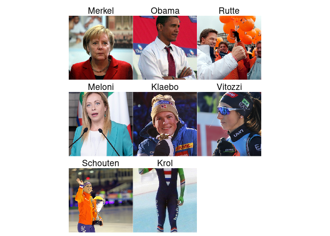
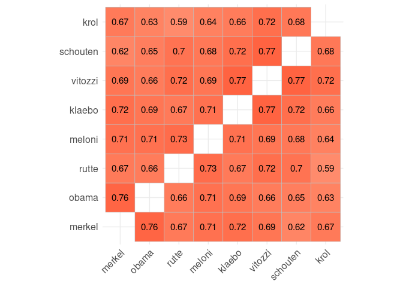
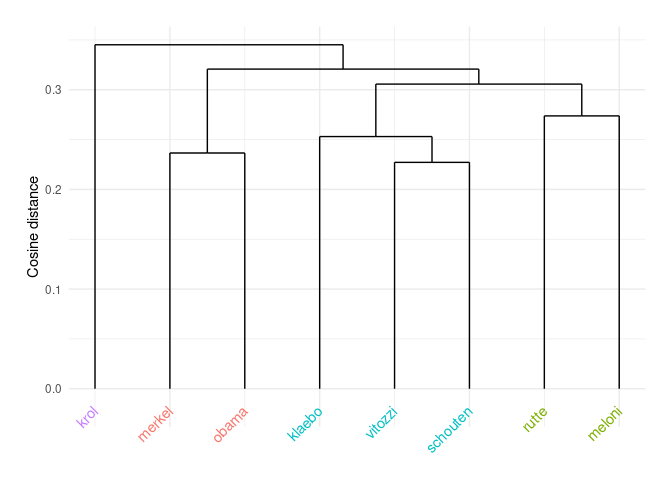
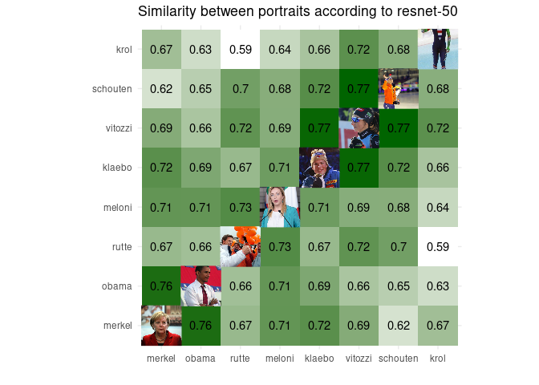

Dealing with images in R
================

# Downloading and handling images

As a first step to image analysis, you need to acquire the source
material. For now, let’s assume we have a data frame with image URLs and
other relevant information, for example politicians and gender:

``` r
library(tidyverse)

images <- tribble(
  ~name, ~gender, ~url,
    "merkel", "female", "https://upload.wikimedia.org/wikipedia/commons/d/d7/Angela_Merkel_11.jpg",
    "obama", "male", "https://upload.wikimedia.org/wikipedia/commons/d/d1/Barack_Obama_Fold.jpg",
    "rutte", "male", "https://upload.wikimedia.org/wikipedia/commons/c/cd/Mark_Rutte.jpg",  
    "meloni", "female", "https://upload.wikimedia.org/wikipedia/commons/7/78/Giorgia_meloni.jpg",
    "klaebo", "male", "https://upload.wikimedia.org/wikipedia/commons/thumb/1/18/Johannes_H%C3%B8sflot_Kl%C3%A6bo_0736.jpg/500px-Johannes_H%C3%B8sflot_Kl%C3%A6bo_0736.jpg", 
    "vitozzi", "female", "https://upload.wikimedia.org/wikipedia/commons/0/08/Vittozzi_L._%E2%80%93_Biathlon_2023_Nove_Mesto_8374.jpg",
    "schouten", "female", "https://upload.wikimedia.org/wikipedia/commons/0/0d/Irene_schouten-1457901652.jpeg",
    "krol", "male", "https://upload.wikimedia.org/wikipedia/commons/thumb/3/38/2016_World_Single_Distance_Speed_Skating_Championships_-_1500m_M_-_Thomas_Krol.jpg/656px-2016_World_Single_Distance_Speed_Skating_Championships_-_1500m_M_-_Thomas_Krol.jpg"
  )
```

To store the images locally, we can use the `download.file` function. To
make it easy to run this for each politician, let’s define a helper
function to download the images as needed:

``` r
download_image <- function(name, url, ...) {
  destfile = paste0("tutorial_images/", name, ".jpg")
  if (!file.exists(destfile))  {
    download.file(url, destfile, mode = "wb", headers=c("User-Agent" = "RTutorial/1.0"))
    Sys.sleep(1)
  }
} 
```

Now, we can use the `pwalk` function to call this function for each row
of our data frame. Note that this is why I included the ellipsis (`...`)
in the function arguments: R will call it with each column from the data
frame, and without the ellipsis it would throw an error about the
unexpected ‘gender’ argument.

``` r
dir.create("tutorial_images", showWarnings = F)
pwalk(images, download_image, .progress = TRUE)
```

Note that `pwalk` and `pmap` are both ways to call a function on each
row of a tibble. In this case, we use `pwalk` because we are performing
an **action** where we care about the ‘side effect’, like downloading a
file or printing a plot. `pwalk` returns the *input data*, which makes
it perfect for the middle of a pipe since we can just continue with the
original data.

In most cases, we want to use a function to **transform data** rather
than execute an action. For this we can use `pmap` (or `map` on single
columns/vectors rather than whole data frames). This returns the output
of each function call, which is ideal to continue processing the data.

## Preprocessing images with Magick

Imagemagick is a powerful tool to deal with images which can be accessed
with the R `magick` library.

For example, we can use `image_read` and `image_info` to see basic
information of our images

``` r
library(magick)
paste0("tutorial_images/", images$name, ".jpg") |>
  image_read() |>
  image_info() |> 
  add_column(name=images$name)
```

    # A tibble: 8 × 8
      format width height colorspace matte filesize density name    
      <chr>  <int>  <int> <chr>      <lgl>    <int> <chr>   <chr>   
    1 JPEG    3000   3000 sRGB       FALSE  1851560 72x72   merkel  
    2 JPEG     677   1012 sRGB       FALSE   588809 100x100 obama   
    3 JPEG    2922   2238 sRGB       FALSE  1139764 240x240 rutte   
    4 JPEG    1070   2224 sRGB       FALSE  1561131 216x216 meloni  
    5 JPEG     500    526 sRGB       FALSE    66785 72x72   klaebo  
    6 JPEG    2480   3328 sRGB       FALSE  2425133 72x72   vitozzi 
    7 JPEG    1280    854 sRGB       FALSE   184995 72x72   schouten
    8 JPEG     656   1376 sRGB       FALSE   134115 72x72   krol    

As you can see, the image sizes vary from \~1 to \~10 megapixels and
from portrait to square and even landscape images. Let’s resize all
images to be a square 300x300:

``` r
preprocess_image <- function(name, ...) {
  img <- paste0("tutorial_images/", name, ".jpg") |>
    image_read() |>
    image_resize("300x300^") |>
    image_extent("300x300", gravity = "Center", color = "white")
  tibble(name=name, img=list(img))
}
processed_images <- pmap(images, preprocess_image) |> list_rbind() 
images <- left_join(images, processed_images)
images
```

    # A tibble: 8 × 4
      name     gender url                                                 img       
      <chr>    <chr>  <chr>                                               <list>    
    1 merkel   female https://upload.wikimedia.org/wikipedia/commons/d/d… <magck-mg>
    2 obama    male   https://upload.wikimedia.org/wikipedia/commons/d/d… <magck-mg>
    3 rutte    male   https://upload.wikimedia.org/wikipedia/commons/c/c… <magck-mg>
    4 meloni   female https://upload.wikimedia.org/wikipedia/commons/7/7… <magck-mg>
    5 klaebo   male   https://upload.wikimedia.org/wikipedia/commons/thu… <magck-mg>
    6 vitozzi  female https://upload.wikimedia.org/wikipedia/commons/0/0… <magck-mg>
    7 schouten female https://upload.wikimedia.org/wikipedia/commons/0/0… <magck-mg>
    8 krol     male   https://upload.wikimedia.org/wikipedia/commons/thu… <magck-mg>

Note the use of `pmap` as before, but now we return a tibble with the
name as a column, and the image, wrapped in a list, as a second column.
This allows us the join the processed images with the metadata so we now
have all information in one place

Also note this results in **cropped** images because the `^` in
`300x300^` instructs Magick to resize the image based on the smallest
dimension, ensuring the entire 300x300 area is filled even if the other
dimension overflows. The `image_extent` makes the actual change to the
canvas.

To see the result, we can simply select a single image:

``` r
images |> filter(name == "obama") |> pull(img)
```

    [[1]]
    # A tibble: 1 × 7
      format width height colorspace matte filesize density
      <chr>  <int>  <int> <chr>      <lgl>    <int> <chr>  
    1 JPEG     300    300 sRGB       FALSE        0 100x100

What happens if you remove the `^` instead?

## Displaying images with ggplot

We can also incorporate them into ggplot with `image_ggplot`, but this
expects only a single image. So, let’s again make a function to plot one
image with the name as title:

``` r
ggplot_politician <- function(name, img, ...) {
  image_ggplot(img)  + 
    labs(title=name |> str_to_title()) + 
    theme(plot.title = element_text(hjust = 0.5))
}
```

Now, we can use `pmap` as before and combine the four plots in a
`wrap_plots` call:

``` r
library(patchwork)
pmap(images, ggplot_politician) |>
  wrap_plots()
```



# Help me, Chat! Analyzing images with tidyllm

The easiest and perhaps currently most powerful way to do image analysis
is with LLMs such as OpenAI’s chatGPT or a local (vision-capable) model
which you can run through ollama. In both cases, you can use the tidyllm
package to do the actual analysis.

The example below uses `moondream`, which is a very small vision-capable
LLM which you can install through ollama. To run this example, go to
<https://ollama.com/download> to download ollama, and then use
`ollama pull moondream` to load this model.

This example uses the same `function - pmap - list_rbind()` pattern used
before, which calls the function for each image and returns the result
as a data frame that can be joined back on the `name` column in needed.

Note that unfortunately tidyllm cannot use the image directly from our
data frame, so we write it to a temporary file which we then delete. We
could of course also write all the preprocessed images to disk rather
than keep them in memory.

``` r
library(tidyllm)

describe_image <- function(name, img, ...) {
  tmp <- tempfile(fileext = ".png")
  image_write(img, path = tmp, format = "png")
  description <- llm_message(
      "Describe the person in this image",
      .imagefile = tmp
    ) |>
      chat(ollama(.model = "moondream")) |>
      get_reply() 
  unlink(tmp)
  tibble(name=name, description=description)
}

pmap(images, describe_image) |> list_rbind()
```

    # A tibble: 8 × 2
      name     description                                                          
      <chr>    <chr>                                                                
    1 merkel   "\nThe image features a woman with blonde hair, wearing a red jacket…
    2 obama    "\nThe image features a man dressed in a white shirt and red tie, st…
    3 rutte    "\nThe image features a group of people standing together, with one …
    4 meloni   "\nThe image features a woman standing at a podium, giving a speech.…
    5 klaebo   "\nThe image features a man wearing a blue jacket and a hat, with hi…
    6 vitozzi  "\nThe image features a woman wearing sunglasses and a headband, pos…
    7 schouten "\nIn the image, a woman is standing on an ice rink and holding a tr…
    8 krol     "\nThe image features a person standing on an ice rink, wearing a bl…

We can also run this example on a remote LLM like OpenAI’s chatGPT. For
this, you would need to get an API key from OpenAI and paste it in the
line below:

``` r
Sys.setenv(OPENAI_API_KEY="sk-proj-...")
```

After this, we simply replace the `ollama(..)` function with an
`openai(..)` function and keep the rest the same. Interestingly, I did
have to change the prompt to avoid triggering a guard rail preventing
the AI from commenting on the politician in the picture:

``` r
describe_person_chat <- function(name, img, ...) {
  tmp <- tempfile(fileext = ".png")
  image_write(img, path = tmp, format = "png")
  description <- llm_message(
      "Describe the main person's clothing, facial expression, and posture in detail. Do not mention their name",
      .imagefile = tmp
    ) |>
      chat(openai(.model = "gpt-4o-mini")) |>
      get_reply() 
  unlink(tmp)
  tibble(name=name, description=description)
}

pmap(images, describe_person_chat, .progress=TRUE) |> list_rbind()
```

    # A tibble: 8 × 2
      name     description                                                          
      <chr>    <chr>                                                                
    1 merkel   "The main person is wearing a bright red blazer over a blouse, creat…
    2 obama    "The individual is wearing a light-colored dress shirt with rolled-u…
    3 rutte    "The main person is wearing a white, padded jacket with a high colla…
    4 meloni   "The main person is wearing a fitted white top paired with a vibrant…
    5 klaebo   "The person in the image is wearing a blue jacket, which features a …
    6 vitozzi  "The main person is wearing a fitted black and blue athletic outfit,…
    7 schouten "The main person is dressed in a vibrant orange jacket with a sporty…
    8 krol     "The person is dressed in a form-fitting speed skating suit that fea…

## Using structured output

The function above returned the output of the LLM as a simple text
description. Often, however, we want specific structured information
such as the gender, emotion, or setting of a picture.

For this, it is generally best to use **structured outputs**, where we
first define the expected output and then tell the AI to provide the
requested format.

First, we define a `schema`, for example with a short description and
then the gender, emotion, and apparent age of the person

``` r
face_schema <- tidyllm_schema(
  name = "Face schema",
  description = field_chr(.description = "Short description (1–2 sentences) of the main person shown in the picture"),
  gender = field_fct(.description = "What is the apparent gender of the main person (M for male, F for female)", .levels = c("F", "M")),
  emotion = field_chr(.description = "Single word for the main emotion shown by the person, e.g. happy, sad or angry")
)
```

Now, we can rewrite the function above to include the `.json_schema`
(and include the desired output in the prompt). We also replace
`get_reply` by `get_reply_data`, which returns a named list that we can
easily turn into a tibble to return:

``` r
analyse_picture <- function(name, img, ...) {
  tmp <- tempfile(fileext = ".png")
  image_write(img, path = tmp, format = "png")
  llm_message(
      "Describe the main person's apparent gender and main emotion as shown in the picture. First give a small description of the overall face, and then list the gender (as F or M) and main emotion",
      .imagefile = tmp
    ) |>
      chat(ollama(.model = "moondream"), .json_schema = face_schema) |>
      get_reply_data() |>
    as_tibble() |>
    add_column(name=name)
}

pmap(images, analyse_picture, .progress=TRUE) |> list_rbind()
```

    # A tibble: 8 × 4
      description                                         gender emotion   name    
      <chr>                                               <chr>  <chr>     <chr>   
    1 A blonde woman with short hair wearing a red jacket F      sad       merkel  
    2 a man with black hair                               F      happy     obama   
    3 male                                                M      happy     rutte   
    4 female                                              F      surprised meloni  
    5 male                                                F      happy     klaebo  
    6 A woman wearing sunglasses                          F      happy     vitozzi 
    7 F                                                   F      happy     schouten
    8 F                                                   F      happy     krol    

If you look at the output you will probably see that moondream often
makes seemingly stupid mistakes or even fails to answer the question
altogether. You might get better results with a more powerful model
(such as `llava`, `qwen3-vl:8b` or `llama3.2-vision:11b`) but note that
it depends on your computer whether you will be able to run them: the
bigger models require a lot of GPU memory, which not all computers will
support. See https://ollama.com/library for an overview of existing
models.

You can also use proprietary models such as `chatgpt` as used above, but
these might hit the brake more often where it comes to talking about
existing persons, so you might have to massage the prompt to ensure the
AI of your good intentions as a researcher…

# Embedding images

We’ve discussed using word and document embeddings in our [text
embeddings tutorial](embeddings.md). It is also quite easy to embed
images, which allows us to cluster images similar to how a topic model
clusters words and documents.

While the contextual text embeddings were performed by calling python
behind the scenes with reticulate, let’s now use the R packages `torch`
and `torchvision`, which are built directly in R\*

``` r
library(torch)
library(torchvision)
library(magick) # Useful for image loading
```

(\*) Well, actually, the R packages call C++ libraries to do most of the
work – but python’s torch package also just calls the same C++ library,
so in that sense the R package is more ‘native’ than the packages that
use reticulate to call python. And in fact many of the packages we use
daily in R (and python!) actually call libraries written in more
efficient languages such as C behind the scene, including many of our
beloved tidyverse packages!

## Loading an image recognition model

Torchvision includes a number of built-in (pretrained) image
classification models. Resnet-50 is a frequently used model described by
[He et al. (2015)](https://arxiv.org/abs/1512.03385) that is trained for
image classification.

Let’s load the model and then set it into ‘evaluation’ mode and disable
gradient updating, as we simply want to use the existing model and not
train or fine tune it.

``` r
model <- model_resnet50(pretrained = TRUE)
model$eval()
autograd_set_grad_mode(FALSE)
model$fc <- nn_identity()
```

The final line in the code above replaces the last layer of resnet by an
‘identity’ layer (ie a layer that does nothing but just returns the
input). The reason for this is that we are interested in the final
internal representation of the images, and not in the classification.
So, we want to take the output of the layer before the last one.

## Preprocessing images

Before we can proceed to use the model, we need to adapt our images.
Convolutional neural networks like `resnet50` expect images with a fixed
size (224x224) and specific normalization of the colors. Torchvision has
built in functions to do these preprocessing steps, which we can combine
into a single function that reads the image, converts it into a torch
*tensor* (multi-dimensional vector), and performs the preprocessing:

``` r
preprocess_image <- function(name) {
  tensor <- str_glue("tutorial_images/{name}.jpg") |>
    image_read() |>
    transform_to_tensor() |>
    transform_resize(size = c(224, 224)) |>
    transform_normalize(
      mean = c(0.485, 0.456, 0.406), 
      std = c(0.229, 0.224, 0.225)
    )
}
```

Now, we can use the `map` function to call this function on each image,
transform it into a torch `stack` (the expected format for torch
models), and call the actual `model` on it that we loaded earlier. Then,
we convert the result into a native R matrix and re-add the rownames:

``` r
embeddings <- map(images$name, preprocess_image) |>
  torch_stack() |>
  model() |>
  as.matrix() |>
  magrittr::set_rownames(images$name)
embeddings[,1:10]
```

                   [,1]      [,2]      [,3]       [,4]      [,5]       [,6]
    merkel   0.09960679 0.9316353 0.2099732 0.14063604 1.0636740 0.26625001
    obama    0.20041154 0.7344643 1.9371725 0.03454152 1.6850863 0.06435212
    rutte    0.32357955 0.9020723 1.4596217 0.20572768 0.7967631 1.16215038
    meloni   0.56379437 0.4103602 1.3620124 0.61337548 0.2797188 0.33471531
    klaebo   0.36476630 2.3528299 0.6568140 0.11059798 0.6551806 0.28300223
    vitozzi  0.07647586 0.7213166 0.2452165 0.14450058 0.6870580 0.77059662
    schouten 0.33779129 1.0273036 0.5424480 0.33703241 1.8136054 0.59407020
    krol     0.11764721 0.8994471 0.4909870 0.09073172 1.1537111 0.10303762
                  [,7]       [,8]        [,9]      [,10]
    merkel   2.6702819 0.18201096 0.006502523 0.42289954
    obama    1.5951631 0.04366502 0.130203709 1.22252643
    rutte    0.4474068 0.77673817 0.291836888 1.29062235
    meloni   1.5054082 0.27421993 0.417440206 0.95240510
    klaebo   0.9470747 0.11563881 0.076607525 1.34435105
    vitozzi  0.8007805 0.75725305 0.287593037 0.02681891
    schouten 0.5362514 0.36947644 0.160576567 0.87562084
    krol     0.9382736 0.29257861 0.390542239 1.03767693

As you can see, each image is not represented or *embedded* as a
(2,048-dimensional) vector. We can use calculate the cosine similarities
with the same function we used in the embeddings tutorial, and plot the
similarities between the images

``` r
cosine_sim_rows <- function(M) {
  # Step 1: normalize by dividing each row by its Euclidean length
  M_norm <- M / sqrt(rowSums(M^2))
  # Step 2: cosine = inner products of normalized vector pairs = matrix times transposed matrix
  M_norm %*% t(M_norm)
}

similarities <- cosine_sim_rows(embeddings)
ggcorrplot::ggcorrplot(similarities, show.diag=F, lab=T, show.legend = F)
```



As you can see from the result, the (female skater) Schouten is actually
most similar to the (female skier) Vitozzi, which makes sense.
Similarly, Meloni and Obama look more like the other politicians than
like the sporters.

(Note that we could also have used the `torch_cosine_similarity`
function on the model output directly. I chose ot convert to a matrix
and compute the cosine in R because this makes it explicit what we’re
doing, and is consistent with the earlier embeddings tutorial)

## Clustering images

We can also do a cluster analysis of the images: which ‘clusters’ can
the computer find in the images based on their embeddings?

For this, we can use a variety of different clustering methods, but the
simplest is probably just a hierarchical clustering with the built-in
`hclust` function, which works directly on the similarity (or actually
distance) matrix. This results in a full hierarchical clustering, which
we can ‘cut’ at a certain depth to get e.g. 2 clusters:

``` r
library(ggdendro)
clustering <- hclust(as.dist(1 - similarities), 
                     method = "average") 

clusters <- cutree(clustering, k=4)
clusters <- tibble(label = names(clusters), cluster = as.factor(clusters) )
clusters
```

    # A tibble: 8 × 2
      label    cluster
      <chr>    <fct>  
    1 merkel   1      
    2 obama    1      
    3 rutte    2      
    4 meloni   2      
    5 klaebo   3      
    6 vitozzi  3      
    7 schouten 3      
    8 krol     4      

Now, let’s plot the full hierarchy, using the `k=4` for coloring the
labels:

``` r
d <- dendro_data(clustering)
ggplot() +
  geom_segment(data = d$segments,
               aes(x = x, y = y, xend = xend, yend = yend)) +
  geom_text(data = inner_join(d$labels, clusters),
            aes(x = x, y = y - 0.02, label = label, 
                color=cluster),
            angle = 45, hjust = 1) +
  coord_cartesian(clip = "off") +
  ylab("Cosine distance") + 
  theme_minimal() +
  theme(axis.title.x = element_blank(),
        axis.text.x = element_blank(),
        axis.ticks.x = element_blank(),
        plot.margin = margin(20, 20, 40, 20),
        legend.position = "none"
  )
```



As you can see, the politicians are in two pairs of clusters, the formal
portraits of Merkel and Obama and the more campaign-like images of Rutte
and Meloni. Three of the sporters are also clustered together, with the
fourth (Krol) probably falling out because his face is no longer visible
in the cropped image

Since this already works on clustering different groups of portraits,
you can imagine it will also work really well on e.g. differentiating
between different types of news photos or different kinds of instagram
posts (cats, parties and plates of food are all quite distinct!)

## Saving and plotting images

As a final demonstration, let’s use images within an existing ggplot to
enrich the correlation plot above by plotting the portraits on the
diagonal.

To do this, let’s first make a ‘long’ version of the similarities matrix
(as ggplot generally prefers long data), and exclude the diagonal. Let’s
also sort the names by cluster by converting them to a factor using the
`cluster` data frame from above

``` r
names = clusters |> arrange(cluster) |> pull(label)
similarities_long <- similarities |>
  as.data.frame() |>
  rownames_to_column("name1") |>
  pivot_longer(-name1, names_to="name2") |>
  filter(name1 != name2)|>
  mutate(name1=factor(name1, levels=names),
         name2=factor(name2, levels=names))
```

Next, we need to prepare the images to plot. Since we already have
squared and resized images in the `images` data frame, we can use those
nicely for the diagonal. However, we need to convert it to a `grob`
(**gr**aphical **ob**ject) to be able to plot them:

``` r
library(grid)
get_grob <- function(img) rasterGrob(as.raster(img), interpolate = TRUE)
grobs <- images |> 
  mutate(grob = map(img, get_grob),
         name = factor(name, levels=names))
```

Now, we’re ready to make the plot. We use the `ggpmisc` package which
has a `geom_grob` function that can place the images (grobs) directly in
the graph. We set the width and height to 1/8 of the total canvas as
there are 8 tiles in total:

``` r
library(ggpmisc)
ggplot(similarities_long, aes(x=name1, y=name2)) +
  geom_tile(aes(fill=value)) +
  geom_text(aes(label=round(value,2))) +
  geom_grob(data=grobs, aes(x=name, y=name, label=grob), vp.width=1/8, vp.height=1/8) + 
  scale_fill_gradient(low="white", high="darkgreen") + 
  coord_equal() + 
  theme_minimal() + theme(legend.position = "none") + xlab("") + ylab("") +
  ggtitle("Similarity between portraits according to resnet-50")
```



Which makes it much clearer what the images are that we are clustering -
and also shows that the cropping process did not really do justice to
Thomas Krol…)

An alternative approach would be the `geom_image` function from
`ggimages`, which is also a good solution but requires the images to be
on the disk. Since we don’t want to use the original images (which are
too large and not square), we would then first save the resized images
to disk using the `image_write` function, and use the new file name as
the aesthetic for the `geom_image`.
