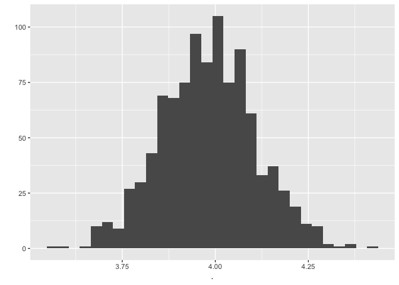

Mediation Analyses
================
Philipp Masur
2022-04

-   [Introduction](#introduction)
    -   [What is a “mediation”?](#what-is-a-mediation)
    -   [Packages and simulating some
        data](#packages-and-simulating-some-data)
-   [Alternative 1: Simple regression
    analyses](#alternative-1-simple-regression-analyses)
    -   [Running linear models](#running-linear-models)
    -   [Testing the indirect effect for
        significance](#testing-the-indirect-effect-for-significance)
-   [Alternative 2: Path modeling using
    `lavaan`](#alternative-2-path-modeling-using-lavaan)
-   [Alternative 3: Using the `mediation`
    package](#alternative-3-using-the-mediation-package)
-   [Where to go next?](#where-to-go-next)

# Introduction

In this tutorial, I am going to provide a very brief introduction on how
to conduct simple mediation analyses in R. As a mediation analysis is
technically just running several, yet specifically defined regression
analyses, I am going to do so by showing three alternative ways to reach
the desired results.

1.  Simple regression analyses
2.  Path modeling
3.  Using the package `mediation`

The more interesting question then becomes, how we can compute the
indirect effect and test its significance. Here again, we can choose
between different methods:

1.  Bootstrapping to gain robust 95% confidence intervals
2.  Monte-Carlo Simulations to gain 95% confidence intervals

## What is a “mediation”?

We are often interested in explaining a relationship or causal effect
between two variables (e.g., `X` and `Y`). Many theories suggest that
`X` does not necessarily *directly* influence `Y`, but that this effect
is *mediated* by a third variable (e.g., `M`). We can visualize this
interplay between the three variables like so:


A mediation thereby represent the following: The total effect between
`X` and `Y` (*c*) is split into a *direct* (*c’*) and *indirect* (*a x
b*) effect. We assume that a mediation is present, if the indirect
effect is significant. Technically, it is possible that the effect of
`X` and `Y` is completely mediated by `M`. In this case (also known as
“full mediation”), the direct effect (*c’*) is non-significant. In most
cases, however, we will probably find a “partial mediation”, suggesting
that X both directly *and* indirectly influences `Y`.

**Note of caution:** Theoretically, mediation models almost always
suggest some sort of “causal chain”. Yet, the analysis itself cannot
prove causality, if the underlying data are observational (e.g., stem
from a cross-sectional survey)!

## Packages and simulating some data

To run mediation analysis, we technically do not need any additional
packages. We only need the function `lm()`, which is part of base R.
However, as we will explore different ways to run such analyses, we will
also engage with the package `boot` (to create bootstrapping samples),
`lavaan` (to engage in path modeling) and `mediation` (which provides a
streamlined solution for mediation analyses).

``` r
library(tidyverse)
library(boot)
library(lavaan)
library(mediation)
```

For this tutorial we are going to simulate some data that align with the
Figure presented above. We are setting a seed to make our simulation
reproducible. We then create a data set with 500 observations and 3
variables.

``` r
set.seed(42)
n <- 500
x <- rnorm(n, 3, 1)
m <- 0.5 + 2*x + rnorm(n, 0, 1)
y <- 0.5 + 2*m + 0.5*x + rnorm(n, 0, 1)

d <- tibble(x,m,y)
head(d)
```

|        x |         m |        y |
|---------:|----------:|---------:|
| 4.370958 | 10.271058 | 25.55265 |
| 2.435302 |  6.285379 | 14.81253 |
| 3.363128 |  7.223801 | 17.59990 |
| 3.632863 |  7.901735 | 18.49687 |
| 3.404268 |  6.588383 | 14.38297 |
| 2.893876 |  6.089627 | 13.52871 |

# Alternative 1: Simple regression analyses

## Running linear models

The simplest way to conduct mediation analyses is to run a simple
regression for each endogeneous variable in our model. For this simple
mediation model, we thus have to create one the estimates the path *a*
and one that estiamtes *b* and *c’* simultaneously. To be comprehensive,
we are also creating one that estiamtes the total effect *c*.

``` r
# Total effect of x on y
m_total <- lm(y ~ x, d)
summary(m_total)
```

    ## 
    ## Call:
    ## lm(formula = y ~ x, data = d)
    ## 
    ## Residuals:
    ##     Min      1Q  Median      3Q     Max 
    ## -6.4258 -1.3752  0.0002  1.5160  6.0092 
    ## 
    ## Coefficients:
    ##             Estimate Std. Error t value Pr(>|t|)    
    ## (Intercept)   1.3496     0.3286   4.107 4.68e-05 ***
    ## x             4.5221     0.1052  43.002  < 2e-16 ***
    ## ---
    ## Signif. codes:  0 '***' 0.001 '**' 0.01 '*' 0.05 '.' 0.1 ' ' 1
    ## 
    ## Residual standard error: 2.284 on 498 degrees of freedom
    ## Multiple R-squared:  0.7878, Adjusted R-squared:  0.7874 
    ## F-statistic:  1849 on 1 and 498 DF,  p-value: < 2.2e-16

``` r
# Effect a, x on m
m_a <- lm(m ~ x, d)
summary(m_a)
```

    ## 
    ## Call:
    ## lm(formula = m ~ x, data = d)
    ## 
    ## Residuals:
    ##     Min      1Q  Median      3Q     Max 
    ## -3.3463 -0.6644  0.0262  0.7373  3.5032 
    ## 
    ## Coefficients:
    ##             Estimate Std. Error t value Pr(>|t|)    
    ## (Intercept)  0.50497    0.14877   3.394 0.000743 ***
    ## x            1.99105    0.04761  41.820  < 2e-16 ***
    ## ---
    ## Signif. codes:  0 '***' 0.001 '**' 0.01 '*' 0.05 '.' 0.1 ' ' 1
    ## 
    ## Residual standard error: 1.034 on 498 degrees of freedom
    ## Multiple R-squared:  0.7784, Adjusted R-squared:  0.7779 
    ## F-statistic:  1749 on 1 and 498 DF,  p-value: < 2.2e-16

``` r
# Effects b and c', x and m on y
m_bc <- lm(y ~ m + x, d)
summary(m_bc)
```

    ## 
    ## Call:
    ## lm(formula = y ~ m + x, data = d)
    ## 
    ## Residuals:
    ##      Min       1Q   Median       3Q      Max 
    ## -2.88348 -0.61767  0.00175  0.63515  2.69139 
    ## 
    ## Coefficients:
    ##             Estimate Std. Error t value Pr(>|t|)    
    ## (Intercept)  0.33911    0.14089   2.407   0.0164 *  
    ## m            2.00099    0.04196  47.694  < 2e-16 ***
    ## x            0.53806    0.09468   5.683 2.26e-08 ***
    ## ---
    ## Signif. codes:  0 '***' 0.001 '**' 0.01 '*' 0.05 '.' 0.1 ' ' 1
    ## 
    ## Residual standard error: 0.968 on 497 degrees of freedom
    ## Multiple R-squared:  0.962,  Adjusted R-squared:  0.9618 
    ## F-statistic:  6283 on 2 and 497 DF,  p-value: < 2.2e-16

We can see that all paths are significant, suggesting that there is both
a direct and indirect effect of `X` on `Y`. The indirect effect can
simply be computed by multiply the estimate of path *a* with the
estimate of path *b*.

``` r
a <- summary(m_a)$coef[2,1]  # 2.08
b <- summary(m_bc)$coef[2,1]  # 1.88

(indirect <- a*b)
```

    ## [1] 3.984083

## Testing the indirect effect for significance

If both *a* and *b* are significant, there is a good chance that the
indirect effect is significant as well. Yet, we can explicitly test the
significance of this indirect effect. However, as the theoretical
distribution of the product-of-coefficients does not necessarily follow
a normal distribution, we have to rely on alternative methods to test
its significance. The first and probably most used alternative is using
bootstrapping to gain 95% confidence intervals for the indirect effect.
Here, we rerun the analyses on e.g., 1000 bootstrap samples and then
check the resulting distribution of coefficients.

For this, we are going to use the package `boot`. The procedure is
always the same, we create a function that runs the relevant analyses
(in this case the two linear regression models) and extracts the
relevant coefficients and creates the product of path `a` and `b`. We
then pass this function to `boot()`, which further requires the exact
model formulas, the data, and the number of bootstrap samples you want
to create (Attention: You should at least run \> 1000, but the more, the
longer the computation!). As a final step, we use the function
`quantile()` to get the 95% confidence intervals from the resulting
distribution of coefficients.

``` r
# Create a function that repeats the same procedure across bootstrap samples
bootreg <- function(formula_a, formula_b, data, i){ 
  a <- coef(lm(formula_a, data[i,]))[2] # extracting a path
  b <- coef(lm(formula_b, data[i,]))[3] # extracting b path
  a*b
}

# Run the bootstrapping procedures
boot_results <- boot(statistic = bootreg, 
                     formula_a = m ~ x, 
                     formula_b = y ~ x + m, 
                     data = d, R = 1000)

# Resulting distribution of indirect effects
boot_results$t %>% 
  as_vector %>% 
  qplot()
```

<!-- -->

``` r
# Extract 2.5 and 97.5 quantiles (95% CIs)
(boot_ci <- boot_results$t %>% 
  as_vector %>%
  quantile(c(.025, .975)))
```

    ##     2.5%    97.5% 
    ## 3.725703 4.232639

The confidence intervals do not include zero, the indirect effect of b =
3.9840833 is thus significant.

An alternative to bootstrapping (which is often computationally
demanding) is taking the path coefficients and their standard errors to
simulate their theoretical distribution using Monte-Carlo draws. We can
do so by using the function `rnorm()`, which requires the number of
observations, the mean of the normal distribution (our path estimates)
and the standard deviation (the standard errors). Once we have simulate
the theoretical (normal) distributions for both *a* and *b*, we can
multiply both distributions to get the theoretical distribution of the
indirect effect. We can then again use the `quantile()` function to
extract 95% confidence intervals. The computation is much faster and
somewhat more elegant.

``` r
# Simulate normal distributions of the found effects
n <- 10000
sim_a <- rnorm(n, summary(m_a)$coef[2,1], summary(m_a)$coef[2,2])
sim_b <- rnorm(n, summary(m_bc)$coef[2,1], summary(m_bc)$coef[2,2])
sim_ind <- sim_a*sim_b

# Extract 2.5 and 97.5 quantiles (95% CIs 
(mc_ci <- quantile(sim_ind, c(.025, .975)) %>%
  round(2))
```

    ##  2.5% 97.5% 
    ##  3.74  4.24

Again, the confidence intervalls do not include zero. We conclude that
the indirect effect is significant. If we now compare the results from
the bootstrapping and the Monte-Carlo Somulation, we find that both
methods lead to almost the same results.

``` r
# Comparing bootstrap and Monte Carlo CIs
bind_rows(boot_ci, mc_ci) %>%
  mutate(type = c("bootrapping", "monte carlo"),
         effect = c(indirect, indirect)) %>%
  dplyr::select(type, effect, everything())
```

| type        |   effect |     2.5% |    97.5% |
|:------------|---------:|---------:|---------:|
| bootrapping | 3.984083 | 3.725703 | 4.232639 |
| monte carlo | 3.984083 | 3.740000 | 4.240000 |

# Alternative 2: Path modeling using `lavaan`

The package `lavaan`, developed for path and structural equation
modeling, provides another alternative for running mediation models.
Here, we can specifiy all regression equations and so-called pseudo
parameter (e.g. indirect effects) as a string, which we then simply pass
to the function `sem()`. This way, we can estimate all paths and effects
in one step. Additionally, we also automatically get standardized effect
estiamtes.

In contrast to standard path modelling, we need to “label” our paths. We
can do so by simply multiply our variables with a label (e.g., `a*x`).
We can then use these labels to compute pseudo parameters (e.g., the
indirect effect via `ind := a*b`).

``` r
# Define path model including pseudo parameters (indirect and total effect)
model <- "

  # Paths
  m ~ a*x
  y ~ c*x + b*m
  
  # Pseudo parameter
  ind := a*b
  total := ind + c
"

# Fit model
fit <- sem(model, d)
summary(fit, std = T)
```

    ## lavaan 0.6-11 ended normally after 1 iterations
    ## 
    ##   Estimator                                         ML
    ##   Optimization method                           NLMINB
    ##   Number of model parameters                         5
    ##                                                       
    ##   Number of observations                           500
    ##                                                       
    ## Model Test User Model:
    ##                                                       
    ##   Test statistic                                 0.000
    ##   Degrees of freedom                                 0
    ## 
    ## Parameter Estimates:
    ## 
    ##   Standard errors                             Standard
    ##   Information                                 Expected
    ##   Information saturated (h1) model          Structured
    ## 
    ## Regressions:
    ##                    Estimate  Std.Err  z-value  P(>|z|)   Std.lv  Std.all
    ##   m ~                                                                   
    ##     x          (a)    1.991    0.048   41.904    0.000    1.991    0.882
    ##   y ~                                                                   
    ##     x          (c)    0.538    0.094    5.700    0.000    0.538    0.106
    ##     m          (b)    2.001    0.042   47.837    0.000    2.001    0.886
    ## 
    ## Variances:
    ##                    Estimate  Std.Err  z-value  P(>|z|)   Std.lv  Std.all
    ##    .m                 1.065    0.067   15.811    0.000    1.065    0.222
    ##    .y                 0.931    0.059   15.811    0.000    0.931    0.038
    ## 
    ## Defined Parameters:
    ##                    Estimate  Std.Err  z-value  P(>|z|)   Std.lv  Std.all
    ##     ind               3.984    0.126   31.521    0.000    3.984    0.782
    ##     total             4.522    0.105   43.089    0.000    4.522    0.888

Using the summary function, the output shows all path coefficients and
the pseudo-parameters. Although it looks like the indirect and total
effect were already tested for significance, this test is based on the
Sobel test, which is not appropriate for these type of effects. Again,
we could run the same analyses on bootstrap samples, or we could use the
Monte-Carlo simulation procedure. Below, I exemplify the bootstrapping
procedure using the the function `lavaan::boostrapLavaan()`. It works
somewhat similar to the `boot()` function, outlined earlier.

``` r
# Define funtion that extracts indirect effect estimate
boot_sem<- function(x) {
  parameterestimates(x) %>%
  filter(label == "ind") %>%
  dplyr::select(est) %>%
  as_vector
}

# Run bootstrapp procedure
sem_boot <- bootstrapLavaan(fit, R = 100, FUN = boot_sem) # only 100 to save time, should be above 1000 or even 10000

# Extract 2.5 and 97.5 quantiles (95% CIs)
quantile(sem_boot, c(.025, .975)) %>%
  round(2)
```

    ##  2.5% 97.5% 
    ##  3.74  4.23

Again, we of course find that the indirect effect is significant.

# Alternative 3: Using the `mediation` package

Last, but not least, we can also use the mediation package which does
some of these steps automatically. Here, we again have to estimate the
separate regression models (like in step 1). Then, we can simply pass
them to the function `mediate()`, and define what type of confidence
interval we want to estimate.

``` r
# Use models estimated in Alternative 1 and pass to the function mediate
results <- mediate(m_a, m_bc, treat = 'x', mediator = 'm', boot = T)

# Summarize results
summary(results)
```

    ## 
    ## Causal Mediation Analysis 
    ## 
    ## Nonparametric Bootstrap Confidence Intervals with the Percentile Method
    ## 
    ##                Estimate 95% CI Lower 95% CI Upper p-value    
    ## ACME              3.984        3.737         4.25  <2e-16 ***
    ## ADE               0.538        0.364         0.71  <2e-16 ***
    ## Total Effect      4.522        4.324         4.71  <2e-16 ***
    ## Prop. Mediated    0.881        0.842         0.92  <2e-16 ***
    ## ---
    ## Signif. codes:  0 '***' 0.001 '**' 0.01 '*' 0.05 '.' 0.1 ' ' 1
    ## 
    ## Sample Size Used: 500 
    ## 
    ## 
    ## Simulations: 1000

The results again align with the other methods. The 95% confidence
intervals of the indirect effect (here labelled ACME) do not include
zero. The effect is thus significant.

# Where to go next?

This tutorial only exemplified simple mediation models. The framework
can be extended to more complex models such as parallel mediation
models, serial mediation models, or even moderated mediation models. For
further information on such models, consider checking out the following
books and resources:

-   Hayes, A. (2022). Introduction to Mediation, Moderation, and
    Conditional Process Analysis. A Regression-Based Approach. Guilford
    Press.
