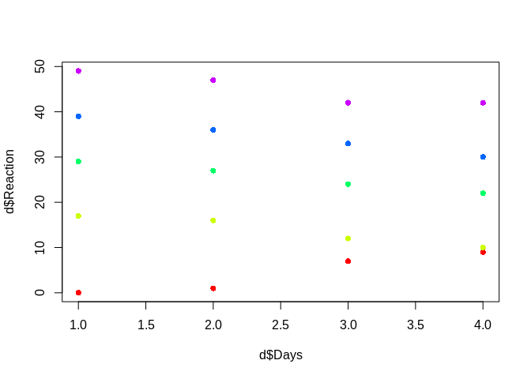
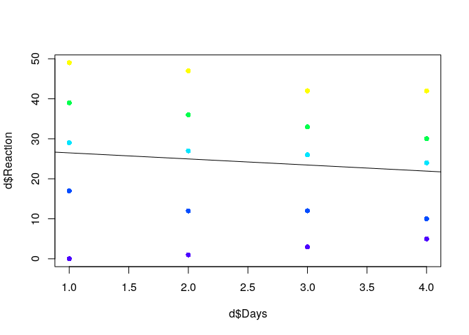
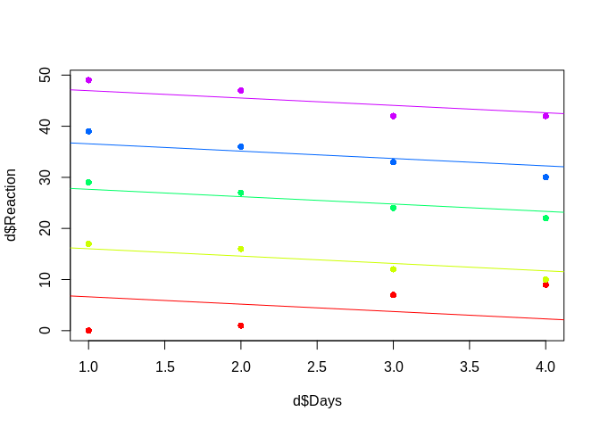
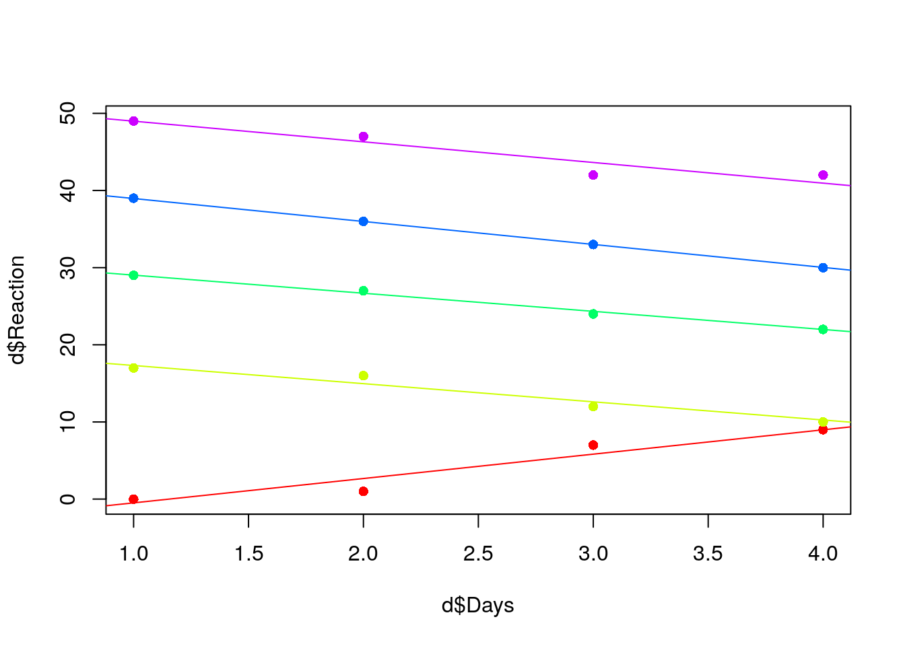
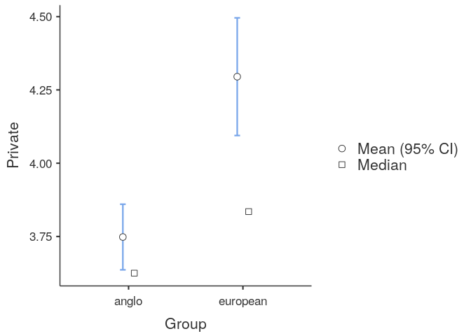

Advanced Statistical Modeling in R
================
Kasper Welbers & Wouter van Atteveldt
November 2018

-   [Multilevel models](#multilevel-models)
    -   [Multilevel modeling in R: a visual explanation](#multilevel-modeling-in-r-a-visual-explanation)
        -   [Regular linear model](#regular-linear-model)
        -   [Multilevel model with random intercepts](#multilevel-model-with-random-intercepts)
        -   [Multilevel model with random intercepts and random slopes](#multilevel-model-with-random-intercepts-and-random-slopes)
        -   [Comparing multilevel models](#comparing-multilevel-models)
-   [Another example with more data](#another-example-with-more-data)
    -   [Analyzing the data with normal linear regression](#analyzing-the-data-with-normal-linear-regression)
        -   [Using dummy variables for class\_ids](#using-dummy-variables-for-class_ids)
    -   [Analyzing the data with multilevel regression](#analyzing-the-data-with-multilevel-regression)
    -   [Multilevel Logistic or Poisson regression with glmer()](#multilevel-logistic-or-poisson-regression-with-glmer)

    ## Registered S3 method overwritten by 'printr':
    ##   method                from     
    ##   knit_print.data.frame rmarkdown

Multilevel models
=================

Multilevel models are, simply put, linear models that can account for multiple levels in the data. Here we briefly explain what what multilevel analysis in and how to apply it in R with the `lme4` package. For tabulating and plotting we'll use the `sjPlot` package. Also, we could use a bit of tidyverse.

``` r
install.packages("lme4")
install.packages("sjPlot")
```

``` r
library(lme4)
library(sjPlot)
library(tidyverse)
```

The examples in the lme4 packages use the sleepstudy data, which measures reaction time of participants after sleep deprivation. The data contains three variables: Reaction, Days and Subject. Subjects were limited to 3 hours of sleep each night, so the question is whether their reaction time slows after more days of limited sleep.

``` r
head(sleepstudy)
```

|  Reaction|  Days| Subject |
|---------:|-----:|:--------|
|  249.5600|     0| 308     |
|  258.7047|     1| 308     |
|  250.8006|     2| 308     |
|  321.4398|     3| 308     |
|  356.8519|     4| 308     |
|  414.6901|     5| 308     |

The sleepstudy data requires multilevel analysis, because the observations are nested in Subjects. Linear regression models assume that observations are independent, but that is not the case here. Different subjects might have different reaction speeds in general, and might also be more or less affected by sleep deprivation.

To account for this, multilevel models can have `random intercepts` and `random slopes`. By using random intercepts, each Subject has its own intercept, which accounts for differences between subjects in overall reaction speed. Random slopes can be applied for each independent variable in the model, so that each Subject also has its own slope (i.e. coefficient) for this variable. This can be used simply to controll for implications of nested data (to not violate the independence assumption in linear regression). But moreover, it can be used to better investigate variance and effects at different levels. For instance, to what extent student learning success is explained by individual level factors (doing homework, participating in class) or class level factors (class size, experience of teacher).

Multilevel modeling in R: a visual explanation
----------------------------------------------

We will not try to explain exactly how multilevel modeling works. This is a workshop and several books in its own right. However, after this tutorial you will hopefully understand why its important to properly model data with multiple levels, and realize that it is fairly easy to fit multilevel models in R.

To achieve this, we will show you how to fit a multilevel model, and visually illustrate what the difference is from using a linear model. For this we'll use a small toy data.frame (which is actually too small to properly fit a multilevel model). We'll use the same names as the aforementioned sleep study data for easy interpretation.

``` r
d = data.frame(Reaction = c(0,1,7,9,17,16,12,10,29,27,24,22,39,36,33,30,49,47,42,42),
               Days = c(1,2,3,4,1,2,3,4,1,2,3,4,1,2,3,4,1,2,3,4),
               Subject = c(1,1,1,1,2,2,2,2,3,3,3,3,4,4,4,4,5,5,5,5))
```

Here the Subjects have clearly different intercepts (average Reaction) and slopes (effect of Days on Reaction). We can show this with a scatterplot, in which different subjects are given different colors.

``` r
cols = rainbow(5)  # make colors for 5 subjects
plot(d$Days, d$Reaction, col=cols[d$Subject], pch=16)
```



If we just look at the dots without the colors, we hardly see any patterns. Taking the colors into account, we see that the average reaction time (in our toy data) is vastly different for each Subject. Also, we see that overall the reaction time within Subjects decrease for most Subjects, but with different slopes (the red one even increases).

To show how we can model this with random intercepts and random slopes, we'll fit this data with three models: regular linear model, multilevel model with random intercepts, multilevel model with random intercepts and random slopes.

### Regular linear model

Let's see what happens if we fit a regular linear regression, and plot the regression line.

``` r
m = lm(Reaction ~ Days, data=d)
tab_model(m)
```

<table style="border-collapse:collapse; border:none;">
<tr>
<th style="border-top: double; text-align:center; font-style:normal; font-weight:bold; padding:0.2cm;  text-align:left; ">
 
</th>
<th colspan="3" style="border-top: double; text-align:center; font-style:normal; font-weight:bold; padding:0.2cm; ">
Reaction
</th>
</tr>
<tr>
<td style=" text-align:center; border-bottom:1px solid; font-style:italic; font-weight:normal;  text-align:left; ">
Predictors
</td>
<td style=" text-align:center; border-bottom:1px solid; font-style:italic; font-weight:normal;  ">
Estimates
</td>
<td style=" text-align:center; border-bottom:1px solid; font-style:italic; font-weight:normal;  ">
CI
</td>
<td style=" text-align:center; border-bottom:1px solid; font-style:italic; font-weight:normal;  ">
p
</td>
</tr>
<tr>
<td style=" padding:0.2cm; text-align:left; vertical-align:top; text-align:left; ">
(Intercept)
</td>
<td style=" padding:0.2cm; text-align:left; vertical-align:top; text-align:center;  ">
28.20
</td>
<td style=" padding:0.2cm; text-align:left; vertical-align:top; text-align:center;  ">
10.33 – 46.07
</td>
<td style=" padding:0.2cm; text-align:left; vertical-align:top; text-align:center;  ">
<strong>0.004</strong>
</td>
</tr>
<tr>
<td style=" padding:0.2cm; text-align:left; vertical-align:top; text-align:left; ">
Days
</td>
<td style=" padding:0.2cm; text-align:left; vertical-align:top; text-align:center;  ">
-1.44
</td>
<td style=" padding:0.2cm; text-align:left; vertical-align:top; text-align:center;  ">
-7.96 – 5.08
</td>
<td style=" padding:0.2cm; text-align:left; vertical-align:top; text-align:center;  ">
0.648
</td>
</tr>
<tr>
<td style=" padding:0.2cm; text-align:left; vertical-align:top; text-align:left; padding-top:0.1cm; padding-bottom:0.1cm; border-top:1px solid;">
Observations
</td>
<td style=" padding:0.2cm; text-align:left; vertical-align:top; padding-top:0.1cm; padding-bottom:0.1cm; text-align:left; border-top:1px solid;" colspan="3">
20
</td>
</tr>
<tr>
<td style=" padding:0.2cm; text-align:left; vertical-align:top; text-align:left; padding-top:0.1cm; padding-bottom:0.1cm;">
R<sup>2</sup> / R<sup>2</sup> adjusted
</td>
<td style=" padding:0.2cm; text-align:left; vertical-align:top; padding-top:0.1cm; padding-bottom:0.1cm; text-align:left;" colspan="3">
0.012 / -0.043
</td>
</tr>
</table>
The model states that there is no relation between Days and Reaction. We can visualize the problem of fitting a regular linear model to this data by adding the coefficient line to the plot.

``` r
plot(d$Days, d$Reaction, col=cols[d$Subject], pch=16)
abline(coef(m)[1], coef(m)[2])
```



It does captures the overal pattern (Reaction times goes down), but only roughly.

### Multilevel model with random intercepts

To fit a linear multilevel model we will use the `lmer` function from the `lme4` package. Notice the similarity to the `lm` function. The difference is that you need to specify the higher level in the formula, which looks like this.

``` r
m_ri = lmer(Reaction ~ Days + (1 | Subject), data=d)
```

The multilevel part is the added `+ (1 | Subject)`. The part between the parentheses has two parts:

-   The part after the | symbol gives the name of the higher level group, in this case Subject.
-   The part before the | specifies the model for this higher level. In the current example, this is only `1`, which referes to the intercept. Normally, the intercept is implicit, but here you do always need to specify it.

Here we can also use the `screenreg` function (from the `texreg` package) to print the regression table.

    tab_model(m_ri)

Interestingly, we see that the intercept and the effect for Days is identical (though now the effect is Days statistically significant). This part of the output still shows the overall intercept (or grand intercept) and effect. What's new is the lower part, which shows the way the model is fit and the random effects.

As with the `glm`, there is no straightforward R2, but sjPlot provides us with a marginal R2 and conditional R2. The difference is that the marginal R2 reflects the variance of the fixed effects only, whereas the conditional R2 reflects both the fixed and random effects. It is nice to report these, but for multilevel models it is also (more) common and good practice to evalute model fit by comparing different models (as discussed below).

For now, focus on the *σ*<sup>2</sup> and *τ*<sub>00</sub>*S**u**b**j**e**c**t* rows. These report the variance for the individual level (repeated measures of subjects) and group level (subjects), respectively. We see that the Subject variance (259.00) is much higher than *σ*<sup>2</sup> (10.83). This makes sense for our data, because the biggest differences in the Reaction scores can be explained by the differences between Subjects. We can see this more clearly by visualizing the effect of Days with the random interceps. The random intercept values are not reported in the model above, but they are stored in the output (m\_ri).

``` r
plot(d$Days, d$Reaction, col=cols[d$Subject], pch=16)
for (i in 1:5) {  ## for each subject
  abline(coef(m_ri)$Subject[i,1], coef(m_ri)$Subject[i,2], col=cols[i])
}
```



Now each Subject has it's own regression line for the effect of Days on Reaction. This also makes it clear why the variance is mainly on the Subject level. The distance of the observations (the dots) to the lines of the same colour is relatively small. The bigger distance is between the lines.

### Multilevel model with random intercepts and random slopes

In the random intercepts model the slope for the effect of Days is still the same. So now, let's fit the model with random intercepts AND random slopes. We do this by adding the Days variable in the multilevel part (the part between parentheses) of the formula.

``` r
m_rs = lmer(Reaction ~ Days + (1 + Days | Subject), data=d)
tab_model(m_rs)
```

<table style="border-collapse:collapse; border:none;">
<tr>
<th style="border-top: double; text-align:center; font-style:normal; font-weight:bold; padding:0.2cm;  text-align:left; ">
 
</th>
<th colspan="3" style="border-top: double; text-align:center; font-style:normal; font-weight:bold; padding:0.2cm; ">
Reaction
</th>
</tr>
<tr>
<td style=" text-align:center; border-bottom:1px solid; font-style:italic; font-weight:normal;  text-align:left; ">
Predictors
</td>
<td style=" text-align:center; border-bottom:1px solid; font-style:italic; font-weight:normal;  ">
Estimates
</td>
<td style=" text-align:center; border-bottom:1px solid; font-style:italic; font-weight:normal;  ">
CI
</td>
<td style=" text-align:center; border-bottom:1px solid; font-style:italic; font-weight:normal;  ">
p
</td>
</tr>
<tr>
<td style=" padding:0.2cm; text-align:left; vertical-align:top; text-align:left; ">
(Intercept)
</td>
<td style=" padding:0.2cm; text-align:left; vertical-align:top; text-align:center;  ">
28.20
</td>
<td style=" padding:0.2cm; text-align:left; vertical-align:top; text-align:center;  ">
9.53 – 46.87
</td>
<td style=" padding:0.2cm; text-align:left; vertical-align:top; text-align:center;  ">
<strong>0.003</strong>
</td>
</tr>
<tr>
<td style=" padding:0.2cm; text-align:left; vertical-align:top; text-align:left; ">
Days
</td>
<td style=" padding:0.2cm; text-align:left; vertical-align:top; text-align:center;  ">
-1.44
</td>
<td style=" padding:0.2cm; text-align:left; vertical-align:top; text-align:center;  ">
-3.75 – 0.87
</td>
<td style=" padding:0.2cm; text-align:left; vertical-align:top; text-align:center;  ">
0.222
</td>
</tr>
<tr>
<td colspan="4" style="font-weight:bold; text-align:left; padding-top:.8em;">
Random Effects
</td>
</tr>
<tr>
<td style=" padding:0.2cm; text-align:left; vertical-align:top; text-align:left; padding-top:0.1cm; padding-bottom:0.1cm;">
σ<sup>2</sup>
</td>
<td style=" padding:0.2cm; text-align:left; vertical-align:top; padding-top:0.1cm; padding-bottom:0.1cm; text-align:left;" colspan="3">
1.03
</td>
<tr>
<td style=" padding:0.2cm; text-align:left; vertical-align:top; text-align:left; padding-top:0.1cm; padding-bottom:0.1cm;">
τ<sub>00</sub> <sub>Subject</sub>
</td>
<td style=" padding:0.2cm; text-align:left; vertical-align:top; padding-top:0.1cm; padding-bottom:0.1cm; text-align:left;" colspan="3">
452.06
</td>
<tr>
<td style=" padding:0.2cm; text-align:left; vertical-align:top; text-align:left; padding-top:0.1cm; padding-bottom:0.1cm;">
τ<sub>11</sub> <sub>Subject.Days</sub>
</td>
<td style=" padding:0.2cm; text-align:left; vertical-align:top; padding-top:0.1cm; padding-bottom:0.1cm; text-align:left;" colspan="3">
6.75
</td>
<tr>
<td style=" padding:0.2cm; text-align:left; vertical-align:top; text-align:left; padding-top:0.1cm; padding-bottom:0.1cm;">
ρ<sub>01</sub> <sub>Subject</sub>
</td>
<td style=" padding:0.2cm; text-align:left; vertical-align:top; padding-top:0.1cm; padding-bottom:0.1cm; text-align:left;" colspan="3">
-0.86
</td>
<tr>
<td style=" padding:0.2cm; text-align:left; vertical-align:top; text-align:left; padding-top:0.1cm; padding-bottom:0.1cm;">
ICC
</td>
<td style=" padding:0.2cm; text-align:left; vertical-align:top; padding-top:0.1cm; padding-bottom:0.1cm; text-align:left;" colspan="3">
1.00
</td>
<tr>
<td style=" padding:0.2cm; text-align:left; vertical-align:top; text-align:left; padding-top:0.1cm; padding-bottom:0.1cm;">
N <sub>Subject</sub>
</td>
<td style=" padding:0.2cm; text-align:left; vertical-align:top; padding-top:0.1cm; padding-bottom:0.1cm; text-align:left;" colspan="3">
5
</td>
<tr>
<td style=" padding:0.2cm; text-align:left; vertical-align:top; text-align:left; padding-top:0.1cm; padding-bottom:0.1cm; border-top:1px solid;">
Observations
</td>
<td style=" padding:0.2cm; text-align:left; vertical-align:top; padding-top:0.1cm; padding-bottom:0.1cm; text-align:left; border-top:1px solid;" colspan="3">
20
</td>
</tr>
<tr>
<td style=" padding:0.2cm; text-align:left; vertical-align:top; text-align:left; padding-top:0.1cm; padding-bottom:0.1cm;">
Marginal R<sup>2</sup> / Conditional R<sup>2</sup>
</td>
<td style=" padding:0.2cm; text-align:left; vertical-align:top; padding-top:0.1cm; padding-bottom:0.1cm; text-align:left;" colspan="3">
0.010 / 0.996
</td>
</tr>
</table>
(You might get a "Model failed to converge" warning. This is related to the maximum likelihood estimation. Normally you would want to investigate why this happens and fix it. In the current case it is probably related to our very simple and small demo data. Even though it failed to fully converge, it still gives us its the best fit that it did converge to, so for this example we'll ignore the warning.)

Again, the fixed effects for the Intercept and Days are the same. What is new is that the variance of *τ*<sub>11</sub>*S**u**b**j**e**c**t*.*D**a**y**s* is reported. This is the variance between Subject in the effect of Days on Reaction. In our data, this variance is most clearly seen in the effect for the 'red' Subject at the bottom of the graph, which is the only Subject for whom Reaction time somehow increased.

``` r
plot(d$Days, d$Reaction, col=cols[d$Subject], pch=16)  ## redo the plot for clarity
for (i in 1:5) {  ## for each subject
  abline(coef(m_rs)$Subject[i,1], coef(m_rs)$Subject[i,2], col=cols[i])
}
```



What we now see is that the random part of the model accounts for the fact that the subjects in our study have (a) a different reaction time overal, and (b) have a different effect of sleep deprivation.

### Comparing multilevel models

By comparing the models, we can see how the variance at different levels changes. Here we first make a base model, which is a random intercepts model without any predictor variables. Then we add Days at the individual level, and finally we add the random slopes for Days.

``` r
m_base = lmer(Reaction ~ (1 | Subject), data=d)
m1 = lmer(Reaction ~ Days + (1 | Subject), data=d)
m2 = lmer(Reaction ~ Days + (1 + Days| Subject), data=d)
anova(m_base,m1,m2)
```

|         |   Df|       AIC|       BIC|     logLik|  deviance|      Chisq|  Chi Df|  Pr(&gt;Chisq)|
|---------|----:|---------:|---------:|----------:|---------:|----------:|-------:|--------------:|
| m\_base |    3|  135.5236|  138.5108|  -64.76182|  129.5236|         NA|      NA|             NA|
| m1      |    4|  133.1133|  137.0962|  -62.55664|  125.1133|   4.410373|       1|      0.0357210|
| m2      |    6|  115.5772|  121.5516|  -51.78861|  103.5772|  21.536052|       2|      0.0000211|

The anova shows that each model is an improvement of the previous model. Interestingly, the improvement from m\_base to m1 is not that great. This is because the overall effect of Days (not taking random slopes into account) isn't that great (remember that it was not statistically significant)

``` r
tab_model(m_base, m1, m2)
```

<table style="border-collapse:collapse; border:none;">
<tr>
<th style="border-top: double; text-align:center; font-style:normal; font-weight:bold; padding:0.2cm;  text-align:left; ">
 
</th>
<th colspan="3" style="border-top: double; text-align:center; font-style:normal; font-weight:bold; padding:0.2cm; ">
Reaction
</th>
<th colspan="3" style="border-top: double; text-align:center; font-style:normal; font-weight:bold; padding:0.2cm; ">
Reaction
</th>
<th colspan="3" style="border-top: double; text-align:center; font-style:normal; font-weight:bold; padding:0.2cm; ">
Reaction
</th>
</tr>
<tr>
<td style=" text-align:center; border-bottom:1px solid; font-style:italic; font-weight:normal;  text-align:left; ">
Predictors
</td>
<td style=" text-align:center; border-bottom:1px solid; font-style:italic; font-weight:normal;  ">
Estimates
</td>
<td style=" text-align:center; border-bottom:1px solid; font-style:italic; font-weight:normal;  ">
CI
</td>
<td style=" text-align:center; border-bottom:1px solid; font-style:italic; font-weight:normal;  ">
p
</td>
<td style=" text-align:center; border-bottom:1px solid; font-style:italic; font-weight:normal;  ">
Estimates
</td>
<td style=" text-align:center; border-bottom:1px solid; font-style:italic; font-weight:normal;  ">
CI
</td>
<td style=" text-align:center; border-bottom:1px solid; font-style:italic; font-weight:normal;  col7">
p
</td>
<td style=" text-align:center; border-bottom:1px solid; font-style:italic; font-weight:normal;  col8">
Estimates
</td>
<td style=" text-align:center; border-bottom:1px solid; font-style:italic; font-weight:normal;  col9">
CI
</td>
<td style=" text-align:center; border-bottom:1px solid; font-style:italic; font-weight:normal;  0">
p
</td>
</tr>
<tr>
<td style=" padding:0.2cm; text-align:left; vertical-align:top; text-align:left; ">
(Intercept)
</td>
<td style=" padding:0.2cm; text-align:left; vertical-align:top; text-align:center;  ">
24.60
</td>
<td style=" padding:0.2cm; text-align:left; vertical-align:top; text-align:center;  ">
10.42 – 38.78
</td>
<td style=" padding:0.2cm; text-align:left; vertical-align:top; text-align:center;  ">
<strong>0.001</strong>
</td>
<td style=" padding:0.2cm; text-align:left; vertical-align:top; text-align:center;  ">
28.20
</td>
<td style=" padding:0.2cm; text-align:left; vertical-align:top; text-align:center;  ">
13.66 – 42.74
</td>
<td style=" padding:0.2cm; text-align:left; vertical-align:top; text-align:center;  col7">
<strong>&lt;0.001
</td>
<td style=" padding:0.2cm; text-align:left; vertical-align:top; text-align:center;  col8">
28.20
</td>
<td style=" padding:0.2cm; text-align:left; vertical-align:top; text-align:center;  col9">
9.53 – 46.87
</td>
<td style=" padding:0.2cm; text-align:left; vertical-align:top; text-align:center;  0">
<strong>0.003</strong>
</td>
</tr>
<tr>
<td style=" padding:0.2cm; text-align:left; vertical-align:top; text-align:left; ">
Days
</td>
<td style=" padding:0.2cm; text-align:left; vertical-align:top; text-align:center;  ">
</td>
<td style=" padding:0.2cm; text-align:left; vertical-align:top; text-align:center;  ">
</td>
<td style=" padding:0.2cm; text-align:left; vertical-align:top; text-align:center;  ">
</td>
<td style=" padding:0.2cm; text-align:left; vertical-align:top; text-align:center;  ">
-1.44
</td>
<td style=" padding:0.2cm; text-align:left; vertical-align:top; text-align:center;  ">
-2.73 – -0.15
</td>
<td style=" padding:0.2cm; text-align:left; vertical-align:top; text-align:center;  col7">
<strong>0.029</strong>
</td>
<td style=" padding:0.2cm; text-align:left; vertical-align:top; text-align:center;  col8">
-1.44
</td>
<td style=" padding:0.2cm; text-align:left; vertical-align:top; text-align:center;  col9">
-3.75 – 0.87
</td>
<td style=" padding:0.2cm; text-align:left; vertical-align:top; text-align:center;  0">
0.222
</td>
</tr>
<tr>
<td colspan="10" style="font-weight:bold; text-align:left; padding-top:.8em;">
Random Effects
</td>
</tr>
<tr>
<td style=" padding:0.2cm; text-align:left; vertical-align:top; text-align:left; padding-top:0.1cm; padding-bottom:0.1cm;">
σ<sup>2</sup>
</td>
<td style=" padding:0.2cm; text-align:left; vertical-align:top; padding-top:0.1cm; padding-bottom:0.1cm; text-align:left;" colspan="3">
13.57
</td>
<td style=" padding:0.2cm; text-align:left; vertical-align:top; padding-top:0.1cm; padding-bottom:0.1cm; text-align:left;" colspan="3">
10.83
</td>
<td style=" padding:0.2cm; text-align:left; vertical-align:top; padding-top:0.1cm; padding-bottom:0.1cm; text-align:left;" colspan="3">
1.03
</td>
<tr>
<td style=" padding:0.2cm; text-align:left; vertical-align:top; text-align:left; padding-top:0.1cm; padding-bottom:0.1cm;">
τ<sub>00</sub>
</td>
<td style=" padding:0.2cm; text-align:left; vertical-align:top; padding-top:0.1cm; padding-bottom:0.1cm; text-align:left;" colspan="3">
258.31 <sub>Subject</sub>
</td>
<td style=" padding:0.2cm; text-align:left; vertical-align:top; padding-top:0.1cm; padding-bottom:0.1cm; text-align:left;" colspan="3">
259.00 <sub>Subject</sub>
</td>
<td style=" padding:0.2cm; text-align:left; vertical-align:top; padding-top:0.1cm; padding-bottom:0.1cm; text-align:left;" colspan="3">
452.06 <sub>Subject</sub>
</td>
<tr>
<td style=" padding:0.2cm; text-align:left; vertical-align:top; text-align:left; padding-top:0.1cm; padding-bottom:0.1cm;">
τ<sub>11</sub>
</td>
<td style=" padding:0.2cm; text-align:left; vertical-align:top; padding-top:0.1cm; padding-bottom:0.1cm; text-align:left;" colspan="3">
 
</td>
<td style=" padding:0.2cm; text-align:left; vertical-align:top; padding-top:0.1cm; padding-bottom:0.1cm; text-align:left;" colspan="3">
 
</td>
<td style=" padding:0.2cm; text-align:left; vertical-align:top; padding-top:0.1cm; padding-bottom:0.1cm; text-align:left;" colspan="3">
6.75 <sub>Subject.Days</sub>
</td>
<tr>
<td style=" padding:0.2cm; text-align:left; vertical-align:top; text-align:left; padding-top:0.1cm; padding-bottom:0.1cm;">
ρ<sub>01</sub>
</td>
<td style=" padding:0.2cm; text-align:left; vertical-align:top; padding-top:0.1cm; padding-bottom:0.1cm; text-align:left;" colspan="3">
 
</td>
<td style=" padding:0.2cm; text-align:left; vertical-align:top; padding-top:0.1cm; padding-bottom:0.1cm; text-align:left;" colspan="3">
 
</td>
<td style=" padding:0.2cm; text-align:left; vertical-align:top; padding-top:0.1cm; padding-bottom:0.1cm; text-align:left;" colspan="3">
-0.86 <sub>Subject</sub>
</td>
<tr>
<td style=" padding:0.2cm; text-align:left; vertical-align:top; text-align:left; padding-top:0.1cm; padding-bottom:0.1cm;">
ICC
</td>
<td style=" padding:0.2cm; text-align:left; vertical-align:top; padding-top:0.1cm; padding-bottom:0.1cm; text-align:left;" colspan="3">
0.95
</td>
<td style=" padding:0.2cm; text-align:left; vertical-align:top; padding-top:0.1cm; padding-bottom:0.1cm; text-align:left;" colspan="3">
0.96
</td>
<td style=" padding:0.2cm; text-align:left; vertical-align:top; padding-top:0.1cm; padding-bottom:0.1cm; text-align:left;" colspan="3">
1.00
</td>
<tr>
<td style=" padding:0.2cm; text-align:left; vertical-align:top; text-align:left; padding-top:0.1cm; padding-bottom:0.1cm;">
N
</td>
<td style=" padding:0.2cm; text-align:left; vertical-align:top; padding-top:0.1cm; padding-bottom:0.1cm; text-align:left;" colspan="3">
5 <sub>Subject</sub>
</td>
<td style=" padding:0.2cm; text-align:left; vertical-align:top; padding-top:0.1cm; padding-bottom:0.1cm; text-align:left;" colspan="3">
5 <sub>Subject</sub>
</td>
<td style=" padding:0.2cm; text-align:left; vertical-align:top; padding-top:0.1cm; padding-bottom:0.1cm; text-align:left;" colspan="3">
5 <sub>Subject</sub>
</td>
<tr>
<td style=" padding:0.2cm; text-align:left; vertical-align:top; text-align:left; padding-top:0.1cm; padding-bottom:0.1cm; border-top:1px solid;">
Observations
</td>
<td style=" padding:0.2cm; text-align:left; vertical-align:top; padding-top:0.1cm; padding-bottom:0.1cm; text-align:left; border-top:1px solid;" colspan="3">
20
</td>
<td style=" padding:0.2cm; text-align:left; vertical-align:top; padding-top:0.1cm; padding-bottom:0.1cm; text-align:left; border-top:1px solid;" colspan="3">
20
</td>
<td style=" padding:0.2cm; text-align:left; vertical-align:top; padding-top:0.1cm; padding-bottom:0.1cm; text-align:left; border-top:1px solid;" colspan="3">
20
</td>
</tr>
<tr>
<td style=" padding:0.2cm; text-align:left; vertical-align:top; text-align:left; padding-top:0.1cm; padding-bottom:0.1cm;">
Marginal R<sup>2</sup> / Conditional R<sup>2</sup>
</td>
<td style=" padding:0.2cm; text-align:left; vertical-align:top; padding-top:0.1cm; padding-bottom:0.1cm; text-align:left;" colspan="3">
0.000 / 0.950
</td>
<td style=" padding:0.2cm; text-align:left; vertical-align:top; padding-top:0.1cm; padding-bottom:0.1cm; text-align:left;" colspan="3">
0.010 / 0.960
</td>
<td style=" padding:0.2cm; text-align:left; vertical-align:top; padding-top:0.1cm; padding-bottom:0.1cm; text-align:left;" colspan="3">
0.010 / 0.996
</td>
</tr>
</table>
It's interesting to look at the random effects to see how the variance is explained at different levels. From m\_base to m1 (adding the Days effect) we see that variance is mostly explained at the individual level (*σ*<sup>2</sup> decreases from 13.57 to 10.83). This makes sense, because Days are nested within subjects. From m1 to m2 (adding the random slope for Days), we see that even more variance at the individual level level is explained. This again makes sense, because the lines within the Subjects now much better fit the data.

Another example with more data
==============================

This time we'll generate a larger toy dataset about the effects of studying on a student's grade. The multilevel component will be that students are nested in classes, and these classes have different teachers. In addition to a positive effect of studying, we make it so that grades are on average higher if the teacher is better. And to introduce a spurious relation, we'll include a variable for the wealth of students, and make it so that students with more wealth tend to have better teachers. The problem we're aiming for here, is to show that we need to control for the class level differences in average grades, so that we do not incorrectly conclude that being wealthy causes better grades.

The variables in our data are:

-   *minutes\_studied*: The time a student studied, in minutes (we somehow just know)
-   *exam\_grade*: A grade on a scale from 1-10
-   *wealth*: A continuous variable indicating how wealthy a student is.
-   *class\_id*: A factor with class ids, conveniently named after the alphabet (a, b, c, ..., z)
-   *teacher\_exp*: Teacher experience, measured in number of years.

To generate a dataset with multilevel structure, we'll take the equation for a 2-level model with random intercepts and random slopes. This equation is taken from the rather excellent wikipedia page [Multilevel model](https://en.wikipedia.org/wiki/Multilevel_model). If you want more details on the equation (its not critical for this tutorial), please consult sections 1 and 2.

The level 1 regression equation is similar to the equation for single level regression. The difference is the \_j subscript which refers to

*Y*<sub>*i**j*</sub> = *β*<sub>0*j*</sub> + *β*<sub>1*j*</sub>*X*<sub>*i**j*</sub> + *e*<sub>*i**j*</sub>

The level 2 regression equations have the intercepts and slopes for the level 1 equation as the dependent variable.

*β*<sub>0*j*</sub> = *γ*<sub>00</sub> + *γ*<sub>01</sub>*W*<sub>*j*</sub> + *u*<sub>0*j*</sub>
*β*<sub>1*j*</sub> = *γ*<sub>10</sub> + *u*<sub>1*j*</sub>

The following code is a bit complicated, and you do not need to understand it.

``` r
set.seed(1)
groups = 26
groupsize = 30
n = 26*30

level1 = tibble(class_id = rep(letters, each=groupsize),
                hours_studied = rpois(n, 12),
                wealth = rnorm(n, rep(1:groups, each=groupsize), 3))


level2 = tibble(class_id = letters,
                teacher_exp = rpois(groups, 1:groups/2))
level2$B0j = 2 + 0.3*level2$teacher_exp + rnorm(groups, 0, 0.4)
level2$B1j = 0.1 + rnorm(groups, 0, 0.15)

d = left_join(level1, level2, by='class_id')
d$exam_grade = d$B0j + d$B1j*d$hours_studied + rnorm(n, 0, 0.8)
```

Analyzing the data with normal linear regression
------------------------------------------------

Now that we have our multilevel data, let's first fit the model with linear regression. For good pracice, we'll compare models at different stages of complexity.

``` r
m0 = lm(exam_grade ~ 1, data=d)
m1 = lm(exam_grade ~ 1 + hours_studied, data=d)
m2 = lm(exam_grade ~ 1 + hours_studied + wealth, data=d)

tab_model(m0, m1, m2)
```

<table style="border-collapse:collapse; border:none;">
<tr>
<th style="border-top: double; text-align:center; font-style:normal; font-weight:bold; padding:0.2cm;  text-align:left; ">
 
</th>
<th colspan="3" style="border-top: double; text-align:center; font-style:normal; font-weight:bold; padding:0.2cm; ">
exam\_grade
</th>
<th colspan="3" style="border-top: double; text-align:center; font-style:normal; font-weight:bold; padding:0.2cm; ">
exam\_grade
</th>
<th colspan="3" style="border-top: double; text-align:center; font-style:normal; font-weight:bold; padding:0.2cm; ">
exam\_grade
</th>
</tr>
<tr>
<td style=" text-align:center; border-bottom:1px solid; font-style:italic; font-weight:normal;  text-align:left; ">
Predictors
</td>
<td style=" text-align:center; border-bottom:1px solid; font-style:italic; font-weight:normal;  ">
Estimates
</td>
<td style=" text-align:center; border-bottom:1px solid; font-style:italic; font-weight:normal;  ">
CI
</td>
<td style=" text-align:center; border-bottom:1px solid; font-style:italic; font-weight:normal;  ">
p
</td>
<td style=" text-align:center; border-bottom:1px solid; font-style:italic; font-weight:normal;  ">
Estimates
</td>
<td style=" text-align:center; border-bottom:1px solid; font-style:italic; font-weight:normal;  ">
CI
</td>
<td style=" text-align:center; border-bottom:1px solid; font-style:italic; font-weight:normal;  col7">
p
</td>
<td style=" text-align:center; border-bottom:1px solid; font-style:italic; font-weight:normal;  col8">
Estimates
</td>
<td style=" text-align:center; border-bottom:1px solid; font-style:italic; font-weight:normal;  col9">
CI
</td>
<td style=" text-align:center; border-bottom:1px solid; font-style:italic; font-weight:normal;  0">
p
</td>
</tr>
<tr>
<td style=" padding:0.2cm; text-align:left; vertical-align:top; text-align:left; ">
(Intercept)
</td>
<td style=" padding:0.2cm; text-align:left; vertical-align:top; text-align:center;  ">
5.52
</td>
<td style=" padding:0.2cm; text-align:left; vertical-align:top; text-align:center;  ">
5.36 – 5.68
</td>
<td style=" padding:0.2cm; text-align:left; vertical-align:top; text-align:center;  ">
<strong>&lt;0.001
</td>
<td style=" padding:0.2cm; text-align:left; vertical-align:top; text-align:center;  ">
4.72
</td>
<td style=" padding:0.2cm; text-align:left; vertical-align:top; text-align:center;  ">
4.19 – 5.25
</td>
<td style=" padding:0.2cm; text-align:left; vertical-align:top; text-align:center;  col7">
<strong>&lt;0.001
</td>
<td style=" padding:0.2cm; text-align:left; vertical-align:top; text-align:center;  col8">
2.99
</td>
<td style=" padding:0.2cm; text-align:left; vertical-align:top; text-align:center;  col9">
2.45 – 3.52
</td>
<td style=" padding:0.2cm; text-align:left; vertical-align:top; text-align:center;  0">
<strong>&lt;0.001
</td>
</tr>
<tr>
<td style=" padding:0.2cm; text-align:left; vertical-align:top; text-align:left; ">
hours\_studied
</td>
<td style=" padding:0.2cm; text-align:left; vertical-align:top; text-align:center;  ">
</td>
<td style=" padding:0.2cm; text-align:left; vertical-align:top; text-align:center;  ">
</td>
<td style=" padding:0.2cm; text-align:left; vertical-align:top; text-align:center;  ">
</td>
<td style=" padding:0.2cm; text-align:left; vertical-align:top; text-align:center;  ">
0.07
</td>
<td style=" padding:0.2cm; text-align:left; vertical-align:top; text-align:center;  ">
0.02 – 0.11
</td>
<td style=" padding:0.2cm; text-align:left; vertical-align:top; text-align:center;  col7">
<strong>0.002</strong>
</td>
<td style=" padding:0.2cm; text-align:left; vertical-align:top; text-align:center;  col8">
0.08
</td>
<td style=" padding:0.2cm; text-align:left; vertical-align:top; text-align:center;  col9">
0.04 – 0.11
</td>
<td style=" padding:0.2cm; text-align:left; vertical-align:top; text-align:center;  0">
<strong>&lt;0.001
</td>
</tr>
<tr>
<td style=" padding:0.2cm; text-align:left; vertical-align:top; text-align:left; ">
wealth
</td>
<td style=" padding:0.2cm; text-align:left; vertical-align:top; text-align:center;  ">
</td>
<td style=" padding:0.2cm; text-align:left; vertical-align:top; text-align:center;  ">
</td>
<td style=" padding:0.2cm; text-align:left; vertical-align:top; text-align:center;  ">
</td>
<td style=" padding:0.2cm; text-align:left; vertical-align:top; text-align:center;  ">
</td>
<td style=" padding:0.2cm; text-align:left; vertical-align:top; text-align:center;  ">
</td>
<td style=" padding:0.2cm; text-align:left; vertical-align:top; text-align:center;  col7">
</td>
<td style=" padding:0.2cm; text-align:left; vertical-align:top; text-align:center;  col8">
0.12
</td>
<td style=" padding:0.2cm; text-align:left; vertical-align:top; text-align:center;  col9">
0.11 – 0.14
</td>
<td style=" padding:0.2cm; text-align:left; vertical-align:top; text-align:center;  0">
<strong>&lt;0.001
</td>
</tr>
<tr>
<td style=" padding:0.2cm; text-align:left; vertical-align:top; text-align:left; padding-top:0.1cm; padding-bottom:0.1cm; border-top:1px solid;">
Observations
</td>
<td style=" padding:0.2cm; text-align:left; vertical-align:top; padding-top:0.1cm; padding-bottom:0.1cm; text-align:left; border-top:1px solid;" colspan="3">
780
</td>
<td style=" padding:0.2cm; text-align:left; vertical-align:top; padding-top:0.1cm; padding-bottom:0.1cm; text-align:left; border-top:1px solid;" colspan="3">
780
</td>
<td style=" padding:0.2cm; text-align:left; vertical-align:top; padding-top:0.1cm; padding-bottom:0.1cm; text-align:left; border-top:1px solid;" colspan="3">
780
</td>
</tr>
<tr>
<td style=" padding:0.2cm; text-align:left; vertical-align:top; text-align:left; padding-top:0.1cm; padding-bottom:0.1cm;">
R<sup>2</sup> / R<sup>2</sup> adjusted
</td>
<td style=" padding:0.2cm; text-align:left; vertical-align:top; padding-top:0.1cm; padding-bottom:0.1cm; text-align:left;" colspan="3">
0.000 / 0.000
</td>
<td style=" padding:0.2cm; text-align:left; vertical-align:top; padding-top:0.1cm; padding-bottom:0.1cm; text-align:left;" colspan="3">
0.012 / 0.011
</td>
<td style=" padding:0.2cm; text-align:left; vertical-align:top; padding-top:0.1cm; padding-bottom:0.1cm; text-align:left;" colspan="3">
0.216 / 0.214
</td>
</tr>
</table>
### Using dummy variables for class\_ids

To be fair, we could address this specific issue with linear regression as well. By adding the class\_id as an independent variable, R will make dummy variables to account for different intercepts of the classes. After adding these, the effect of wealth will no longer be significant. Here we do this, but since this would result in a very long table (25 rows for dummy variables) we'll use the `rm.terms` argument in tab\_model to remove these coefficients from the table. (if you do this, always make sure to clearly report that you did include these dummies, e.g. in a table footnote)

``` r
m3 = lm(exam_grade ~ 1 + hours_studied + wealth + class_id, data=d)
tab_model(m3, rm.terms = paste('class_id', letters, sep=''))
```

Adding dummy variables for groups can be a solution if you do not want to use multilevel models. However, there are stil arguments for why a multilevel model can be a better choice. Part of that has to do with how we prefer to think about the effects of groups. If there are many groups, then rather than considering them as independent fixed effects, it makes sense to consider the group level differences of the intercept to be drawn from a normal distribution.
Another benefit of multilevel models is that you can separately look at the explained variance for the first and second level, and can also see whether there is unexplained variance in slopes.

Finally, the dummy solution becomes problematic if we also want to include other group level effects. In our case, if we actually have data on how experienced teachers are, we could include that in the model to see whether this explains the group level variance. With the dummy solution, this is not possible because all our degrees of freedom for the group have been used, leading to possible biases or even not being able to estimate the other group level coefficient.

In our data, adding the teacher\_exp variable results in an NA, due to which we actually cannot use tab\_model (which doesn't like NAs). But we can see the problem in the coefficients (we don't show them here because it's messy).

``` r
m3 = lm(exam_grade ~ 1 + hours_studied + wealth + class_id + teacher_exp, data=d)
m3$coefficients
```

Analyzing the data with multilevel regression
---------------------------------------------

Now let's do the same with a multilevel mode. Let's start with a problem! If we try to fit our most complex model, we get a warning that the model does not converge

``` r
m4 = lmer(exam_grade ~ 1 + hours_studied + wealth + teacher_exp + (1 + hours_studied | class_id), data=d)
```

This can be a bit complicated issue (e.g. see [this](https://stats.stackexchange.com/questions/110004/how-scared-should-we-be-about-convergence-warnings-in-lme4) and the top answer\]). One solution is centering some of you variables. In our case, the hours\_studied and wealth variables have rather high numbers. Here we center them by subtracting the mean, and in our case that solves the issue.

``` f
d = mutate(d, hours_studied = hours_studied - mean(hours_studied),
              wealth = wealth - mean(wealth))
m4 = lmer(exam_grade ~ 1 + hours_studied + wealth + teacher_exp + (1 + hours_studied | class_id), data=d)
```

Now We can make one big, happy table. To make it fit on the page, we use the `show.ci = F` argument in tab\_model to drop the confidence interval column.

``` r
m0 = lmer(exam_grade ~ 1 + (1 | class_id), data=d)
m1 = lmer(exam_grade ~ 1 + hours_studied + (1 | class_id), data=d)
m2 = lmer(exam_grade ~ 1 + hours_studied + wealth + (1 | class_id), data=d)
m3 = lmer(exam_grade ~ 1 + hours_studied + wealth + teacher_exp + (1 | class_id), data=d)
m4 = lmer(exam_grade ~ 1 + hours_studied + wealth + teacher_exp + (1 + hours_studied | class_id), data=d)

tab_model(m0, m1, m2, m3, m4, show.ci = F)
```

<table style="border-collapse:collapse; border:none;">
<tr>
<th style="border-top: double; text-align:center; font-style:normal; font-weight:bold; padding:0.2cm;  text-align:left; ">
 
</th>
<th colspan="2" style="border-top: double; text-align:center; font-style:normal; font-weight:bold; padding:0.2cm; ">
exam\_grade
</th>
<th colspan="2" style="border-top: double; text-align:center; font-style:normal; font-weight:bold; padding:0.2cm; ">
exam\_grade
</th>
<th colspan="2" style="border-top: double; text-align:center; font-style:normal; font-weight:bold; padding:0.2cm; ">
exam\_grade
</th>
<th colspan="2" style="border-top: double; text-align:center; font-style:normal; font-weight:bold; padding:0.2cm; ">
exam\_grade
</th>
<th colspan="2" style="border-top: double; text-align:center; font-style:normal; font-weight:bold; padding:0.2cm; ">
exam\_grade
</th>
</tr>
<tr>
<td style=" text-align:center; border-bottom:1px solid; font-style:italic; font-weight:normal;  text-align:left; ">
Predictors
</td>
<td style=" text-align:center; border-bottom:1px solid; font-style:italic; font-weight:normal;  ">
Estimates
</td>
<td style=" text-align:center; border-bottom:1px solid; font-style:italic; font-weight:normal;  ">
p
</td>
<td style=" text-align:center; border-bottom:1px solid; font-style:italic; font-weight:normal;  ">
Estimates
</td>
<td style=" text-align:center; border-bottom:1px solid; font-style:italic; font-weight:normal;  ">
p
</td>
<td style=" text-align:center; border-bottom:1px solid; font-style:italic; font-weight:normal;  ">
Estimates
</td>
<td style=" text-align:center; border-bottom:1px solid; font-style:italic; font-weight:normal;  col7">
p
</td>
<td style=" text-align:center; border-bottom:1px solid; font-style:italic; font-weight:normal;  col8">
Estimates
</td>
<td style=" text-align:center; border-bottom:1px solid; font-style:italic; font-weight:normal;  col9">
p
</td>
<td style=" text-align:center; border-bottom:1px solid; font-style:italic; font-weight:normal;  0">
Estimates
</td>
<td style=" text-align:center; border-bottom:1px solid; font-style:italic; font-weight:normal;  1">
p
</td>
</tr>
<tr>
<td style=" padding:0.2cm; text-align:left; vertical-align:top; text-align:left; ">
(Intercept)
</td>
<td style=" padding:0.2cm; text-align:left; vertical-align:top; text-align:center;  ">
5.52
</td>
<td style=" padding:0.2cm; text-align:left; vertical-align:top; text-align:center;  ">
<strong>&lt;0.001
</td>
<td style=" padding:0.2cm; text-align:left; vertical-align:top; text-align:center;  ">
4.73
</td>
<td style=" padding:0.2cm; text-align:left; vertical-align:top; text-align:center;  ">
<strong>&lt;0.001
</td>
<td style=" padding:0.2cm; text-align:left; vertical-align:top; text-align:center;  ">
4.74
</td>
<td style=" padding:0.2cm; text-align:left; vertical-align:top; text-align:center;  col7">
<strong>&lt;0.001
</td>
<td style=" padding:0.2cm; text-align:left; vertical-align:top; text-align:center;  col8">
3.15
</td>
<td style=" padding:0.2cm; text-align:left; vertical-align:top; text-align:center;  col9">
<strong>&lt;0.001
</td>
<td style=" padding:0.2cm; text-align:left; vertical-align:top; text-align:center;  0">
2.47
</td>
<td style=" padding:0.2cm; text-align:left; vertical-align:top; text-align:center;  1">
<strong>&lt;0.001
</td>
</tr>
<tr>
<td style=" padding:0.2cm; text-align:left; vertical-align:top; text-align:left; ">
hours\_studied
</td>
<td style=" padding:0.2cm; text-align:left; vertical-align:top; text-align:center;  ">
</td>
<td style=" padding:0.2cm; text-align:left; vertical-align:top; text-align:center;  ">
</td>
<td style=" padding:0.2cm; text-align:left; vertical-align:top; text-align:center;  ">
0.07
</td>
<td style=" padding:0.2cm; text-align:left; vertical-align:top; text-align:center;  ">
<strong>&lt;0.001
</td>
<td style=" padding:0.2cm; text-align:left; vertical-align:top; text-align:center;  ">
0.07
</td>
<td style=" padding:0.2cm; text-align:left; vertical-align:top; text-align:center;  col7">
<strong>&lt;0.001
</td>
<td style=" padding:0.2cm; text-align:left; vertical-align:top; text-align:center;  col8">
0.07
</td>
<td style=" padding:0.2cm; text-align:left; vertical-align:top; text-align:center;  col9">
<strong>&lt;0.001
</td>
<td style=" padding:0.2cm; text-align:left; vertical-align:top; text-align:center;  0">
0.07
</td>
<td style=" padding:0.2cm; text-align:left; vertical-align:top; text-align:center;  1">
<strong>0.022</strong>
</td>
</tr>
<tr>
<td style=" padding:0.2cm; text-align:left; vertical-align:top; text-align:left; ">
wealth
</td>
<td style=" padding:0.2cm; text-align:left; vertical-align:top; text-align:center;  ">
</td>
<td style=" padding:0.2cm; text-align:left; vertical-align:top; text-align:center;  ">
</td>
<td style=" padding:0.2cm; text-align:left; vertical-align:top; text-align:center;  ">
</td>
<td style=" padding:0.2cm; text-align:left; vertical-align:top; text-align:center;  ">
</td>
<td style=" padding:0.2cm; text-align:left; vertical-align:top; text-align:center;  ">
-0.00
</td>
<td style=" padding:0.2cm; text-align:left; vertical-align:top; text-align:center;  col7">
0.920
</td>
<td style=" padding:0.2cm; text-align:left; vertical-align:top; text-align:center;  col8">
-0.01
</td>
<td style=" padding:0.2cm; text-align:left; vertical-align:top; text-align:center;  col9">
0.492
</td>
<td style=" padding:0.2cm; text-align:left; vertical-align:top; text-align:center;  0">
-0.00
</td>
<td style=" padding:0.2cm; text-align:left; vertical-align:top; text-align:center;  1">
0.729
</td>
</tr>
<tr>
<td style=" padding:0.2cm; text-align:left; vertical-align:top; text-align:left; ">
teacher\_exp
</td>
<td style=" padding:0.2cm; text-align:left; vertical-align:top; text-align:center;  ">
</td>
<td style=" padding:0.2cm; text-align:left; vertical-align:top; text-align:center;  ">
</td>
<td style=" padding:0.2cm; text-align:left; vertical-align:top; text-align:center;  ">
</td>
<td style=" padding:0.2cm; text-align:left; vertical-align:top; text-align:center;  ">
</td>
<td style=" padding:0.2cm; text-align:left; vertical-align:top; text-align:center;  ">
</td>
<td style=" padding:0.2cm; text-align:left; vertical-align:top; text-align:center;  col7">
</td>
<td style=" padding:0.2cm; text-align:left; vertical-align:top; text-align:center;  col8">
0.20
</td>
<td style=" padding:0.2cm; text-align:left; vertical-align:top; text-align:center;  col9">
<strong>&lt;0.001
</td>
<td style=" padding:0.2cm; text-align:left; vertical-align:top; text-align:center;  0">
0.28
</td>
<td style=" padding:0.2cm; text-align:left; vertical-align:top; text-align:center;  1">
<strong>&lt;0.001
</td>
</tr>
<tr>
<td colspan="11" style="font-weight:bold; text-align:left; padding-top:.8em;">
Random Effects
</td>
</tr>
<tr>
<td style=" padding:0.2cm; text-align:left; vertical-align:top; text-align:left; padding-top:0.1cm; padding-bottom:0.1cm;">
σ<sup>2</sup>
</td>
<td style=" padding:0.2cm; text-align:left; vertical-align:top; padding-top:0.1cm; padding-bottom:0.1cm; text-align:left;" colspan="2">
0.96
</td>
<td style=" padding:0.2cm; text-align:left; vertical-align:top; padding-top:0.1cm; padding-bottom:0.1cm; text-align:left;" colspan="2">
0.90
</td>
<td style=" padding:0.2cm; text-align:left; vertical-align:top; padding-top:0.1cm; padding-bottom:0.1cm; text-align:left;" colspan="2">
0.90
</td>
<td style=" padding:0.2cm; text-align:left; vertical-align:top; padding-top:0.1cm; padding-bottom:0.1cm; text-align:left;" colspan="2">
0.90
</td>
<td style=" padding:0.2cm; text-align:left; vertical-align:top; padding-top:0.1cm; padding-bottom:0.1cm; text-align:left;" colspan="2">
0.65
</td>
<tr>
<td style=" padding:0.2cm; text-align:left; vertical-align:top; text-align:left; padding-top:0.1cm; padding-bottom:0.1cm;">
τ<sub>00</sub>
</td>
<td style=" padding:0.2cm; text-align:left; vertical-align:top; padding-top:0.1cm; padding-bottom:0.1cm; text-align:left;" colspan="2">
4.24 <sub>class\_id</sub>
</td>
<td style=" padding:0.2cm; text-align:left; vertical-align:top; padding-top:0.1cm; padding-bottom:0.1cm; text-align:left;" colspan="2">
4.24 <sub>class\_id</sub>
</td>
<td style=" padding:0.2cm; text-align:left; vertical-align:top; padding-top:0.1cm; padding-bottom:0.1cm; text-align:left;" colspan="2">
4.26 <sub>class\_id</sub>
</td>
<td style=" padding:0.2cm; text-align:left; vertical-align:top; padding-top:0.1cm; padding-bottom:0.1cm; text-align:left;" colspan="2">
2.54 <sub>class\_id</sub>
</td>
<td style=" padding:0.2cm; text-align:left; vertical-align:top; padding-top:0.1cm; padding-bottom:0.1cm; text-align:left;" colspan="2">
0.16 <sub>class\_id</sub>
</td>
<tr>
<td style=" padding:0.2cm; text-align:left; vertical-align:top; text-align:left; padding-top:0.1cm; padding-bottom:0.1cm;">
τ<sub>11</sub>
</td>
<td style=" padding:0.2cm; text-align:left; vertical-align:top; padding-top:0.1cm; padding-bottom:0.1cm; text-align:left;" colspan="2">
 
</td>
<td style=" padding:0.2cm; text-align:left; vertical-align:top; padding-top:0.1cm; padding-bottom:0.1cm; text-align:left;" colspan="2">
 
</td>
<td style=" padding:0.2cm; text-align:left; vertical-align:top; padding-top:0.1cm; padding-bottom:0.1cm; text-align:left;" colspan="2">
 
</td>
<td style=" padding:0.2cm; text-align:left; vertical-align:top; padding-top:0.1cm; padding-bottom:0.1cm; text-align:left;" colspan="2">
 
</td>
<td style=" padding:0.2cm; text-align:left; vertical-align:top; padding-top:0.1cm; padding-bottom:0.1cm; text-align:left;" colspan="2">
0.02 <sub>class\_id.hours\_studied</sub>
</td>
<tr>
<td style=" padding:0.2cm; text-align:left; vertical-align:top; text-align:left; padding-top:0.1cm; padding-bottom:0.1cm;">
ρ<sub>01</sub>
</td>
<td style=" padding:0.2cm; text-align:left; vertical-align:top; padding-top:0.1cm; padding-bottom:0.1cm; text-align:left;" colspan="2">
 
</td>
<td style=" padding:0.2cm; text-align:left; vertical-align:top; padding-top:0.1cm; padding-bottom:0.1cm; text-align:left;" colspan="2">
 
</td>
<td style=" padding:0.2cm; text-align:left; vertical-align:top; padding-top:0.1cm; padding-bottom:0.1cm; text-align:left;" colspan="2">
 
</td>
<td style=" padding:0.2cm; text-align:left; vertical-align:top; padding-top:0.1cm; padding-bottom:0.1cm; text-align:left;" colspan="2">
 
</td>
<td style=" padding:0.2cm; text-align:left; vertical-align:top; padding-top:0.1cm; padding-bottom:0.1cm; text-align:left;" colspan="2">
-0.21 <sub>class\_id</sub>
</td>
<tr>
<td style=" padding:0.2cm; text-align:left; vertical-align:top; text-align:left; padding-top:0.1cm; padding-bottom:0.1cm;">
ICC
</td>
<td style=" padding:0.2cm; text-align:left; vertical-align:top; padding-top:0.1cm; padding-bottom:0.1cm; text-align:left;" colspan="2">
0.81
</td>
<td style=" padding:0.2cm; text-align:left; vertical-align:top; padding-top:0.1cm; padding-bottom:0.1cm; text-align:left;" colspan="2">
0.82
</td>
<td style=" padding:0.2cm; text-align:left; vertical-align:top; padding-top:0.1cm; padding-bottom:0.1cm; text-align:left;" colspan="2">
0.82
</td>
<td style=" padding:0.2cm; text-align:left; vertical-align:top; padding-top:0.1cm; padding-bottom:0.1cm; text-align:left;" colspan="2">
0.74
</td>
<td style=" padding:0.2cm; text-align:left; vertical-align:top; padding-top:0.1cm; padding-bottom:0.1cm; text-align:left;" colspan="2">
0.82
</td>
<tr>
<td style=" padding:0.2cm; text-align:left; vertical-align:top; text-align:left; padding-top:0.1cm; padding-bottom:0.1cm;">
N
</td>
<td style=" padding:0.2cm; text-align:left; vertical-align:top; padding-top:0.1cm; padding-bottom:0.1cm; text-align:left;" colspan="2">
26 <sub>class\_id</sub>
</td>
<td style=" padding:0.2cm; text-align:left; vertical-align:top; padding-top:0.1cm; padding-bottom:0.1cm; text-align:left;" colspan="2">
26 <sub>class\_id</sub>
</td>
<td style=" padding:0.2cm; text-align:left; vertical-align:top; padding-top:0.1cm; padding-bottom:0.1cm; text-align:left;" colspan="2">
26 <sub>class\_id</sub>
</td>
<td style=" padding:0.2cm; text-align:left; vertical-align:top; padding-top:0.1cm; padding-bottom:0.1cm; text-align:left;" colspan="2">
26 <sub>class\_id</sub>
</td>
<td style=" padding:0.2cm; text-align:left; vertical-align:top; padding-top:0.1cm; padding-bottom:0.1cm; text-align:left;" colspan="2">
26 <sub>class\_id</sub>
</td>
<tr>
<td style=" padding:0.2cm; text-align:left; vertical-align:top; text-align:left; padding-top:0.1cm; padding-bottom:0.1cm; border-top:1px solid;">
Observations
</td>
<td style=" padding:0.2cm; text-align:left; vertical-align:top; padding-top:0.1cm; padding-bottom:0.1cm; text-align:left; border-top:1px solid;" colspan="2">
780
</td>
<td style=" padding:0.2cm; text-align:left; vertical-align:top; padding-top:0.1cm; padding-bottom:0.1cm; text-align:left; border-top:1px solid;" colspan="2">
780
</td>
<td style=" padding:0.2cm; text-align:left; vertical-align:top; padding-top:0.1cm; padding-bottom:0.1cm; text-align:left; border-top:1px solid;" colspan="2">
780
</td>
<td style=" padding:0.2cm; text-align:left; vertical-align:top; padding-top:0.1cm; padding-bottom:0.1cm; text-align:left; border-top:1px solid;" colspan="2">
780
</td>
<td style=" padding:0.2cm; text-align:left; vertical-align:top; padding-top:0.1cm; padding-bottom:0.1cm; text-align:left; border-top:1px solid;" colspan="2">
780
</td>
</tr>
<tr>
<td style=" padding:0.2cm; text-align:left; vertical-align:top; text-align:left; padding-top:0.1cm; padding-bottom:0.1cm;">
Marginal R<sup>2</sup> / Conditional R<sup>2</sup>
</td>
<td style=" padding:0.2cm; text-align:left; vertical-align:top; padding-top:0.1cm; padding-bottom:0.1cm; text-align:left;" colspan="2">
0.000 / 0.815
</td>
<td style=" padding:0.2cm; text-align:left; vertical-align:top; padding-top:0.1cm; padding-bottom:0.1cm; text-align:left;" colspan="2">
0.012 / 0.826
</td>
<td style=" padding:0.2cm; text-align:left; vertical-align:top; padding-top:0.1cm; padding-bottom:0.1cm; text-align:left;" colspan="2">
0.012 / 0.827
</td>
<td style=" padding:0.2cm; text-align:left; vertical-align:top; padding-top:0.1cm; padding-bottom:0.1cm; text-align:left;" colspan="2">
0.340 / 0.827
</td>
<td style=" padding:0.2cm; text-align:left; vertical-align:top; padding-top:0.1cm; padding-bottom:0.1cm; text-align:left;" colspan="2">
0.483 / 0.908
</td>
</tr>
</table>
``` r
anova(m0,m1,m2,m3,m4)
```

|     |   Df|       AIC|       BIC|     logLik|  deviance|       Chisq|  Chi Df|  Pr(&gt;Chisq)|
|-----|----:|---------:|---------:|----------:|---------:|-----------:|-------:|--------------:|
| m0  |    3|  2316.172|  2330.149|  -1155.086|  2310.172|          NA|      NA|             NA|
| m1  |    4|  2269.031|  2287.668|  -1130.516|  2261.031|   49.140256|       1|      0.0000000|
| m2  |    5|  2271.025|  2294.322|  -1130.513|  2261.025|    0.005907|       1|      0.9387374|
| m3  |    6|  2258.332|  2286.287|  -1123.166|  2246.332|   14.693727|       1|      0.0001265|
| m4  |    8|  2034.524|  2071.798|  -1009.262|  2018.524|  227.807846|       2|      0.0000000|

First, notice that wealth does not have a significant effect. Even though it is strongly correlated with teacher experience, this variance is much better explained by the random intercepts, as is should be because it is (as we simulated it) the result of teacher experience. Second, notice that now we can include teacher experience as an independent (group level) variable, to show that this has a positive effect on exam grade.

In the fourth model we added random slopes for the hours\_studied effect, and based on the anova we can conclude that there is notable variance in the effect of hours\_studied on exam\_grade. We don't know what caused this variance (well... we know that we simply added variance when generating the data, but with real data you don't). But knowing that there is variance in the effectiveness of studying with regards to school performance can be important information in itself. Maybe you have, or can collect, data that can explain this, such as what textbooks are used in these classes.

We can also investigate the random effects to see which classes had on average lower grades, and for which classes the effect of studying was above or below average. The versatile plot\_model function also has a nice way to visualize this.

``` r
plot_model(m4, type='re')
```



We've only touched the surface here, but hopefully you see why multilevel modeling is an important technique for working with large, complex datasets.

Multilevel Logistic or Poisson regression with glmer()
------------------------------------------------------

The `lmer` function can be seen as the `lm` function for multilevel models. Similarly, the `lme4` package has the `glmer` function, which can be seen as the `glm` function for multilevel models. In terms of syntax, using `glmer` is very similar to `lmer`, and like in `glm`, you need to specify a `family` (e.g., binomial for logistic regression, poisson for poisson regression).

In other words, if you know GLM and multilevel modeling in R, you're pretty much set to also use Generalized Multilevel Regression Models.
