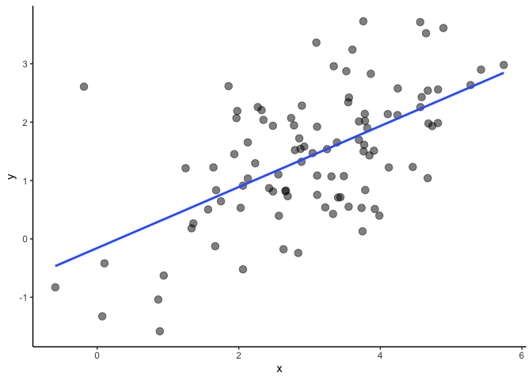
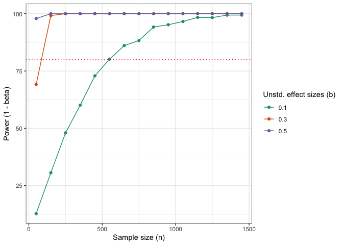
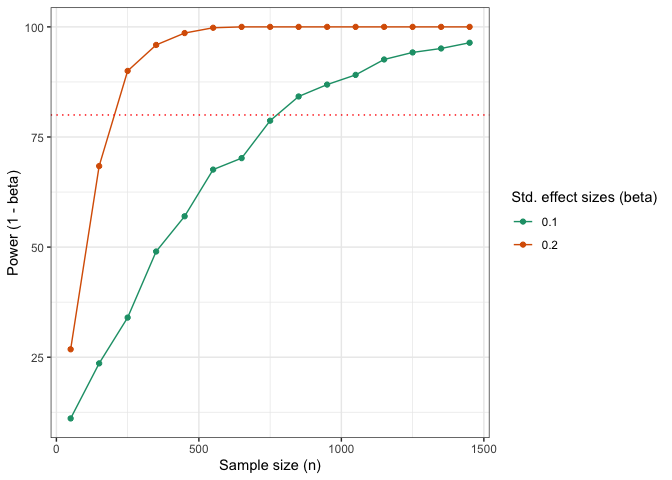

Power Analysis & Simulations: Bivariate Regression
================
Philipp Masur
2022-12

-   <a href="#introduction" id="toc-introduction">Introduction</a>
-   <a href="#power-analyses-using-the-pwr-package"
    id="toc-power-analyses-using-the-pwr-package">Power analyses using the
    <code>pwr</code> package</a>
-   <a href="#power-analyses-using-monte-carlo-simulations"
    id="toc-power-analyses-using-monte-carlo-simulations">Power analyses
    using Monte Carlo Simulations</a>
    -   <a href="#unstandardized-effect-sizes"
        id="toc-unstandardized-effect-sizes">Unstandardized effect sizes</a>
-   <a href="#standardized-effect-sizes"
    id="toc-standardized-effect-sizes">Standardized effect sizes</a>
-   <a href="#references" id="toc-references">References</a>

# Introduction

> “The power of a statistical test is the probability that it will yield
> statistically significant results. Since statistical significance is
> so earnestly sought and devoutly wished for by behavioral scientists,
> one would think that the a priori probability of its accomplishment
> would be routinely determined and well understood. Quite surprisingly,
> this is not the case. Instead, if we take as evidence the research
> literature, we find evidence that statistical power is frequenty not
> understood and, in reports of research where it is clearly relevant,
> the issue is not addressed.”

*Cohen, 1988, p. 1*

Whenever we engage in confirmatory research, we should engage a priori
power analyses. By developing informed assumptions about how the effect
of interest might look like, we can design a better study and also
calculate the necessary sample size to increase the probability of
obtaining a statistically significant result if the effect truly exists.
However, calculating the necessary sample size can be easy, even
trivial, or it can be really complex and at times feel like it is
impossible. Any power analysis thereby involves the following concepts:

-   the effect size (can be standardized or unstandardized)
-   sample size
-   the significance level (alpha error; usually 5%)
-   the power (1 - beta error, often 80% or 95%)
-   the type of analysis that is chosen

Whenever, we know four of them, we can compute the remaining one. For
example, if we have the sample size (e.g., n = 100), the significance
level (5%), the desired power (80%) and we know the type of analysis
(e.g., a bivariate regression analysis), we can compute the smallest
effect size that we can still find to be statistically significant if
the relationship is actually exisiting (in this cases: r = .28). Vice
versa, we can compute the necessary sample size for being able to test
an assumed effect size (e.g., r = .10) given the significance level
(5%), power (80%) and the type of analysis (regression analysis). In
this case, the necessary sample size would be n = 782. Whereas the
former is often called a “sensitivity analysis” and is mostly conducted
a posterori, the latter corresponds to an “a priori power analysis”
whose aim it is to justify a certain sample size before the data is
collected.

But how can we do this in R? And why is it sometimes worthwhile to
simulate different scenarios? In this tutorial, we will discuss a priori
power analyses for bivariate regression analyses. We will first learn
how this can be achieved mathematically using the package `pwr`, but
then explore a bit more in-depth how this can be achieved using Monte
Carlo Simulation techniques.

# Power analyses using the `pwr` package

For simple analyses, we can often solve the above described challenge of
computing the necessary sample size mathematically. In R, we have the
package `pwr`, which provides various functions that can be used for
both sensitivity and power analyses. The function `pwr.r.test()`, for
example, allows us to compute the necessary sample size for standardized
effect sizes (*r* or
)
in bivariate regression analyses.

Let’s imagine that we want to conduct a survey to investigate the
relationship between social media use and well-being. The first step is
quantifying our assumption about the strength of the potential effect
(e.g., is the effect rather small or rather strong?). If we are unsure,
we may want to define a smallest effect size of interest (SESOI), which
we deem still relevant enough to support our hypotheses (e.g., the more
social media use leads to less well-being). In this case, I chose r = .1
as I deem anything below this typical threshold would be too small to
support this hypothesis (a fairly vague assumption).

``` r
# Load package
library(pwr)

# Estimate necessary sample size
pwr.r.test(r = .1,                      # Assumed effect size
           sig.level = .05,             # alpha error
           power = .80,                 # Power (1 - beta error) 
           alternative = "two.sided")   # Type of test
```

    ## 
    ##      approximate correlation power calculation (arctangh transformation) 
    ## 
    ##               n = 781.7516
    ##               r = 0.1
    ##       sig.level = 0.05
    ##           power = 0.8
    ##     alternative = two.sided

As we can see, we would need 782 participants to test this effect with a
power of 80% given a significance level of .05 and when using a
two-sided hypothesis test.

Now, bear in mind, that we can use the same function also the other way
around. Let’s imagine I have only funds to conduct a study with 500
participants. Now I may want to ask what effect size I can still test
given a power of 80%?

``` r
pwr.r.test(n = 500,
           sig.level = .05,
           power = .80,
           alternative = "two.sided")
```

    ## 
    ##      approximate correlation power calculation (arctangh transformation) 
    ## 
    ##               n = 500
    ##               r = 0.1249027
    ##       sig.level = 0.05
    ##           power = 0.8
    ##     alternative = two.sided

As expected, the resulting effect size is slightly larger (r = .12).
This would mean that I would need to discard any smaller effect sizes
even if they turn out to be significant.

# Power analyses using Monte Carlo Simulations

Sometimes, we may not have a clear idea about the size of the
relationship in standardized terms, but we may have some ideas about how
the variables might look like. In this case, we can also simulate data
and compute power by running thousands of simulations. Another great
aspect of simulating data is that we can explore how different
assumptions affect the outcome. What would the sample size be if the
effect was actually stronger? What would it be if the variance in the
independent variable was larger? Through simulations, we can explore
different assumptions to arrive at an educated justification for our
sample size.

In the following, I will demonstrate an approach that uses the function
`pmap()` from the `tidyverse`. But there are other packages that can
accomplish similar tasks and the good old “for loop” would work here as
well.

## Unstandardized effect sizes

We first need to learn how to simulate data that corresponds to our
assumptions using the function `rnorm()`, which produces normally
distributed vectors. In this case, I simulate data of 100 participants.
They answered a variable `x` which as a mean of 3 and a standard
deviation of 1.2 (values that we may have drawn from prior research or
that we base on logical assumptions; here e.g., a mean indice based on
5-point Likert-type items). They also answered a variable `y` which is
positively related to `x` in such a way that a 1-unit increase in `x`
leads to a b = .5 increase in `y`. This is our assumption about the
unstandardized effect size. We further assume a standard deviation of 1
for `y`. We can quickly plot the relationship and also run a simple
regression analysis to check whether the resulting coefficient matches
our assumptions.

``` r
# Load package
library(tidyverse)

# To ensure reproducibility
set.seed(42)

# Simulate data
n <- 100
x <- rnorm(n = n, mean = 3, sd = 1.2)
y <- .5*x + rnorm(n = n, mean = 0, sd = 1)
head(tibble(x, y))
```

|        x |         y |
|---------:|----------:|
| 4.645150 | 3.5235404 |
| 2.322362 | 2.2059322 |
| 3.435754 | 0.7146684 |
| 3.759435 | 3.7281995 |
| 3.485122 | 1.0757876 |
| 2.872651 | 1.5418391 |

``` r
# Plot relationship
ggplot(NULL, aes(x, y)) +
  geom_point(alpha = .5, size = 3) +
  theme_classic() +
  geom_smooth(method = "lm", se = F)
```

<!-- -->

``` r
# Check regression
summary(lm(y~x))
```

    ## 
    ## Call:
    ## lm(formula = y ~ x)
    ## 
    ## Residuals:
    ##      Min       1Q   Median       3Q      Max 
    ## -1.88842 -0.50664  0.01225  0.54106  2.86240 
    ## 
    ## Coefficients:
    ##             Estimate Std. Error t value Pr(>|t|)    
    ## (Intercept) -0.15626    0.23988  -0.651    0.516    
    ## x            0.52263    0.07305   7.154 1.54e-10 ***
    ## ---
    ## Signif. codes:  0 '***' 0.001 '**' 0.01 '*' 0.05 '.' 0.1 ' ' 1
    ## 
    ## Residual standard error: 0.9083 on 98 degrees of freedom
    ## Multiple R-squared:  0.3431, Adjusted R-squared:  0.3364 
    ## F-statistic: 51.18 on 1 and 98 DF,  p-value: 1.541e-10

Because it is a simulation, the resulting coefficient is very close to
the effect we coded into the simulation, but it is not perfect. For our
purposes, however, it is good enough. It is important to understand that
the function `rnorm()` samples a vector of length `n` from the normal
distribution. As such, the process corresponds to sampling from a
population in which the parameter are assumend to be fixed.

We can use the code created above to create function which simulates
data in a similar way and directly computes the regression and extracts
the p-value. As arguments, we include sample size (n) and effect size
(b).

``` r
# Create a funtion that simulates data
sim_reg <- function(n = 100, b = .5){
  
  x <- rnorm(n = n, mean = 3, sd = 1.2)
  y <- b*x + rnorm(n = n, mean = 0, sd = 1)
  
  broom::glance(summary((lm(y ~ x))))$p.value
}

# Check
sim_reg()
```

    ##        value 
    ## 4.334476e-09

Now we can create a grid that corresponds to the combinations of
parameters that we want to explore. In this case, we want to compute the
above function for sample sizes ranging from 50 to 1500 and for the
effect sizes .1, .3. and .5. Each combinations, we run 1,000 times (for
a really stable solution, we should actually run it 10,000 times, but we
keep it smaller to save time). The actual simulation that happens within
a `mutate()`-command that incorporates a `pmap()` function. This
function basically computes the `sim_reg()` that we computed above for
each row of the grid and taking the columns as input.

``` r
# Run simulations
results <- expand_grid(n = seq(50, 1500, by = 100),  # Sample sizes
                       b = c(.1, .3, .5),            # Effect sizes 
                       times = 1:1000) %>%           # Number of simulations per combination 
  dplyr::select(-times) %>%
  mutate(pmap_df(., sim_reg))

# Check results
head(results)
```

|   n |   b |     value |
|----:|----:|----------:|
|  50 | 0.1 | 0.0563342 |
|  50 | 0.1 | 0.1126772 |
|  50 | 0.1 | 0.2324577 |
|  50 | 0.1 | 0.7701515 |
|  50 | 0.1 | 0.0828229 |
|  50 | 0.1 | 0.5950469 |

The resulting data frame includes now the p-value that results from the
bivariate regression analysis in each row. To gain a better
understanding of the results, we should plot so-called power curves. We
first compute a new variable `sig` that tells us whether the
relationship was significant (based on p \< .05) and then count the
number of times it became significant per combination in the grid. We
then compute curves by using `geom_point()` and `geom_line()`. We add a
horizontal line at 80% power so that we can see when the curves reach
sufficient power.

``` r
# Plot power curves
results %>%
  mutate(sig = ifelse(value < .05, TRUE, FALSE)) %>%
  group_by(n, b) %>%
  summarize(power = (sum(sig)/length(sig))*100) %>%
  ggplot(aes(x = n, y = power, color = factor(b))) +
  geom_point() +
  geom_line() +
  geom_hline(yintercept = 80, linetype = "dotted", color = "red") +
  scale_color_brewer(palette = "Dark2") +
  theme_bw() +
  labs(x = "Sample size (n)", y = "Power (1 - beta)", 
       color = "Unstd. effect sizes (b)")
```

<!-- -->

As we can see, we would already have sufficient power to test larger
effects of .5 with small sample sizes. For an effect of .3, we would
need around 75 participants to achieve a power of 80%. Finally, if the
effect was only .1, we would need around 500 participants to achieve a
power of 80%.

# Standardized effect sizes

The example above is interesting if we want to compute power for
unstandardized effects. Yet, this requires us to make assumptions about
the variables’ variance. Can we also use simulations, but assume
standarized effect sizes? Yes, we can! In this case, we need to base our
simulation on the variance-covariance matrix and then simulate a
multivariate normalöy distributed data. This can be achieved with the
package `MASS` and its function `mvrnorm()`. We first set the beta
coefficient to our desired strenght
(e.g. ).
Then, we build the variance-covariance matrix and simulate that data.

``` r
# Load packages
library(MASS)

# Set parameters
n <- 500
beta <- 0.2
means <- c(x = 0, y = 0)

# Covariance matrix
sigma <- matrix(
  c(1, beta, 
    beta, 1),
  ncol = 2
)

# Simulate corresponding data
d <- mvrnorm(n, means, sigma) %>%
  as_tibble

# Check result
lm(y~x, d)
```

    ## 
    ## Call:
    ## lm(formula = y ~ x, data = d)
    ## 
    ## Coefficients:
    ## (Intercept)            x  
    ##     0.09929      0.21881

As we can see, close to the assumed effect size without specifying
variances of the variables. Let’s again, wrap this in a function that
also extracts that p-value and iterate across meaningful combinations of
the parameters. Finally, we can again plot power curves that should help
to make a meaningful decision about the necessary sample size.

``` r
sim_cor <- function(n = 100, beta = .2) {
  
  means <- c(x = 0, y = 0)
  sigma <- matrix(
    c(1, beta, 
      beta, 1),
    ncol = 2
  )
  
  d <- mvrnorm(n, means, sigma) %>%
    as_tibble

  broom::glance(summary((lm(y ~ x, d))))$p.value
  
}

# Run simulations
results <- expand_grid(n = seq(50, 1500, by = 100),  # Sample sizes
                       beta = c(.1, .2),       # Effect sizes 
                       times = 1:1000) %>%           # Number of simulations per combination
  dplyr::select(-times) %>%
  mutate(pmap_df(., sim_cor))

# Check results
head(results)
```

|   n | beta |     value |
|----:|-----:|----------:|
|  50 |  0.1 | 0.2143030 |
|  50 |  0.1 | 0.0821555 |
|  50 |  0.1 | 0.6027225 |
|  50 |  0.1 | 0.7262512 |
|  50 |  0.1 | 0.6945968 |
|  50 |  0.1 | 0.7759105 |

``` r
# Plot curves
results %>%
  mutate(sig = ifelse(value < .05, TRUE, FALSE)) %>%
  group_by(n, beta) %>%
  summarize(power = (sum(sig)/length(sig))*100) %>%
  ggplot(aes(x = n, y = power, color = factor(beta))) +
  geom_point() +
  geom_line() +
  geom_hline(yintercept = 80, linetype = "dotted", color = "red") +
  scale_color_brewer(palette = "Dark2") +
  theme_bw() +
  labs(x = "Sample size (n)", y = "Power (1 - beta)", 
       color = "Std. effect sizes (beta)")
```

<!-- -->

Here, we see that for a standardized effect size of
,
we would need between 250 and 350 participants to reach a power of 80%.
In contrast, for an effect size of
,
we would need between 750 and 850 participants. In fact, in the
beginning, we used the package `pwr` to compute the necessary sample
size for r = .2 and it turn out to be 782 participants. As we simulated
the power only for sample sizes 50, 150, 250, 350, and so on), we do not
gain very precise results. Yet, if we would lower the steps between
sample sizes, the simulations would slowly converge towards the
analytical solutions.

# References

Cohen, J. (1988). Statistical power analysis for the behavioral
sciences. Routledge.
