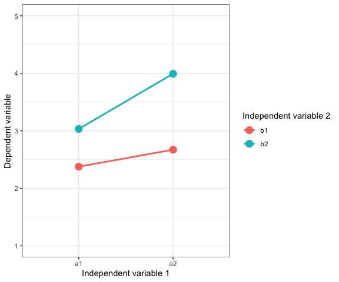
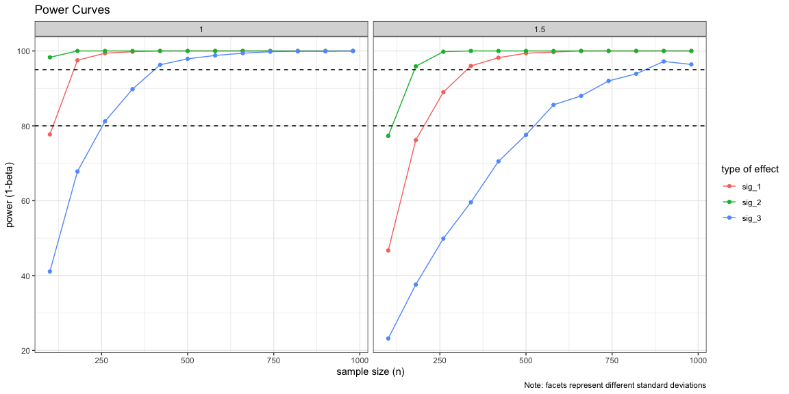

Power Analysis & Simulations: 2x2 Experimental Designs
================
Philipp Masur
2022-12

-   <a href="#introduction" id="toc-introduction">Introduction</a>
-   <a href="#simulate-power-for-2x2-designs"
    id="toc-simulate-power-for-2x2-designs">Simulate power for 2x2
    designs</a>
    -   <a href="#simulate-data" id="toc-simulate-data">Simulate data</a>
    -   <a href="#prepare-and-run-simulation"
        id="toc-prepare-and-run-simulation">Prepare and run simulation</a>
    -   <a href="#specify-simulation-parameters"
        id="toc-specify-simulation-parameters">Specify simulation parameters</a>
    -   <a href="#run-simulation" id="toc-run-simulation">Run simulation</a>
-   <a href="#results" id="toc-results">Results</a>
    -   <a href="#summary" id="toc-summary">Summary</a>
    -   <a href="#power-curves" id="toc-power-curves">Power curves</a>

# Introduction

This is the third tutorial in a series on power analyses for various
designs. Here, we explore the benefits of simulating power in the
context of 2x2 (or 2x3 and so on) between-person exprimental designs,
where it is often difficult to work with standardized effect sizes and
thus hard to calculate a necessary sample size analytically. The basic
procedure for such simulations is always the same:

1.  Make assumptions about the mean differences and standard deviations

2.  Simulate data that aligns with these assumptions(e.g., 1000 times)

3.  Test the effect(s) of interest in all iterations

4.  Extract p-values and count times the effect becomes significant (=
    power)

# Simulate power for 2x2 designs

For this tutorial, we need the package collection `tidyverse()` and the
package `MonteCarlo`, which provides a nice interface for running Monte
Carlo Simulations.

``` r
library(tidyverse)
library(MonteCarlo)
```

## Simulate data

First, we let’s simulate some data that corresponds to a typical
experimental design.

``` r
# Ensure reproducibility
set.seed(42)

# Define parameters
n <- 500
means <- c(2.5, 2.75, 3, 4)  # a1b1, a2b1, a1b2, a2b2
sd <- 1

# Simulate data
dv <- rnorm(n, mean = means , sd = sd) %>% round(0)
iv1 <- rep(c("a1", "a2"),each = 1, n/2)
iv2 <- rep(c("b1", "b2"), each = 2, n/4)
d <-data.frame(dv, iv1, iv2)


# Check data simulation
d %>%
  group_by(iv1, iv2) %>%
  summarise(m = mean(dv)) %>%
  ggplot(aes(x = factor(iv1), y = m, color = iv2, group = iv2)) +
  geom_point(size = 4) +
  geom_line(size = 1) +
  ylim(1, 5) +
  theme_bw() +
  labs(y = "Dependent variable", x = "Independent variable 1",
       color = "Independent variable 2")
```

<!-- -->

## Prepare and run simulation

Next, we put this code in a function that thus simulates the data, fits
the models, extracts p-values, and the significance (based on p \< .05).
This function will be passed to a grid of possible parameters.

``` r
# Simulation function
sim_func <- function(n = 400, 
                     means = c(2.5, 2.75, 3, 4),
                     sd = 1) {
  
  # Simulate data
  dv <- round(rnorm(n, mean = means , sd = sd),0)
  iv1 <- rep(c("a1", "a2"),each = 1, n/2)
  iv2 <- rep(c("b1", "b2"), each = 2, n/4)
  d <-data.frame(dv, iv1, iv2)
  
  # Fit models
  fit1 <- lm(dv ~ iv1, d)     # Main effet of IV1
  fit2 <- lm(dv ~ iv2, d)     # Main effect of IV2
  fit3 <- lm(dv ~ iv1*iv2, d) # Interaction between both
  
  # Extract p-values and compute significance
  p_1 <- summary(fit1)$coef[2,4]
  sig_1 <- ifelse(p_1 < .05, TRUE, FALSE)
  p_2 <- summary(fit2)$coef[2,4]
  sig_2 <- ifelse(p_2 < .05, TRUE, FALSE)
  p_3 <- summary(fit3)$coef[4,4]
  sig_3 <- ifelse(p_3 < .05, TRUE, FALSE)
  

  # return values as list
  return(list("p_1" = p_1,
              "sig_1" = sig_1,
              "p_2" = p_2,
              "sig_2" = sig_2,
              "p_3" = p_3,
              "sig_3" = sig_3))
}

# check
sim_func()
```

    ## $p_1
    ## [1] 2.116913e-09
    ## 
    ## $sig_1
    ## [1] TRUE
    ## 
    ## $p_2
    ## [1] 1.669046e-11
    ## 
    ## $sig_2
    ## [1] TRUE
    ## 
    ## $p_3
    ## [1] 0.0003585762
    ## 
    ## $sig_3
    ## [1] TRUE

## Specify simulation parameters

Now, we create a list that defines how the parameters, in this case the
sample size and the standard devations, should vary.

``` r
n_grid <- seq(100, 1000, 80) 
sd_grid <- c(1, 1.5) 

# Collect simulation parameters in list
(param_list <- list("n" = n_grid,
                    "sd" = sd_grid))
```

    ## $n
    ##  [1] 100 180 260 340 420 500 580 660 740 820 900 980
    ## 
    ## $sd
    ## [1] 1.0 1.5

## Run simulation

Now, we can run the actual simulation using the function `MonteCarlo()`,
which requires us to specify the function (created above), the number of
iterations per combinations of the parameters, the number of cores we
want to use (we can parallelize here, which saves a lot of time!), and
the parameter list. Here, we use 1,000 runs per combination (this may
take a bit of time).

``` r
result <- MonteCarlo(func = sim_func,             # pass test function
                     nrep = 1000,                 # number of tests
                     ncpus = 4,                   # number of cores to be used
                     param_list = param_list)     # provide parameters
```

We can use the function `MakeFrame()` to transform the results into a
data frame.

``` r
# Create result data frame
df <- MakeFrame(result)
head(df)
```

|   n |  sd |       p_1 | sig_1 |       p_2 | sig_2 |       p_3 | sig_3 |
|----:|----:|----------:|------:|----------:|------:|----------:|------:|
| 100 |   1 | 0.0024508 |     1 | 0.0012429 |     1 | 0.0003476 |     1 |
| 180 |   1 | 0.0008330 |     1 | 0.0000537 |     1 | 0.5703521 |     0 |
| 260 |   1 | 0.0000035 |     1 | 0.0000000 |     1 | 0.0110188 |     1 |
| 340 |   1 | 0.0000000 |     1 | 0.0000000 |     1 | 0.0009279 |     1 |
| 420 |   1 | 0.0000080 |     1 | 0.0000000 |     1 | 0.0002008 |     1 |
| 500 |   1 | 0.0000000 |     1 | 0.0000000 |     1 | 0.0154429 |     1 |

As we can see, the data frame now includes the parameters (n, sd) and
the p-values and significane (true, false) related to all three effects
that we were interested in.

# Results

## Summary

We can now have a look at the results (e.g., by summarising the power
across the different specifications). We do so by counting the times the
effects become significant.

``` r
# Power in each combination
df %>%
  dplyr::select(-contains("p")) %>%
  gather(key, value, -n, -sd) %>%
  group_by(n, sd, key) %>%
  summarize(power = (sum(value)/length(value))*100) %>%
  head()
```

    ## # A tibble: 6 × 4
    ## # Groups:   n, sd [2]
    ##       n    sd key   power
    ##   <dbl> <dbl> <chr> <dbl>
    ## 1   100   1   sig_1  77.7
    ## 2   100   1   sig_2  98.3
    ## 3   100   1   sig_3  41.1
    ## 4   100   1.5 sig_1  46.7
    ## 5   100   1.5 sig_2  77.3
    ## 6   100   1.5 sig_3  23.2

## Power curves

Most importantly, we can plot so-called power curves that tell us how
much power we achieve (on average) for each specification. This helps to
decide for an appropriate sample size.

``` r
df %>%
  dplyr::select(-contains("p")) %>%
  gather(key, value, -n, -sd) %>%
  group_by(n, sd, key) %>%
  summarize(power = sum(value)/10) %>%
  ggplot(aes(x = n, y = power, color = key)) +
  geom_line() +
  geom_point() +
  geom_hline(yintercept = 80, linetype = "dashed") +
  geom_hline(yintercept = 95, linetype = "dashed") +
  facet_wrap(~sd) +
  theme_bw() +
  labs(title = "Power Curves",
       x = "sample size (n)", 
       y = "power (1-beta)", 
       color = "type of effect",
       caption = "Note: facets represent different standard deviations")
```

<!-- -->

As we can see, the main effects (sig_1, sig_2) require less sample size,
but the interaction (blue) require quite a lot of participants to
achieve enough power. Differences in standard deviations further affect
the outcome considerably.
