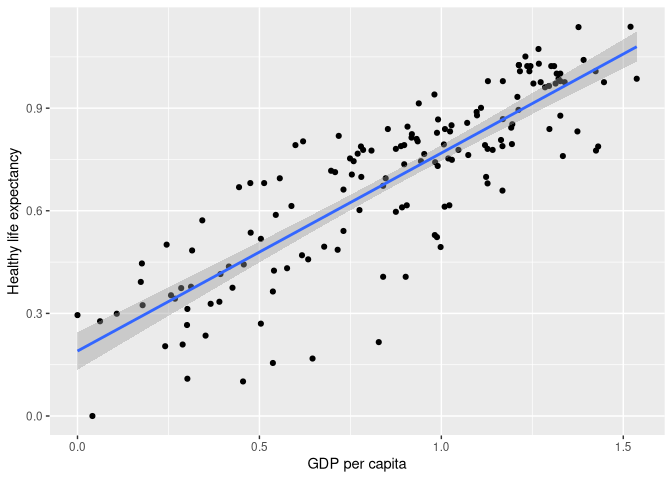
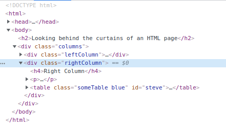

Web Scraping with RVest
================
Kasper Welbers, Wouter van Atteveldt & Philipp Masur
2021-12

-   [Video tutorial](#video-tutorial)
-   [What is web scraping and why learn
    it?](#what-is-web-scraping-and-why-learn-it)
    -   [Web scraping in a nutshell](#web-scraping-in-a-nutshell)
    -   [How to read this tutorial](#how-to-read-this-tutorial)
-   [Web scraping HTML pages in three
    steps](#web-scraping-html-pages-in-three-steps)
    -   [A short intro to HTML](#a-short-intro-to-html)
    -   [Selecting HTML elements](#selecting-html-elements)
    -   [Selecting descendants (children, children’s children,
        etc.)](#selecting-descendants-children-childrens-children-etc)
    -   [Extracting data from elements](#extracting-data-from-elements)
-   [Two demo cases](#two-demo-cases)
    -   [Scraping single pages: An actor profile from
        IMDB](#scraping-single-pages-an-actor-profile-from-imdb)
        -   [Putting it all together](#putting-it-all-together)
    -   [Scraping an archive: all actor profiles for a
        movie](#scraping-an-archive-all-actor-profiles-for-a-movie)
        -   [looping over the URLs](#looping-over-the-urls)
        -   [Putting it all together](#putting-it-all-together-1)
-   [Bonus. Doing it more elegantly](#bonus-doing-it-more-elegantly)
    -   [making functions for the main scraper
        components](#making-functions-for-the-main-scraper-components)
    -   [Building a scraper using the
        functions](#building-a-scraper-using-the-functions)
-   [FAQs](#faqs)
    -   [The *inspect* tool is lying! it shows stuff that’s not in the
        HTML
        code](#the-inspect-tool-is-lying-it-shows-stuff-thats-not-in-the-html-code)
    -   [Wait, is this even allowed?](#wait-is-this-even-allowed)

# Video tutorial

This tutorial also has a video version, so if that’s your cup of tea,
check it out [here](https://www.youtube.com/watch?v=9GR26Y4z_v4)

# What is web scraping and why learn it?

The internet is a veritable data gold mine, and being able to mine this
data is a valuable skill set. In this tutorial we will be looking at a
technique called **web scraping**, which can greatly expand your horizon
in terms of what data you will be able to collect.

To put this into perspective, let’s distinguish three general ways to
gather online data. In the most straightforward situation, you can just
**download** some data, for instance as a CSV or JSON file. This is
great if it’s possible, but alas, there often is no download button.
Another convenient situation is that some platforms have an **API**. For
example, Twitter has an API where one can collect tweets for a given
search term or user. But what if you encounter data that can’t be
downloaded, and for which no API is available? In this case, you might
still be able to collect it using **web scraping**.

A simple example is a table on a website. This table might practically
be a data.frame, with nice rows and columns, but it can be hassle to
copy this data. A more elaborate example could be that you want to
gather all user posts on a web forum, or all press releases from the
website of a certain organization. You could technically click your way
through the website and copy/paste each item manually, but you (or the
people you hire) will die a little inside. Whenever you encounter such a
tedious, repetitive data collection task, chances are good you can
automate it with a web scraper!

In addition to being a very useful technique, I would furthermore
emphasize that web scraping is an excellent way to learn about R and
programming. When students ask how to approach become better in R (or
Python, or whatever), our first recommendation is to simply to spend
time with it on fun and/or rewarding tasks that intrinsically motivate
you. Web scraping is rather ideal in this regard. It touches upon
various useful programming skills, has an engaging puzzle-like element
in trying to conquer websites, and collecting your own novel data set
that you could use is pretty awesome. I mean, It’s literally building a
robot to do work for you! How cool is that?

## Web scraping in a nutshell

In this tutorial we will be using the `rvest` package (to **ha-rvest**
data). This is a neat little package developed by the venerable Hadley
Wickham (aka the mastermind behind the `tidyverse`). And in true
tidyverse fashion it makes web scraping really intuitive. Check out this
small piece of code that scrapes the world happiness report from
Wikipedia and shows the relationship between wealth and life expectancy.

``` r
library(rvest)
library(tidyverse)

url = "https://en.wikipedia.org/wiki/World_Happiness_Report"

## import table from the Wikipedia url
happy_table = read_html(url) %>%
  html_element(".wikitable") %>% 
  html_table()

## Plot relationship wealth and life expectancy
ggplot(happy_table, aes(x=`GDP per capita`, y=`Healthy life expectancy`)) + 
  geom_point() + geom_smooth(method = 'lm')
```

<!-- -->

The scraping part is really just the short pipe there! With
`read_html(url)`, we visit the Wikipedia page. Then
`html_element(".wikitable")` searches this website to find any elements
called ‘wikitable’, and `html_table()` imports this table as a data
frame.

*As an exercise, you could try the same thing for other Wikipedia pages
with tables. Just replace the url and change the columns for the x and y
axis in gglot*

If you happen to know a bit about HTML, you might realize that
`html_element(".wikitable")` just uses CSS to select the (first) element
with the .wikitable class. If so, congratulations, you now basically
know web scraping! If not, don’t worry! You really only need to know
very little about HTML to use web scraping. We’ll cover this in the next
section.

Off course, this is just a simple example. If you need to scrape all
press releases from a website, you will need more steps and some
additional functions from the `rvest` package. But take a minute to
think how this does cover the key logic. If we would want to scrape all
press releases from a website, our first step would be to find an
archive on the website that contains links to the press releases. We
would read this archive with `read_html()`, and then use
`html_elements()` to look for all HTML elements that contain the links.
Then for each link, we can again use `read_html()` to read the data, and
look for all HTML elements of the press release that we want to collect
(e.g., title, date, body).

## How to read this tutorial

Off course, it makes most sense to just read this thing from start to
finish. However, we’ll go through quite a lot of details before we get
to the actual scraping. If you’re the type of person that rather sees
something in action first, or want to see what scraping can do before
you decide to learn the details, you can also skip straight to the demo
cases section.

# Web scraping HTML pages in three steps

In this tutorial we focus on web scraping of HTML pages, which covers
the vast majority of websites. The general workflow then covers three
steps:

-   **Reading HTML pages into R**. This step is by far the easiest. With
    `rvest` we simply use the `read_html()` function for a given URL. As
    such, you now already learned this step (one down, two to go!).
-   **Selecting HTML elements from these pages**. This step is the most
    involved, because you need to know a bit about HTML. But even if
    this is completely new to you, you’ll be able to learn the most
    important steps within a good hour or so.
-   **Extracting data from these elements**. This step is again quite
    easy. `rvest` has some nice, intuitive functions for extracting data
    from selected HTML elements.

In this section we’ll start with a **short introduction to HTML**, using
an example web page that we made for this tutorial. Then we’ll cover
**selecting HTML elements** and \*\*extracting data from HTML
elements\*.

## A short intro to HTML

The vast majority of the internet users **HTML** to make nice looking
web pages. Simply put, HTML is a markup language that tells a browser
what things are shown where. For example, it could say that halfway on
the page there is a table, and then tell what data there is in the rows
and columns.

In other words, HTML is the language that web developers use to display
**data** as a **web page** that’s nice for human interpretation. With
web scraping, we’re basically translating the **web page** back into
**data**. You really don’t need a deep understanding of HTML to do this,
but it’s convenient to understand the main ideas.

To get a feel for HTML code, open [this link
here](https://bit.ly/3lz6ZRe) in your web browser. Use Chrome or Firefox
if you have it (not all browsers let you *inspect elements* as we’ll do
below). You should see a nicely formatted document. Sure, it’s not very
pretty, but it does have a big bold title, and two ok-ish looking
tables.

The purpose of this page is to show an easy example of what the HTML
code looks like. If you right-click on the page, you should see an
option like *view page source*. If you select it you’ll see the entire
HTML source code. This can seem a bit overwhelming, but don’t worry, you
will never actually be reading the entire thing. We only need to look
for the elements that we’re interested in, and there are some nice
tricks for this. For now, let’s say that we’re interested in the table
on the left of the page. Somewhere in the middle of the code you’ll find
the code for this table.

    <table class="someTable" id="exampleTable">           <!-- table                -->
        <tr class="headerRow">                            <!--    table row         -->
            <th>First column</th>                         <!--       table header   -->
            <th>Second column</th>                        <!--       table header   -->
            <th>Third column</th>                         <!--       table header   -->
        </tr>
        <tr>                                              <!--    table row         -->
            <td>1</td>                                    <!--       table data     -->
            <td>2</td>                                    <!--       table data     -->
            <td>3</td>                                    <!--       table data     -->
        </tr>
        <tr>                                              <!--    table row         -->
            <td>4</td>                                    <!--       table dat      -->
            <td>5</td>                                    <!--       table dat      -->
            <td>6</td>                                    <!--       table data     -->
        </tr>
    </table>

This is the HTML representation of the table, and it’s a good showcase
of what HTML is about. The parts after the `<!--` are not part of the
HTML code, but comments to help you see the structure. First of all,
notice that the table has this *family tree* like shape. At the highest
level we have the `<table>`. This table has three **table rows**
(`<tr>`), which we can think of as it’s **children**. Each of these rows
in turn also has three **children** that contain the data in these rows.

Let’s see how we can tell where the table starts and ends. The **table**
starts at the opening tag `<table>`, and ends at the closing tag
`</table>` (the `/` always indicates a closing tag). This means that
everything in between of these tags is part of the table. Likewise, we
see that each **table row** opens with `<tr>`, and closes with `</tr>`,
and everything between these tags is part of the row. In the first row,
these are 3 *table headers* `<th>`, which contain the column names. The
second and third row each have 3 *table data* `<td>`, that contain the
data points.

Each of these components can be thought of as an **element** (more
strictly a **node**, but the distinction can be ignored for now). And
each of these elements can be selected with the `html_element` function.
Note that our table is `<table class="someTable" id="exampleTable">`. We
can now use the id to select this table (we’ll cover how this works in
the next section)

``` r
## first, read the HTML code for our example HTML page
html = read_html('https://bit.ly/3lz6ZRe')

## select the element where id="exampleTable"
html %>% html_element('#exampleTable') 
```

The output looks a bit messy, but what it tells us is that we have
selected the `<table>` html element/node. It also shows that this
element has the three table rows (tr) as children, and shows the values
within these rows.

*Note that since this is a table element, you could also use
`html_table` like we did above to extract the data.*

HTML always has this tree structure. In this case we saw that the table
has rows, and these rows have values. But if we view the example page we
also see that our page has columns, and these columns have text. Let’s
now select the column on the right, and then extract this text.

To select this column, we first need to know a bit about it. This time,
instead of looking it up in the raw code, we’ll use the **inspect
element** feature of your browser. Note that not all browsers might have
this feature (or it might be disabled). If you can’t find it, it can be
worthwhile to install Google Chrome, because you’ll really like this
feature!! With it, you can right click on any part of a webpage, and
then select **inspect** to inspect the element!

<center>


</center

This will open a sidebar in which you see the HTML code, but focused on that element. 

<center>



</center>

When you hover your mouse over the elements they light up on the page,
so you can directly see the correspondence between the code and the
page. The tree structure is also made more obvious by allowing you to
fold and unfold elements by clicking on the triangles on the left. This
is a great tool for web scraping, because it allows you to quickly
identify the HTML elements that you want to select.

In our case, we now see that the right column is specified as a `div`
with `class="rightColumn"`. We can now select this column by selecting
the div element with this class (more on this in the next section).

``` r
html %>% html_element('div.rightColumn') 
```

    ## {html_node}
    ## <div class="rightColumn">
    ## [1] <h4>Right Column</h4>
    ## [2] <p>Here's another column! The main purpose of this column is just to show ...
    ## [3] <table class="someTable blue" id="steve">\n<tr class="headerRow">\n<th>nu ...

We can extract the text with the `html_text2` function (more on this
below).

``` r
text = html %>% 
  html_element('div.rightColumn') %>%
  html_text2()

cat(text)  ## (cat just prints the text more nicely)
```

    ## Right Column
    ## 
    ## Here's another column! The main purpose of this column is just to show that you can use CSS selectors to get all elements in a specific column.
    ## 
    ## numbers  letters 
    ## 1    A   
    ## 2    B   
    ## 3    C   
    ## 4    D   
    ## 5    E   
    ## 6    F   

## Selecting HTML elements

The `rvest` package supports two ways for selecting HTML elements. The
first and default approach is to use **CSS selectors**. CSS is mostly
used by web developers to *style* web pages[1], but it works just as
well for scraping. The second approach is to use **xpath**. This is a
bit more flexible, but it’s also harder to read and write. For sake of
simplicity we’ll only cover CSS selectors, which is often all you need.

There are quite a lot of [CSS
selectors](https://www.w3schools.com/cssref/css_selectors.asp) and we
won’t cover all of them. Here are the most common ones you’ll need for
web scraping. You can always look up the other ones, but these are good
to know by heart.

| selector      | example           | Selects                                                |
|---------------|-------------------|--------------------------------------------------------|
| element/tag   | `table`           | **all** `<table>` elements                             |
| class         | `.someTable`      | **all** elements with `class="someTable"`              |
| id            | `#steve`          | **unique** element with `id="steve"`                   |
| element.class | `tr.headerRow`    | **all** `<tr>` elements with the `someTable` class     |
| class1.class2 | `.someTable.blue` | **all** elements with the `someTable` AND `blue` class |

We can use these `CSS selectors` in `rvest` with the `html_element` and
`html_elements` functions. Both work the same way, but `html_element`
only returns **the first** element that meets the criteria, whereas
`html_elements` returns a set with all elements. This is important, but
might be a bit confusing. So let’s just walk through each CSS selector
for both functions to see what it does.

``` r
html = 'https://bit.ly/3lz6ZRe' %>% read_html()

## find any <table> element
html %>% html_element('table')            ## left table 
html %>% html_elements('table')           ## set of both tables

## find any element with class="someTable"
html %>% html_element('.someTable')       ## left table
html %>% html_elements('.someTable')      ## set of both tables

## find any element with id="steve" 
## (only called it steve to show that id can be anything the developer chooses)
html %>% html_element('#steve')           ## right table 
html %>% html_elements('#steve')          ## set with only the right table 

## find any <tr> element with class="headerRow"
html %>% html_element('tr.headerRow')     ## left table first row
html %>% html_elements('tr.headerRow')    ## first rows of both tables

## find any element with class="sometable blue"
html %>% html_element('.someTable.blue')  ## right table    
html %>% html_elements('.someTable.blue') ## set with only the right table    
```

Note that the output of `html_element` is always a `html_node`, and the
output of `html_elements` is always an `xml_nodeset`. This can be a bit
confusing given that we looked for HTML elements, and it’s perfectly
fine for now to just think of an `html_node` as a single element (like a
single table), and of an `xml_nodeset` as just a list of multiple
elements.

Important to remember:

-   `html_element` always returns a single element. If there are
    multiple elements that meet the condition, it will return the first
    element.
-   `html_elements` always returns a list of elements. If there is only
    one element that meets the condition, you’ll just get a list with
    that one element.

Luckily, `rvest` is quite flexible in how it handles single elements and
lists of elements. The functions to extract data from single elements
also work on lists, and then just return a list of data. For example,
this is what happens if we use the `html_table()` function on a list of
tables.

``` r
tables = html %>% html_elements('table')
html_table(tables)
```

This also works with the other functions for extracting data that we
discuss below.

## Selecting descendants (children, children’s children, etc.)

Sometimes it’s necessary to select elements via their parent. For
example, imagine you have a website with news articles, and you want to
extract all URLs mentioned in the news article. You can’t just extract
all URLs from the web page, because there are probably many outside of
the article as well. Instead, what you’d do is select the article
element first, and then within that article element you’d look for all
URLs.

Here’s how you’d do it. Let’s take the [Wikipedia page for
hyperlinks](https://en.wikipedia.org/wiki/Hyperlink). And let’s say we
want to get only links from the body of the article (so NOT the ones in
the left column). First, let’s just get all the links. Links are
typically in `<a>` tags, so we’ll get all of them, and then use the
`length()` function to see how many we got.

``` r
'https://en.wikipedia.org/wiki/Hyperlink' %>%
  read_html() %>%
  html_elements('a') %>%
  length()
```

    ## [1] 538

Now let’s do this again, but first selecting only the body. If you
inspect the HTML, you’d find that the body is in an element with the
attributes `<div id="content" class="mb-body" role="main">`. So we can
easily get this with the id selector `#content`. There are two ways to
do this. The most efficient way is to use `#content a` as the CSS
selector. This basically says: first select `#content`, and then within
that select all `<a>`.

``` r
'https://en.wikipedia.org/wiki/Hyperlink' %>%
  read_html() %>%
  html_elements('#content a') %>%
  length()
```

    ## [1] 411

Indeed, we got less links this time, because it worked! The nice thing
about this is that it works for any combination of CSS selectors. This
was a combination of `id` (#content) and `element` (a), but it could
also have been `class element`, `class class` etc. Also, you can
actually string as many together as you like! So if you have an `<a>` in
a `<span>` in a `<div>`, you could look for `div span a`.

The second approach is to use the pipe! The `html_elements` function
doesn’t just work on the entire HTML. It also works on selected
elements. So we could first look for the `#content` element, and then
run `html_elements('a')` on that element.

``` r
'https://en.wikipedia.org/wiki/Hyperlink' %>%
  read_html() %>%
  html_element('#content') %>%
  html_elements('a') %>%
  length()
```

    ## [1] 411

If this is your first run in with CSS and HTML, this might al seem a bit
overwhelming. The good part though: this should cover most of what you
need! With just these CSS selectors, and the option to look for elements
within elements, you now have a super flexible tool for parsing HTML
content. But if you want to learn more about CSS selectors, you could
look through [this
list](https://www.w3schools.com/cssref/css_selectors.asp), or play [this
game](https://flukeout.github.io/#)

## Extracting data from elements

Once you have selected elements, you still need to extract data from
them. `rvest` offers several nice functions to do this. We’ve already
used the `html_table` and `html_text2` functions, but let’s shed a
little more light on them.

The `html_table` function doesn’t really need much more explanation
(right?). Given a table element, it can produce a data frame in R.

The `html_text` and `html_text2` functions both serve to extract text
from an element. They don’t just get the text directly from the element,
but also the text from all its descendants (children, grandchildren,
etc.). The difference between the two is subtle. `html_text` is faster,
but gives you the text as it appears in the html code. For example, look
at this text from the left column of our toy example:

``` r
html = 'https://bit.ly/3lz6ZRe' %>% read_html
html %>% html_element('.leftColumn') %>% html_text()
```

    ## [1] "\n    Left Column\n\n    This is a simple HTML document. Right click on the page and select view page source \n       (or something similar, depending on browser) to view the HTML source code.\n    \n    Alternatively, right click on a specific element on the page and select inspect element. \n       This also shows the HTML code, but focused on the selected element. You should be able to fold \n       and unfold HTML nodes (using the triangle-like thing before the <tags>), and when you hover \n       your mouse over them, they should light up in the browser. Play around with this for a bit to get \n       a feel for exploring HTML code.\n\n    Here's a stupid table.\n    \n    First column                         \n        Second column                        \n        Third column                         \n      1                                    \n        2                                    \n        3                                    \n      4                                    \n        5                                    \n        6                                    \n      "

That’s pretty ugly. See all those ‘\\n’ and empty spaces? That’s because
in the HTML source code the developer added some line breaks and empty
space to make it look better in the code. But in the browser these extra
breaks and spaces are ignored. `html_text2` let’s you get the text as
seen in the browser. In general, you should just use html_text2(), but
note that for huge amounts of data html_text() might be faster.

``` r
html %>% html_element('.leftColumn') %>% html_text2()
```

    ## [1] "Left Column\n\nThis is a simple HTML document. Right click on the page and select view page source (or something similar, depending on browser) to view the HTML source code.\n\nAlternatively, right click on a specific element on the page and select inspect element. This also shows the HTML code, but focused on the selected element. You should be able to fold and unfold HTML nodes (using the triangle-like thing before the <tags>), and when you hover your mouse over them, they should light up in the browser. Play around with this for a bit to get a feel for exploring HTML code.\n\nHere's a stupid table.\n\nFirst column\tSecond column\tThird column\t\n1\t2\t3\t\n4\t5\t6\t"

Another nice function is `html_attr` or `html_attrs`, for getting
attributes of elements. With `html_attrs` we get all attributes. For
example, we can get the attributes of the `#exampleTable`.

``` r
html %>% html_elements('#exampleTable') %>% html_attrs()
```

    ## [[1]]
    ##          class             id 
    ##    "someTable" "exampleTable"

Being able to access attributes is especially useful for scraping links.
Links are typically represented by `<a>` tags, in which the link is
stored as the `href` attribute.

``` r
html %>% html_elements('a') %>% html_attr('href')
```

# Two demo cases

Now that we have the tools to load HTML into R, select HTML elements and
extract data from them, we can go over a few cases to demonstrate web
scraping in practice.

Please note that since these examples use actual websites, they might
break if the websites change. If the code doesn’t work anymore, don’t
judge us too harshly, and please let us know so we can update the
examples.

## Scraping single pages: An actor profile from IMDB

Scraping starts with the ability to scrape information from a single web
page. Often, this involves scraping some specific pieces of this page
that you’re interested in. For news articles, you might want to scrape
the headline, date and body, and maybe also things like author and
section. In this demo we’ll be scraping some basic biography information
of actors from the Internet Movie Data Base (IMDB) This is a huge
database that’s used by many people, so we don’t have to feel too bad
about wasting a tiny bit if it’s bandwidth for these scraping demos.

So how do we approach this? Well, if we look at the page, we see there’s
this nice separate box that contains info such as name, job categories,
where/when born and such. Let’s first just select this box! If you
`right click -> inspect element` it, you’ll see that this box has
`id="name-overview-widget"`. Let’s grab this, and quickly look at the
text to see if we got it right.

``` r
html = read_html('https://www.imdb.com/name/nm0000195/')
  
name_overview = html %>% 
  html_element('#name-overview-widget')

html_text2(name_overview)  
```

    ## [1] "Bill Murray (I) Actor | Writer | Producer STARmeter Top 5000 Down 236 this week View rank on IMDbPro » 1:40 | Clip 140 VIDEOS | 795 IMAGES window.IMDbHeroVideoPreview = { heroVideoPreviewContainerId: \"name_hero_video_preview\", videoId: \"vi1805828889\", videoType: \"Clip\", duration: \"1:40\" }; Bill Murray is an American actor, comedian, and writer. The fifth of nine children, he was born William James Murray in Wilmette, Illinois, to Lucille (Collins), a mailroom clerk, and Edward Joseph Murray II, who sold lumber. He is of Irish descent. Among his siblings are actors Brian Doyle-Murray, Joel Murray, and John Murray. He and most of his ... See full bio » Born: September 21, 1950 in Wilmette, Illinois, USA More at IMDbPro » Contact Info: View agent, publicist, legal on IMDbPro"

Looks pretty good! Now let’s see what we have. The first h1 header in
this box is the name. It’s fairly safe to assume this is always the
first header in this box, so we’ll take it! Note that in the header
there are two `<span>`: one with the name, and one with `(I)`. We could
just get the first one, but maybe the order shifts sometimes? To be
sure, we could also use the fact that the span with the actual item
property has `class="itemprop"`.

``` r
name = name_overview %>% 
  html_element('h1 .itemprop') %>% 
  html_text2()

name
```

    ## [1] "Bill Murray"

Next, let’s get the job categories. There’s this div with
`id="name-job-categories"` just lying there. Inside, there are again
spans with this `itemprop` class. We’ll take them, this time using
`html_elements` (plural) because we want all of them!

``` r
job_categories = name_overview %>% 
  html_elements('#name-job-categories .itemprop') %>%
  html_text2()

job_categories
```

    ## [1] "Actor"    "Writer"   "Producer"

Now for the bio text. Inspect the element of the bio text, and you’ll as
`<div>` with `id="name-bio-text"`. Nice.

``` r
bio = name_overview %>% 
  html_element('#name-bio-text') %>% 
  html_text2()

bio
```

    ## [1] "Bill Murray is an American actor, comedian, and writer. The fifth of nine children, he was born William James Murray in Wilmette, Illinois, to Lucille (Collins), a mailroom clerk, and Edward Joseph Murray II, who sold lumber. He is of Irish descent. Among his siblings are actors Brian Doyle-Murray, Joel Murray, and John Murray. He and most of his ... See full bio »"

Finally, let’s get the birth date and location. There’s a `<div>` with
`id="name-born-info"`. Inside there is a `<time>`, which shows the date
in two ways. One is the date presented as text in the `<a>` tags. But
there’s also a `datetime` attribute which uses a more standardized
format. Let’s get that one.

``` r
born_date = name_overview %>%
  html_element('#name-born-info time') %>% 
  html_attr('datetime')

born_date
```

    ## [1] "1950-9-21"

Now, the location is actually a bit tricky. It’s in a `<a>` tag, but
that’s the third `<a>` tag in the name_born node. We could assume this
is always the case, and then get use `html_elements("a")` and pick the
third. But if we look closer, we see that the structure is (in
simplified form):

    div (id="name-born-info")
      h4
      time
         a (September 21)
         a (1950)
      a (Wilmette, Illinois, USA)

So the other two `<a>` are children of `<time>`, and the `<a>` we want
is the only direct child of div. Here we can use another nice CSS
selector (not mentioned above), which let’s us pick a direct child. The
format is `element > child`.

``` r
born_location = name_overview %>%
  html_element('#name-born-info > a') %>% 
  html_text2()

born_location
```

    ## [1] "Wilmette, Illinois, USA"

### Putting it all together

Ok, so let’s put that all together!

``` r
html = read_html('https://www.imdb.com/name/nm0000195/')
  
name_overview = html %>% html_element('#name-overview-widget')
name = name_overview %>% html_element('h1 .itemprop') %>% html_text2()
job_categories = name_overview %>% html_elements('#name-job-categories .itemprop') %>% html_text2()
bio = name_overview %>% html_element('#name-bio-text') %>% html_text2()
born_date = name_overview %>% html_element('#name-born-info time') %>% html_attr('datetime')
born_location = name_overview %>% html_element('#name-born-info > a') %>% html_text2()
```

And we can then put the data in a tibble. Note that we’ll use
`paste(job_categories, collapse=' | ')` to make a single text out of the
job categories, where each category is separated by `" | "`.

``` r
tibble(name, born_date, born_location, bio,
       job_categories = paste(job_categories, collapse=' | '))
```

| name        | born_date | born_location           | bio                                                                                                                                                                                                                                                                                                                                                                           | job_categories              |
|:------------|:----------|:------------------------|:------------------------------------------------------------------------------------------------------------------------------------------------------------------------------------------------------------------------------------------------------------------------------------------------------------------------------------------------------------------------------|:----------------------------|
| Bill Murray | 1950-9-21 | Wilmette, Illinois, USA | Bill Murray is an American actor, comedian, and writer. The fifth of nine children, he was born William James Murray in Wilmette, Illinois, to Lucille (Collins), a mailroom clerk, and Edward Joseph Murray II, who sold lumber. He is of Irish descent. Among his siblings are actors Brian Doyle-Murray, Joel Murray, and John Murray. He and most of his … See full bio » | Actor \| Writer \| Producer |

## Scraping an archive: all actor profiles for a movie

It’s nice that we can make a scraper to get the pieces of information
that we want from a given web page. However, we’d still need to manually
get the URLs for these pages. It suddenly become a lot more interesting
when we also know how to first scrape these URLs from a webpage, and
then loop over them to SCRAPE THEM ALL (\*evil laughter\*)! The example
given above is that we might get an archive from a news website, get the
links for all news items, and then scrape these.

For this demo we’re going to scrape all actors for a film on IMDB, and
then re-use our code from the first demo to get all their bio data.

We’ll go with [The life aquatic with Steve
Zissou](https://www.imdb.com/title/tt0362270/). On this page we’ll find
a link to the [full
cast](https://www.imdb.com/title/tt0362270/fullcredits?ref_=tt_cl_sm),
with links to their IMDB profiles.

Inspect the **Cast** title, and you’ll see that below it there’s a
`<table class="cast_list">`. In other words:

``` r
html = read_html('https://www.imdb.com/title/tt0362270/fullcredits?ref_=tt_cl_sm')
html %>% html_element('.cast_list') %>% html_table()
```

Ok, pretty sweet. It doesn’t give us the URLs though, so let’s see where
they are. In each row (`<tr>`) there are four data elements (`<td>`):
the picture, the actor name, some seemingly useless ellipsis (…) and the
character name. Both the picture and actor name also have links to the
bio page. We’ll just use the picture, because that one has a clear
`class="primary_photo"`.

So we have a table with class `cast_list`, and in this table there are
rows with class `primary_photo`, and within these rows there is the
`<a>` tag. We can look for this pattern in one go. Then, we’ll extract
the `href` attribute that has the link.

``` r
bio_urls = html %>% html_elements('.cast_list .primary_photo a') %>% html_attr('href')
head(bio_urls, 5)  # show just first 5 
```

    ## [1] "/name/nm0000195/?ref_=ttfc_fc_cl_i1" "/name/nm0005562/?ref_=ttfc_fc_cl_i2"
    ## [3] "/name/nm0000949/?ref_=ttfc_fc_cl_i3" "/name/nm0001378/?ref_=ttfc_fc_cl_i4"
    ## [5] "/name/nm0000353/?ref_=ttfc_fc_cl_i5"

Voila. But hey, these aren’t URLs yet. Since these are links within the
`imdb.com` domain, they don’t contain the whole `https://imdb.com/`
jingle. We can just paste this onto them though.

``` r
bio_urls = paste('https://imdb.com', bio_urls, sep='')
head(bio_urls, 5)  # show just first 5 
```

    ## [1] "https://imdb.com/name/nm0000195/?ref_=ttfc_fc_cl_i1"
    ## [2] "https://imdb.com/name/nm0005562/?ref_=ttfc_fc_cl_i2"
    ## [3] "https://imdb.com/name/nm0000949/?ref_=ttfc_fc_cl_i3"
    ## [4] "https://imdb.com/name/nm0001378/?ref_=ttfc_fc_cl_i4"
    ## [5] "https://imdb.com/name/nm0000353/?ref_=ttfc_fc_cl_i5"

### looping over the URLs

And now, we can plug each of these into our code for scraping the bio
pages. But we don’t want to do this manually, of course! For these sorts
of jobs, we have `for loops`. Since you might not be familiar with them
(we rarely use them in R), here’s a very brief (and simplified) intro.

A `for loop` let’s you `loop` over all items in a vector or list. Then,
all the code performed within this for loop will be executed for each
single item. For example, here we make a vector with some items (2,5,9).
Then we loop over this vector with
`for (item in items) {here is where the loop goes}`. The part between
the curly brackets will now be executed three times. The first time,
`item` has the value 2. The second time it has the value `5`, and the
third time it has the value `9`.

``` r
items = c(2,5,9)
for (item in items) {
  print('--------')
  print(item)
}
```

    ## [1] "--------"
    ## [1] 2
    ## [1] "--------"
    ## [1] 5
    ## [1] "--------"
    ## [1] 9

So you see that it printed ‘——’ three times. Below it, you see the value
printed for `item` in each loop.

We can use this to loop over all of our bio URLs and then scrape each
page. BUT, we also need to store the results somehow. A common approach
is to create a `list`, and then fill it with the results. This is what
it would look like. Note that I’ll use only the first 5 values of the
`bio_urls` for simplicity.

``` r
top3_bio_urls = head(bio_urls, 3)

results = list()
for (bio_url in top3_bio_urls) {
  bio_tibble = tibble(name = 'name goes here', born_date = "date goes here")
  results[[bio_url]] = bio_tibble
}

results
```

    ## $`https://imdb.com/name/nm0000195/?ref_=ttfc_fc_cl_i1`
    ## # A tibble: 1 × 2
    ##   name           born_date     
    ##   <chr>          <chr>         
    ## 1 name goes here date goes here
    ## 
    ## $`https://imdb.com/name/nm0005562/?ref_=ttfc_fc_cl_i2`
    ## # A tibble: 1 × 2
    ##   name           born_date     
    ##   <chr>          <chr>         
    ## 1 name goes here date goes here
    ## 
    ## $`https://imdb.com/name/nm0000949/?ref_=ttfc_fc_cl_i3`
    ## # A tibble: 1 × 2
    ##   name           born_date     
    ##   <chr>          <chr>         
    ## 1 name goes here date goes here

Ok, let’s look at this slowly. We loop over the `top3_bio_urls` and each
loop the name `bio_url` refers to one of these urls. Then we create the
tibble with the bio data based on this url (here we just create a dummy
tibble). We then say `results[[bio_url]] = bio_tibble`, which means that
we’re adding a new item to our list. The name/id of this item is the
url, and the value is the bio_tibble. In the output you indeed see that
the names (`$...`) are urls, and the values are tibbles with a single
row.

Conveniently, we can bind all these rows in the list into a single
tibble with the `bind_rows` function. With the `.id = 'url'` argument,
we then say that we want to include the name/ids of the list as the
“url” column.

``` r
bind_rows(results, .id = 'url')
```

| url                                                   | name           | born_date      |
|:------------------------------------------------------|:---------------|:---------------|
| <https://imdb.com/name/nm0000195/?ref_=ttfc_fc_cl_i1> | name goes here | date goes here |
| <https://imdb.com/name/nm0005562/?ref_=ttfc_fc_cl_i2> | name goes here | date goes here |
| <https://imdb.com/name/nm0000949/?ref_=ttfc_fc_cl_i3> | name goes here | date goes here |

### Putting it all together

Now for the fun part. We have our code for collecting the biography page
URLs. We have our code for looping over them and filling a list of
results. And we have our code for scraping the biography page URLs.
We’ll put it all together here! (Note that for this demo we use only the
top 5 URLs to save time, and not bother IMDB too much)

``` r
## the URL for the cast page of a movie
movie_cast_url = 'https://www.imdb.com/title/tt0362270/fullcredits?ref_=tt_cl_sm'

## get URLs for every cast member
bio_urls = read_html(movie_cast_url) %>%
  html_elements('.cast_list .primary_photo a') %>% 
  html_attr('href')
bio_urls = paste('https://imdb.com', bio_urls, sep='')

## take just first 5 cast members for demo
top5_bio_urls = head(bio_urls, 5)

## loop over cast member bio_urls
results = list()
for (bio_url in top5_bio_urls) {
  message('Scraping URL: ', bio_url)
  
  ## read the html for the bio page
  bio_html = read_html(bio_url) 

  ## parse the bio page
  name_overview = bio_html %>% html_element('#name-overview-widget')
  name = name_overview %>% html_element('h1 .itemprop') %>% html_text2()
  job_categories = name_overview %>% html_elements('#name-job-categories .itemprop') %>% html_text2()
  bio = name_overview %>% html_element('#name-bio-text') %>% html_text2()
  born_date = name_overview %>% html_element('#name-born-info time') %>% html_attr('datetime')
  born_location = name_overview %>% html_element('#name-born-info > a') %>% html_text2()
  
  ## save results
  bio_tibble = tibble(name, born_date, born_location, bio,
                      job_categories = paste(job_categories, collapse=' | '))
  results[[bio_url]] = bio_tibble
}

d = bind_rows(results, .id = 'url')
d
```

# Bonus. Doing it more elegantly

As a final note, we thought it would be nice to say something about how
to do this a bit more elegantly. The code above works fine, but you can
imagine that for more complicated scrapers the code can get huge. For
example, we could add another loop to our IMDB scraper. We could go to
the [IMDB top 250 rated movies](https://www.imdb.com/chart/top/), loop
over each movie, the loop over each cast member, and then scrape the
biography. It’s not that much harder than what we did before, but it
will become hard to read fast.

The key thing to address here, is that when you’re building scripts like
this, it becomes really attractive to work with functions. So here we’ll
repeat the code from the second demo, but using functions. As you’ll
see, the big pieces of code (such as parsing the bio) can then be
abstracted away from the looping workflow.

## making functions for the main scraper components

We’d start by defining the function for parsing the bio page.

``` r
parse_bio_page <- function(bio_url) {
  message('Scraping URL: ', bio_url)

  html = read_html(bio_url) 
  name_overview = html %>% html_element('#name-overview-widget')
  name = name_overview %>% html_element('h1 .itemprop') %>% html_text2()
  job_categories = name_overview %>% html_elements('#name-job-categories .itemprop') %>% html_text2()
  bio = name_overview %>% html_element('#name-bio-text') %>% html_text2()
  born_date = name_overview %>% html_element('#name-born-info time') %>% html_attr('datetime')
  born_location = name_overview %>% html_element('#name-born-info > a') %>% html_text2()
  
  ## return tibble
  tibble(name, born_date, born_location, bio, job_categories = paste(job_categories, collapse=' | '))
}
```

Next, we’d define a function for getting the biography page urls. Note
that we added a `max_urls` argument so that we can easily limit
ourselves to the first n items.

``` r
get_bio_urls <- function(cast_url, max_urls=Inf) {
  bio_urls = read_html(cast_url) %>%
    html_elements('.cast_list .primary_photo a') %>% 
    html_attr('href') %>%
    head(max_urls)
  
  paste('https://imdb.com', bio_urls, sep='')
} 
```

## Building a scraper using the functions

Now that we have taken care of all that lengthy code, we don’t have to
include it in our scraper workflow. This way, you’d also manage several
for loops without crying.

``` r
movie_cast_url = 'https://www.imdb.com/title/tt0362270/fullcredits?ref_=tt_cl_sm'

bio_urls = get_bio_urls(movie_cast_url, max_urls=5)

results = list()
for (bio_url in bio_urls) {
  results[[bio_url]] = parse_bio_page(bio_url)
}

bind_rows(results, .id = 'url')
```

At this point the for loop actually becomes really trivial, and R
enthusiasts might point out that you could just as well use something
like lapply. We’ll leave this as an exercise for to the motivated
readers.

# FAQs

## The *inspect* tool is lying! it shows stuff that’s not in the HTML code

Ok, full disclosure, this isn’t actually a question we’ve been asked,
but it’s related to a very common question: why can’t I select certain
elements with `html_element` that I CAN find with `inspect element`?

Sometimes, it happens that the *inspect* tool shows you a slightly
different version of the HTML code. For instance, it might be that the
website is updated via Javascript, and then the original html source
code is different from the one you see in action.

If the parts that you want to scrape are only visible after the page has
been updated (e.g., if the Javascript code has been executed), then you
can’t just scrape these parts from the HTML source. You can probably
still scrape the webpage, but you’ll need some heavier equipment.1 For
instance, you could use
[RSelenium](https://cran.r-project.org/web/packages/RSelenium/index.html),
which basically controls a web browser via R, and this allows you to
execute the Javascript parts.

What you learned here is then still relevant though. You still need to
be able to select elements and extract information from the HTML. You’ll
just need to use RSelenium first to get the HTML.

## Wait, is this even allowed?

In principle, yes. The internet is filled with *robots* that scrape all
sorts of content. But off course, this does not mean that anything goes.
If you write a scraper that opens a webpage a thousand times per minute,
you’re not being a very nice visitor, and the host might kick you out.
If you collect data from a website, whether manually or automatically,
you could run into copyright issues. For non-commercial research this is
rarely an issue, but just remember to always be mindful that if you use
data (in certain ways) it might cause harm, either financially or
ethically.

Aside from legal issues, note that there can be ethical concerns as
well. If you scrape data from a web forum where people share deeply
personal stories, you can imagine that they might not like this data
being collected. As with any form of research involving people, do
consider whether the end goals of your research justify the means.

If you’re interested, there are various articles dealing with the issue.
Among recent publications there is [Fiesler, Beard & Keegan,
2020](https://ojs.aaai.org/index.php/ICWSM/article/view/7290) and
[Luscombe, Dick &
Walby](https://link.springer.com/article/10.1007/s11135-021-01164-0).

[1] If you look at the HTML code of our [example
page](view-source:https://bit.ly/31keW5P), you see that there is this
`<style>...</style>` section, and in this section we also use CSS
selectors to select elements. For example, the `.someTable` class is
selected to style this table like an APA table, and the `.blue` class
defines that any element with this class (in our case the second table)
is colored blue.
