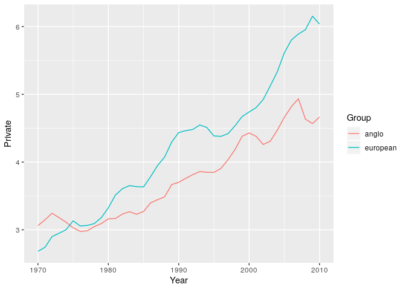
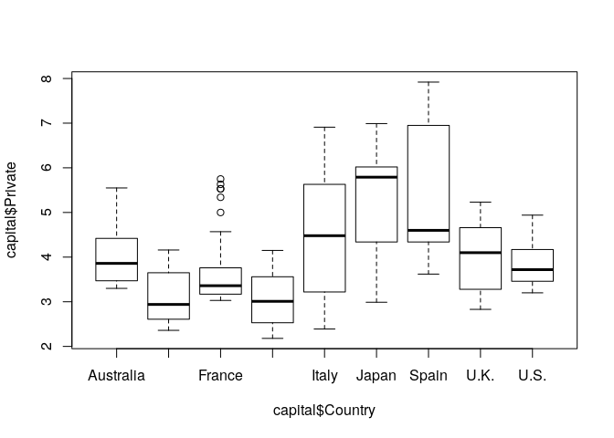
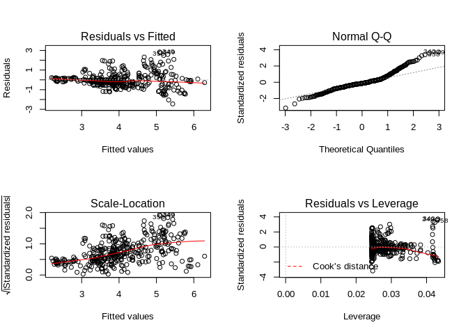
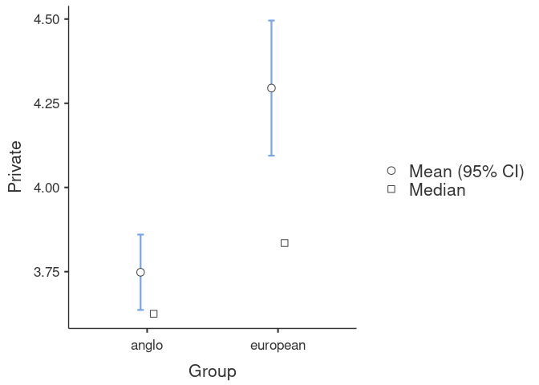

Simple Statistical Modeling in R
================
Wouter van Atteveldt & Kasper Welbers
November 2018

  - [Basic Modeling](#basic-modeling)
  - [T-tests](#t-tests)
  - [Anova](#anova)
  - [Linear models (linear regression
    analysis)](#linear-models-linear-regression-analysis)
  - [Comparing and diagnosing models](#comparing-and-diagnosing-models)
  - [Jamovi](#jamovi)

# Basic Modeling

In this tutorial we use a file adapted from the data published by Thomas
Piketty as a digital appendix to his book “Capital in the 21st Century”.
You can find the original files here:
<http://piketty.pse.ens.fr/files/capital21c/en/xls/>, but to make things
easier we’ve published a cleaned version of this data set on our
repository.

``` r
library(tidyverse)
url = "https://raw.githubusercontent.com/ccs-amsterdam/r-course-material/master/data/piketty_capital.csv"
capital = read_csv(url)
head(capital)
```

    ## # A tibble: 6 x 5
    ##    Year Country   Public Private Total
    ##   <dbl> <chr>      <dbl>   <dbl> <dbl>
    ## 1  1970 Australia   0.61    3.3   3.91
    ## 2  1970 Canada      0.37    2.47  2.84
    ## 3  1970 France      0.41    3.1   3.51
    ## 4  1970 Germany     0.88    2.25  3.13
    ## 5  1970 Italy       0.2     2.39  2.59
    ## 6  1970 Japan       0.61    2.99  3.6

This data set describes the accumulation of public and private capital
per year for a number of countries, expressed as percentage of GDP. So,
in Australia in 1970, the net assets owned by the state amounted to 61%
of GDP.

In this tutorial we mainly use the `stats` package. This is loaded by
default, so you do not need to call `library(stats)`.

# T-tests

First, let’s split our countries into two groups, anglo-saxon countries
and european countries (plus Japan): We can use the `ifelse` command
here combined with the `%in%` operator

``` r
anglo = c("U.S.", "U.K.", "Canada", "Australia")
capital = mutate(capital, Group = ifelse(capital$Country %in% anglo, "anglo", "european"))
table(capital$Group)
```

    ## 
    ##    anglo european 
    ##      164      205

Now, let’s see whether capital accumulation is different between these
two groups. We use an (independent samples) T-test, where we use the
*formula notation* (`dependent ~ independent`) to describe the model we
try to test.

``` r
t.test(capital$Private ~ capital$Group)
```

    ## 
    ##  Welch Two Sample t-test
    ## 
    ## data:  capital$Private by capital$Group
    ## t = -4.6664, df = 289.34, p-value = 4.692e-06
    ## alternative hypothesis: true difference in means is not equal to 0
    ## 95 percent confidence interval:
    ##  -0.7775339 -0.3162154
    ## sample estimates:
    ##    mean in group anglo mean in group european 
    ##               3.748232               4.295106

So, according to this test capital accumulation is indeed significantly
higher in European countries than in Anglo-Saxon countries.

Of course, the data here are not independently distributed since the
data in the same year in different countries is related (as are data in
subsequent years in the same country, but let’s ignore that for the
moment) We could also do a paired t-test of average accumulation per
year per group by first using the cast command to aggregate the data.
Note that we first remove the NA values (for Spain).

``` r
pergroup = capital %>% 
  na.omit() %>% 
  group_by(Year, Group) %>% 
  summarize(Private=mean(Private))
```

Let’s plot the data to have a look at the lines:

``` r
library(ggplot2)
pergroup %>% 
  ggplot + geom_line(aes(x=Year, y=Private, colour=Group))
```

<!-- -->

So initially capital is higher in the Anglo-Saxon countries, but the
European countries overtake quickly and stay higher.

Now, we can do a paired-sample t-test. This requires the group
measurements to be in the same row across different columns, so that the
‘anglo’ and ‘european’ are seen as two ‘measurements’ on the same year.
We therefore first use pivot\_wider, as discussed in the tutorial on
reshaping data:

``` r
pergroup = pivot_wider(pergroup, names_from = Group, values_from = Private)
```

Now we can do a t.test of two different columns, using the `data$column`
notation to specify columns:

``` r
t.test(pergroup$anglo, pergroup$european, paired=T)
```

    ## 
    ##  Paired t-test
    ## 
    ## data:  pergroup$anglo and pergroup$european
    ## t = -6.5332, df = 40, p-value = 8.424e-08
    ## alternative hypothesis: true difference in means is not equal to 0
    ## 95 percent confidence interval:
    ##  -0.6007073 -0.3168537
    ## sample estimates:
    ## mean of the differences 
    ##              -0.4587805

So, the mean difference per year between the groups is indeed
significant; t(40) = -6.533, p \< 0.001.

Finally, when reporting a t-test, you will want to report the means and
standard deviations. Since we have the vectors for anglo and european,
we can simply use the `mean` and `sd` functions. With the argument
`na.rm = T` (NA remove is TRUE) we say that missing values are ignored
(otherwise, the `mean` and `sd` functions would return NA if the vectors
have any NA values).

``` r
mean(pergroup$anglo, na.rm = T)
```

    ## [1] 3.748232

``` r
sd(pergroup$anglo, na.rm = T)
```

    ## [1] 0.6075878

``` r
mean(pergroup$european, na.rm = T)
```

    ## [1] 4.207012

``` r
sd(pergroup$european, na.rm = T)
```

    ## [1] 0.997204

So now we can report that the private capital accumulation per year was
lower for Anglo-Saxon countries (M=3.75, SD=0.61) compared to European
countries (M=4.21; SD=1.00), and this difference is significant; t(40) =
-6.533, p \< 0.001.

# Anova

We can also use a one-way Anova to see whether accumulation differs per
country. Let’s first do a box-plot to see how different the countries
are.

Base-R `plot` by default gives a box plot of a formula with a nominal
independent variable. For this, we first need to tell R that Country is
a factor (nomimal) rather than textual variable

``` r
capital = mutate(capital, Country = as.factor(Country))
plot(capital$Private ~ capital$Country)
```

<!-- -->

So, it seems that in fact a lot of countries are quite similar, with
some extreme cases of high capital accumulation. (also, it seems that
including Japan in the European countries might have been a mistake).
Note that if you are not seeing all country names on the x-axis, you
should make the plotting window wider (i.e. drag the window borders).

We use the `aov` function for this. There is also a function named
`anova`, but this is meant to analyze already fitted models, as will be
shown below.

``` r
m = aov(capital$Private ~ capital$Country)
summary(m)
```

    ##                  Df Sum Sq Mean Sq F value Pr(>F)    
    ## capital$Country   8  201.3  25.158   30.78 <2e-16 ***
    ## Residuals       343  280.3   0.817                   
    ## ---
    ## Signif. codes:  0 '***' 0.001 '**' 0.01 '*' 0.05 '.' 0.1 ' ' 1
    ## 17 observations deleted due to missingness

So in fact there is a significant difference. However, the Anova only
tells us that there is a difference between groups. From the box plot we
get some idea of the differences between specific countries, but often
we also want to know whether there is a significant difference between
specific countries. For this we can use the `pairwise.t.test` to perform
post-hoc comparisons:

``` r
posthoc = pairwise.t.test(capital$Private, capital$Country, p.adj = "bonf")
round(posthoc$p.value, 3)
```

    ##         Australia Canada France Germany Italy Japan Spain U.K.
    ## Canada      0.000     NA     NA      NA    NA    NA    NA   NA
    ## France      1.000  0.269     NA      NA    NA    NA    NA   NA
    ## Germany     0.000  1.000  0.058      NA    NA    NA    NA   NA
    ## Italy       0.457  0.000  0.001   0.000    NA    NA    NA   NA
    ## Japan       0.000  0.000  0.000   0.000 0.007    NA    NA   NA
    ## Spain       0.000  0.000  0.000   0.000 0.006     1    NA   NA
    ## U.K.        1.000  0.001  1.000   0.000 0.307     0     0   NA
    ## U.S.        1.000  0.021  1.000   0.003 0.018     0     0    1

When you report the results of an Anova, you will often want to report
specific means and standard deviations. This is simply a matter of
aggregating (i.e. summarizing) the Private capital accumulation grouped
by countries.

``` r
capital %>%
  group_by(Country) %>%
  summarise(M = mean(Private, na.rm = T), SD = sd(Private, na.rm = T))
```

    ## # A tibble: 9 x 3
    ##   Country       M    SD
    ##   <fct>     <dbl> <dbl>
    ## 1 Australia  4.03 0.684
    ## 2 Canada     3.13 0.576
    ## 3 France     3.67 0.821
    ## 4 Germany    3.04 0.582
    ## 5 Italy      4.53 1.39 
    ## 6 Japan      5.28 1.07 
    ## 7 Spain      5.42 1.49 
    ## 8 U.K.       4.00 0.783
    ## 9 U.S.       3.83 0.476

# Linear models (linear regression analysis)

A more generic way of fitting models is using the `lm` command. This is
how you do ordinary linear regression analysis in R (but more generally,
`aov` is also a linear model). Let’s see how well we can predict the
`capital` variable (dependent) by the `country` and `public capital`
variables (independent).

The lm function also takes a formula as the first argument. The format
is `dependent ~ independent1 + independent2 + ...`.

``` r
m = lm(Private ~ Country + Public, data=capital)  
summary(m)
```

    ## 
    ## Call:
    ## lm(formula = Private ~ Country + Public, data = capital)
    ## 
    ## Residuals:
    ##     Min      1Q  Median      3Q     Max 
    ## -2.4457 -0.4091 -0.1076  0.2601  2.8346 
    ## 
    ## Coefficients:
    ##                Estimate Std. Error t value Pr(>|t|)    
    ## (Intercept)      5.3662     0.1725  31.109  < 2e-16 ***
    ## CountryCanada   -2.3350     0.2167 -10.774  < 2e-16 ***
    ## CountryFrance   -0.9758     0.1812  -5.386 1.34e-07 ***
    ## CountryGermany  -1.4197     0.1765  -8.044 1.44e-14 ***
    ## CountryItaly    -1.4332     0.2468  -5.808 1.45e-08 ***
    ## CountryJapan     1.1762     0.1723   6.828 3.95e-11 ***
    ## CountrySpain     0.1909     0.2284   0.836 0.403630    
    ## CountryU.K.     -0.2511     0.1733  -1.449 0.148361    
    ## CountryU.S.     -0.6421     0.1768  -3.633 0.000323 ***
    ## Public          -1.8144     0.1660 -10.933  < 2e-16 ***
    ## ---
    ## Signif. codes:  0 '***' 0.001 '**' 0.01 '*' 0.05 '.' 0.1 ' ' 1
    ## 
    ## Residual standard error: 0.7793 on 342 degrees of freedom
    ##   (17 observations deleted due to missingness)
    ## Multiple R-squared:  0.5687, Adjusted R-squared:  0.5573 
    ## F-statistic:  50.1 on 9 and 342 DF,  p-value: < 2.2e-16

As you can see, R automatically creates dummy values for the nominal
variable `Country`, using the first value (`U.S.`) as reference
category. An alternative is to remove the intercept and create a dummy
for each country:

``` r
m = lm(Private ~ -1 + Country + Public, data=capital)
summary(m)
```

    ## 
    ## Call:
    ## lm(formula = Private ~ -1 + Country + Public, data = capital)
    ## 
    ## Residuals:
    ##     Min      1Q  Median      3Q     Max 
    ## -2.4457 -0.4091 -0.1076  0.2601  2.8346 
    ## 
    ## Coefficients:
    ##                  Estimate Std. Error t value Pr(>|t|)    
    ## CountryAustralia   5.3662     0.1725   31.11   <2e-16 ***
    ## CountryCanada      3.0313     0.1221   24.83   <2e-16 ***
    ## CountryFrance      4.3904     0.1383   31.74   <2e-16 ***
    ## CountryGermany     3.9465     0.1474   26.77   <2e-16 ***
    ## CountryItaly       3.9330     0.1334   29.48   <2e-16 ***
    ## CountryJapan       6.5424     0.1676   39.05   <2e-16 ***
    ## CountrySpain       5.5572     0.1596   34.82   <2e-16 ***
    ## CountryU.K.        5.1151     0.1587   32.23   <2e-16 ***
    ## CountryU.S.        4.7241     0.1468   32.18   <2e-16 ***
    ## Public            -1.8144     0.1660  -10.93   <2e-16 ***
    ## ---
    ## Signif. codes:  0 '***' 0.001 '**' 0.01 '*' 0.05 '.' 0.1 ' ' 1
    ## 
    ## Residual standard error: 0.7793 on 342 degrees of freedom
    ##   (17 observations deleted due to missingness)
    ## Multiple R-squared:  0.9666, Adjusted R-squared:  0.9657 
    ## F-statistic: 991.2 on 10 and 342 DF,  p-value: < 2.2e-16

(`- 1` removes the intercept because there is an implicit +1 constant
for the intercept in the regression formula)

You can also introduce interaction terms by using either the `:`
operator (which only creates the interaction term) or the `*` (which
creates a full model including the main effects). To keep the model
somewhat parsimonious, let’s use the country group rather than the
country itself

``` r
m1 = lm(Private ~ Group + Public, data=capital)
m2 = lm(Private ~ Group + Public + Group:Public, data=capital)
```

Here we have created two models. A common way to investigate (and
report) these models is by showing them side by side in a table. There
are several packages in R for making nice regression tables (e.g.,
sjPlot, texreg, stargazer). Here we’ll use the sjPlot package.

``` r
## remember to first install with install.packages('sjPlot')
library(sjPlot)
tab_model(m1, m2)
```

<table style="border-collapse:collapse; border:none;">

<tr>

<th style="border-top: double; text-align:center; font-style:normal; font-weight:bold; padding:0.2cm;  text-align:left; ">

 

</th>

<th colspan="3" style="border-top: double; text-align:center; font-style:normal; font-weight:bold; padding:0.2cm; ">

Private

</th>

<th colspan="3" style="border-top: double; text-align:center; font-style:normal; font-weight:bold; padding:0.2cm; ">

Private

</th>

</tr>

<tr>

<td style=" text-align:center; border-bottom:1px solid; font-style:italic; font-weight:normal;  text-align:left; ">

Predictors

</td>

<td style=" text-align:center; border-bottom:1px solid; font-style:italic; font-weight:normal;  ">

Estimates

</td>

<td style=" text-align:center; border-bottom:1px solid; font-style:italic; font-weight:normal;  ">

CI

</td>

<td style=" text-align:center; border-bottom:1px solid; font-style:italic; font-weight:normal;  ">

p

</td>

<td style=" text-align:center; border-bottom:1px solid; font-style:italic; font-weight:normal;  ">

Estimates

</td>

<td style=" text-align:center; border-bottom:1px solid; font-style:italic; font-weight:normal;  ">

CI

</td>

<td style=" text-align:center; border-bottom:1px solid; font-style:italic; font-weight:normal;  col7">

p

</td>

</tr>

<tr>

<td style=" padding:0.2cm; text-align:left; vertical-align:top; text-align:left; ">

(Intercept)

</td>

<td style=" padding:0.2cm; text-align:left; vertical-align:top; text-align:center;  ">

3.97

</td>

<td style=" padding:0.2cm; text-align:left; vertical-align:top; text-align:center;  ">

3.76 – 4.18

</td>

<td style=" padding:0.2cm; text-align:left; vertical-align:top; text-align:center;  ">

<strong>\<0.001

</td>

<td style=" padding:0.2cm; text-align:left; vertical-align:top; text-align:center;  ">

3.75

</td>

<td style=" padding:0.2cm; text-align:left; vertical-align:top; text-align:center;  ">

3.50 – 4.01

</td>

<td style=" padding:0.2cm; text-align:left; vertical-align:top; text-align:center;  col7">

<strong>\<0.001

</td>

</tr>

<tr>

<td style=" padding:0.2cm; text-align:left; vertical-align:top; text-align:left; ">

Group \[european\]

</td>

<td style=" padding:0.2cm; text-align:left; vertical-align:top; text-align:center;  ">

0.47

</td>

<td style=" padding:0.2cm; text-align:left; vertical-align:top; text-align:center;  ">

0.23 – 0.71

</td>

<td style=" padding:0.2cm; text-align:left; vertical-align:top; text-align:center;  ">

<strong>\<0.001

</td>

<td style=" padding:0.2cm; text-align:left; vertical-align:top; text-align:center;  ">

0.78

</td>

<td style=" padding:0.2cm; text-align:left; vertical-align:top; text-align:center;  ">

0.46 – 1.10

</td>

<td style=" padding:0.2cm; text-align:left; vertical-align:top; text-align:center;  col7">

<strong>\<0.001

</td>

</tr>

<tr>

<td style=" padding:0.2cm; text-align:left; vertical-align:top; text-align:left; ">

Public

</td>

<td style=" padding:0.2cm; text-align:left; vertical-align:top; text-align:center;  ">

\-0.49

</td>

<td style=" padding:0.2cm; text-align:left; vertical-align:top; text-align:center;  ">

\-0.77 – -0.22

</td>

<td style=" padding:0.2cm; text-align:left; vertical-align:top; text-align:center;  ">

<strong>0.001</strong>

</td>

<td style=" padding:0.2cm; text-align:left; vertical-align:top; text-align:center;  ">

\-0.01

</td>

<td style=" padding:0.2cm; text-align:left; vertical-align:top; text-align:center;  ">

\-0.44 – 0.41

</td>

<td style=" padding:0.2cm; text-align:left; vertical-align:top; text-align:center;  col7">

0.958

</td>

</tr>

<tr>

<td style=" padding:0.2cm; text-align:left; vertical-align:top; text-align:left; ">

Group \[european\] \* Public

</td>

<td style=" padding:0.2cm; text-align:left; vertical-align:top; text-align:center;  ">

</td>

<td style=" padding:0.2cm; text-align:left; vertical-align:top; text-align:center;  ">

</td>

<td style=" padding:0.2cm; text-align:left; vertical-align:top; text-align:center;  ">

</td>

<td style=" padding:0.2cm; text-align:left; vertical-align:top; text-align:center;  ">

\-0.83

</td>

<td style=" padding:0.2cm; text-align:left; vertical-align:top; text-align:center;  ">

\-1.39 – -0.28

</td>

<td style=" padding:0.2cm; text-align:left; vertical-align:top; text-align:center;  col7">

<strong>0.004</strong>

</td>

</tr>

<tr>

<td style=" padding:0.2cm; text-align:left; vertical-align:top; text-align:left; padding-top:0.1cm; padding-bottom:0.1cm; border-top:1px solid;">

Observations

</td>

<td style=" padding:0.2cm; text-align:left; vertical-align:top; padding-top:0.1cm; padding-bottom:0.1cm; text-align:left; border-top:1px solid;" colspan="3">

352

</td>

<td style=" padding:0.2cm; text-align:left; vertical-align:top; padding-top:0.1cm; padding-bottom:0.1cm; text-align:left; border-top:1px solid;" colspan="3">

352

</td>

</tr>

<tr>

<td style=" padding:0.2cm; text-align:left; vertical-align:top; text-align:left; padding-top:0.1cm; padding-bottom:0.1cm;">

R<sup>2</sup> / R<sup>2</sup> adjusted

</td>

<td style=" padding:0.2cm; text-align:left; vertical-align:top; padding-top:0.1cm; padding-bottom:0.1cm; text-align:left;" colspan="3">

0.086 / 0.081

</td>

<td style=" padding:0.2cm; text-align:left; vertical-align:top; padding-top:0.1cm; padding-bottom:0.1cm; text-align:left;" colspan="3">

0.108 / 0.101

</td>

</tr>

</table>

So, there is a significant interaction effect which displaces the main
effect of public wealth.

One of the cool things about sjPlot is that the table is produced in
HTML, which makes it easy to copy/paste the table into a .DOC file (if
you’re working with latex, the `texreg` package is more convenient).

``` r
tab_model(m1,m2, file = 'model.html')
```

<table style="border-collapse:collapse; border:none;">

<tr>

<th style="border-top: double; text-align:center; font-style:normal; font-weight:bold; padding:0.2cm;  text-align:left; ">

 

</th>

<th colspan="3" style="border-top: double; text-align:center; font-style:normal; font-weight:bold; padding:0.2cm; ">

Private

</th>

<th colspan="3" style="border-top: double; text-align:center; font-style:normal; font-weight:bold; padding:0.2cm; ">

Private

</th>

</tr>

<tr>

<td style=" text-align:center; border-bottom:1px solid; font-style:italic; font-weight:normal;  text-align:left; ">

Predictors

</td>

<td style=" text-align:center; border-bottom:1px solid; font-style:italic; font-weight:normal;  ">

Estimates

</td>

<td style=" text-align:center; border-bottom:1px solid; font-style:italic; font-weight:normal;  ">

CI

</td>

<td style=" text-align:center; border-bottom:1px solid; font-style:italic; font-weight:normal;  ">

p

</td>

<td style=" text-align:center; border-bottom:1px solid; font-style:italic; font-weight:normal;  ">

Estimates

</td>

<td style=" text-align:center; border-bottom:1px solid; font-style:italic; font-weight:normal;  ">

CI

</td>

<td style=" text-align:center; border-bottom:1px solid; font-style:italic; font-weight:normal;  col7">

p

</td>

</tr>

<tr>

<td style=" padding:0.2cm; text-align:left; vertical-align:top; text-align:left; ">

(Intercept)

</td>

<td style=" padding:0.2cm; text-align:left; vertical-align:top; text-align:center;  ">

3.97

</td>

<td style=" padding:0.2cm; text-align:left; vertical-align:top; text-align:center;  ">

3.76 – 4.18

</td>

<td style=" padding:0.2cm; text-align:left; vertical-align:top; text-align:center;  ">

<strong>\<0.001

</td>

<td style=" padding:0.2cm; text-align:left; vertical-align:top; text-align:center;  ">

3.75

</td>

<td style=" padding:0.2cm; text-align:left; vertical-align:top; text-align:center;  ">

3.50 – 4.01

</td>

<td style=" padding:0.2cm; text-align:left; vertical-align:top; text-align:center;  col7">

<strong>\<0.001

</td>

</tr>

<tr>

<td style=" padding:0.2cm; text-align:left; vertical-align:top; text-align:left; ">

Group \[european\]

</td>

<td style=" padding:0.2cm; text-align:left; vertical-align:top; text-align:center;  ">

0.47

</td>

<td style=" padding:0.2cm; text-align:left; vertical-align:top; text-align:center;  ">

0.23 – 0.71

</td>

<td style=" padding:0.2cm; text-align:left; vertical-align:top; text-align:center;  ">

<strong>\<0.001

</td>

<td style=" padding:0.2cm; text-align:left; vertical-align:top; text-align:center;  ">

0.78

</td>

<td style=" padding:0.2cm; text-align:left; vertical-align:top; text-align:center;  ">

0.46 – 1.10

</td>

<td style=" padding:0.2cm; text-align:left; vertical-align:top; text-align:center;  col7">

<strong>\<0.001

</td>

</tr>

<tr>

<td style=" padding:0.2cm; text-align:left; vertical-align:top; text-align:left; ">

Public

</td>

<td style=" padding:0.2cm; text-align:left; vertical-align:top; text-align:center;  ">

\-0.49

</td>

<td style=" padding:0.2cm; text-align:left; vertical-align:top; text-align:center;  ">

\-0.77 – -0.22

</td>

<td style=" padding:0.2cm; text-align:left; vertical-align:top; text-align:center;  ">

<strong>0.001</strong>

</td>

<td style=" padding:0.2cm; text-align:left; vertical-align:top; text-align:center;  ">

\-0.01

</td>

<td style=" padding:0.2cm; text-align:left; vertical-align:top; text-align:center;  ">

\-0.44 – 0.41

</td>

<td style=" padding:0.2cm; text-align:left; vertical-align:top; text-align:center;  col7">

0.958

</td>

</tr>

<tr>

<td style=" padding:0.2cm; text-align:left; vertical-align:top; text-align:left; ">

Group \[european\] \* Public

</td>

<td style=" padding:0.2cm; text-align:left; vertical-align:top; text-align:center;  ">

</td>

<td style=" padding:0.2cm; text-align:left; vertical-align:top; text-align:center;  ">

</td>

<td style=" padding:0.2cm; text-align:left; vertical-align:top; text-align:center;  ">

</td>

<td style=" padding:0.2cm; text-align:left; vertical-align:top; text-align:center;  ">

\-0.83

</td>

<td style=" padding:0.2cm; text-align:left; vertical-align:top; text-align:center;  ">

\-1.39 – -0.28

</td>

<td style=" padding:0.2cm; text-align:left; vertical-align:top; text-align:center;  col7">

<strong>0.004</strong>

</td>

</tr>

<tr>

<td style=" padding:0.2cm; text-align:left; vertical-align:top; text-align:left; padding-top:0.1cm; padding-bottom:0.1cm; border-top:1px solid;">

Observations

</td>

<td style=" padding:0.2cm; text-align:left; vertical-align:top; padding-top:0.1cm; padding-bottom:0.1cm; text-align:left; border-top:1px solid;" colspan="3">

352

</td>

<td style=" padding:0.2cm; text-align:left; vertical-align:top; padding-top:0.1cm; padding-bottom:0.1cm; text-align:left; border-top:1px solid;" colspan="3">

352

</td>

</tr>

<tr>

<td style=" padding:0.2cm; text-align:left; vertical-align:top; text-align:left; padding-top:0.1cm; padding-bottom:0.1cm;">

R<sup>2</sup> / R<sup>2</sup> adjusted

</td>

<td style=" padding:0.2cm; text-align:left; vertical-align:top; padding-top:0.1cm; padding-bottom:0.1cm; text-align:left;" colspan="3">

0.086 / 0.081

</td>

<td style=" padding:0.2cm; text-align:left; vertical-align:top; padding-top:0.1cm; padding-bottom:0.1cm; text-align:left;" colspan="3">

0.108 / 0.101

</td>

</tr>

</table>

``` r
browseURL('model.html')
```

# Comparing and diagnosing models

A relevant question can be whether a model with an interaction effect is
in fact a better model than the model without the interaction. This can
be investigated with an anova of the model fits of the two models:

``` r
m1 = lm(Private ~ Group + Public, data=capital)
m2 = lm(Private ~ Group + Public + Group:Public, data=capital)
anova(m1, m2)
```

    ## Analysis of Variance Table
    ## 
    ## Model 1: Private ~ Group + Public
    ## Model 2: Private ~ Group + Public + Group:Public
    ##   Res.Df    RSS Df Sum of Sq     F   Pr(>F)   
    ## 1    349 440.02                               
    ## 2    348 429.36  1    10.661 8.641 0.003506 **
    ## ---
    ## Signif. codes:  0 '***' 0.001 '**' 0.01 '*' 0.05 '.' 0.1 ' ' 1

So, the interaction term is in fact a significant improvement of the
model. Apparently, in European countries private capital is accumulated
faster in those times that the government goes into depth.

After doing a linear model it is a good idea to do some diagnostics. We
can ask R for a set of standard plots by simply calling `plot` on the
model fit. This will actually create 4 plots, so you’d have to hit
`Return` to see them all. A nice alternative is to tell R to split the
plotting window into multiple rows and columns. With the parameter
(`par`) `mfrow`, we here set the number of rows and columns to 2, to
created a 2x2 grid.

``` r
par(mfrow=c(2,2))
plot(m)
```

<!-- -->

``` r
par(mfrow=c(1,1))
```

Note that after plotting we immediately return the 2x2 grid to a 1x1
grid, so that for the next plot we use the default settings.

If these diagnostic plots are new to you, a good explanation can be
found on: <https://data.library.virginia.edu/diagnostic-plots/> Also,
see <http://www.statmethods.net/stats/rdiagnostics.html> for a more
exhausitve list of model diagnostics.

# Jamovi

R features several packages with alternative implementations of basic
statistics. One of these is the `jmv` package, which allows you to use
the stats functions from [Jamovi](https://www.jamovi.org). Jamovi is an
open-source statistical spreadsheet program that runs on R. You can also
run it as a GUI (think separate program) that is rather similar to SPSS
(i.e. you just click stuff). It can be a useful stepping stone from SPSS
to R.

Note that installing jmv might take a while.

``` r
install.packages('jmv')
```

The ANOVA function in jmv gives output very similar to the SPSS output.

``` r
library(jmv)

ANOVA(capital, dep = 'Private', factors = 'Country', postHoc = 'Country')
```

    ## 
    ##  ANOVA
    ## 
    ##  ANOVA - Private                                                                 
    ##  ─────────────────────────────────────────────────────────────────────────────── 
    ##                 Sum of Squares    df     Mean Square    F           p            
    ##  ─────────────────────────────────────────────────────────────────────────────── 
    ##    Country            201.2615      8     25.1576852    30.78318    < .0000001   
    ##    Residuals          280.3182    343      0.8172542                             
    ##  ─────────────────────────────────────────────────────────────────────────────── 
    ## 
    ## 
    ##  POST HOC TESTS
    ## 
    ##  Post Hoc Comparisons - Country                                                                         
    ##  ────────────────────────────────────────────────────────────────────────────────────────────────────── 
    ##    Country           Country    Mean Difference    SE           df          t              p-tukey      
    ##  ────────────────────────────────────────────────────────────────────────────────────────────────────── 
    ##    Australia    -    Canada          0.89536585    0.1996649    343.0000      4.4843436     0.0003392   
    ##                 -    France          0.35804878    0.1996649    343.0000      1.7932488     0.6867127   
    ##                 -    Germany         0.99268293    0.1996649    343.0000      4.9717457     0.0000367   
    ##                 -    Italy          -0.50024390    0.1996649    343.0000     -2.5054178     0.2329878   
    ##                 -    Japan          -1.25365854    0.1996649    343.0000     -6.2788140    < .0000001   
    ##                 -    Spain          -1.38982724    0.2323473    343.0000     -5.9816791     0.0000002   
    ##                 -    U.K.            0.02804878    0.1996649    343.0000      0.1404793     1.0000000   
    ##                 -    U.S.            0.20268293    0.1996649    343.0000      1.0151156     0.9842913   
    ##    Canada       -    France         -0.53731707    0.1996649    343.0000     -2.6910948     0.1548521   
    ##                 -    Germany         0.09731707    0.1996649    343.0000      0.4874021     0.9999166   
    ##                 -    Italy          -1.39560976    0.1996649    343.0000     -6.9897614    < .0000001   
    ##                 -    Japan          -2.14902439    0.1996649    343.0000    -10.7631576    < .0000001   
    ##                 -    Spain          -2.28519309    0.2323473    343.0000     -9.8352453    < .0000001   
    ##                 -    U.K.           -0.86731707    0.1996649    343.0000     -4.3438643     0.0006189   
    ##                 -    U.S.           -0.69268293    0.1996649    343.0000     -3.4692280     0.0169320   
    ##    France       -    Germany         0.63463415    0.1996649    343.0000      3.1784969     0.0423118   
    ##                 -    Italy          -0.85829268    0.1996649    343.0000     -4.2986666     0.0007481   
    ##                 -    Japan          -1.61170732    0.1996649    343.0000     -8.0720628    < .0000001   
    ##                 -    Spain          -1.74787602    0.2323473    343.0000     -7.5226857    < .0000001   
    ##                 -    U.K.           -0.33000000    0.1996649    343.0000     -1.6527695     0.7746014   
    ##                 -    U.S.           -0.15536585    0.1996649    343.0000     -0.7781332     0.9973849   
    ##    Germany      -    Italy          -1.49292683    0.1996649    343.0000     -7.4771635    < .0000001   
    ##                 -    Japan          -2.24634146    0.1996649    343.0000    -11.2505597    < .0000001   
    ##                 -    Spain          -2.38251016    0.2323473    343.0000    -10.2540884    < .0000001   
    ##                 -    U.K.           -0.96463415    0.1996649    343.0000     -4.8312664     0.0000712   
    ##                 -    U.S.           -0.79000000    0.1996649    343.0000     -3.9566301     0.0029488   
    ##    Italy        -    Japan          -0.75341463    0.1996649    343.0000     -3.7733962     0.0058599   
    ##                 -    Spain          -0.88958333    0.2323473    343.0000     -3.8286788     0.0047808   
    ##                 -    U.K.            0.52829268    0.1996649    343.0000      2.6458971     0.1718254   
    ##                 -    U.S.            0.70292683    0.1996649    343.0000      3.5205335     0.0142590   
    ##    Japan        -    Spain          -0.13616870    0.2323473    343.0000     -0.5860566     0.9996656   
    ##                 -    U.K.            1.28170732    0.1996649    343.0000      6.4192933    < .0000001   
    ##                 -    U.S.            1.45634146    0.1996649    343.0000      7.2939296    < .0000001   
    ##    Spain        -    U.K.            1.41787602    0.2323473    343.0000      6.1023983     0.0000001   
    ##                 -    U.S.            1.59251016    0.2323473    343.0000      6.8540064    < .0000001   
    ##    U.K.         -    U.S.            0.17463415    0.1996649    343.0000      0.8746363     0.9941290   
    ##  ──────────────────────────────────────────────────────────────────────────────────────────────────────

Likewise for t-tests. Here we compute an independent samples (IS)
t-test.

``` r
ttestIS(capital, vars = 'Private', group = 'Group', plots=T)
```

    ## 
    ##  INDEPENDENT SAMPLES T-TEST
    ## 
    ##  Independent Samples T-Test                                         
    ##  ────────────────────────────────────────────────────────────────── 
    ##                              Statistic      df          p           
    ##  ────────────────────────────────────────────────────────────────── 
    ##    Private    Student's t    -4.487068 ᵃ    350.0000    0.0000098   
    ##  ────────────────────────────────────────────────────────────────── 
    ##    ᵃ Levene's test is significant (p < .05), suggesting a
    ##    violation of the assumption of equal variances

<!-- -->
