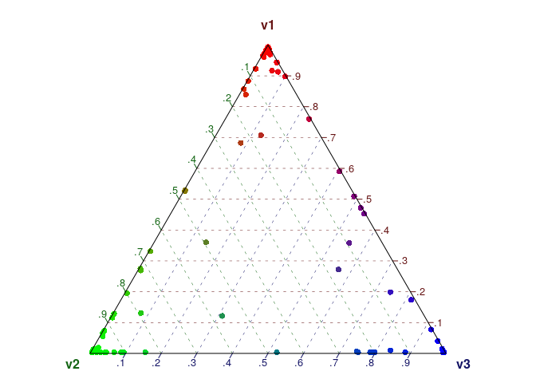
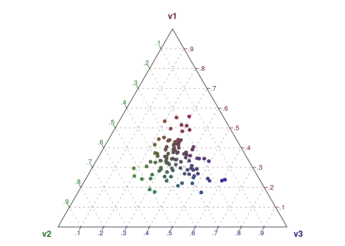
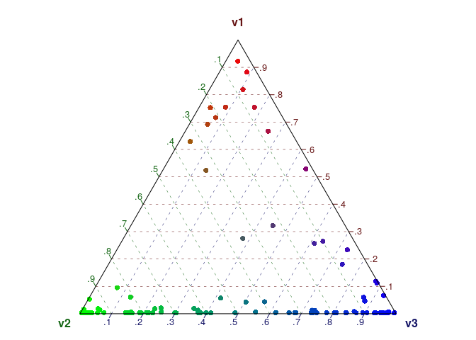
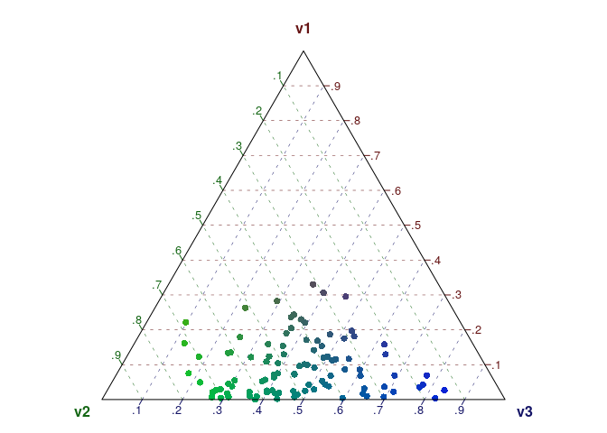

Dirichlet distributions, the alpha hyperparameter, and LDA
================
Kasper Welbers
2019

-   [What is a dirichlet distribution?](#what-is-a-dirichlet-distribution)
-   [The alpha parameter](#the-alpha-parameter)
-   [This document](#this-document)
-   [Example: the dirichlet distribution of a bag of dices](#example-the-dirichlet-distribution-of-a-bag-of-dices)
    -   [A bag of fair dices (dense and symmetric)](#a-bag-of-fair-dices-dense-and-symmetric)
    -   [A bag of bad dices, but the bag is fair in the sense there is no clear skew (sparse and symmetric)](#a-bag-of-bad-dices-but-the-bag-is-fair-in-the-sense-there-is-no-clear-skew-sparse-and-symmetric)
    -   [A bag of false dices. If you draw a random dice, you are more likely to draw a dice that is rigged to throw a 6](#a-bag-of-false-dices.-if-you-draw-a-random-dice-you-are-more-likely-to-draw-a-dice-that-is-rigged-to-throw-a-6)
    -   [Two strange bags of false dices, to illustrate how only changing the concentration affects the dirichlet.](#two-strange-bags-of-false-dices-to-illustrate-how-only-changing-the-concentration-affects-the-dirichlet.)
-   [Visualization](#visualization)
-   [Latent dirichlet allocation (LDA)](#latent-dirichlet-allocation-lda)

### What is a dirichlet distribution?

A good way to think about a dirichlet distribution is as a distribution of multinomial distributions. For illustration, imagine a bag of dices. Each die has 6 sides, and the probability for each side to be trown can be described as a (single) multinomial distribution. The probability mass function (PMF) for each die is then a vector of length 6, that gives the probability for each side, and sums to 1. Now, given a bag of dices, you basically have a bag of PMF's. The dirichlet distribution can be used to describe the distribution of these PMF's. For example, if you were to take one die from the bag, how likely is it that you get a fair die, or a die that is more likely to trow a six?

### The alpha parameter

The dirichlet distribution has a single parameter, often referred to as the alpha parameter. This parameter determines both the distribution and concentration of the dirichlet.

If the alpha is a scalar (i.e. a single value), it only determines the concentration of the dirichlet. A higher alpha then gives a more dense distribution whereas a lower alpha gives a more sparse distribution. In the example of a bag of dices, a dense distribution means that each die in the bag is likely to have a faily uniform PMF. Thus, it's a bag of fair dices. If the distribution is sparse, this means that many dices are skewed towards certain sides. Since the distribution is symmetrical, this skew towards certain sides is random.

If the alpha is a vector, then it determines both the concentration and distribution of the dirichlet. In the example of the bag of (six sided) dices, the alpha would be a vector of length 6, and a value in the vector would correspond to the number of eyes on one side of a die. If, for example, the values in the vector for the side with 6 eyes is higher, then the bag of dices is more likely to contain dices that are skewed towards trowing 6 eyes. The overal hight of the alpha still determines the concentration. How this works is best illustrated (we'll get to the examples in a minute).

### This document

This document contains some examples of dirichlet distributions with different alpha parameters. It first shows this for the example of a bag of dices. Then, it shows how the dirichlet distribution can be visualized (which is a great way to play with the alpha parameter and see the consequences). Finally, it discusses the use of the dirichlet distribution and the alpha parameter in Latent Dirichlet Allocation.

Example: the dirichlet distribution of a bag of dices
=====================================================

``` r
install.packages('DirichletReg')
```

``` r
library(DirichletReg)
```

To illustrate the effect of alpha on the dirichlet distribution, we generate some random dirichlet distributions with different alpha values.

In this example, we always give the alpha as a vector, because the rdirichlet function needs the length of the vector to determine K. However, if each value of the alpha vector is the same, it can actually be considered as a scalar. So, if alpha is the vector c(1,1,1), it is synoymous to using the scalar c(1) for a dirichlet distribution with K = 3.

### A bag of fair dices (dense and symmetric)

The rdirichlet function generates random numbers according to the dirichlet distribution. This is a matrix with K columns and N rows. Each row can be considered a die, with the columns representing the PMF of the die. In a bag of fair dices, we would thus expect the column means (i.e. the means across all dices) to be fairly uniform. Also, the standard deviation should be low, because we expect each die to be fair.

``` r
N = 1000
alpha = c(100,100,100,100,100,100) 
diri = rdirichlet(N, alpha) 
apply(diri, 2, 'mean')
apply(diri, 2, 'sd')
```

### A bag of bad dices, but the bag is fair in the sense there is no clear skew (sparse and symmetric)

If we lower the alpha, we get a more sparse concentration. Since the distribution is symmetric (we use the same value for all alpha, like a scalar) the means are still rather uniform. However, since each individual die is skewed, the standard deviations should be higher.

``` r
N = 1000
alpha = c(0.1,0.1,0.1,0.1,0.1,0.1) 
diri = rdirichlet(N, alpha) 
apply(diri, 2, 'mean')
apply(diri, 2, 'sd')
```

### A bag of false dices. If you draw a random dice, you are more likely to draw a dice that is rigged to throw a 6

Now we give a vector as alpha in which the sixth value is much higher. Thus, the mean for the sixth column is much higher. Also note that the standard deviation is low, because each die is heavily skewed towards 6.

``` r
N = 1000
alpha = c(0.1,0.1,0.1,0.1,0.1,100) 
diri = rdirichlet(N, alpha) 
apply(diri, 2, 'mean')
apply(diri, 2, 'sd')
```

### Two strange bags of false dices, to illustrate how only changing the concentration affects the dirichlet.

Bag 1 contains dices that are likely to trow either a 5 or a 6.

``` r
N = 1000
alpha1 = c(0.1,0.1,0.1,0.1,100,100) 
diri1 = rdirichlet(N, alpha1)
round(head(diri1),2)
```

If we make the concentration more sparse by lowering the alpha, we get a very different outcome (note that we only divide the previous alpha by 1000, keeping the same distribution with only a different concentration). Bag 2 contains dices that are either skewed towards 5 OR skewed towards 6.

``` r
N = 1000
alpha2 = alpha1 / 1000 ## the previous alpha, but divided by 1000 to make distribution more dense
diri2 = rdirichlet(N, alpha2) 
round(head(diri2),2)
```

Visualization
=============

We can visualize a dirichlet distribution nicely if we have a distribution with K=3 (or, an alpha of length 3). Since a PMF sums to 1, we can plot this in two dimenstions.

Low, symmetrical alpha: sparse and even distribution (each document often contains only 1 topic)

``` r
diri = rdirichlet(100, alpha = c(0.1,0.1,0.1)) 
dr = DR_data(diri) ## for visualization, make this a DirichletRegData object
plot(dr) 
```



high, symmetrical alpha: sense and even distribution (each document often contains a mixture of all topics)

``` r
diri = rdirichlet(100, alpha = c(10,10,10)) 
dr = DR_data(diri) 
plot(dr) 
```



Low, assymmetrical alpha: sparse and uneven distribution (2 high value topics more likely to occur, but often one OR the other. Due to sparseness, the low value topic can still be dominant in a few topics)

``` r
diri = rdirichlet(100, alpha = c(0.1,0.5,0.5)) 
dr = DR_data(diri) 
plot(dr) 
```



high, assymmetrical alpha: dense and uneven distribution (two topics most likely to occur, but often together within the same document. Due to denseness, other topics are rarely dominant)

``` r
diri = rdirichlet(100, alpha = c(1,5,5)) 
dr = DR_data(diri) 
plot(dr) 
```



Latent dirichlet allocation (LDA)
=================================

LDA uses two dirichlet distributions: one for the distribution of topics over documents, and one for the distribution of words over topics. Both have their own alpha parameter, but in LDA they are given different names to avoid confusion. The parameter for the distribution of topics over documents is generally still referred to as the alpha parameter. The parameter for the distribution of words over topics, however, is often referred to as the beta parameter. These parameters are referred to as the hyperparameters of the LDA model.

For the distribution of topics over documents, each document is a PFM of length K (the number of topics). Thus, for each document we have a probability for each topic to occur. For the distribution of words over topics, each topic is a PMF of length V (the number of words in the vocabulary). Thus for each topics we have a probability for each word to occur.

Here are some examples of what these dirichlet distributions look like given different hyperparameters. Note that these are only the starting values of the distribution (i.e. they change as the model is trained on the data). The way this works is off course identical to the bag of dices example. It is only presented in a slightly different way to make the connection with text analysis. Most importantly, for this example we assume that we just want to know whether a topic occurs in a document, for which we use a threshold of 0.3. That is, a topic is assumed to be 'present' in a document if in the PMF of this document the topic scores above o.3.

Example 1: A distribution of topics over documents with 5 topics and a dense, symmetrical alpha. This gives documents in which many topics can occur in each document

``` r
N = 1000
K = 5
alpha = 50/K ## As a scalar
alpha = rep(alpha, K) ## make a vector of the scalar. Note that in most LDA packages this happens automatically
diri = rdirichlet(N, alpha) ## Generate dirichlet
colMeans(diri > 0.3) * 100 ## In what pct (as a ) of documents does each topic occur given a threshold of 0.3? 
mean(rowSums(diri > 0.3) == 0) * 100 ## pct of documents without any topic
```

Hey! This means that there are many documents that do not have a topic! The reason in this case is that our alpha is so high (dense) that most documents contain all topics fairly evenly, meaning that there are rarely topics that pass the threshold (you can look at head(diri)). Thus, if you are using a threshold and many documents have no topics, you might need to lower the alpha hyperparameter. Let's try that

``` r
N = 1000
K = 5
alpha = 5/K ## As a scalar
alpha = rep(alpha, K) ## make a vector of the scalar. Note that in most LDA packages this happens automatically
diri = rdirichlet(N, alpha) ## Genereer dirichlet
colMeans(diri > 0.3) * 100 ## In what pct (as a ) of documents does each topic occur given a threshold of 0.3? 
mean(rowSums(diri > 0.3) == 0) * 100 ## pct of documents without any topic
```

Now each topic occurs in slightly over 20 percent of all documents, and only around 5 percent of documents does not contain a topic.

So what is the catch of using a low alpha? The really depends, but the most immediate consequence is that you force documents to contain only 1 or a few topics, while there might in fact be more of a mixture of topics. Being able to identify multiple topics within a document is also one the strengst of LDA, so it would be a shame to lose this.

For illustration, we can look at the cooccurrence of topics given a low and high alpha.

``` r
alpha1 = c(0.1,0.1,0.1,0.1,0.1)
alpha2 = c(0.01,0.01,0.01,0.01,0.01)
diri1 = rdirichlet(1000, alpha1) ## Genereer dirichlet
diri2 = rdirichlet(1000, alpha2) ## Genereer dirichlet
colnames(diri1) = colnames(diri2) = paste('topic', 1:5)

crossprod(diri1 > 0.3)  
crossprod(diri2 > 0.3) 
```

Here we see that the lower the alpha, the less times topics co-occurr.

Finally, let's look a assymetrical hyperparameters.

``` r
N = 1000
K = 5
alpha = c(0.1,0.5,1,1.5, 2)
diri = rdirichlet(N, alpha) ## Genereer dirichlet
colMeans(diri > 0.3) * 100 ## In what pct (as a ) of documents does each topic occur given a threshold of 0.3? 
```

Here we see that topic 5 is most likely to occur, whereas topic 1 very rarely occurs. This can be a usefull starting point for an LDA model if it makes sense to assume that this is actually the case. For instance, if you want to analyze certain topics in the news, and you know for a fact that one topic is much more likely to occur than another (just beware that you can then also steer towards this finding).

For the distribution of words over topics the idea is very much the same. Here, a lower beta means that each topic has fewer words that are strong indicators of the topic, whereas a higher beta means that the PMF of each topic is more spread out over multiple words. Theoretically, the lowest beta would mean that each topic is only related to one word, whereas the highest beta means that the PMF is uniform (no word more likely than another).
